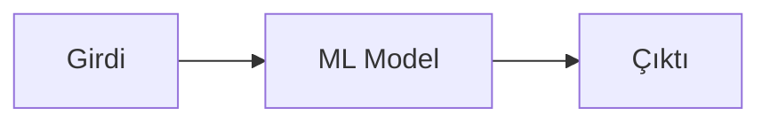
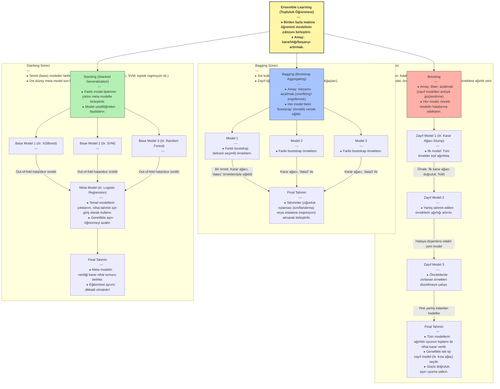

# Makine Öğrenmesi (Machine Learning) ve Yapay Zeka (AI)

---

### 1. Temel Kavramlar ve Avantaj

**Yapay Zeka (AI)**, İnsanın sahip olduğu **deneyim** ve **tecrübeyi** bilgisayarlara aktarılmasının yollarını inceleyen bilim dalının en genel adıdır. **Makine Öğrenmesi** ise bu amaç için kendine özgü teknikleri barındıran yapay zekanın bir **alt koludur**.

Bilgisayarlar **dijital** kullanan makinelerdir. İnsanların sahip olduğu tecrübe, deneyim, uzmanlık, yetenekler ve kabiliyetlerin bu dil yardımıyla onlara aktarılması, bu alanın en büyük **avantajıdır**.

### 2. Veri ve Bilgi Hiyerarşisi
**Datum**, Latince kökenli bir kelime olup, "verilen şey" veya "gerçek" anlamına gelir. İngilizcede "data" kelimesinin tekil hali olarak kullanılır. Genellikle tek bir gözlemi, ölçümü veya gerçeği ifade ederken, "data" ise bu tekil gerçeklerin çoğulunu, yani bir koleksiyonunu temsil eder. Bu ayrım, özellikle bilimsel ve teknik metinlerde verinin temel birimini vurgulamak için önemlidir.

**Veri**, bir nesne, varlık, durum, olay hakkında nitel ya da nicel bulguların (gerçeklerin) belirli bir sistematiğe göre kayıt altına alınmış haline denilir.

Veri, bilgiye dönüşürken bir hiyerarşiden geçer:

$$\text{Raw Data (İşlenmemiş Veri)} \rightarrow \text{Data (Veri)} \rightarrow \text{Knowledge (Bilgi)}$$

* **İşlenmemiş Veri Örn.:** Yeni doğan bir bebeğin ağırlığı (Henüz bilinmiyor ancak bir ağırlığı var).

* **Veri Örn.:** Bir metriğe (örn. m, kg, inç, galon vb.) göre bu bebeğin ağırlığının ölçülüp bir yere kayıt edilmesi.

* **Bilgi (information) Örn.:** Bebeğin kilosu vb. özelliklerini kullanarak elde edilen gerçeklerdir. Örn: Çorlu'da Mart ayında doğan bebeklerin kilo ortalaması 2.8 kg'dır.

* **Knowledge (Anlamlı-İşe yarar bilgi):** Büyük ve karmaşık verilerden, ilk bakışta fark edilmeyen, daha önce elde edilmemiş, işe yarar ve anlamlı gerçeklerdir.
    * **Yapay Zeka (AI) ile Elde Edilen Bilgi Örn.:** Bir yapay zeka sistemi, yeni doğan bebeklerin ağlama seslerini analiz ederek, ağlamanın açlık, uykusuzluk veya rahatsızlık gibi farklı nedenlerini ayırt edebilir. Bu sayede ebeveynlere, bebeğin neden ağladığına dair daha hızlı ve doğru bir tahmin sunarak, bebeğin ihtiyaçlarına daha etkili yanıt vermelerine yardımcı olabilir.

### 3. Süreç ve İlişkili Disiplinler

Makine öğrenmesi **İstatistik** ve **matematiksel teorileri** kullanır.

#### Süreç Akışı (Model)

#### İlişkili Alanların Bazıları

* **Veri Madenciliği (Mining)**
* **Temel Bilimler:** İstatistik, Matematik
* **Mühendislik Dalları:** Bilg. Müh., Elek. Müh.
* **Uygulamalar ve Teknikler:** Finans, Neural Network, Google Translate, Genetik Algoritmalar, High Performance Computing.

#
### 4. Ensemble Learning

Birden fazla makine öğrenmesi modelinin bir araya getirilerek daha güçlü ve doğru tahminler yapmasını sağlayan bir tekniktir. Farklı modellerin avantajlarını birleştirerek, tek bir modelin yapamayacağı karmaşık görevleri başarabilir.
#### Ensemble Learning Yöntemleri
Gençler, topluluk öğrenmesi (ensemble learning) yöntemleri, "birlikten kuvvet doğar" atasözünün makine öğrenmesindeki karşılığıdır. Tek bir modelin yetersiz kalabileceği durumlarda, birden fazla modelin gücünü birleştirerek çok daha isabetli ve güvenilir sonuçlar elde etmeyi amaçlarız. Şimdi bu yaklaşımların en popüler olan üç tanesini inceleyelim.

*   **Bagging (Bootstrap Aggregating):** Bu yöntemi, zor bir sınav sorusunu tek bir öğrenciye çözdürmek yerine, sınıfı rastgele gruplara ayırıp her gruba aynı soruyu sormaya benzetebiliriz. Her grup kendi içinde tartışır ve bir cevap bulur. Sonunda, tüm grupların verdiği cevaplar toplanır ve en çok tekrar edilen cevap, nihai doğru yanıt olarak kabul edilir. Bu yaklaşım, tek bir kişinin yapabileceği bireysel hataları ortadan kaldırarak daha sağlam bir sonuca ulaşır. En bilinen örneği *Random Forest* (Rastgele Orman) algoritmasıdır.

    Teknik açıdan Bagging, özellikle modelin **varyansını düşürmeyi** ve böylece aşırı öğrenmeyi (overfitting) engellemeyi amaçlayan paralel bir topluluk yöntemidir. Süreç, orijinal veri setinden "bootstrap" adı verilen, yerine koyarak örnekleme (sampling with replacement) yöntemiyle çok sayıda alt veri seti oluşturulmasıyla başlar. Genellikle aynı tipte olan (homojen) temel öğreniciler, bu alt kümelerin her biri üzerinde birbirinden bağımsız olarak eğitilir. Sınıflandırma problemlerinde nihai tahmin **çoğunluk oylaması (majority voting)** ile, regresyon problemlerinde ise tahminlerin **ortalaması** alınarak belirlenir.

*   **Boosting (Güçlendirme):** Bu yaklaşım, zor bir ödevi bir grup öğrencinin sırayla çözmesine benzer. İlk öğrenci tüm ödevi yapmaya çalışır. İkinci öğrenci, ilk öğrencinin yanlış yaptığı sorulara odaklanarak o hataları düzeltir. Üçüncü öğrenci ise önceki iki öğrencinin hala çözemediği kısımları ele alır ve bu süreç böyle devam eder. Her yeni model, bir öncekinin hatalarından ders çıkarır. Sonunda, tüm modellerin bu sıralı ve odaklanmış çabası, tek başına elde edilebilecek olandan çok daha başarılı bir sonuç ortaya çıkarır.

    Boosting, zayıf öğrenicileri (weak learners) bir araya getirerek güçlü bir öğrenici oluşturmayı hedefleyen sıralı (sequential) bir tekniktir. Temel amacı modelin **yanlılığını (bias) azaltmaktır**. Modeller ardışık olarak eğitilir; her yeni model, bir önceki modelin yanlış sınıflandırdığı veya yüksek hata yaptığı örneklere daha fazla **ağırlık vererek** bu hataları düzeltmeye odaklanır. Bu sayede modeller birbirine bağımlı hale gelir. Nihai tahmin, tüm modellerin ağırlıklı bir toplamıyla oluşturulur. *AdaBoost*, *Gradient Boosting Machines (GBM)* ve *XGBoost* bu yöntemin popüler uygulamalarıdır.

*   **Stacking (Yığınlama):** Farklı alanlarda uzmanlaşmış bir danışmanlar kurulu düşünün. Bir proje için bir mimar, bir mühendis ve bir tasarımcı kendi bakış açılarıyla birer öneride bulunur. Bu önerileri tek tek değerlendirmek yerine, tüm bu uzman görüşlerini alıp en iyi nihai kararı vermekle görevli bir proje yöneticisi işe alınır. İşte Stacking de böyledir: Farklı modellerin tahminlerini bir girdi olarak kullanır ve bu girdileri birleştirerek en isabetli tahmini yapan bir "yönetici" model çalıştırır.

    Stacking, genellikle farklı mimarilere sahip (heterojen) modellerin tahminlerini birleştirerek daha yüksek performans elde etmeyi amaçlayan bir yöntemdir. İki seviyeli bir yapıdan oluşur: Seviye-0'da "temel modeller" (base models) ve Seviye-1'de bir "meta-model" bulunur. Temel modellerin tahminleri, meta-model için yeni bir **özellik seti (feature set)** olarak kullanılır. Veri sızıntısını (data leakage) önlemek için temel modellerin tahminleri genellikle çapraz doğrulama (cross-validation) ile "out-of-fold" olarak üretilir. Meta-model, bu tahminleri girdi olarak alıp nihai sonucu üreten modeldir.

