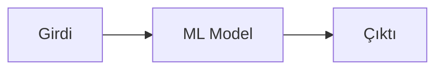
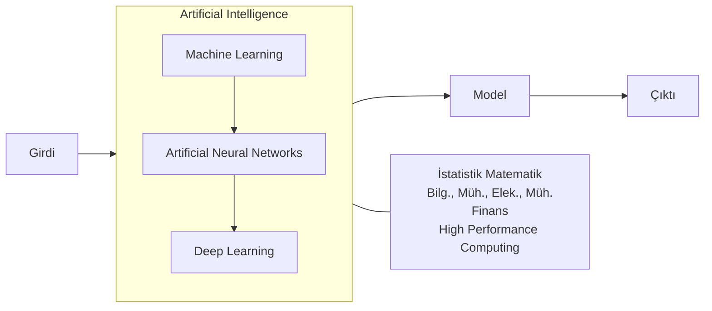
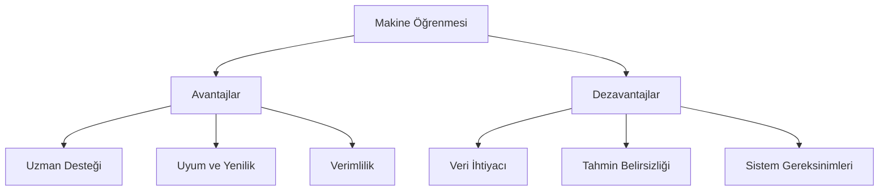
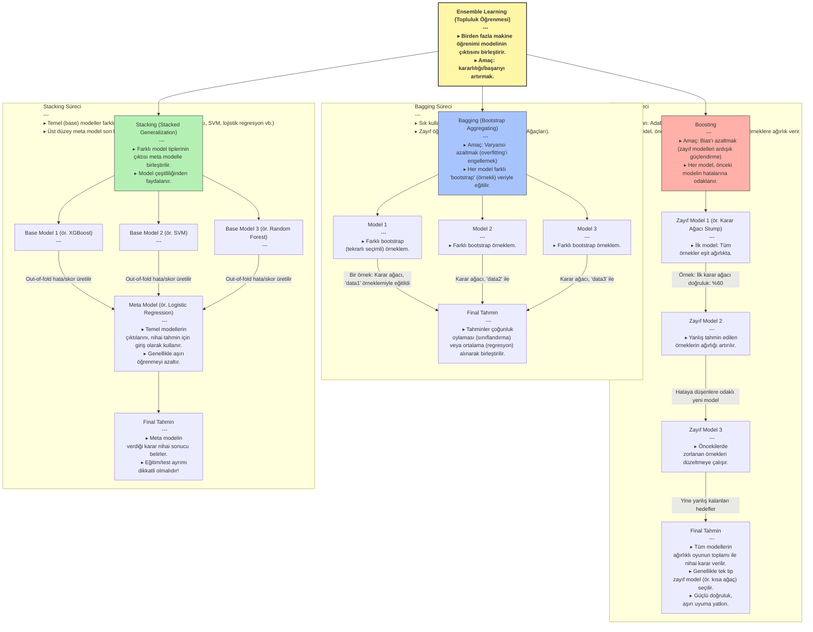

# Makine Öğrenmesi (Machine Learning) ve Yapay Zeka (AI)

---

### 1. Temel Kavramlar ve Avantaj

**Yapay Zeka (AI)**, İnsanın sahip olduğu **deneyim** ve **tecrübeyi** bilgisayarlara aktarılmasının yollarını inceleyen bilim dalının en genel adıdır. **Makine Öğrenmesi** ise bu amaç için kendine özgü teknikleri barındıran yapay zekanın bir **alt koludur**.

Bilgisayarlar **dijital** kullanan makinelerdir. İnsanların sahip olduğu tecrübe, deneyim, uzmanlık, yetenekler ve kabiliyetlerin bu dil yardımıyla onlara aktarılması, bu alanın en büyük **avantajıdır**.

### 2. Veri ve Bilgi Hiyerarşisi
**Datum**, Latince kökenli bir kelime olup, "verilen şey" veya "gerçek" anlamına gelir. İngilizcede "data" kelimesinin tekil hali olarak kullanılır. Genellikle tek bir gözlemi, ölçümü veya gerçeği ifade ederken, "data" ise bu tekil gerçeklerin çoğulunu, yani bir koleksiyonunu temsil eder. Bu ayrım, özellikle bilimsel ve teknik metinlerde verinin temel birimini vurgulamak için önemlidir.

**Veri**, bir nesne, varlık, durum, olay hakkında nitel ya da nicel bulguların (gerçeklerin) belirli bir sistematiğe göre kayıt altına alınmış haline denilir.

Veri, bilgiye dönüşürken bir hiyerarşiden geçer:

$$\text{Raw Data (İşlenmemiş Veri)} \rightarrow \text{Data (Veri)} \rightarrow \text{Knowledge (Bilgi)}$$

* **İşlenmemiş Veri Örn.:** Yeni doğan bir bebeğin ağırlığı (Henüz bilinmiyor ancak bir ağırlığı var).

* **Veri Örn.:** Bir metriğe (örn. m, kg, inç, galon vb.) göre bu bebeğin ağırlığının ölçülüp bir yere kayıt edilmesi.

* **Bilgi (information) Örn.:** Bebeğin kilosu vb. özelliklerini kullanarak elde edilen gerçeklerdir. Örn: Çorlu'da Mart ayında doğan bebeklerin kilo ortalaması 2.8 kg'dır.

* **Knowledge (Anlamlı-İşe yarar bilgi):** Büyük ve karmaşık verilerden, ilk bakışta fark edilmeyen, daha önce elde edilmemiş, işe yarar ve anlamlı gerçeklerdir.
    * **Yapay Zeka (AI) ile Elde Edilen Bilgi Örn.:** Bir yapay zeka sistemi, yeni doğan bebeklerin ağlama seslerini analiz ederek, ağlamanın açlık, uykusuzluk veya rahatsızlık gibi farklı nedenlerini ayırt edebilir. Bu sayede ebeveynlere, bebeğin neden ağladığına dair daha hızlı ve doğru bir tahmin sunarak, bebeğin ihtiyaçlarına daha etkili yanıt vermelerine yardımcı olabilir.

### 3. Süreç ve İlişkili Disiplinler

Makine öğrenmesi **İstatistik** ve **matematiksel teorileri** kullanır.

#### Süreç Akışı (Model)

#### İlişkili Alanların Bazıları

* **Veri Madenciliği (Mining)**
* **Temel Bilimler:** İstatistik, Matematik
* **Mühendislik Dalları:** Bilg. Müh., Elek. Müh.

#

### 5. Makine Öğrenmesinin Avantajları ve Dezavantajları

Makine öğrenmesi teknolojilerinin günlük hayatımıza getirdiği kolaylıklar kadar, dikkat edilmesi gereken sınırlamaları da vardır. Bu bölümde her iki yönünü de inceleyeceğiz.

#### Avantajları:

1. **Uzman Desteği**
    - Uzman sayısının yetersiz olduğu alanlarda karar desteği sağlar
    - Yeni verilerle sürekli kendini güncelleyerek uzman görüşlerini öğrenir

2. **Uyum ve Yenilik**
    - Daha önce karşılaşılmamış durumlar için yeni kurallar geliştirebilir
    - Veri setindeki gizli örüntüleri ve ilişkileri keşfedebilir

3. **Verimlilik**
    - 7/24 kesintisiz çalışabilir
    - Klasik programlama ile çözülemeyen problemlere veri-odaklı çözümler üretebilir

#### Dezavantajları:

1. **Veri Gereksinimleri**
    - Modelin doğru çalışması için sürekli güncel veri gerekir
    - Büyük veri setleri bile bazen doğru öğrenme için yeterli olmayabilir

2. **Tahmin Doğruluğu**
    - Sonuçlar kesin değil, olasılıksal tahminlerdir
    - Problem yapısı değiştiğinde modelin yeniden eğitilmesi gerekir

3. **Teknik Sınırlamalar**
    - Karmaşık algoritmalar yüksek işlemci gücü ve bellek gerektirir
    - Gerçek zamanlı veri akışlarında performans sorunları yaşanabilir
    - Yüksek başarımlı hesaplama sistemlerine ihtiyaç duyulabilir

### Makine Öğrenmesi Projelerinde Adım Adım İlerleme

Makine öğrenmesi, bilgisayarların veriden anlam çıkarmasını ve bu anlamı kullanarak kararlar almasını sağlayan güçlü bir alandır. Ancak bu süreci başarıyla yönetmek, belirli adımları titizlikle takip etmeyi gerektirir. Tıpkı bir bilimsel araştırma gibi, makine öğrenmesi projeleri de bir dizi aşamadan oluşur ve her aşama bir sonrakini etkiler. Unutulmamalıdır ki, bazı yöntemler eksik veya gürültülü veriyle başa çıkabilirken, çoğu algoritma için temiz ve düzenli veri hayati öneme sahiptir. En uygun modeli bulmak için genellikle birden fazla algoritma ve yaklaşım denemek gerekir.

#### 1. Problemi Anlamak ve Tanımlamak

Her şey, çözmek istediğimiz problemi net bir şekilde anlamakla başlar. Bu aşamada, karşılaştığımız sorunun makine öğrenmesi teknikleriyle çözülüp çözülemeyeceğini belirleriz. Örneğin, bir fırının sıcaklığını belirli bir seviyede tutmak daha çok kontrol sistemlerinin işiyken, bir marketteki müşterilerin yaş dağılımını bulmak istatistiksel bir analizdir. Makine öğrenmesi, özellikle şu tür durumlar için idealdir:

*   **Kuralların Belirsiz Olduğu Durumlar:** Çözüm için açık ve net bir algoritma yazmanın zor olduğu, karmaşık ilişkilerin bulunduğu problemler.
*   **Dinamik ve Büyük Veri Setleri:** Sürekli değişen ve çok sayıda girdiye sahip sistemlerde çıktıları tahmin etme ihtiyacı.
*   **Gizli Örüntüleri Keşfetme:** Büyük ve karmaşık veri yığınlarından ilk bakışta fark edilmeyen, işe yarar ve anlamlı bilgileri ortaya çıkarma.

Bu adımda, problemin kapsamını, hedeflerini ve başarı kriterlerini belirlemek, projenin geri kalanına yön verir.

#### 2. Veri Toplama ve Yönetimi

Problemi tanımladıktan sonra, modelimizi eğitmek için gerekli verileri toplamaya başlarız. Bu süreç, genellikle alanında uzman kişilerle iş birliği içinde yürütülür. Burada önemli olan, sadece veri toplamak değil, aynı zamanda bu verilerin nasıl yönetileceğini de planlamaktır:

*   **Hangi Veriler?** Problemi çözmek için hangi özelliklerin (değişkenlerin) önemli olduğunu belirlemek.
*   **Nereden ve Nasıl?** Veri kaynaklarını (veritabanları, sensörler, web vb.) ve toplama yöntemlerini seçmek.
*   **Depolama ve Teknoloji:** Toplanan verilerin nerede (bulut, yerel sunucu) ve hangi teknolojiyle (SQL, NoSQL veritabanları, veri gölleri) depolanacağını kararlaştırmak.
*   **Veri Türü ve Boyutu:** Verilerin nitel mi nicel mi olduğunu, ne kadar hacimli olacağını ve bu hacme uygun depolama stratejilerini belirlemek.

Veri toplama aşaması, modelin kalitesini doğrudan etkileyecek temel bir adımdır.

#### 3. Veri Temizleme ve Hazırlık

Gerçek dünya verileri nadiren mükemmeldir. Çoğu zaman eksik değerler, hatalı girişler, aykırı gözlemler veya tutarsız formatlar içerirler. Bu aşama, ham veriyi makine öğrenmesi algoritmalarının anlayabileceği ve doğru sonuçlar üretebileceği bir formata dönüştürmeyi amaçlar:

*   **Eksik Veriyle Başa Çıkma:** Boşlukları doldurma (imputation) veya ilgili kayıtları çıkarma gibi stratejiler.
*   **Gürültü ve Aykırılıkları Giderme:** Modelin yanlış öğrenmesine neden olabilecek hatalı veya sıra dışı değerleri tespit edip düzeltme.
*   **Veri Türü Dönüşümleri:** Algoritmaların gereksinimlerine göre veri tiplerini (örneğin, metin verisini sayısal temsile) dönüştürme.
*   **Özellik Mühendisliği:** Mevcut verilerden yeni ve daha anlamlı özellikler türeterek modelin öğrenme kapasitesini artırma.

Bu adımın ne kadar titizlikle yapıldığı, modelin nihai performansını büyük ölçüde belirler.

#### 4. Model Eğitimi ve Seçimi

Verilerimiz hazır olduğunda, makine öğrenmesi algoritmalarını kullanarak modellerimizi oluşturmaya başlarız. Bu aşamada, farklı algoritmalar (örneğin, karar ağaçları, destek vektör makineleri, sinir ağları) eğitim verisi üzerinde denenir ve her birinin performansı kaydedilir.

*   **Algoritma Çeşitliliği:** Makine öğrenmesi dünyası, her biri farklı problem türleri ve veri yapıları için optimize edilmiş zengin bir algoritma yelpazesi sunar. En iyi modeli bulmak için bu algoritmalar arasında denemeler yapmak önemlidir.
*   **Veri Tipi Uyumu:** Bazı algoritmalar yalnızca sayısal verilerle çalışırken, bazıları kategorik verileri de doğrudan işleyebilir. Bu nedenle, seçilen algoritmanın veri tipimizle uyumlu olduğundan emin olmak gerekir.
*   **Performans Metrikleri:** Bir algoritmanın ne kadar iyi çalıştığını değerlendirmek için tek bir ölçüt yoktur. Doğruluk (accuracy), kesinlik (precision), geri çağırma (recall), F1 skoru gibi birçok farklı metrik, modelin farklı yönlerini değerlendirmemizi sağlar. Buradaki temel hedef, kabul edilebilir bir hata oranıyla en yüksek doğruluğu sunan algoritmayı ve onun parametrelerini bulmaktır.

#### 5. Sonuçları Değerlendirme ve İyileştirme

Model eğitimi tamamlandıktan sonra, elde edilen sonuçları dikkatlice değerlendirmemiz gerekir. Bu aşamada, daha önce belirlenen performans metrikleri kullanılarak modelin ne kadar başarılı olduğu analiz edilir.

*   **Kapsamlı Değerlendirme:** Modelin sadece genel doğruluğuna değil, aynı zamanda belirli hata türlerine (örneğin, yanlış pozitifler veya yanlış negatifler) ne kadar yatkın olduğuna da bakılır.
*   **İteratif Süreç:** Eğer modelin performansı, tanımlanan problem için yeterli düzeyde değilse, bu bir başarısızlık değil, bir öğrenme fırsatıdır. Bu durumda, önceki adımlara geri dönülerek (veri toplama, temizleme, özellik mühendisliği veya farklı algoritmalar deneme) iyileştirmeler yapılır. Bu döngü, tatmin edici sonuçlar elde edilene kadar devam eder.
*   **İstatistiksel Doğrulama:** Elde edilen sonuçların istatistiksel olarak anlamlı olup olmadığını değerlendirmek, modelin genellenebilirliği hakkında önemli bilgiler sunar.

#### Model Nedir?

Makine öğrenmesinde bir "model", girdiye göre çıktıyı öngörebilen otomatik veya yarı otomatik bir sistemdir. Bu, gerçek dünyadaki bir sürecin matematiksel bir temsili olabileceği gibi, veriden öğrenilmiş karmaşık bir kural seti de olabilir. Önemli bir nokta, modellerin ürettiği sonuçların **kesin olmaması**, aksine **olasılıksal tahminler** olduğudur. Bir model, genellikle programlama dilleri aracılığıyla inşa edilen sistemlere entegre edilerek, ham girdiyi işleyip anlamlı çıktılara dönüştüren yapay zeka tekniklerini kullanan bir "beyin" görevi görür.

#### Öğrenme Kavramı

Bilgisayarlar için "öğrenme", bir konu, durum veya olay hakkında yeterli bilgiye sahip olma sürecidir. Bu, insanlardaki gibi tecrübe kazanma ve uygun davranışları geliştirme yoluyla gerçekleşir. Bilgisayarlar, kendilerine sunulan büyük miktardaki veriyi analiz ederek, bu verilerdeki örüntüleri ve ilişkileri keşfederler. Yeterli veri ve doğru algoritmalarla "eğitildiklerinde", tıpkı bir insanın yeni bir beceri kazanması gibi, belirli görevleri yerine getirme yeteneği kazanırlar. Bu sayede, daha önce görmedikleri verilere karşı bile anlamlı tahminler yapabilir veya kararlar alabilirler.

### Öğrenme Türleri

Makine öğrenmesinin temel taşlarından biri, bilgisayarların veriden nasıl öğrendiğini anlamaktır. Bu öğrenme süreçlerini genellikle iki ana kategoriye ayırırız: Denetimli ve Denetimsiz Öğrenme. Her birinin kendine özgü bir yaklaşımı ve kullanım alanı vardır.

#### Denetimli Öğrenme (Supervised Learning)

Şöyle düşünün gençler, küçük bir çocuğa hayvanları öğretirken, ona bir kedi resmi gösterip "bu bir kedi" deriz, bir köpek resmi gösterip "bu bir köpek" deriz. Yani, her resim için doğru cevabı, yani "etiketi" ona veririz. Çocuk yeterince örnek gördüğünde, daha önce hiç görmediği bir hayvan resmini bile doğru tahmin etmeye başlar.

İşte denetimli öğrenme de tam olarak bu prensiple çalışır. Elimizde, girdilerin (örneğin bir hayvanın özellikleri) ve bunlara karşılık gelen doğru çıktıların (örneğin "kedi" veya "köpek" etiketi) bulunduğu bir veri seti vardır. Bu verilere **etiketlenmiş veri** adını veririz. Amacımız, bu etiketlenmiş veriyi kullanarak, bilgisayarın yeni, daha önce görmediği girdiler için doğru çıktıyı tahmin edebilecek bir **model** oluşturmasını sağlamaktır. Bu model, geçmişteki deneyimlerden (veri) öğrenerek gelecekteki durumlar hakkında tahminler yapar.

Bu öğrenme türü, makine öğrenmesinde en sık karşılaştığımız yaklaşımdır. Temelinde, belirli bir hedef değişkeni (çıktı) tahmin etme veya sınıflandırma amacı yatar. Model, girdiler ile çıktılar arasındaki karmaşık ilişkileri öğrenir ve bu ilişkileri yeni verilere genellemeye çalışır.

**Uygulamalar:**
Denetimli öğrenme, özellikle şu tür problemlerin çözümünde kullanılır:
*   **Sınıflandırma Problemleri (Classification):** Bir verinin hangi kategoriye ait olduğunu tahmin etmek.
*   **Regresyon Problemleri (Regression):** Sürekli bir sayısal değeri tahmin etmek.

**Örnekler:**
*   Bir e-postanın "Spam" mı yoksa "Normal" mi olduğunu belirlemek.
*   Bir müşterinin kredi başvurusunun "Onaylandı" ya da "Reddedildi" olarak sonuçlanacağını tahmin etmek.
*   Bir hastada "Şeker hastalığı var" ya da "Yok" teşhisi koymak.
*   Bir evin özelliklerine (metrekare, oda sayısı, konum vb.) bakarak satış fiyatını öngörmek.
#### Denetimsiz Öğrenme (Unsupervised Learning)

Şimdi de şöyle bir senaryo düşünelim: Size bir kutu dolusu farklı renkte ve şekilde oyuncak veriliyor ve "Bunları benzerliklerine göre gruplandır" deniyor. Ama size hangi oyuncağın ne olduğunu veya kaç grup olması gerektiğini söyleyen kimse yok. Siz de oyuncakların renklerine, boyutlarına, şekillerine bakarak kendinizce gruplar oluşturuyorsunuz.

Denetimsiz öğrenme de bu mantıkla çalışır. Elimizde **etiketlenmemiş veriler** bulunur; yani, girdilere karşılık gelen doğru çıktıları önceden bilmeyiz ve sınıflar önceden belirli değildir. Buradaki temel amaç, verinin kendi içindeki gizli yapıları, örüntüleri veya ilişkileri keşfetmektir. Denetimsiz öğrenme algoritmaları (örneğin kümeleme ve birliktelik kuralları gibi yöntemler) bu etiketlenmemiş verilerde var olan örüntüyü ortaya çıkarır. Bu süreçte veri analisti, algoritmalar üzerinde beklentileri doğrultusunda ayarlamalar yaparak en anlamlı sonuçları elde etmeye çalışır. Özellikle kümeleme analizi, verinin anlaşılırlığını artırır ve kümeler arası uzaklıklar, farklılıklar veya benzerlikler gibi önemli bilgilerin tespit edilmesini sağlar. Model, herhangi bir dış rehberlik olmaksızın, verinin doğal düzenini anlamaya çalışır.

**Yöntemler ve Uygulamalar:**
*   **Kümeleme (Clustering):** Bu alandaki en yaygın yöntemlerden biri kümelemedir. Kümeleme, veri noktalarını birbirine benzer özelliklere sahip gruplara ayırır. Örneğin, bir e-ticaret sitesi, müşterilerinin satın alma alışkanlıklarına bakarak onları farklı segmentlere ayırabilir. Böylece her segmente özel pazarlama stratejileri geliştirebilir. Burada kaç müşteri grubu olduğunu veya hangi müşterinin hangi gruba ait olduğunu önceden bilmeyiz, model bunu veriden öğrenir.
*   **Birliktelik Kuralları (Association Rules):** Bir diğer önemli denetimsiz öğrenme yöntemi ise birliktelik kurallarıdır. Bu yöntem, veriler arasındaki eş zamanlı oluşumları veya ilişkileri ortaya çıkarır. En bilinen örneği **sepet analizi**dir: "Eğer bir müşteri ekmek alıyorsa, büyük ihtimalle tereyağı da alır" gibi kurallar keşfedilir. Bu sayede marketler ürün yerleşimlerini veya kampanyalarını optimize edebilir.
*   **Boyut Azaltma (Dimensionality Reduction):** Ayrıca, verinin daha anlaşılır hale getirilmesi veya görselleştirilmesi için boyut azaltma gibi teknikler de denetimsiz öğrenme kapsamına girer. Bu, çok sayıda özelliği olan veriyi, bilgi kaybını en aza indirerek daha az sayıda özellikle temsil etmeyi amaçlar.

**Örnekler:**
*   Bir şirketin müşteri tabanında kaç farklı "müşteri tipi" olduğunu bulmak ve bu tiplere göre pazarlama stratejileri geliştirmek.
*   Sosyal medya gönderilerindeki konuları otomatik olarak gruplandırmak.
*   Bir süpermarkette hangi ürünlerin sıklıkla birlikte satın alındığını keşfetmek (sepet analizi).
*   Büyük bir veri setindeki anormallikleri veya sıra dışı durumları tespit etmek.

### Lineer Regresyon (Doğrusal Regresyon)

Şimdi de makine öğrenmesinin en temel ve en sık kullanılan modellerinden biri olan Lineer Regresyon'a (Doğrusal Regresyon) bir göz atalım gençler. Adından da anlaşılacağı gibi, bu model, değişkenler arasında doğrusal bir ilişki olduğunu varsayar ve bu ilişkiyi matematiksel olarak ifade etmeye çalışır.

Hayatımızda birçok şeyin birbiriyle ilişkili olduğunu gözlemleriz. Örneğin, bir evin büyüklüğü arttıkça fiyatının da artması beklenir, ya da bir öğrencinin ders çalışma süresi uzadıkça sınav notunun yükselme ihtimali artar. Lineer regresyon, işte bu tür 'neden-sonuç' ilişkilerini, bir doğru denklemiyle ifade etmeyi hedefler.

En basit haliyle, bir girdi (bağımsız değişken) ve bir çıktı (bağımlı değişken) arasındaki ilişkiyi şöyle bir denklemle gösterebiliriz:

$$y = \theta_0 + \theta_1 x$$

Burada:
*   `y`, tahmin etmeye çalıştığımız sonuçtur (örneğin, evin fiyatı veya sınav notu).
*   `x`, sonucu etkilediğini düşündüğümüz girdidir (örneğin, evin metrekaresi veya ders çalışma süresi).
*   `θ₀` (teta sıfır), doğrunun y eksenini kestiği noktadır, yani `x` sıfır olduğunda `y`'nin alacağı değerdir. Buna 'sabit terim' veya 'kesişim' diyebiliriz.
*   `θ₁` (teta bir), `x`'teki bir birimlik değişimin `y`'de ne kadarlık bir değişime yol açtığını gösteren 'eğim' veya 'katsayı'dır. Bu katsayı, `x` ile `y` arasındaki ilişkinin gücünü ve yönünü belirler.

Makine öğrenmesinde bu `y = \theta_0 + \theta_1 x` denklemini bir 'hipotez' olarak adlandırırız. Yani, `x` ile `y` arasında böyle bir doğrusal ilişki olabileceğini varsayarız. Modelin 'öğrenme süreci' ise, elimizdeki mevcut verileri (geçmiş ev fiyatları ve metrekareleri gibi) kullanarak, bu hipoteze en uygun `θ₀` ve `θ₁` değerlerini bulmaktan ibarettir. Amacımız, bu parametreleri öyle bir şekilde belirlemektir ki, modelimiz mevcut verilere en iyi şekilde uysun ve gelecekteki yeni `x` değerleri için `y`'yi mümkün olan en doğru şekilde tahmin edebilsin.

Peki ya bir sonucu etkileyen tek bir faktör değil de birden fazla faktör varsa? Örneğin, evin fiyatını sadece metrekaresi değil, aynı zamanda oda sayısı, bulunduğu semt, yaşı gibi birçok özellik etkileyebilir. İşte bu durumda modelimizi genişleterek 'Çoklu Lineer Regresyon'a geçeriz:

$$y = \theta_0 + \theta_1 x_1 + \theta_2 x_2 + \dots + \theta_n x_n$$

Burada `x₁`, `x₂`, ..., `xₙ` farklı girdi özelliklerini (metrekaresi, oda sayısı vb.) temsil ederken, `θ₁`, `θ₂`, ..., `θₙ` de her bir özelliğin `y` üzerindeki etkisini gösteren katsayılardır. Bu denklem hala 'lineer'dir, çünkü `y`'nin tahmini, her bir özelliğin katsayılarla çarpılıp toplanmasıyla elde edilir. Yani, parametreler (`θ` değerleri) açısından ilişki doğrusaldır.

Lineer regresyonun en önemli özelliklerinden biri, makine öğrenmesi algoritmaları arasında en basit ve anlaşılır olanlardan biri olmasıdır. Bu basitliği sayesinde, sonuçları yorumlamak ve hangi faktörlerin çıktıyı ne kadar etkilediğini anlamak genellikle kolaydır. Ayrıca, hesaplama maliyeti düşüktür ve birçok gerçek dünya probleminde şaşırtıcı derecede iyi sonuçlar verebilir. Ancak unutmamak gerekir ki, bu modelin iyi çalışabilmesi için girdi ve çıktı arasında gerçekten doğrusal bir ilişki olması varsayılır. Eğer ilişki doğrusal değilse, daha karmaşık modellere ihtiyaç duyulabilir.

Bu doğrusal modeller, yani bir sonuç (y) ve neden (x) değişkenlerini tanımlayan denklemler gibi yapılar, neden-sonuç ilişkilerini anlamak için oldukça güçlü araçlardır. Aralarında doğrusal bir ilişki bulunan durumları analiz etmek ve yorumlamak genellikle daha kolaydır.

#### Lineer Modelin Avantajları:

*   **Gelişmiş Teori ve Anlaşılırlık:** Lineer modellerin matematiksel teorisi oldukça iyi geliştirilmiştir. Özellikleri ve kapsamları net bir şekilde bilindiği için, bu modeller güvenilir bir temel sunar.
*   **Kolay Tahmin ve Geliştirme:** Model parametrelerinin (yani `θ` değerlerinin) tahmini ve probleme göre modelin geliştirilmesi genellikle kolaydır.
*   **Geniş Uygulama Alanı:** Basit yapılarına rağmen, çok geniş ve çeşitli ilişkileri ifade edebilirler. Birçok farklı alandaki problemleri çözmek için kullanılabilirler.
*   **Karmaşık Veri Setleriyle Başarı:** Spesifik ve karmaşık veri setlerinin tahmin problemlerinde bile şaşırtıcı derecede iyi sonuçlar verebilirler.
*   **Hesaplama Verimliliği:** Yüz binlerce parametre ve faktör içeren lineer modellerin bilgisayarla kurulması ve eğitilmesi genellikle kolay ve hızlıdır.
*   **Esneklik:** Lineer modeller, doğrusal olmayan ilişkileri modelleme konusunda da şaşırtıcı bir esneklik sunar. Doğrudan doğrusal olmayan bir ilişkiyi ifade etmek yerine, mevcut değişkenler üzerinden yeni "geçici değişkenler" veya "dönüştürülmüş öznitelikler" tanımlayarak bu ilişkileri doğrusal bir forma dönüştürebiliriz. Örneğin, bir `x₁` değişkeninin karesi olan `x₁²`'yi yeni bir `X₂` özniteliği olarak düşünebiliriz. Ya da `log(x₁)` gibi bir dönüşüm uygulayarak bunu `X₃` olarak modele dahil edebiliriz. Bu durumda, orijinalde `y = θ₀ + θ₁x₁ + θ₂x₁²` gibi görünen bir denklemi, `X₂ = x₁²` tanımlamasıyla `y = θ₀ + θ₁x₁ + θ₂X₂` şeklinde parametreleri açısından doğrusal bir yapıya kavuşturmuş oluruz. Yani, `f(x₁) = X_{n+1}` veya `f(x₂) = X_{n+2}` gibi fonksiyonlarla orijinal öznitelikleri dönüştürerek, modelin parametreleri (`θ` değerleri) açısından doğrusal kalmasını sağlarız. Eğer veri kümesinde doğrusal olmayan ilişkiler barındıran parametreler varsa, bunlar temel değişkenlerden hesaplanıp veri kümesine yeni özellikler olarak eklenebilir ve bu genişletilmiş veri kümesinde doğrusal model kullanılabilir. Bu yaklaşım, lineer modellerin çok daha geniş bir problem yelpazesine uygulanabilmesine olanak tanır.

Lineer modellerin nasıl ifade edildiğine ve görselleştirildiğine de kısaca değinelim.

#### Lineer Modelin Gösterimi:

Önce matematiksel modelimizi daha anlaşılır kılalım. Temel lineer model denklemi:
$$y = \theta_0 + \theta_1 x_1 + \theta_2 x_2 + \dots + \theta_m x_m$$

Bu denklemin tek değişkenli en basit hali şöyle görünür:
$$y = \theta_0 + \theta_1 x$$

<svg width="400" height="300" xmlns="http://www.w3.org/2000/svg">
    <line x1="50" y1="250" x2="350" y2="250" stroke="black"/>
    <line x1="50" y1="250" x2="50" y2="50" stroke="black"/>
    <line x1="50" y1="150" x2="350" y2="100" stroke="blue" stroke-width="2"/>
    <text x="360" y="250">x</text>
    <text x="40" y="40">y</text>
    <text x="360" y="100">y = θ₀ + θ₁x</text>
    <text x="70" y="180">θ₀ (y-kesişimi)</text>
    <text x="200" y="140">θ₁ (eğim)</text>
</svg>

Burada:
- `θ₀` doğrunun y eksenini kestiği noktayı belirler
- `θ₁` doğrunun eğimini gösterir
- Her x değeri için tek bir y değeri vardır

İki değişkenli model için durum biraz farklıdır:
$$y = \theta_0 + \theta_1 x_1 + \theta_2 x_2$$

<svg width="400" height="300" xmlns="http://www.w3.org/2000/svg">
    <polygon points="50,250 350,250 350,50" fill="lightblue" opacity="0.3"/>
    <line x1="50" y1="250" x2="350" y2="250" stroke="black"/>
    <line x1="350" y1="250" x2="350" y2="50" stroke="black"/>
    <line x1="50" y1="250" x2="50" y2="50" stroke="black"/>
    <text x="360" y="250">x₁</text>
    <text x="360" y="40">x₂</text>
    <text x="40" y="40">y</text>
    <text x="200" y="150">y = θ₀ + θ₁x₁ + θ₂x₂</text>
</svg>

Sınıflandırma problemlerinde, lineer model bir ayırıcı çizgi oluşturur:

<svg width="400" height="300" xmlns="http://www.w3.org/2000/svg">
    <!-- X ve Y eksenleri -->
    <line x1="50" y1="250" x2="350" y2="250" stroke="black" stroke-width="2"/>
    <line x1="50" y1="250" x2="50" y2="50" stroke="black" stroke-width="2"/>
    <!-- Ayırıcı çizgi -->
    <line x1="50" y1="250" x2="350" y2="50" stroke="red" stroke-width="2"/>
    <!-- Sınıf A noktaları -->
    <circle cx="100" cy="100" r="5" fill="blue"/>
    <circle cx="120" cy="120" r="5" fill="blue"/>
    <circle cx="90" cy="80" r="5" fill="blue"/>
    <!-- Sınıf B noktaları -->
    <circle cx="250" cy="200" r="5" fill="green"/>
    <circle cx="270" cy="220" r="5" fill="green"/>
    <circle cx="290" cy="240" r="5" fill="green"/>
    <!-- Etiketler -->
    <text x="100" y="70" font-size="14">Sınıf A</text>
    <text x="250" y="250" font-size="14">Sınıf B</text>
    <text x="150" y="150" font-size="14" fill="red">Ayırıcı Çizgi</text>
    <!-- Eksen etiketleri -->
    <text x="360" y="255" font-size="14">x</text>
    <text x="35" y="60" font-size="14">y</text>
</svg>

Bu gösterimlerdeki öznitelikler (x'ler), sonucu (y) etkileyen ölçülebilir özellikleri temsil eder. Her özniteliğin etkisi, kendi θ katsayısı ile belirlenir.

#### Öznitelikler (Features)

Bir makine öğrenmesi modelinde, tahmin etmeye çalıştığımız `y` sonucunu etkilediğini düşündüğümüz her bir girdi değişkenine **öznitelik (feature)** denir. Bunlara bazen **nitelik (attribute)**, **değişken (variable)**, **boyut (dimension)** veya modelin içindeki **parametreler (parameters)** de diyebiliriz.

Yukarıdaki standart lineer model denklemimizde:
$$y = \theta_0 + \theta_1 x_1 + \theta_2 x_2 + \dots + \theta_m x_m$$
Burada `y` tahmin edilen sonuçken, `x₁`, `x₂`, ..., `xₘ` ifadeleri modelin kullandığı farklı özniteliklerdir.

Bu özniteliklerin bir araya gelerek oluşturduğu topluluğa **öznitelik serisi** veya **öznitelik vektörü** denir. Bir öznitelik vektörünün oluşturulmasında, öncelikle alanında uzman kişilerin görüşleri ve bilgileri kullanılır. Bu uzmanlar, tahmin edilmeye çalışılan durumu en iyi şekilde karakterize eden özellikleri belirlememize yardımcı olurlar.

**Örnek:** Yarınki hava durumunun tahmini probleminde:
*   `y` = Yarınki hava durumu tahmini (örneğin, sıcaklık, yağış durumu)
*   `x₁` = Bugünkü sıcaklık
*   `x₂` = Bugünkü nem
*   `x₃` = Bugünkü basınç
*   `x₄` = Bugünkü rüzgar hızı
*   `x₅` = Bugünkü rüzgarın yönü

Şimdi gençler, bir makine öğrenmesi modelinin beynine giden bilgiyi, yani öznitelikleri biraz daha derinlemesine konuşalım. Bir doktorun doğru teşhisi koymak için hastanın ateşine, tansiyonuna, tahlil sonuçlarına bakması gibi, makine öğrenmesi modeli de bir tahminde bulunurken bu 'özniteliklere' bakar.

Bir evin fiyatını tahmin etmeye çalıştığımızı düşünelim. Modelimize hangi bilgileri veririz? Evin metrekaresi, oda sayısı, bulunduğu semt, binanın yaşı... İşte bunların her biri birer **özniteliktir**.

Peki, bu özniteliklerin hepsi eşit derecede önemli mi? Evin fiyatını tahmin ederken, evin kapı rengi önemli bir bilgi midir? Muhtemelen hayır. Ama metrekaresi? Kesinlikle evet. İşte bu yüzden doğru öznitelikleri seçmek, bir dedektifin doğru ipuçlarını takip etmesi gibidir. Yanlış veya alakasız ipuçları (öznitelikler) modelimizi yanıltabilir ve performansını ciddi şekilde düşürebilir.

#### Öznitelik Türleri

Öznitelikler genellikle birkaç temel kategoriye ayrılır:

1.  **Sayısal (Numeric) Öznitelikler:** Bunlar bildiğimiz sayılardır. Bir evin metrekaresi (120 m²), bir arabanın motor gücü (150 beygir), hava sıcaklığı (25.5°C) gibi ölçülebilir değerlerdir.
2.  **Kategorik (Categorical) Öznitelikler:** Belirli ve sınırlı sayıda seçenekten birini alan değerlerdir. Örneğin, bir arabanın markası ('Ford', 'Fiat', 'Renault') veya bir öğrencinin bölümü ('Mühendislik', 'Tıp', 'İşletme') gibi.
3.  **İkili (Binary) Öznitelikler:** Kategorik özniteliklerin en basit halidir, sadece iki olası değeri vardır. 'Garajı var mı?' (Evet/Hayır), 'E-posta spam mi?' (Evet/Hayır) gibi. Genellikle modelin anlayabilmesi için 1 ve 0 olarak kodlanırlar.

#### Öznitelik Seçimi ve Öznitelik Mühendisliği

İşin en yaratıcı ve önemli kısımlarından birine geldik: **Öznitelik Mühendisliği**. Bazen elimizdeki ham veriler, yani **temel öznitelikler**, problemi çözmek için yeterli olmaz. Tıpkı bir aşçının elindeki temel malzemelerle yepyeni bir tarif yaratması gibi, biz de mevcut özniteliklerden daha anlamlı, yeni öznitelikler türetiriz.

*   **Temel Öznitelikler:** Bunlar, veri setimizde bize doğrudan verilen orijinal özelliklerdir. Bu temel özniteliklerin seçiminde alanında uzman kişilerin görüşü altın değerindedir. Bir bankacı, kredi riskini tahmin ederken hangi finansal oranların önemli olduğunu en iyi bilir.
*   **Türetilmiş Öznitelikler:** Mevcut özniteliklerden yeni ve daha güçlü bilgiler oluşturmaktır. Örneğin, bir müşterinin 'doğum tarihi' özniteliği tek başına çok anlamlı olmayabilir. Ama bu bilgiden 'yaş' özniteliğini türetirsek, modelimiz için çok daha değerli bir bilgi elde ederiz. Veya bir evin 'genişliği' ve 'uzunluğu' öznitelikleri yerine, bu ikisini çarparak 'alan' adında tek ve daha güçlü bir öznitelik oluşturabiliriz.
*   **Etkileşim Öznitelikleri (Interaction Features):** Bazen iki öznitelik tek başlarına zayıfken, bir araya geldiklerinde özel bir etki yaratırlar. Buna **birleşik etki** de diyebiliriz. Örneğin, bir reklamın tıklanma oranını tahmin ederken, 'günün saati' ve 'kullanıcının cihazı' (mobil/masaüstü) özniteliklerini düşünelim. Belki de 'akşam saatlerinde mobil cihazdan' gösterilen reklamlar çok daha başarılıdır. İşte bu iki özniteliğin birleşiminden doğan etkiyi yakalayan yeni bir öznitelik oluşturmak, modelin başarısını katlayabilir.
*   **Gereksiz Öznitelikler:** Bazen de bazı öznitelikler aynı bilgiyi tekrar eder. Örneğin, veri setinde hem 'doğum tarihi' hem de 'yaş' varsa, bu iki öznitelik büyük ölçüde aynı bilgiyi taşır. Bu gibi durumlarda birini modelden çıkarmak, modelin daha basit ve hızlı çalışmasını sağlayabilir.

Kısacası, bir makine öğrenmesi modelinin ne kadar 'akıllı' olacağı, ona ne kadar kaliteli ve anlamlı 'bilgi' (öznitelik) verdiğimizle doğrudan ilişkilidir. Ham veriyi almakla yetinmeyip onu işlemek, zenginleştirmek ve en doğru temsilini bulmak, bu alanın hem bilimi hem de sanatıdır.

#### Özniteliklerin Ölçeklendirilmesi (Feature Scaling)

Şimdi gençler, makine öğrenmesi modellerimizin adil ve doğru kararlar verebilmesi için çok kritik bir konuya geldik: Öznitelik Ölçeklendirme. Bu, farklı birimlerde veya çok farklı aralıklarda olan sayısal verilerimizi ortak bir dile, yani ortak bir ölçeğe getirme işlemidir.

Neden bu kadar önemli olduğunu basit bir örnekle anlatalım. Bir ev fiyatı tahmin modeli kurduğumuzu düşünün. Elimizde iki temel öznitelik olsun: evin metrekaresi (örneğin, 50 ile 250 arasında değişiyor) ve oda sayısı (örneğin, 1 ile 6 arasında değişiyor). Sayısal olarak metrekare değerleri, oda sayısı değerlerinden çok daha büyüktür. Eğer bu verileri olduğu gibi modelimize verirsek, modelimiz sanki metrekare çok daha önemli bir özellikmiş gibi davranabilir. Çünkü algoritma, büyük sayısal değerlerin daha fazla etkiye sahip olduğu yanılgısına kapılabilir. Bu, modelimizin oda sayısı gibi potansiyel olarak çok önemli bir özniteliğin etkisini göz ardı etmesine neden olur. İşte bu adaletsizliği ortadan kaldırmak ve her özniteliğe kendini ifade etme şansı tanımak için ölçeklendirme yaparız.

Bu işlemi genellikle iki popüler yöntemle gerçekleştiririz: Normalizasyon ve Standardizasyon.

##### 1. Min-Max Normalizasyonu (Normalization)

Bu yöntem, adından da anlaşılacağı gibi, verileri belirli bir aralığa, genellikle 0 ile 1 arasına sıkıştırmayı hedefler. Bunu yaparken veri setindeki en küçük değeri 0'a, en büyük değeri ise 1'e karşılık gelecek şekilde dönüştürür. Aradaki diğer tüm değerler de bu yeni aralıkta orantılı olarak yerlerini alırlar.

Formülü şöyledir:
$$
\text{Val}_{\text{yeni}} = \frac{\text{Val}_{\text{eski}} - \text{min}(\text{Val})}{\text{max}(\text{Val}) - \text{min}(\text{Val})}
$$

*   **Örnek:** Bir grup öğrencinin bir sınavdan aldığı notlar [60, 70, 80, 100] olsun.
    *   En düşük not (min): 60
    *   En yüksek not (max): 100
    *   Şimdi 70 alan öğrencinin yeni notunu hesaplayalım:
        $$
        \frac{70 - 60}{100 - 60} = \frac{10}{40} = 0.25
        $$
    *   Tüm notları dönüştürdüğümüzde yeni setimiz şöyle olur: [0, 0.25, 0.5, 1]. Gördüğünüz gibi, tüm değerler artık 0 ile 1 arasında.

Bu yöntem, verinin dağılım yapısını bozmaz ancak veri setindeki aykırı değerlere (outliers) karşı oldukça hassastır. Örneğin, notlar arasında bir de 300 gibi hatalı bir giriş olsaydı, diğer tüm notlar 0'a çok yakın bir aralığa sıkışırdı.

##### 2. Z-Skoru Standardizasyonu (Standardization)

Bu yöntem ise verileri belirli bir aralığa sıkıştırmak yerine, onları ortalaması 0 ve standart sapması 1 olan bir dağılıma dönüştürür. Yani her bir veri noktasının, veri setinin ortalamasından kaç standart sapma uzakta olduğunu ifade eder. Bu nedenle bu işleme **standartlaştırma** da denir.

Formülü şöyledir:
$$
\text{Val}_{\text{yeni}} = \frac{\text{Val}_{\text{eski}} - \text{ortalama}(\text{Val})}{\text{standart\_sapma}(\text{Val})}
$$

*   **Örnek:** Yine aynı notları ele alalım: [60, 70, 80, 100].
    *   Bu notların ortalaması: (60 + 70 + 80 + 100) / 4 = 77.5
    *   Standart sapması: Yaklaşık 17.07
    *   Şimdi 70 alan öğrencinin Z-skorunu hesaplayalım:
        $$
        \frac{70 - 77.5}{17.07} = \frac{-7.5}{17.07} \approx -0.44
        $$
    *   Bu sonuç bize, 70 notunun ortalamanın yaklaşık 0.44 standart sapma altında olduğunu söyler.

Standardizasyon, Min-Max normalizasyonunun aksine aykırı değerlerden daha az etkilenir. Bu nedenle, verinizde aykırı değerler olduğundan şüpheleniyorsanız veya kullanacağınız algoritma verinin normal dağılıma yakın olmasını varsayıyorsa (örneğin, bazı lineer modeller), standardizasyon genellikle daha güvenli bir tercihtir.

##### 3. Onluk Ölçekleme (Decimal Scaling)

Bu, diğerlerine göre daha az kullanılan, daha basit bir yöntemdir. Temel amacı, değerleri sadece ondalık virgülünü kaydırarak -1 ile 1 arasına getirmektir. Bunu yapmak için, veri setindeki en büyük mutlak değere sahip elemanı 1'den küçük yapacak en küçük 10'un kuvvetini bulur ve tüm değerleri bu sayıya böleriz.

Formülü şöyledir:
$$
\text{Val}_{\text{yeni}} = \frac{\text{Val}_{\text{eski}}}{10^n}
$$
Buradaki `n`, `max(|Val|) / 10^n < 1` koşulunu sağlayan en küçük tam sayıdır.

*   **Örnek:** Elimizdeki değerler [-986, 450, 120, -50] olsun.
    *   Bu setteki en büyük mutlak değer `|-986| = 986`'dır.
    *   986'yı 1'den küçük yapmak için onu 1000'e (yani 10³) bölmemiz gerekir. Demek ki `n=3`.
    *   Şimdi tüm değerleri 1000'e böleriz: [-0.986, 0.450, 0.120, -0.050].

Bu yöntem oldukça basittir ancak verinin dağılımı hakkında herhangi bir bilgi kullanmadığı için genellikle diğer iki yöntem kadar etkili değildir.

### Örnek: Kredi Riski Tahmin Modeli Oluşturma

Şimdi gençler, öğrendiğimiz bu teorik bilgileri somut bir probleme uygulayalım. Bir banka olduğumuzu ve bize kredi başvurusunda bulunan bir müşterinin borcunu zamanında ödeyip ödemeyeceğini, yani "kredi riskini" tahmin etmek istediğimizi düşünelim. Bu, makine öğrenmesinin finansta en sık kullanıldığı alanlardan biridir.

#### 1. Adım: Problemi Anlamak ve Gerekli Bilgileri (Öznitelikleri) Belirlemek

Her şeyden önce, doğru soruları sormamız gerekir: Bir kişinin kredisini geri ödeme olasılığını ne gibi faktörler etkiler? Bu noktada tek başımıza hareket etmeyiz, alanında uzman kişilerden, yani bankacılardan ve kredi analistlerinden destek alırız. Onların tecrübeleri bize hangi bilgilerin değerli olduğunu söyler.

Kredi analistlerinden, geçmişte kredi kullanmış yüzlerce veya binlerce müşterinin bilgilerini alırız. Bu bilgiler, müşterinin krediyi zamanında ödeyip ödemediği bilgisiyle birlikte gelir. İşte bu 'sonucu belli olan' geçmiş veriler, bizim **etiketlenmiş eğitim verimizi** oluşturur. Modelimiz, bu verilerden öğrenerek gelecekteki müşteriler için tahmin yapmayı öğrenecektir.

Bu iş birliği sonucunda, modelimize girdi olarak sunacağımız bazı temel öznitelikleri belirlediğimizi varsayalım:
*   **Müşterinin Aylık Geliri:** Kişinin borcunu ödeme kapasitesini gösteren en temel bilgilerden biri.
*   **Yaşadığı Şehir:** Büyük şehirlerdeki yaşam maliyeti veya bölgesel ekonomik koşullar riski etkileyebilir.
*   **Geçmiş Ödeme Performansı:** Müşterinin daha önceki borçlarını zamanında ödeyip ödemediği. Bu, gelecekteki davranışları için en güçlü ipuçlarından biridir.

#### 2. Adım: Veri Tiplerini Anlamak ve Tanımlamak

Modelimizi kurmadan önce elimizdeki bilgilerin ne türde olduğunu anlamamız şart. Çünkü bir bilgisayar, "İstanbul" kelimesiyle "5000 TL" sayısını aynı şekilde işleyemez.

*   **Müşterinin Aylık Geliri:** Bu, sayısal bir değerdir. 5000, 15000, 25000 gibi üzerinde matematiksel işlemler yapabileceğimiz bir sayıdır. Bu tür verilere **Sayısal (Numeric)** öznitelik diyoruz.
*   **Yaşadığı Şehir:** Bu, 'İstanbul', 'Ankara', 'İzmir' gibi belirli kategorilerden birini alan bir bilgidir. Bu kategoriler arasında doğal bir sıralama yoktur (İstanbul, Ankara'dan daha "büyük" bir sayı değildir). Bu tür verilere **Kategorik (Categorical)** öznitelik diyoruz.
*   **Geçmiş Ödeme Performansı:** Bu sorunun cevabı genellikle basittir: "Evet, geçmişte gecikme yaşadı" veya "Hayır, yaşamadı". Sadece iki olası durumu olan bu tür verilere **İkili (Binary)** öznitelik diyoruz.

#### 3. Adım: Modelin Çıktısını, Yani Hedefimizi Belirlemek

Peki, modelimiz bize ne söyleyecek? Amacımız, tüm bu girdileri analiz edip sonunda tek bir karar vermektir: Bu müşteri "Yüksek Riskli" mi, yoksa "Düşük Riskli" mi? Bu, bizim modelimizin tahmin etmeye çalışacağı **hedef değişkendir**. Çıktımız, bu iki kategoriden biri olacak.

#### 4. Adım: Veriyi Modelin Anlayacağı Dile Çevirmek (Dönüşüm)

İşte en kritik adımlardan birine geldik. Özellikle lineer regresyon gibi matematiksel temelli modeller, kelimelerle veya kategorilerle doğrudan çalışamazlar. Onların dili sayılardır. Bu yüzden, sayısal olmayan özniteliklerimizi onlara uygun bir formata dönüştürmemiz gerekir.

*   **İkili Öznitelikler:** Bu en kolayıdır. "Evet" için `1`, "Hayır" için `0` değerini kullanabiliriz. Böylece "Geçmişte gecikme yaşadı" özniteliği, model için `1` veya `0` olan sayısal bir girdiye dönüşür.

*   **Kategorik Öznitelikler:** "Yaşadığı Şehir" gibi kategorik veriler biraz daha karmaşıktır. Eğer İstanbul=1, Ankara=2, İzmir=3 gibi rastgele sayılar verirsek, modelimiz bu şehirler arasında aslında var olmayan bir matematiksel ilişki (İzmir > Ankara gibi) kurmaya çalışabilir. Bu hatadan kaçınmak için **One-Hot Encoding (Tekil Etkin Kodlama)** adı verilen bir yöntem kullanırız.
    *   Bu yöntemde, "Yaşadığı Şehir" adlı tek bir sütun yerine, her bir şehir için yeni bir ikili (binary) sütun oluştururuz: `Şehir_İstanbul_mu`, `Şehir_Ankara_mı`, `Şehir_İzmir_mi`...
    *   Eğer müşteri İstanbul'da yaşıyorsa, bu sütunlardaki değerler şöyle olur: `[1, 0, 0]`.
    *   Eğer Ankara'da yaşıyorsa: `[0, 1, 0]`.
    *   Bu sayede, kategorik bilgiyi, modelin yanlış yorumlamayacağı, sadece varlık-yokluk (`1` veya `0`) belirten sayısal bir formata dönüştürmüş oluruz.

*   **Sayısal Öznitelikler:** Bazen sayısal verileri de olduğu gibi kullanmak yerine dönüştürmek daha iyi sonuç verir. Örneğin, "Aylık Gelir" özniteliğini doğrudan kullanmak yerine, onu gelir gruplarına ayırabiliriz: "0-10000 TL" (Düşük), "10001-20000 TL" (Orta), "20001+ TL" (Yüksek). Bu işleme **gruplama (binning)** denir. Bu yeni kategorik özniteliği de yine One-Hot Encoding ile modelin anlayacağı `[1, 0, 0]` gibi sayısal bir formata çevirebiliriz. Bu, modelin belirli gelir aralıklarındaki risk değişimlerini daha kolay yakalamasını sağlayabilir.

Tüm bu dönüşümler tamamlandığında, artık veri setimiz tamamen sayılardan oluşur ve makine öğrenmesi algoritmasını eğitmek için hazırdır. Model, bu sayısallaştırılmış verilerdeki desenleri öğrenerek, gelecekteki yeni müşteriler için isabetli risk tahminleri yapmaya çalışacaktır.

### 4. Ensemble Learning

Birden fazla makine öğrenmesi modelinin bir araya getirilerek daha güçlü ve doğru tahminler yapmasını sağlayan bir tekniktir. Farklı modellerin avantajlarını birleştirerek, tek bir modelin yapamayacağı karmaşık görevleri başarabilir.
#### Ensemble Learning Yöntemleri
Topluluk öğrenmesi (ensemble learning) yöntemleri, "birlikten kuvvet doğar" atasözünün makine öğrenmesindeki karşılığıdır. Tek bir modelin yetersiz kalabileceği durumlarda, birden fazla modelin gücünü birleştirerek çok daha isabetli ve güvenilir sonuçlar elde etmeyi amaçlarız. Şimdi bu yaklaşımların en popüler olan üç tanesini inceleyelim.

*   **Bagging (Bootstrap Aggregating):** Bu yöntemi, zor bir sınav sorusunu tek bir öğrenciye çözdürmek yerine, sınıfı rastgele gruplara ayırıp her gruba aynı soruyu sormaya benzetebiliriz. Her grup kendi içinde tartışır ve bir cevap bulur. Sonunda, tüm grupların verdiği cevaplar toplanır ve en çok tekrar edilen cevap, nihai doğru yanıt olarak kabul edilir. Bu yaklaşım, tek bir kişinin yapabileceği bireysel hataları ortadan kaldırarak daha sağlam bir sonuca ulaşır. En bilinen örneği *Random Forest* (Rastgele Orman) algoritmasıdır.

    Teknik açıdan Bagging, özellikle modelin **varyansını düşürmeyi** ve böylece aşırı öğrenmeyi (overfitting) engellemeyi amaçlayan paralel bir topluluk yöntemidir. Süreç, orijinal veri setinden "bootstrap" adı verilen, yerine koyarak örnekleme (sampling with replacement) yöntemiyle çok sayıda alt veri seti oluşturulmasıyla başlar. Genellikle aynı tipte olan (homojen) temel öğreniciler, bu alt kümelerin her biri üzerinde birbirinden bağımsız olarak eğitilir. Sınıflandırma problemlerinde nihai tahmin **çoğunluk oylaması (majority voting)** ile, regresyon problemlerinde ise tahminlerin **ortalaması** alınarak belirlenir.

*   **Boosting (Güçlendirme):** Bu yaklaşım, zor bir ödevi bir grup öğrencinin sırayla çözmesine benzer. İlk öğrenci tüm ödevi yapmaya çalışır. İkinci öğrenci, ilk öğrencinin yanlış yaptığı sorulara odaklanarak o hataları düzeltir. Üçüncü öğrenci ise önceki iki öğrencinin hala çözemediği kısımları ele alır ve bu süreç böyle devam eder. Her yeni model, bir öncekinin hatalarından ders çıkarır. Sonunda, tüm modellerin bu sıralı ve odaklanmış çabası, tek başına elde edilebilecek olandan çok daha başarılı bir sonuç ortaya çıkarır.

    Boosting, zayıf öğrenicileri (weak learners) bir araya getirerek güçlü bir öğrenici oluşturmayı hedefleyen sıralı (sequential) bir tekniktir. Temel amacı modelin **yanlılığını (bias) azaltmaktır**. Modeller ardışık olarak eğitilir; her yeni model, bir önceki modelin yanlış sınıflandırdığı veya yüksek hata yaptığı örneklere daha fazla **ağırlık vererek** bu hataları düzeltmeye odaklanır. Bu sayede modeller birbirine bağımlı hale gelir. Nihai tahmin, tüm modellerin ağırlıklı bir toplamıyla oluşturulur. *AdaBoost*, *Gradient Boosting Machines (GBM)* ve *XGBoost* bu yöntemin popüler uygulamalarıdır.

*   **Stacking (Yığınlama):** Farklı alanlarda uzmanlaşmış bir danışmanlar kurulu düşünün. Bir proje için bir mimar, bir mühendis ve bir tasarımcı kendi bakış açılarıyla birer öneride bulunur. Bu önerileri tek tek değerlendirmek yerine, tüm bu uzman görüşlerini alıp en iyi nihai kararı vermekle görevli bir proje yöneticisi işe alınır. İşte Stacking de böyledir: Farklı modellerin tahminlerini bir girdi olarak kullanır ve bu girdileri birleştirerek en isabetli tahmini yapan bir "yönetici" model çalıştırır.

    Stacking, genellikle farklı mimarilere sahip (heterojen) modellerin tahminlerini birleştirerek daha yüksek performans elde etmeyi amaçlayan bir yöntemdir. İki seviyeli bir yapıdan oluşur: Seviye-0'da "temel modeller" (base models) ve Seviye-1'de bir "meta-model" bulunur. Temel modellerin tahminleri, meta-model için yeni bir **özellik seti (feature set)** olarak kullanılır. Veri sızıntısını (data leakage) önlemek için temel modellerin tahminleri genellikle çapraz doğrulama (cross-validation) ile "out-of-fold" olarak üretilir. Meta-model, bu tahminleri girdi olarak alıp nihai sonucu üreten modeldir.

### Weka ve Python'da Topluluk Öğrenmesi Algoritmaları

Makine öğrenmesi algoritmalarını uygulamak için farklı araçlar ve programlama dilleri kullanabiliriz. Bu bölümde, topluluk öğrenmesi yöntemlerini hem görsel bir arayüz sunan Weka'da hem de esnek bir programlama dili olan Python'da nasıl uygulayabileceğimize değinelim.

#### Weka'da Topluluk Öğrenmesi

Weka, makine öğrenmesi algoritmalarını görsel bir arayüz üzerinden kolayca uygulayabileceğiniz, özellikle başlangıç seviyesindeki kullanıcılar ve hızlı denemeler yapmak isteyenler için oldukça kullanışlı bir yazılımdır. Topluluk öğrenmesi yöntemlerini Weka'da uygulamak da oldukça basittir.

Weka'da "Classify" (Sınıflandır) sekmesine gittiğinizde, "Choose" (Seç) butonuna tıklayarak farklı algoritmaları görebilirsiniz. Topluluk öğrenmesi algoritmaları genellikle "meta" başlığı altında yer alır. Burada, daha önce bahsettiğimiz yöntemlerin Weka'daki karşılıklarını bulabilirsiniz:

*   **Bagging:** Weka'da doğrudan `Bagging` adıyla bulabileceğiniz bu algoritma, seçtiğiniz temel bir öğreniciyi (örneğin bir karar ağacı olan J48'i) veri setinin farklı bootstrap örnekleri üzerinde eğitir ve sonuçları birleştirir. Kaç tane temel öğrenici kullanacağınızı (`numIterations`) ve hangi temel öğreniciyi (`classifier`) kullanacağınızı ayarlayabilirsiniz.
*   **AdaBoostM1:** Boosting yönteminin bir uygulaması olan `AdaBoostM1`, yine bir temel öğreniciyi (genellikle zayıf bir öğrenici, örneğin `DecisionStump` gibi basit bir karar ağacı) ardışık olarak eğitir. Her adımda, önceki modelin yanlış sınıflandırdığı örneklere daha fazla odaklanarak hataları düzeltmeye çalışır.
*   **Stacking:** Weka'da `Stacking` algoritması, birden fazla temel öğrenicinin (base learners) tahminlerini alarak, bu tahminleri yeni bir veri seti gibi kullanır ve bu yeni veri seti üzerinde bir "meta-öğrenici" (meta-learner) eğitir. Böylece farklı modellerin güçlü yönlerini birleştirerek daha iyi bir nihai tahmin elde etmeyi hedefler.

Weka'nın görsel arayüzü sayesinde, bu algoritmaların nasıl çalıştığını ve farklı parametrelerin sonuçları nasıl etkilediğini deneyerek kolayca gözlemleyebilirsiniz.

#### Python'da Topluluk Öğrenmesi

Python, makine öğrenmesi uygulamaları için en popüler dillerden biridir ve özellikle `scikit-learn` kütüphanesi sayesinde topluluk öğrenmesi algoritmalarını kodla uygulamak oldukça güçlü ve esnektir.

`scikit-learn` kütüphanesinde, daha önce ele aldığımız topluluk öğrenmesi yöntemlerinin çoğu hazır olarak bulunur:

*   **Bagging:**
    *   `BaggingClassifier` (sınıflandırma için) ve `BaggingRegressor` (regresyon için) sınıflarını kullanarak kendi Bagging modellerinizi oluşturabilirsiniz. Bu sınıflar, `base_estimator` (temel öğrenici) ve `n_estimators` (kaç tane temel model kullanılacağı) gibi parametrelerle özelleştirilebilir. Örneğin, birçok karar ağacını bir araya getirerek bir Bagging modeli kurabilirsiniz.
    *   **Random Forest (Rastgele Orman):** Bagging'in özel ve çok başarılı bir türüdür. `RandomForestClassifier` ve `RandomForestRegressor` sınıfları, temel öğrenici olarak karar ağaçlarını kullanır ve her ağacı eğitirken hem veri örneklemesi yapar hem de özelliklerin rastgele bir alt kümesini seçer. Bu "rastgelelik", modellerin birbirinden daha bağımsız olmasını sağlayarak performansı artırır.

*   **Boosting:**
    *   `AdaBoostClassifier` ve `AdaBoostRegressor`: Weka'daki `AdaBoostM1`'e benzer şekilde çalışır. Genellikle `DecisionTreeClassifier(max_depth=1)` gibi zayıf bir temel öğrenici ile kullanılır.
    *   `GradientBoostingClassifier` ve `GradientBoostingRegressor`: Bu algoritmalar, bir önceki modelin hatalarını (rezidüellerini) düzeltmek için yeni modelleri ardışık olarak eğitir. Daha karmaşık ve genellikle daha yüksek performanslı bir Boosting yöntemidir.
    *   **XGBoost, LightGBM, CatBoost:** Bunlar, `scikit-learn`'in dışında, ancak Python ekosisteminde yaygın olarak kullanılan ve Gradient Boosting'in optimize edilmiş, yüksek performanslı uygulamalarıdır. Özellikle büyük veri setleri ve karmaşık problemler için tercih edilirler.

*   **Stacking:**
    *   `StackingClassifier` ve `StackingRegressor`: Bu sınıflar, farklı temel modellerin (örneğin, bir Lojistik Regresyon, bir Destek Vektör Makinesi ve bir Rastgele Orman) tahminlerini birleştirerek, bu tahminler üzerinde eğitilen bir "final_estimator" (meta-model) ile nihai sonucu üretir. Bu sayede farklı algoritmaların güçlü yönlerini bir araya getirme esnekliği sunar.

Python'da kod yazarak, bu algoritmaların her bir adımını daha detaylı kontrol edebilir, farklı parametre kombinasyonlarını deneyebilir ve modellerinizi kendi özel ihtiyaçlarınıza göre uyarlayabilirsiniz. Bu, özellikle daha derinlemesine analizler ve özelleştirilmiş çözümler geliştirmek istediğinizde büyük avantaj sağlar.

