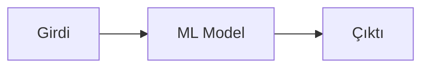
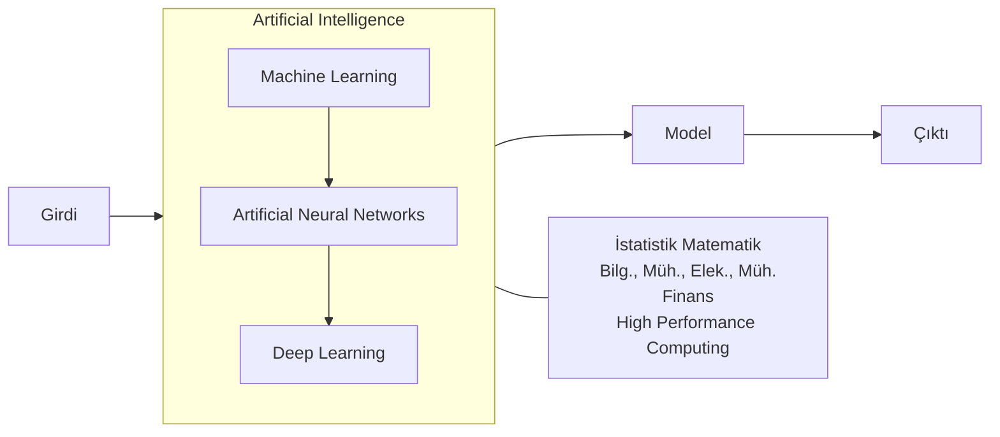
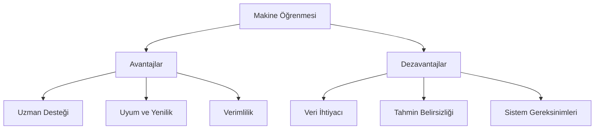
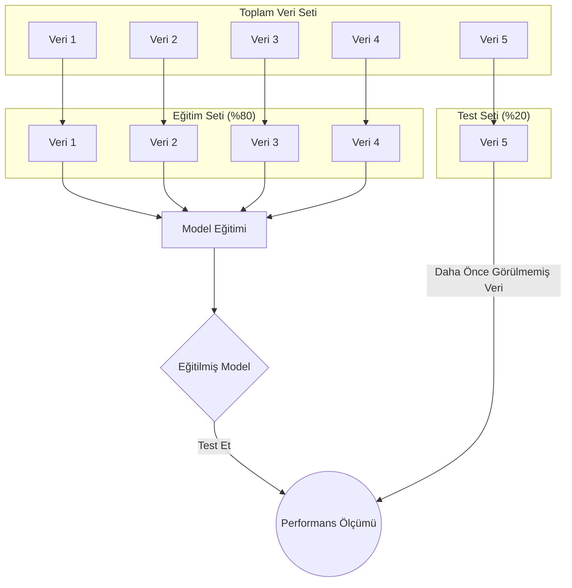
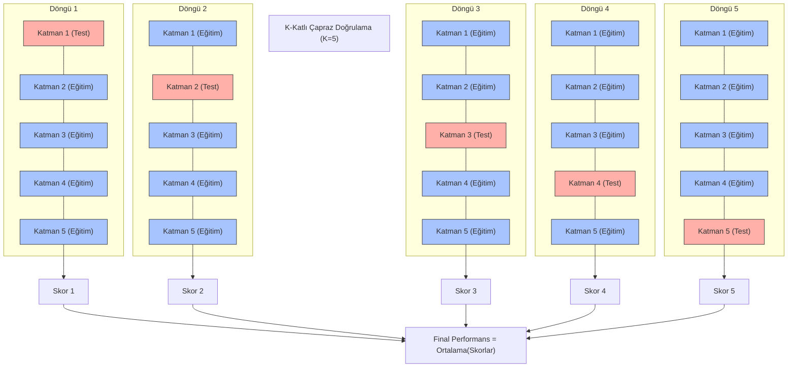
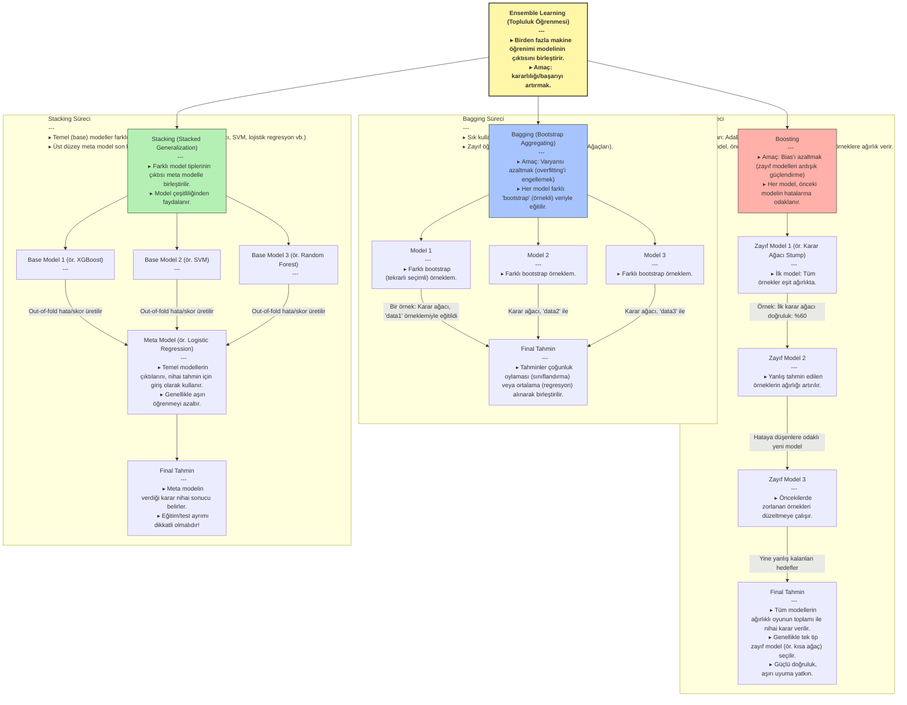

# Makine Öğrenmesi (Machine Learning) ve Yapay Zeka (AI)

---

### 1. Temel Kavramlar ve Avantaj

**Yapay Zeka (AI)**, İnsanın sahip olduğu **deneyim** ve **tecrübeyi** bilgisayarlara aktarılmasının yollarını inceleyen bilim dalının en genel adıdır. **Makine Öğrenmesi** ise bu amaç için kendine özgü teknikleri barındıran yapay zekanın bir **alt koludur**.

Bilgisayarlar **dijital** kullanan makinelerdir. İnsanların sahip olduğu tecrübe, deneyim, uzmanlık, yetenekler ve kabiliyetlerin bu dil yardımıyla onlara aktarılması, bu alanın en büyük **avantajıdır**.

### 2. Veri ve Bilgi Hiyerarşisi
**Datum**, Latince kökenli bir kelime olup, "verilen şey" veya "gerçek" anlamına gelir. İngilizcede "data" kelimesinin tekil hali olarak kullanılır. Genellikle tek bir gözlemi, ölçümü veya gerçeği ifade ederken, "data" ise bu tekil gerçeklerin çoğulunu, yani bir koleksiyonunu temsil eder. Bu ayrım, özellikle bilimsel ve teknik metinlerde verinin temel birimini vurgulamak için önemlidir.

**Veri**, bir nesne, varlık, durum, olay hakkında nitel ya da nicel bulguların (gerçeklerin) belirli bir sistematiğe göre kayıt altına alınmış haline denilir.

Veri, bilgiye dönüşürken bir hiyerarşiden geçer:

$$\text{Raw Data (İşlenmemiş Veri)} \rightarrow \text{Data (Veri)} \rightarrow \text{Knowledge (Bilgi)}$$

* **İşlenmemiş Veri Örn.:** Yeni doğan bir bebeğin ağırlığı (Henüz bilinmiyor ancak bir ağırlığı var).

* **Veri Örn.:** Bir metriğe (örn. m, kg, inç, galon vb.) göre bu bebeğin ağırlığının ölçülüp bir yere kayıt edilmesi.

* **Bilgi (information) Örn.:** Bebeğin kilosu vb. özelliklerini kullanarak elde edilen gerçeklerdir. Örn: Çorlu'da Mart ayında doğan bebeklerin kilo ortalaması 2.8 kg'dır.

* **Knowledge (Anlamlı-İşe yarar bilgi):** Büyük ve karmaşık verilerden, ilk bakışta fark edilmeyen, daha önce elde edilmemiş, işe yarar ve anlamlı gerçeklerdir.
    * **Yapay Zeka (AI) ile Elde Edilen Bilgi Örn.:** Bir yapay zeka sistemi, yeni doğan bebeklerin ağlama seslerini analiz ederek, ağlamanın açlık, uykusuzluk veya rahatsızlık gibi farklı nedenlerini ayırt edebilir. Bu sayede ebeveynlere, bebeğin neden ağladığına dair daha hızlı ve doğru bir tahmin sunarak, bebeğin ihtiyaçlarına daha etkili yanıt vermelerine yardımcı olabilir.

### 3. Süreç ve İlişkili Disiplinler

Makine öğrenmesi **İstatistik** ve **matematiksel teorileri** kullanır.

#### Süreç Akışı (Model)


#### İlişkili Alanların Bazıları

* **Veri Madenciliği (Mining)**
* **Temel Bilimler:** İstatistik, Matematik
* **Mühendislik Dalları:** Bilg. Müh., Elek. Müh.

#


### 5. Makine Öğrenmesinin Avantajları ve Dezavantajları

Makine öğrenmesi teknolojilerinin günlük hayatımıza getirdiği kolaylıklar kadar, dikkat edilmesi gereken sınırlamaları da vardır. Bu bölümde her iki yönünü de inceleyeceğiz.

#### Avantajları:

1. **Uzman Desteği**
    - Uzman sayısının yetersiz olduğu alanlarda karar desteği sağlar
    - Yeni verilerle sürekli kendini güncelleyerek uzman görüşlerini öğrenir

2. **Uyum ve Yenilik**
    - Daha önce karşılaşılmamış durumlar için yeni kurallar geliştirebilir
    - Veri setindeki gizli örüntüleri ve ilişkileri keşfedebilir

3. **Verimlilik**
    - 7/24 kesintisiz çalışabilir
    - Klasik programlama ile çözülemeyen problemlere veri-odaklı çözümler üretebilir

#### Dezavantajları:

1. **Veri Gereksinimleri**
    - Modelin doğru çalışması için sürekli güncel veri gerekir
    - Büyük veri setleri bile bazen doğru öğrenme için yeterli olmayabilir

2. **Tahmin Doğruluğu**
    - Sonuçlar kesin değil, olasılıksal tahminlerdir
    - Problem yapısı değiştiğinde modelin yeniden eğitilmesi gerekir

3. **Teknik Sınırlamalar**
    - Karmaşık algoritmalar yüksek işlemci gücü ve bellek gerektirir
    - Gerçek zamanlı veri akışlarında performans sorunları yaşanabilir
    - Yüksek başarımlı hesaplama sistemlerine ihtiyaç duyulabilir



### Makine Öğrenmesi Projelerinde Adım Adım İlerleme

Makine öğrenmesi, bilgisayarların veriden anlam çıkarmasını ve bu anlamı kullanarak kararlar almasını sağlayan güçlü bir alandır. Ancak bu süreci başarıyla yönetmek, belirli adımları titizlikle takip etmeyi gerektirir. Tıpkı bir bilimsel araştırma gibi, makine öğrenmesi projeleri de bir dizi aşamadan oluşur ve her aşama bir sonrakini etkiler. Unutulmamalıdır ki, bazı yöntemler eksik veya gürültülü veriyle başa çıkabilirken, çoğu algoritma için temiz ve düzenli veri hayati öneme sahiptir. En uygun modeli bulmak için genellikle birden fazla algoritma ve yaklaşım denemek gerekir.

#### 1. Problemi Anlamak ve Tanımlamak

Her şey, çözmek istediğimiz problemi net bir şekilde anlamakla başlar. Bu aşamada, karşılaştığımız sorunun makine öğrenmesi teknikleriyle çözülüp çözülemeyeceğini belirleriz. Örneğin, bir fırının sıcaklığını belirli bir seviyede tutmak daha çok kontrol sistemlerinin işiyken, bir marketteki müşterilerin yaş dağılımını bulmak istatistiksel bir analizdir. Makine öğrenmesi, özellikle şu tür durumlar için idealdir:

*   **Kuralların Belirsiz Olduğu Durumlar:** Çözüm için açık ve net bir algoritma yazmanın zor olduğu, karmaşık ilişkilerin bulunduğu problemler.
*   **Dinamik ve Büyük Veri Setleri:** Sürekli değişen ve çok sayıda girdiye sahip sistemlerde çıktıları tahmin etme ihtiyacı.
*   **Gizli Örüntüleri Keşfetme:** Büyük ve karmaşık veri yığınlarından ilk bakışta fark edilmeyen, işe yarar ve anlamlı bilgileri ortaya çıkarma.

Bu adımda, problemin kapsamını, hedeflerini ve başarı kriterlerini belirlemek, projenin geri kalanına yön verir.

#### 2. Veri Toplama ve Yönetimi

Problemi tanımladıktan sonra, modelimizi eğitmek için gerekli verileri toplamaya başlarız. Bu süreç, genellikle alanında uzman kişilerle iş birliği içinde yürütülür. Burada önemli olan, sadece veri toplamak değil, aynı zamanda bu verilerin nasıl yönetileceğini de planlamaktır:

*   **Hangi Veriler?** Problemi çözmek için hangi özelliklerin (değişkenlerin) önemli olduğunu belirlemek.
*   **Nereden ve Nasıl?** Veri kaynaklarını (veritabanları, sensörler, web vb.) ve toplama yöntemlerini seçmek.
*   **Depolama ve Teknoloji:** Toplanan verilerin nerede (bulut, yerel sunucu) ve hangi teknolojiyle (SQL, NoSQL veritabanları, veri gölleri) depolanacağını kararlaştırmak.
*   **Veri Türü ve Boyutu:** Verilerin nitel mi nicel mi olduğunu, ne kadar hacimli olacağını ve bu hacme uygun depolama stratejilerini belirlemek.

Veri toplama aşaması, modelin kalitesini doğrudan etkileyecek temel bir adımdır.

#### 3. Veri Temizleme ve Hazırlık

Gerçek dünya verileri nadiren mükemmeldir. Çoğu zaman eksik değerler, hatalı girişler, aykırı gözlemler veya tutarsız formatlar içerirler. Bu aşama, ham veriyi makine öğrenmesi algoritmalarının anlayabileceği ve doğru sonuçlar üretebileceği bir formata dönüştürmeyi amaçlar:

*   **Eksik Veriyle Başa Çıkma:** Boşlukları doldurma (imputation) veya ilgili kayıtları çıkarma gibi stratejiler.
*   **Gürültü ve Aykırılıkları Giderme:** Modelin yanlış öğrenmesine neden olabilecek hatalı veya sıra dışı değerleri tespit edip düzeltme.
*   **Veri Türü Dönüşümleri:** Algoritmaların gereksinimlerine göre veri tiplerini (örneğin, metin verisini sayısal temsile) dönüştürme.
*   **Özellik Mühendisliği:** Mevcut verilerden yeni ve daha anlamlı özellikler türeterek modelin öğrenme kapasitesini artırma.

Bu adımın ne kadar titizlikle yapıldığı, modelin nihai performansını büyük ölçüde belirler.

#### 4. Model Eğitimi ve Seçimi

Verilerimiz hazır olduğunda, makine öğrenmesi algoritmalarını kullanarak modellerimizi oluşturmaya başlarız. Bu aşamada, farklı algoritmalar (örneğin, karar ağaçları, destek vektör makineleri, sinir ağları) eğitim verisi üzerinde denenir ve her birinin performansı kaydedilir.

*   **Algoritma Çeşitliliği:** Makine öğrenmesi dünyası, her biri farklı problem türleri ve veri yapıları için optimize edilmiş zengin bir algoritma yelpazesi sunar. En iyi modeli bulmak için bu algoritmalar arasında denemeler yapmak önemlidir.
*   **Veri Tipi Uyumu:** Bazı algoritmalar yalnızca sayısal verilerle çalışırken, bazıları kategorik verileri de doğrudan işleyebilir. Bu nedenle, seçilen algoritmanın veri tipimizle uyumlu olduğundan emin olmak gerekir.
*   **Performans Metrikleri:** Bir algoritmanın ne kadar iyi çalıştığını değerlendirmek için tek bir ölçüt yoktur. Doğruluk (accuracy), kesinlik (precision), geri çağırma (recall), F1 skoru gibi birçok farklı metrik, modelin farklı yönlerini değerlendirmemizi sağlar. Buradaki temel hedef, kabul edilebilir bir hata oranıyla en yüksek doğruluğu sunan algoritmayı ve onun parametrelerini bulmaktır.

#### 5. Sonuçları Değerlendirme ve İyileştirme

Model eğitimi tamamlandıktan sonra, elde edilen sonuçları dikkatlice değerlendirmemiz gerekir. Bu aşamada, daha önce belirlenen performans metrikleri kullanılarak modelin ne kadar başarılı olduğu analiz edilir.

*   **Kapsamlı Değerlendirme:** Modelin sadece genel doğruluğuna değil, aynı zamanda belirli hata türlerine (örneğin, yanlış pozitifler veya yanlış negatifler) ne kadar yatkın olduğuna da bakılır.
*   **İteratif Süreç:** Eğer modelin performansı, tanımlanan problem için yeterli düzeyde değilse, bu bir başarısızlık değil, bir öğrenme fırsatıdır. Bu durumda, önceki adımlara geri dönülerek (veri toplama, temizleme, özellik mühendisliği veya farklı algoritmalar deneme) iyileştirmeler yapılır. Bu döngü, tatmin edici sonuçlar elde edilene kadar devam eder.
*   **İstatistiksel Doğrulama:** Elde edilen sonuçların istatistiksel olarak anlamlı olup olmadığını değerlendirmek, modelin genellenebilirliği hakkında önemli bilgiler sunar.

#### Model Nedir?

Makine öğrenmesinde bir "model", girdiye göre çıktıyı öngörebilen otomatik veya yarı otomatik bir sistemdir. Bu, gerçek dünyadaki bir sürecin matematiksel bir temsili olabileceği gibi, veriden öğrenilmiş karmaşık bir kural seti de olabilir. Önemli bir nokta, modellerin ürettiği sonuçların **kesin olmaması**, aksine **olasılıksal tahminler** olduğudur. Bir model, genellikle programlama dilleri aracılığıyla inşa edilen sistemlere entegre edilerek, ham girdiyi işleyip anlamlı çıktılara dönüştüren yapay zeka tekniklerini kullanan bir "beyin" görevi görür.

#### Öğrenme Kavramı

Bilgisayarlar için "öğrenme", bir konu, durum veya olay hakkında yeterli bilgiye sahip olma sürecidir. Bu, insanlardaki gibi tecrübe kazanma ve uygun davranışları geliştirme yoluyla gerçekleşir. Bilgisayarlar, kendilerine sunulan büyük miktardaki veriyi analiz ederek, bu verilerdeki örüntüleri ve ilişkileri keşfederler. Yeterli veri ve doğru algoritmalarla "eğitildiklerinde", tıpkı bir insanın yeni bir beceri kazanması gibi, belirli görevleri yerine getirme yeteneği kazanırlar. Bu sayede, daha önce görmedikleri verilere karşı bile anlamlı tahminler yapabilir veya kararlar alabilirler.


### Öğrenme Türleri

Makine öğrenmesinin temel taşlarından biri, bilgisayarların veriden nasıl öğrendiğini anlamaktır. Bu öğrenme süreçlerini genellikle iki ana kategoriye ayırırız: Denetimli ve Denetimsiz Öğrenme. Her birinin kendine özgü bir yaklaşımı ve kullanım alanı vardır.

#### Denetimli Öğrenme (Supervised Learning)

Şöyle düşünün gençler, küçük bir çocuğa hayvanları öğretirken, ona bir kedi resmi gösterip "bu bir kedi" deriz, bir köpek resmi gösterip "bu bir köpek" deriz. Yani, her resim için doğru cevabı, yani "etiketi" ona veririz. Çocuk yeterince örnek gördüğünde, daha önce hiç görmediği bir hayvan resmini bile doğru tahmin etmeye başlar.

İşte denetimli öğrenme de tam olarak bu prensiple çalışır. Elimizde, girdilerin (örneğin bir hayvanın özellikleri) ve bunlara karşılık gelen doğru çıktıların (örneğin "kedi" veya "köpek" etiketi) bulunduğu bir veri seti vardır. Bu verilere **etiketlenmiş veri** adını veririz. Amacımız, bu etiketlenmiş veriyi kullanarak, bilgisayarın yeni, daha önce görmediği girdiler için doğru çıktıyı tahmin edebilecek bir **model** oluşturmasını sağlamaktır. Bu model, geçmişteki deneyimlerden (veri) öğrenerek gelecekteki durumlar hakkında tahminler yapar.

Bu öğrenme türü, makine öğrenmesinde en sık karşılaştığımız yaklaşımdır. Temelinde, belirli bir hedef değişkeni (çıktı) tahmin etme veya sınıflandırma amacı yatar. Model, girdiler ile çıktılar arasındaki karmaşık ilişkileri öğrenir ve bu ilişkileri yeni verilere genellemeye çalışır.

**Uygulamalar:**
Denetimli öğrenme, özellikle şu tür problemlerin çözümünde kullanılır:
*   **Sınıflandırma Problemleri (Classification):** Bir verinin hangi kategoriye ait olduğunu tahmin etmek.
*   **Regresyon Problemleri (Regression):** Sürekli bir sayısal değeri tahmin etmek.

**Örnekler:**
*   Bir e-postanın "Spam" mı yoksa "Normal" mi olduğunu belirlemek.
*   Bir müşterinin kredi başvurusunun "Onaylandı" ya da "Reddedildi" olarak sonuçlanacağını tahmin etmek.
*   Bir hastada "Şeker hastalığı var" ya da "Yok" teşhisi koymak.
*   Bir evin özelliklerine (metrekare, oda sayısı, konum vb.) bakarak satış fiyatını öngörmek.
#### Denetimsiz Öğrenme (Unsupervised Learning)

Şimdi de şöyle bir senaryo düşünelim: Size bir kutu dolusu farklı renkte ve şekilde oyuncak veriliyor ve "Bunları benzerliklerine göre gruplandır" deniyor. Ama size hangi oyuncağın ne olduğunu veya kaç grup olması gerektiğini söyleyen kimse yok. Siz de oyuncakların renklerine, boyutlarına, şekillerine bakarak kendinizce gruplar oluşturuyorsunuz.

Denetimsiz öğrenme de bu mantıkla çalışır. Elimizde **etiketlenmemiş veriler** bulunur; yani, girdilere karşılık gelen doğru çıktıları önceden bilmeyiz ve sınıflar önceden belirli değildir. Buradaki temel amaç, verinin kendi içindeki gizli yapıları, örüntüleri veya ilişkileri keşfetmektir. Denetimsiz öğrenme algoritmaları (örneğin kümeleme ve birliktelik kuralları gibi yöntemler) bu etiketlenmemiş verilerde var olan örüntüyü ortaya çıkarır. Bu süreçte veri analisti, algoritmalar üzerinde beklentileri doğrultusunda ayarlamalar yaparak en anlamlı sonuçları elde etmeye çalışır. Özellikle kümeleme analizi, verinin anlaşılırlığını artırır ve kümeler arası uzaklıklar, farklılıklar veya benzerlikler gibi önemli bilgilerin tespit edilmesini sağlar. Model, herhangi bir dış rehberlik olmaksızın, verinin doğal düzenini anlamaya çalışır.

**Yöntemler ve Uygulamalar:**
*   **Kümeleme (Clustering):** Bu alandaki en yaygın yöntemlerden biri kümelemedir. Kümeleme, veri noktalarını birbirine benzer özelliklere sahip gruplara ayırır. Örneğin, bir e-ticaret sitesi, müşterilerinin satın alma alışkanlıklarına bakarak onları farklı segmentlere ayırabilir. Böylece her segmente özel pazarlama stratejileri geliştirebilir. Burada kaç müşteri grubu olduğunu veya hangi müşterinin hangi gruba ait olduğunu önceden bilmeyiz, model bunu veriden öğrenir.
*   **Birliktelik Kuralları (Association Rules):** Bir diğer önemli denetimsiz öğrenme yöntemi ise birliktelik kurallarıdır. Bu yöntem, veriler arasındaki eş zamanlı oluşumları veya ilişkileri ortaya çıkarır. En bilinen örneği **sepet analizi**dir: "Eğer bir müşteri ekmek alıyorsa, büyük ihtimalle tereyağı da alır" gibi kurallar keşfedilir. Bu sayede marketler ürün yerleşimlerini veya kampanyalarını optimize edebilir.
*   **Boyut Azaltma (Dimensionality Reduction):** Ayrıca, verinin daha anlaşılır hale getirilmesi veya görselleştirilmesi için boyut azaltma gibi teknikler de denetimsiz öğrenme kapsamına girer. Bu, çok sayıda özelliği olan veriyi, bilgi kaybını en aza indirerek daha az sayıda özellikle temsil etmeyi amaçlar.

**Örnekler:**
*   Bir şirketin müşteri tabanında kaç farklı "müşteri tipi" olduğunu bulmak ve bu tiplere göre pazarlama stratejileri geliştirmek.
*   Sosyal medya gönderilerindeki konuları otomatik olarak gruplandırmak.
*   Bir süpermarkette hangi ürünlerin sıklıkla birlikte satın alındığını keşfetmek (sepet analizi).
*   Büyük bir veri setindeki anormallikleri veya sıra dışı durumları tespit etmek.


### Lineer Regresyon (Doğrusal Regresyon)

Şimdi de makine öğrenmesinin en temel ve en sık kullanılan modellerinden biri olan Lineer Regresyon'a (Doğrusal Regresyon) bir göz atalım gençler. Adından da anlaşılacağı gibi, bu model, değişkenler arasında doğrusal bir ilişki olduğunu varsayar ve bu ilişkiyi matematiksel olarak ifade etmeye çalışır.

Hayatımızda birçok şeyin birbiriyle ilişkili olduğunu gözlemleriz. Örneğin, bir evin büyüklüğü arttıkça fiyatının da artması beklenir, ya da bir öğrencinin ders çalışma süresi uzadıkça sınav notunun yükselme ihtimali artar. Lineer regresyon, işte bu tür 'neden-sonuç' ilişkilerini, bir doğru denklemiyle ifade etmeyi hedefler.

En basit haliyle, bir girdi (bağımsız değişken) ve bir çıktı (bağımlı değişken) arasındaki ilişkiyi şöyle bir denklemle gösterebiliriz:

$$y = \theta_0 + \theta_1 x$$

Burada:
*   `y`, tahmin etmeye çalıştığımız sonuçtur (örneğin, evin fiyatı veya sınav notu).
*   `x`, sonucu etkilediğini düşündüğümüz girdidir (örneğin, evin metrekaresi veya ders çalışma süresi).
*   `θ₀` (teta sıfır), doğrunun y eksenini kestiği noktadır, yani `x` sıfır olduğunda `y`'nin alacağı değerdir. Buna 'sabit terim' veya 'kesişim' diyebiliriz.
*   `θ₁` (teta bir), `x`'teki bir birimlik değişimin `y`'de ne kadarlık bir değişime yol açtığını gösteren 'eğim' veya 'katsayı'dır. Bu katsayı, `x` ile `y` arasındaki ilişkinin gücünü ve yönünü belirler.

Makine öğrenmesinde bu `y = \theta_0 + \theta_1 x` denklemini bir 'hipotez' olarak adlandırırız. Yani, `x` ile `y` arasında böyle bir doğrusal ilişki olabileceğini varsayarız. Modelin 'öğrenme süreci' ise, elimizdeki mevcut verileri (geçmiş ev fiyatları ve metrekareleri gibi) kullanarak, bu hipoteze en uygun `θ₀` ve `θ₁` değerlerini bulmaktan ibarettir. Amacımız, bu parametreleri öyle bir şekilde belirlemektir ki, modelimiz mevcut verilere en iyi şekilde uysun ve gelecekteki yeni `x` değerleri için `y`'yi mümkün olan en doğru şekilde tahmin edebilsin.

Peki ya bir sonucu etkileyen tek bir faktör değil de birden fazla faktör varsa? Örneğin, evin fiyatını sadece metrekaresi değil, aynı zamanda oda sayısı, bulunduğu semt, yaşı gibi birçok özellik etkileyebilir. İşte bu durumda modelimizi genişleterek 'Çoklu Lineer Regresyon'a geçeriz:

$$y = \theta_0 + \theta_1 x_1 + \theta_2 x_2 + \dots + \theta_n x_n$$

Burada `x₁`, `x₂`, ..., `xₙ` farklı girdi özelliklerini (metrekaresi, oda sayısı vb.) temsil ederken, `θ₁`, `θ₂`, ..., `θₙ` de her bir özelliğin `y` üzerindeki etkisini gösteren katsayılardır. Bu denklem hala 'lineer'dir, çünkü `y`'nin tahmini, her bir özelliğin katsayılarla çarpılıp toplanmasıyla elde edilir. Yani, parametreler (`θ` değerleri) açısından ilişki doğrusaldır.

Lineer regresyonun en önemli özelliklerinden biri, makine öğrenmesi algoritmaları arasında en basit ve anlaşılır olanlardan biri olmasıdır. Bu basitliği sayesinde, sonuçları yorumlamak ve hangi faktörlerin çıktıyı ne kadar etkilediğini anlamak genellikle kolaydır. Ayrıca, hesaplama maliyeti düşüktür ve birçok gerçek dünya probleminde şaşırtıcı derecede iyi sonuçlar verebilir. Ancak unutmamak gerekir ki, bu modelin iyi çalışabilmesi için girdi ve çıktı arasında gerçekten doğrusal bir ilişki olması varsayılır. Eğer ilişki doğrusal değilse, daha karmaşık modellere ihtiyaç duyulabilir.

Bu doğrusal modeller, yani bir sonuç (y) ve neden (x) değişkenlerini tanımlayan denklemler gibi yapılar, neden-sonuç ilişkilerini anlamak için oldukça güçlü araçlardır. Aralarında doğrusal bir ilişki bulunan durumları analiz etmek ve yorumlamak genellikle daha kolaydır.

#### Lineer Modelin Avantajları:

*   **Gelişmiş Teori ve Anlaşılırlık:** Lineer modellerin matematiksel teorisi oldukça iyi geliştirilmiştir. Özellikleri ve kapsamları net bir şekilde bilindiği için, bu modeller güvenilir bir temel sunar.
*   **Kolay Tahmin ve Geliştirme:** Model parametrelerinin (yani `θ` değerlerinin) tahmini ve probleme göre modelin geliştirilmesi genellikle kolaydır.
*   **Geniş Uygulama Alanı:** Basit yapılarına rağmen, çok geniş ve çeşitli ilişkileri ifade edebilirler. Birçok farklı alandaki problemleri çözmek için kullanılabilirler.
*   **Karmaşık Veri Setleriyle Başarı:** Spesifik ve karmaşık veri setlerinin tahmin problemlerinde bile şaşırtıcı derecede iyi sonuçlar verebilirler.
*   **Hesaplama Verimliliği:** Yüz binlerce parametre ve faktör içeren lineer modellerin bilgisayarla kurulması ve eğitilmesi genellikle kolay ve hızlıdır.
*   **Esneklik:** Lineer modeller, doğrusal olmayan ilişkileri modelleme konusunda da şaşırtıcı bir esneklik sunar. Doğrudan doğrusal olmayan bir ilişkiyi ifade etmek yerine, mevcut değişkenler üzerinden yeni "geçici değişkenler" veya "dönüştürülmüş öznitelikler" tanımlayarak bu ilişkileri doğrusal bir forma dönüştürebiliriz. Örneğin, bir `x₁` değişkeninin karesi olan `x₁²`'yi yeni bir `X₂` özniteliği olarak düşünebiliriz. Ya da `log(x₁)` gibi bir dönüşüm uygulayarak bunu `X₃` olarak modele dahil edebiliriz. Bu durumda, orijinalde `y = θ₀ + θ₁x₁ + θ₂x₁²` gibi görünen bir denklemi, `X₂ = x₁²` tanımlamasıyla `y = θ₀ + θ₁x₁ + θ₂X₂` şeklinde parametreleri açısından doğrusal bir yapıya kavuşturmuş oluruz. Yani, `f(x₁) = X_{n+1}` veya `f(x₂) = X_{n+2}` gibi fonksiyonlarla orijinal öznitelikleri dönüştürerek, modelin parametreleri (`θ` değerleri) açısından doğrusal kalmasını sağlarız. Eğer veri kümesinde doğrusal olmayan ilişkiler barındıran parametreler varsa, bunlar temel değişkenlerden hesaplanıp veri kümesine yeni özellikler olarak eklenebilir ve bu genişletilmiş veri kümesinde doğrusal model kullanılabilir. Bu yaklaşım, lineer modellerin çok daha geniş bir problem yelpazesine uygulanabilmesine olanak tanır.


Lineer modellerin nasıl ifade edildiğine ve görselleştirildiğine de kısaca değinelim.

#### Lineer Modelin Gösterimi:

Önce matematiksel modelimizi daha anlaşılır kılalım. Temel lineer model denklemi:
$$y = \theta_0 + \theta_1 x_1 + \theta_2 x_2 + \dots + \theta_m x_m$$

Bu denklemin tek değişkenli en basit hali şöyle görünür:
$$y = \theta_0 + \theta_1 x$$

<svg width="400" height="300" xmlns="http://www.w3.org/2000/svg">
    <line x1="50" y1="250" x2="350" y2="250" stroke="black"/>
    <line x1="50" y1="250" x2="50" y2="50" stroke="black"/>
    <line x1="50" y1="150" x2="350" y2="100" stroke="blue" stroke-width="2"/>
    <text x="360" y="250">x</text>
    <text x="40" y="40">y</text>
    <text x="360" y="100">y = θ₀ + θ₁x</text>
    <text x="70" y="180">θ₀ (y-kesişimi)</text>
    <text x="200" y="140">θ₁ (eğim)</text>
</svg>

Burada:
- `θ₀` doğrunun y eksenini kestiği noktayı belirler
- `θ₁` doğrunun eğimini gösterir
- Her x değeri için tek bir y değeri vardır

İki değişkenli model için durum biraz farklıdır:
$$y = \theta_0 + \theta_1 x_1 + \theta_2 x_2$$

<svg width="400" height="300" xmlns="http://www.w3.org/2000/svg">
    <polygon points="50,250 350,250 350,50" fill="lightblue" opacity="0.3"/>
    <line x1="50" y1="250" x2="350" y2="250" stroke="black"/>
    <line x1="350" y1="250" x2="350" y2="50" stroke="black"/>
    <line x1="50" y1="250" x2="50" y2="50" stroke="black"/>
    <text x="360" y="250">x₁</text>
    <text x="360" y="40">x₂</text>
    <text x="40" y="40">y</text>
    <text x="200" y="150">y = θ₀ + θ₁x₁ + θ₂x₂</text>
</svg>

Sınıflandırma problemlerinde, lineer model bir ayırıcı çizgi oluşturur:

<svg width="400" height="300" xmlns="http://www.w3.org/2000/svg">
    <!-- X ve Y eksenleri -->
    <line x1="50" y1="250" x2="350" y2="250" stroke="black" stroke-width="2"/>
    <line x1="50" y1="250" x2="50" y2="50" stroke="black" stroke-width="2"/>
    <!-- Ayırıcı çizgi -->
    <line x1="50" y1="250" x2="350" y2="50" stroke="red" stroke-width="2"/>
    <!-- Sınıf A noktaları -->
    <circle cx="100" cy="100" r="5" fill="blue"/>
    <circle cx="120" cy="120" r="5" fill="blue"/>
    <circle cx="90" cy="80" r="5" fill="blue"/>
    <!-- Sınıf B noktaları -->
    <circle cx="250" cy="200" r="5" fill="green"/>
    <circle cx="270" cy="220" r="5" fill="green"/>
    <circle cx="290" cy="240" r="5" fill="green"/>
    <!-- Etiketler -->
    <text x="100" y="70" font-size="14">Sınıf A</text>
    <text x="250" y="250" font-size="14">Sınıf B</text>
    <text x="150" y="150" font-size="14" fill="red">Ayırıcı Çizgi</text>
    <!-- Eksen etiketleri -->
    <text x="360" y="255" font-size="14">x</text>
    <text x="35" y="60" font-size="14">y</text>
</svg>

Bu gösterimlerdeki öznitelikler (x'ler), sonucu (y) etkileyen ölçülebilir özellikleri temsil eder. Her özniteliğin etkisi, kendi θ katsayısı ile belirlenir.


#### Öznitelikler (Features)

Bir makine öğrenmesi modelinde, tahmin etmeye çalıştığımız `y` sonucunu etkilediğini düşündüğümüz her bir girdi değişkenine **öznitelik (feature)** denir. Bunlara bazen **nitelik (attribute)**, **değişken (variable)**, **boyut (dimension)** veya modelin içindeki **parametreler (parameters)** de diyebiliriz.

Yukarıdaki standart lineer model denklemimizde:
$$y = \theta_0 + \theta_1 x_1 + \theta_2 x_2 + \dots + \theta_m x_m$$
Burada `y` tahmin edilen sonuçken, `x₁`, `x₂`, ..., `xₘ` ifadeleri modelin kullandığı farklı özniteliklerdir.

Bu özniteliklerin bir araya gelerek oluşturduğu topluluğa **öznitelik serisi** veya **öznitelik vektörü** denir. Bir öznitelik vektörünün oluşturulmasında, öncelikle alanında uzman kişilerin görüşleri ve bilgileri kullanılır. Bu uzmanlar, tahmin edilmeye çalışılan durumu en iyi şekilde karakterize eden özellikleri belirlememize yardımcı olurlar.

**Örnek:** Yarınki hava durumunun tahmini probleminde:
*   `y` = Yarınki hava durumu tahmini (örneğin, sıcaklık, yağış durumu)
*   `x₁` = Bugünkü sıcaklık
*   `x₂` = Bugünkü nem
*   `x₃` = Bugünkü basınç
*   `x₄` = Bugünkü rüzgar hızı
*   `x₅` = Bugünkü rüzgarın yönü

Şimdi gençler, bir makine öğrenmesi modelinin beynine giden bilgiyi, yani öznitelikleri biraz daha derinlemesine konuşalım. Bir doktorun doğru teşhisi koymak için hastanın ateşine, tansiyonuna, tahlil sonuçlarına bakması gibi, makine öğrenmesi modeli de bir tahminde bulunurken bu 'özniteliklere' bakar.

Bir evin fiyatını tahmin etmeye çalıştığımızı düşünelim. Modelimize hangi bilgileri veririz? Evin metrekaresi, oda sayısı, bulunduğu semt, binanın yaşı... İşte bunların her biri birer **özniteliktir**.

Peki, bu özniteliklerin hepsi eşit derecede önemli mi? Evin fiyatını tahmin ederken, evin kapı rengi önemli bir bilgi midir? Muhtemelen hayır. Ama metrekaresi? Kesinlikle evet. İşte bu yüzden doğru öznitelikleri seçmek, bir dedektifin doğru ipuçlarını takip etmesi gibidir. Yanlış veya alakasız ipuçları (öznitelikler) modelimizi yanıltabilir ve performansını ciddi şekilde düşürebilir.

#### Öznitelik Türleri

Öznitelikler genellikle birkaç temel kategoriye ayrılır:

1.  **Sayısal (Numeric) Öznitelikler:** Bunlar bildiğimiz sayılardır. Bir evin metrekaresi (120 m²), bir arabanın motor gücü (150 beygir), hava sıcaklığı (25.5°C) gibi ölçülebilir değerlerdir.
2.  **Kategorik (Categorical) Öznitelikler:** Belirli ve sınırlı sayıda seçenekten birini alan değerlerdir. Örneğin, bir arabanın markası ('Ford', 'Fiat', 'Renault') veya bir öğrencinin bölümü ('Mühendislik', 'Tıp', 'İşletme') gibi.
3.  **İkili (Binary) Öznitelikler:** Kategorik özniteliklerin en basit halidir, sadece iki olası değeri vardır. 'Garajı var mı?' (Evet/Hayır), 'E-posta spam mi?' (Evet/Hayır) gibi. Genellikle modelin anlayabilmesi için 1 ve 0 olarak kodlanırlar.

#### Öznitelik Seçimi ve Öznitelik Mühendisliği

İşin en yaratıcı ve önemli kısımlarından birine geldik: **Öznitelik Mühendisliği**. Bazen elimizdeki ham veriler, yani **temel öznitelikler**, problemi çözmek için yeterli olmaz. Tıpkı bir aşçının elindeki temel malzemelerle yepyeni bir tarif yaratması gibi, biz de mevcut özniteliklerden daha anlamlı, yeni öznitelikler türetiriz.

*   **Temel Öznitelikler:** Bunlar, veri setimizde bize doğrudan verilen orijinal özelliklerdir. Bu temel özniteliklerin seçiminde alanında uzman kişilerin görüşü altın değerindedir. Bir bankacı, kredi riskini tahmin ederken hangi finansal oranların önemli olduğunu en iyi bilir.
*   **Türetilmiş Öznitelikler:** Mevcut özniteliklerden yeni ve daha güçlü bilgiler oluşturmaktır. Örneğin, bir müşterinin 'doğum tarihi' özniteliği tek başına çok anlamlı olmayabilir. Ama bu bilgiden 'yaş' özniteliğini türetirsek, modelimiz için çok daha değerli bir bilgi elde ederiz. Veya bir evin 'genişliği' ve 'uzunluğu' öznitelikleri yerine, bu ikisini çarparak 'alan' adında tek ve daha güçlü bir öznitelik oluşturabiliriz.
*   **Etkileşim Öznitelikleri (Interaction Features):** Bazen iki öznitelik tek başlarına zayıfken, bir araya geldiklerinde özel bir etki yaratırlar. Buna **birleşik etki** de diyebiliriz. Örneğin, bir reklamın tıklanma oranını tahmin ederken, 'günün saati' ve 'kullanıcının cihazı' (mobil/masaüstü) özniteliklerini düşünelim. Belki de 'akşam saatlerinde mobil cihazdan' gösterilen reklamlar çok daha başarılıdır. İşte bu iki özniteliğin birleşiminden doğan etkiyi yakalayan yeni bir öznitelik oluşturmak, modelin başarısını katlayabilir.
*   **Gereksiz Öznitelikler:** Bazen de bazı öznitelikler aynı bilgiyi tekrar eder. Örneğin, veri setinde hem 'doğum tarihi' hem de 'yaş' varsa, bu iki öznitelik büyük ölçüde aynı bilgiyi taşır. Bu gibi durumlarda birini modelden çıkarmak, modelin daha basit ve hızlı çalışmasını sağlayabilir.

Kısacası, bir makine öğrenmesi modelinin ne kadar 'akıllı' olacağı, ona ne kadar kaliteli ve anlamlı 'bilgi' (öznitelik) verdiğimizle doğrudan ilişkilidir. Ham veriyi almakla yetinmeyip onu işlemek, zenginleştirmek ve en doğru temsilini bulmak, bu alanın hem bilimi hem de sanatıdır.

#### Özniteliklerin Ölçeklendirilmesi (Feature Scaling)

Şimdi gençler, makine öğrenmesi modellerimizin adil ve doğru kararlar verebilmesi için çok kritik bir konuya geldik: **Öznitelik Ölçeklendirme (Feature Scaling)**. Bu, farklı birimlerde veya çok farklı aralıklarda olan sayısal verilerimizi ortak bir dile, yani ortak bir ölçeğe getirme işlemidir.

Neden bu kadar önemli olduğunu basit bir örnekle anlatalım. Bir ev fiyatı tahmin modeli kurduğumuzu düşünün. Elimizde iki temel öznitelik olsun: evin metrekaresi ve oda sayısı. Bu iki özelliğin değer aralıklarına bir bakalım:

| Özellik | Örnek Değer | Değer Aralığı |
| :--- | :---: | :---: |
| Metrekare (m²) | 150 | ~50 - 250 |
| Oda Sayısı | 3 | ~1 - 6 |

Tabloda da gördüğünüz gibi, metrekare değerleri sayısal olarak oda sayısı değerlerinden çok daha büyüktür. Eğer bu verileri olduğu gibi, örneğin mesafe tabanlı bir algoritmaya (K-En Yakın Komşu gibi) veya gradyan inişi kullanan bir modele (Lineer Regresyon gibi) verirsek, algoritma iki ev arasındaki 'farkı' hesaplarken metrekaredeki 10 birimlik bir değişimi, oda sayısındaki 1 birimlik bir değişimden çok daha önemli sayacaktır. Model, büyük sayısal değerlerin daha fazla etkiye sahip olduğu yanılgısına kapılabilir. Bu, modelimizin oda sayısı gibi potansiyel olarak çok önemli bir özniteliğin etkisini göz ardı etmesine neden olur.

İşte bu adaletsizliği ortadan kaldırmak ve her özniteliğe kendini ifade etme şansı tanımak için ölçeklendirme yaparız. Amacımız, tüm öznitelikleri benzer bir sayısal aralığa getirerek modelin her birinden adil bir şekilde öğrenmesini sağlamaktır. Bu işlemi gerçekleştirmek için kullanılan birkaç popüler yöntem vardır:

##### 1. Min-Max Normalizasyonu (Normalization)

Bu yöntem, adından da anlaşılacağı gibi, verileri belirli bir aralığa, genellikle 0 ile 1 arasına sıkıştırmayı hedefler. Bunu yaparken veri setindeki en küçük değeri 0'a, en büyük değeri ise 1'e karşılık gelecek şekilde dönüştürür. Aradaki diğer tüm değerler de bu yeni aralıkta orantılı olarak yerlerini alırlar.

Formülü şöyledir:
$$
\text{Val}_{\text{yeni}} = \frac{\text{Val}_{\text{eski}} - \text{min}(\text{Val})}{\text{max}(\text{Val}) - \text{min}(\text{Val})}
$$

*   **Örnek:** Bir grup öğrencinin bir sınavdan aldığı notlar [60, 70, 80, 100] olsun.
    *   En düşük not (min): 60
    *   En yüksek not (max): 100
    *   Şimdi 70 alan öğrencinin yeni notunu hesaplayalım:
        $$
        \frac{70 - 60}{100 - 60} = \frac{10}{40} = 0.25
        $$
    *   Tüm notları dönüştürdüğümüzde yeni setimiz şöyle olur: [0, 0.25, 0.5, 1]. Gördüğünüz gibi, tüm değerler artık 0 ile 1 arasında.

Bu yöntem, verinin dağılım yapısını bozmaz ancak veri setindeki aykırı değerlere (outliers) karşı oldukça hassastır. Örneğin, notlar arasında bir de 300 gibi hatalı bir giriş olsaydı, diğer tüm notlar 0'a çok yakın bir aralığa sıkışırdı.

##### 2. Z-Skoru Standardizasyonu (Standardization)

Bu yöntem ise verileri belirli bir aralığa sıkıştırmak yerine, onları ortalaması 0 ve standart sapması 1 olan bir dağılıma dönüştürür. Yani her bir veri noktasının, veri setinin ortalamasından kaç standart sapma uzakta olduğunu ifade eder. Bu nedenle bu işleme **standartlaştırma** da denir.

Formülü şöyledir:
$$
\text{Val}_{\text{yeni}} = \frac{\text{Val}_{\text{eski}} - \text{ortalama}(\text{Val})}{\text{standart\_sapma}(\text{Val})}
$$

*   **Örnek:** Yine aynı notları ele alalım: [60, 70, 80, 100].
    *   Bu notların ortalaması: (60 + 70 + 80 + 100) / 4 = 77.5
    *   Standart sapması: Yaklaşık 17.07
    *   Şimdi 70 alan öğrencinin Z-skorunu hesaplayalım:
        $$
        \frac{70 - 77.5}{17.07} = \frac{-7.5}{17.07} \approx -0.44
        $$
    *   Bu sonuç bize, 70 notunun ortalamanın yaklaşık 0.44 standart sapma altında olduğunu söyler.

Standardizasyon, Min-Max normalizasyonunun aksine aykırı değerlerden daha az etkilenir. Bu nedenle, verinizde aykırı değerler olduğundan şüpheleniyorsanız veya kullanacağınız algoritma verinin normal dağılıma yakın olmasını varsayıyorsa (örneğin, bazı lineer modeller), standardizasyon genellikle daha güvenli bir tercihtir.

##### 3. Onluk Ölçekleme (Decimal Scaling)

Bu, diğerlerine göre daha az kullanılan, daha basit bir yöntemdir. Temel amacı, değerleri sadece ondalık virgülünü kaydırarak -1 ile 1 arasına getirmektir. Bunu yapmak için, veri setindeki en büyük mutlak değere sahip elemanı 1'den küçük yapacak en küçük 10'un kuvvetini bulur ve tüm değerleri bu sayıya böleriz.

Formülü şöyledir:
$$
\text{Val}_{\text{yeni}} = \frac{\text{Val}_{\text{eski}}}{10^n}
$$
Buradaki `n`, `max(|Val|) / 10^n < 1` koşulunu sağlayan en küçük tam sayıdır.

*   **Örnek:** Elimizdeki değerler [-986, 450, 120, -50] olsun.
    *   Bu setteki en büyük mutlak değer `|-986| = 986`'dır.
    *   986'yı 1'den küçük yapmak için onu 1000'e (yani 10³) bölmemiz gerekir. Demek ki `n=3`.
    *   Şimdi tüm değerleri 1000'e böleriz: [-0.986, 0.450, 0.120, -0.050].

Bu yöntem oldukça basittir ancak verinin dağılımı hakkında herhangi bir bilgi kullanmadığı için genellikle diğer iki yöntem kadar etkili değildir.

### Uygulama: Weka ve Python ile Öznitelik Ölçeklendirme

Şimdi bu ölçeklendirme yöntemlerinin Weka ve Python gibi araçlarda nasıl uygulandığına bakalım.

#### Weka'da Ölçeklendirme Örneği

Weka, veri ön işleme adımlarını görsel bir arayüzle kolayca yapmanıza olanak tanır. Ölçeklendirme işlemleri için "Filter" (Filtre) adı verilen araçları kullanırız. Adım adım bir örnek yapalım.

**1. Veri Setini Hazırlama ve Yükleme**

Öncelikle, `notlar.arff` adında basit bir metin dosyası oluşturalım ve içine aşağıdaki veriyi yapıştıralım. Bu dosya, öğrencilerin vize ve final notlarını içeriyor.

```arff
@relation ogrenci_notlari

@attribute vize numeric
@attribute final numeric
@attribute durum {gecti, kaldi}

@data
60,75,gecti
45,50,kaldi
80,90,gecti
95,92,gecti
30,40,kaldi
```

Şimdi Weka'yı açıp "Explorer" arayüzüne girelim. "Preprocess" sekmesindeyken "Open file..." butonuna tıklayarak bu `notlar.arff` dosyasını yükleyelim. Veri yüklendiğinde, `vize` ve `final` özniteliklerinin istatistiklerini (min, max, mean, stddev) sağ taraftaki panelde görebilirsiniz.

**2. Min-Max Normalizasyonu (Normalize Filtresi)**

Amacımız, `vize` ve `final` notlarını 0 ile 1 arasına sıkıştırmak.

*   **Filtre Seçimi:** "Filter" bölümündeki "Choose" butonuna tıklayın.
*   Açılan menüden `weka` -> `filters` -> `unsupervised` -> `attribute` yolunu izleyin ve `Normalize` filtresini seçin.
*   **Uygulama:** "Apply" butonuna basın.

**Sonuç:** Filtreyi uyguladıktan sonra, arayüzün sağındaki öznitelik listesinden `vize` veya `final` özniteliğini seçin. "Selected attribute" panelinde artık **Min: 0** ve **Max: 1** yazdığını göreceksiniz. Veri tablosundaki değerler de bu yeni aralığa göre güncellenmiştir.

**3. Z-Skoru Standardizasyonu (Standardize Filtresi)**

Şimdi aynı veriye standardizasyon uygulayalım. Önceki işlemi geri almak için "Undo" butonuna basın.

*   **Filtre Seçimi:** Tekrar "Choose" butonuna tıklayın ve bu kez aynı yoldan `Standardize` filtresini seçin.
*   **Uygulama:** "Apply" butonuna basın.

**Sonuç:** Bu işlemden sonra `vize` özniteliğini tekrar seçtiğinizde, "Selected attribute" panelinde **Mean (Ortalama)** değerinin 0'a çok yakın (veya tam 0) ve **StdDev (Standart Sapma)** değerinin 1 olduğunu göreceksiniz. Veri tablosundaki değerler artık pozitif ve negatif ondalıklı sayılara dönüşmüştür; bu sayılar her bir notun ortalamadan kaç standart sapma uzakta olduğunu gösterir.

Bu basit adımlarla, Weka'nın görsel arayüzünü kullanarak verilerinizi modelinize sunmadan önce kolayca ölçeklendirebilirsiniz.

#### Python'da Ölçeklendirme Örneği

Python'da makine öğrenmesi denildiğinde akla ilk gelen kütüphane olan `scikit-learn`, bu ölçeklendirme işlemleri için oldukça pratik ve güçlü araçlar sunar. En sık kullanılan iki yöntem için bir örnek yapalım.

```python
import numpy as np
from sklearn.preprocessing import MinMaxScaler, StandardScaler

# Örnek olarak öğrencilerin notlarını içeren bir veri seti oluşturalım
# Bu, tek bir öznitelik (notlar) içeren bir veri setidir.
notlar = np.array([[60], [70], [80], [100]])

print("Orijinal Veri:")
print(notlar)
print("-" * 30)

# 1. Min-Max Normalizasyonu (0-1 arasına ölçekleme)
# MinMaxScaler nesnesini oluşturuyoruz
min_max_scaler = MinMaxScaler()

# Scaler'ı veriye 'eğitiyor' (min ve max değerlerini öğreniyor) ve veriyi dönüştürüyoruz
min_max_notlar = min_max_scaler.fit_transform(notlar)

print("Min-Max Normalizasyonu Sonucu (0-1 Arası):")
print(min_max_notlar)
print("-" * 30)

# 2. Z-Skoru Standardizasyonu (Ortalama=0, Standart Sapma=1)
# StandardScaler nesnesini oluşturuyoruz
standard_scaler = StandardScaler()

# Scaler'ı veriye 'eğitiyor' (ortalama ve standart sapmayı öğreniyor) ve veriyi dönüştürüyoruz
standard_notlar = standard_scaler.fit_transform(notlar)

print("Z-Skoru Standardizasyonu Sonucu:")
print(standard_notlar)
print("-" * 30)
```

Bu kod bloğunda, aynı veri setine iki farklı ölçeklendirme tekniğini uyguladığımızda sonuçların nasıl değiştiğini net bir şekilde görebiliriz. `scikit-learn` kütüphanesi, bu dönüşümleri sadece birkaç satır kod ile gerçekleştirmemizi sağlar. Bu, modellerimizi eğitime hazırlarken bize büyük bir esneklik ve hız kazandırır.


### Örnek: Kredi Riski Tahmin Modeli Oluşturma

Şimdi gençler, öğrendiğimiz bu teorik bilgileri somut bir probleme uygulayalım. Bir banka olduğumuzu ve bize kredi başvurusunda bulunan bir müşterinin borcunu zamanında ödeyip ödemeyeceğini, yani "kredi riskini" tahmin etmek istediğimizi düşünelim. Bu, makine öğrenmesinin finansta en sık kullanıldığı alanlardan biridir.

#### 1. Adım: Problemi Anlamak ve Gerekli Bilgileri (Öznitelikleri) Belirlemek

Her şeyden önce, doğru soruları sormamız gerekir: Bir kişinin kredisini geri ödeme olasılığını ne gibi faktörler etkiler? Bu noktada tek başımıza hareket etmeyiz, alanında uzman kişilerden, yani bankacılardan ve kredi analistlerinden destek alırız. Onların tecrübeleri bize hangi bilgilerin değerli olduğunu söyler.

Kredi analistlerinden, geçmişte kredi kullanmış yüzlerce veya binlerce müşterinin bilgilerini alırız. Bu bilgiler, müşterinin krediyi zamanında ödeyip ödemediği bilgisiyle birlikte gelir. İşte bu 'sonucu belli olan' geçmiş veriler, bizim **etiketlenmiş eğitim verimizi** oluşturur. Modelimiz, bu verilerden öğrenerek gelecekteki müşteriler için tahmin yapmayı öğrenecektir.

Bu iş birliği sonucunda, modelimize girdi olarak sunacağımız bazı temel öznitelikleri belirlediğimizi varsayalım:
*   **Müşterinin Aylık Geliri:** Kişinin borcunu ödeme kapasitesini gösteren en temel bilgilerden biri.
*   **Yaşadığı Şehir:** Büyük şehirlerdeki yaşam maliyeti veya bölgesel ekonomik koşullar riski etkileyebilir.
*   **Geçmiş Ödeme Performansı:** Müşterinin daha önceki borçlarını zamanında ödeyip ödemediği. Bu, gelecekteki davranışları için en güçlü ipuçlarından biridir.

#### 2. Adım: Veri Tiplerini Anlamak ve Tanımlamak

Modelimizi kurmadan önce elimizdeki bilgilerin ne türde olduğunu anlamamız şart. Çünkü bir bilgisayar, "İstanbul" kelimesiyle "5000 TL" sayısını aynı şekilde işleyemez.

*   **Müşterinin Aylık Geliri:** Bu, sayısal bir değerdir. 5000, 15000, 25000 gibi üzerinde matematiksel işlemler yapabileceğimiz bir sayıdır. Bu tür verilere **Sayısal (Numeric)** öznitelik diyoruz.
*   **Yaşadığı Şehir:** Bu, 'İstanbul', 'Ankara', 'İzmir' gibi belirli kategorilerden birini alan bir bilgidir. Bu kategoriler arasında doğal bir sıralama yoktur (İstanbul, Ankara'dan daha "büyük" bir sayı değildir). Bu tür verilere **Kategorik (Categorical)** öznitelik diyoruz.
*   **Geçmiş Ödeme Performansı:** Bu sorunun cevabı genellikle basittir: "Evet, geçmişte gecikme yaşadı" veya "Hayır, yaşamadı". Sadece iki olası durumu olan bu tür verilere **İkili (Binary)** öznitelik diyoruz.

#### 3. Adım: Modelin Çıktısını, Yani Hedefimizi Belirlemek

Peki, modelimiz bize ne söyleyecek? Amacımız, tüm bu girdileri analiz edip sonunda tek bir karar vermektir: Bu müşteri "Yüksek Riskli" mi, yoksa "Düşük Riskli" mi? Bu, bizim modelimizin tahmin etmeye çalışacağı **hedef değişkendir**. Çıktımız, bu iki kategoriden biri olacak.

#### 4. Adım: Veriyi Modelin Anlayacağı Dile Çevirmek (Dönüşüm)

İşte en kritik adımlardan birine geldik. Özellikle lineer regresyon gibi matematiksel temelli modeller, kelimelerle veya kategorilerle doğrudan çalışamazlar. Onların dili sayılardır. Bu yüzden, sayısal olmayan özniteliklerimizi onlara uygun bir formata dönüştürmemiz gerekir.

*   **İkili Öznitelikler:** Bu en kolayıdır. "Evet" için `1`, "Hayır" için `0` değerini kullanabiliriz. Böylece "Geçmişte gecikme yaşadı" özniteliği, model için `1` veya `0` olan sayısal bir girdiye dönüşür.

*   **Kategorik Öznitelikler:** "Yaşadığı Şehir" gibi kategorik veriler biraz daha karmaşıktır. Eğer İstanbul=1, Ankara=2, İzmir=3 gibi rastgele sayılar verirsek, modelimiz bu şehirler arasında aslında var olmayan bir matematiksel ilişki (İzmir > Ankara gibi) kurmaya çalışabilir. Bu hatadan kaçınmak için **One-Hot Encoding (Tekil Etkin Kodlama)** adı verilen bir yöntem kullanırız.
    *   Bu yöntemde, "Yaşadığı Şehir" adlı tek bir sütun yerine, her bir şehir için yeni bir ikili (binary) sütun oluştururuz: `Şehir_İstanbul_mu`, `Şehir_Ankara_mı`, `Şehir_İzmir_mi`...
    *   Eğer müşteri İstanbul'da yaşıyorsa, bu sütunlardaki değerler şöyle olur: `[1, 0, 0]`.
    *   Eğer Ankara'da yaşıyorsa: `[0, 1, 0]`.
    *   Bu sayede, kategorik bilgiyi, modelin yanlış yorumlamayacağı, sadece varlık-yokluk (`1` veya `0`) belirten sayısal bir formata dönüştürmüş oluruz.

*   **Sayısal Öznitelikler:** Bazen sayısal verileri de olduğu gibi kullanmak yerine dönüştürmek daha iyi sonuç verir. Örneğin, "Aylık Gelir" özniteliğini doğrudan kullanmak yerine, onu gelir gruplarına ayırabiliriz: "0-10000 TL" (Düşük), "10001-20000 TL" (Orta), "20001+ TL" (Yüksek). Bu işleme **gruplama (binning)** denir. Bu yeni kategorik özniteliği de yine One-Hot Encoding ile modelin anlayacağı `[1, 0, 0]` gibi sayısal bir formata çevirebiliriz. Bu, modelin belirli gelir aralıklarındaki risk değişimlerini daha kolay yakalamasını sağlayabilir.

Tüm bu dönüşümler tamamlandığında, artık veri setimiz tamamen sayılardan oluşur ve makine öğrenmesi algoritmasını eğitmek için hazırdır. Model, bu sayısallaştırılmış verilerdeki desenleri öğrenerek, gelecekteki yeni müşteriler için isabetli risk tahminleri yapmaya çalışacaktır.


### Model Değerlendirme: Modelimiz Gerçekten Öğrendi mi?

Şimdi gençler, bir makine öğrenmesi modeli eğittiğimizi düşünelim. Modelimiz, ona verdiğimiz verileri kullanarak bir şeyler öğrendi. Peki, bu öğrenmenin kalitesini nasıl ölçeriz? Modelimizin sadece elindeki verileri ezberlemediğinden, yani yeni ve daha önce hiç görmediği durumlarda da doğru kararlar verebileceğinden nasıl emin olabiliriz?

Bu durumu, bir sınava hazırlanan öğrenciye benzetebiliriz. Eğer bir öğrenci, çalışma kitabındaki soruları cevaplarıyla birlikte ezberlerse, aynı sorular sorulduğunda %100 başarılı olur. Ancak bu, konuyu gerçekten öğrendiği anlamına gelmez. Sınavda, kitaptakilerden biraz farklı ama aynı konuyu ölçen yeni sorular geldiğinde muhtemelen başarısız olacaktır. İşte bizim modelimiz de bu öğrenci gibidir. Eğer onu eğittiğimiz verilerle test edersek, bize harika sonuçlar verebilir ama bu bir yanılsamadır. Buna **ezberleme (overfitting)** diyoruz.

Modelin gerçek performansını, yani genelleme yeteneğini ölçmek için elimizdeki veri setini akıllıca bölmemiz gerekir. Bir kısmını modele dersini anlatmak için (eğitim verisi), daha önce hiç görmediği bir kısmını da onu imtihan etmek için (test verisi) kullanırız. Bu bölme işlemini yapmak için kullanılan çeşitli stratejiler vardır.

#### 1. Holdout (Dışarıda Tutma Yöntemi)

Bu, en temel ve en basit yaklaşımdır. Elimizdeki veri setini bir defaya mahsus olmak üzere iki parçaya ayırırız: genellikle daha büyük olan parça **eğitim seti**, daha küçük olan parça ise **test seti** olarak kullanılır. Yaygın olarak kullanılan oranlar 80/20, 70/30 veya 66/34 şeklindedir. Model, eğitim seti üzerinde öğrenme işlemini gerçekleştirir. Öğrenme bittikten sonra, modelin daha önce hiç görmediği test seti üzerindeki performansı ölçülür. Bu performans, modelin gerçek dünya verileri karşısındaki başarısı hakkında bize bir fikir verir.



Bu yöntemin en büyük dezavantajı, bölme işleminin tamamen şansa bağlı olmasıdır. Eğer şans eseri, veri setindeki tüm "kolay" örnekler test setine, "zor" örnekler ise eğitim setine denk gelirse, modelimizin performansı olduğundan daha kötü görünebilir. Tersi durumda ise modelimiz haksız bir şekilde başarılı sayılabilir. Özellikle küçük veri setlerinde bu risk daha da artar, çünkü her bir veri noktası daha değerlidir ve modelin öğrenme sürecinden dışlanması performansı olumsuz etkileyebilir.

#### 2. Üçlü Ayırma (Three-way Split)

Holdout yöntemini bir adım ileri taşıyalım. Bazen modelimizi eğitirken en iyi ayarları bulmak için denemeler yapmamız gerekir. Örneğin bir karar ağacının ne kadar derine inmesi gerektiğini veya bir sinir ağında kaç katman kullanacağımızı belirlemek gibi. Bu ayarlara **hiperparametre** diyoruz.

Eğer bu ayarları yaparken test setini kullanırsak, aslında test setindeki bilgi modele sızmış olur ve test setimiz artık modelin performansını tarafsız bir şekilde ölçemez. Bu durumu engellemek için veriyi üçe ayırırız:

1.  **Eğitim Seti (Training Set):** Modelin temel öğrenme işlemini yaptığı, en büyük veri parçasıdır.
2.  **Doğrulama Seti (Validation Set):** Modelin hiperparametrelerini ayarlamak (tuning) ve farklı model adayları arasından en iyisini seçmek için kullanılır. Model bu veri üzerinde eğitilmez, sadece performansı bu setle kontrol edilir.
3.  **Test Seti (Test Set):** Bu set, tüm süreç boyunca bir kasada kilitli tutulur. En iyi model ve en iyi hiperparametreler belirlendikten sonra, son ve nihai performans ölçümü için sadece bir kez kullanılır. Bu, modelin gerçek dünya performansına dair en tarafsız tahmini verir.

#### 3. Çapraz Doğrulama (Cross-Validation / K-Fold)

Holdout yöntemindeki "şanssız bölünme" riskini ortadan kaldırmak için geliştirilmiş çok daha güvenilir bir yöntemdir. Fikir oldukça basittir: Veri setini tek bir defa bölmek yerine, birden çok defa farklı şekillerde bölüp test edelim ve sonuçların ortalamasını alalım.

En yaygın kullanılan çapraz doğrulama tekniği **K-Katlı (K-Fold)**'dır. Süreç şöyle işler:

1.  Veri seti, `K` adet eşit büyüklükte parçaya (katmana) ayrılır. Genellikle `K` için 5 veya 10 değeri tercih edilir.
2.  Bir döngü başlatılır ve bu döngü `K` defa tekrar eder.
3.  Her bir döngüde, katmanlardan bir tanesi **test seti** olarak seçilir, geri kalan `K-1` katman ise birleştirilerek **eğitim seti** olarak kullanılır.
4.  Model, bu eğitim seti üzerinde eğitilir ve ayrılan test katmanı üzerinde performansı ölçülür.
5.  Döngü tamamlandığında, elimizde `K` adet farklı performans skoru olur. Bu skorların ortalaması alınarak modelin genel performansı hakkında çok daha istikrarlı ve güvenilir bir tahmin elde edilir.



Bu yöntemin getirdiği en önemli avantajlardan biri, elimizdeki verinin tamamını hem eğitim hem de test amacıyla kullanabilmemizdir. Bu, özellikle veri miktarının kısıtlı olduğu durumlarda hayati önem taşır.

#### K Değerinin Seçimi: Bias ve Varyans Dengesi

Çapraz doğrulama yaparken seçeceğimiz `K` değeri, modelimizin performansını ne kadar isabetli ölçtüğümüzü belirleyen kritik bir ayardır. Bu durumu, bir projenin kalitesini değerlendirmek için kurulan bir uzmanlar komitesine benzetebiliriz. `K` değeri, bu komitede kaç uzman olacağını ve her uzmanın projeyi nasıl inceleyeceğini belirler. Burada iki temel kavram devreye girer: **yanlılık (bias)** ve **varyans (variance)**.

*   **Yanlılık (Bias):** Değerlendirmemiz, modelin gerçek potansiyelinden ne kadar sapıyor? Eğer komitemiz sürekli olarak projenin kalitesini olduğundan düşük tahmin ediyorsa, bu yanlı bir değerlendirmedir.
*   **Varyans (Variance):** Değerlendirmemiz ne kadar tutarlı? Eğer komiteyi farklı uzmanlarla tekrar kursaydık, sonuç ne kadar değişirdi? Eğer sonuçlar çok fazla değişiyorsa, değerlendirmemizin varyansı yüksektir.

Şimdi `K` değerinin bu dengeyi nasıl etkilediğine bakalım:

##### Durum 1: `K` Değerinin Büyük Olması (Örn: K=10 veya daha fazla)

Büyük bir `K` değeri seçmek, kalabalık bir uzmanlar komitesi kurmaya benzer. Örneğin, 1000 verimiz varsa ve K=10 seçersek, model her seferinde 900 veriyle eğitilir.

*   **Avantajı: Düşük Yanlılık (Low Bias)**
    *  Model, her döngüde eldeki verinin çok büyük bir kısmıyla (%90'ıyla) eğitilir. Bu, neredeyse tüm veriyi kullanarak eğiteceğimiz nihai modele çok yakın bir modeldir. Dolayısıyla, bu modelden aldığımız performans skoru, modelin gerçek potansiyeline çok yakın, yani **iyimser ve yanlılığı düşük** bir tahmindir. Komitedeki her uzman, projenin neredeyse tamamını gördüğü için projenin kalitesi hakkında çok isabetli bir fikir verir.

*   **Dezavantajı: Yüksek Varyans (High Variance)**
    *  Her döngüde kullanılan eğitim setleri birbirine çok benzerdir (sadece %10'luk bir kısmı farklıdır). Bu yüzden eğitilen modeller de birbirinin neredeyse aynısı olur. Eğer veri setimizde tesadüfen yanıltıcı bir desen varsa, tüm modeller bu deseni öğrenir ve aynı hataya düşer. Bu durum, elde ettiğimiz ortalama performans skorunun **hassas ve değişken** olmasına neden olur. Yani, veri setimiz birazcık farklı olsaydı, elde edeceğimiz sonuç bambaşka olabilirdi. Değerlendirmemiz, elimizdeki o spesifik veri setine aşırı bağımlı hale gelir. Ayrıca, çok sayıda döngü gerektiği için hesaplama maliyeti de artar.

##### Durum 2: `K` Değerinin Küçük Olması (Örn: K=2 veya K=3)

Küçük bir `K` değeri seçmek, az sayıda uzmandan oluşan küçük bir komite kurmak gibidir. Örneğin, 1000 verimiz varsa ve K=2 seçersek, model her seferinde sadece 500 veriyle eğitilir.

*   **Avantajı: Düşük Varyans (Low Variance)**
    *  Her döngüde kullanılan eğitim setleri birbirinden oldukça farklıdır (birbirleriyle hiç ortak verileri yoktur). Bu sayede eğitilen modellerin bakış açıları daha çeşitli olur. Bir modelin yaptığı hatayı diğeri yapmayabilir. Sonuç olarak, bu farklı modellerden gelen performans skorlarının ortalaması, daha **tutarlı ve güvenilir** bir sonuç verir. Veri setimiz biraz farklı olsaydı bile, ortalama sonuç muhtemelen çok fazla değişmezdi.

*   **Dezavantajı: Yüksek Yanlılık (High Bias)**
    *  Anlamı:** Model, her seferinde eldeki verinin sadece küçük bir kısmıyla (örneğimizde %50'siyle) eğitilir. Daha az veriyle eğitilen bir model, genellikle daha fazla veriyle eğitilen bir modelden daha kötü performans gösterir. Bu nedenle, elde ettiğimiz performans skoru, modelin gerçek potansiyelini yansıtmayan, **kötümser ve yanlılığı yüksek** bir tahmin olur. Komitedeki uzmanlar projenin sadece yarısını gördükleri için, projenin gerçek kalitesini tam olarak anlayamaz ve genellikle olduğundan daha düşük bir puan verirler.

**Sonuç: Tatlı Noktayı Bulmak**

Genel kabul görmüş pratik, `K` için **5** veya **10** gibi değerler kullanmaktır. Bu değerler, yanlılık ve varyans arasında makul bir denge kurar. Hem modelin yeterli veriyle eğitilmesini sağlayarak yanlılığı düşürür, hem de döngü sayısını makul tutarak hesaplama maliyetini kontrol altında tutar ve yeterince çeşitli modellerle varyansı azaltır. Bu sayede modelimizin gerçek dünya performansı hakkında hem isabetli hem de güvenilir bir fikir edinmiş oluruz.

#### 4. Tabakalı Örnekleme (Stratified Sampling)

Özellikle sınıflandırma problemlerinde, hedef sınıfların veri setindeki dağılımı dengesiz olabilir. Örneğin, bir hastalığı teşhis etmeye çalıştığımız bir veri setinde, 1000 hastanın 950'si sağlıklı, sadece 50'si hasta olabilir. Eğer burada standart bir K-Fold uygularsak, şans eseri test için ayırdığımız katmanın içinde hiç hasta örneği olmayabilir. Bu durumda modelimiz, o katman için %100 başarılı gibi görünse de aslında hasta teşhisi koyma yeteneğini hiç ölçememiş oluruz.

**Tabakalı K-Katlı Çapraz Doğrulama (Stratified K-Fold)** bu sorunu çözer. Veriyi katmanlara ayırırken, her bir katmanın içindeki sınıf oranlarının, orijinal veri setindeki oranlarla aynı olmasını garanti eder. Yani, her bir katmanda %95 sağlıklı, %5 hasta örneği bulunur. Bu sayede, her bir test ve eğitim adımında modelin tüm sınıfları adil bir şekilde görmesi sağlanır ve çok daha güvenilir bir performans ölçümü yapılır.
#### Diğer Yöntemler

##### Birini Dışarıda Bırak (Leave-One-Out CV)

Gençler, K-Katlı Çapraz Doğrulama'nın çok özel bir durumunu düşünelim. Elimizde çok küçük bir veri seti olduğunu varsayalım, diyelim ki sadece 20 veri noktası var. Bu kadar az veriyle, modelimizi eğitmek için mümkün olan her bir veri noktasını kullanmak isteriz. İşte bu noktada "Birini Dışarıda Bırak" yöntemi devreye girer.

Bu yaklaşımda, veri setindeki her bir örneği sırayla test verisi olarak ayırırız. Yani, 20 örneğimiz varsa, önce ilk örneği test için kenara koyar, kalan 19 örnekle modelimizi eğitiriz. Sonra bu tek örnek üzerinde test yaparız. Ardından ikinci örneği test için ayırır, geri kalan 19 örnekle modeli tekrar eğitiriz. Bu işlemi, veri setindeki her bir örnek test verisi olana kadar, yani tam 20 defa tekrar ederiz.

Bu yöntem, K-Katlı Çapraz Doğrulama'nın `K` değerinin veri setindeki toplam örnek sayısına (`N`) eşit olduğu bir halidir. Her döngüde model, mevcut verinin neredeyse tamamıyla eğitildiği için, modelin performansı hakkındaki tahminimiz oldukça isabetli olur; yani **yanlılığı (bias) düşüktür**. Ancak, her adımda eğitilen modeller birbirine çok benzediği için (sadece bir örnekleri farklıdır), elde edilen performans tahmininin **varyansı yüksek** olabilir. En büyük dezavantajı ise, veri setindeki örnek sayısı kadar model eğitilmesi gerektiğinden, hesaplama maliyetinin çok yüksek olmasıdır. Bu nedenle sadece çok küçük veri setleri için pratik bir seçenektir.

##### Bootstrap Örnekleme: Veri Setimizden Klonlar Yaratmak

Şimdi de topluluk öğrenmesi gibi daha gelişmiş yöntemlerin temelini oluşturan çok zekice bir yaklaşıma bakalım: **Bootstrap**.

Bir an için elinizde 10 farklı renkte bilye olan bir torba olduğunu hayal edin. Amacınız, bu torbadan yine 10 bilyelik yeni bir koleksiyon oluşturmak. Ama özel bir kuralınız var:

1.  Torbadan bir bilye çekiyorsunuz (diyelim ki kırmızı geldi).
2.  Yeni koleksiyonunuz için "kırmızı" notunu alıyorsunuz.
3.  **İşte sihirli adım:** Kırmızı bilyeyi torbaya **geri koyuyorsunuz**.
4.  Bu işlemi, listenizde 10 bilye olana kadar tekrarlıyorsunuz.

İşlem bittiğinde elinizdeki yeni koleksiyon nasıl görünür? Belki şöyle bir şey: `[kırmızı, mavi, yeşil, mavi, sarı, kırmızı, mor, turuncu, mavi, pembe]`.

Bu yeni koleksiyonda iki önemli şey fark edeceksiniz:
*   Bazı bilyeler (örneğin mavi ve kırmızı) birden fazla kez seçildi. Yani **kopyaları** var.
*   Bazı bilyeler ise (belki de kahverengi) şans eseri **hiç seçilmedi**.

İşte bu "çek ve yerine geri koy" mantığıyla rastgele örneklem oluşturma işlemine **Bootstrap Örnekleme** diyoruz.

**Peki, Bunun Makine Öğrenmesiyle Ne İlgisi Var?**

Şimdi bilyeleri, veri setimizdeki satırlar (örneğin, müşteri bilgileri) olarak düşünün. 100 müşterilik bir veri setimiz varsa, bootstrap yöntemiyle yine 100 müşterilik yeni bir **eğitim seti** oluştururuz. Bu yeni set, orijinal veriden bazı müşterileri birden fazla kez içerirken, bazılarını hiç içermeyecektir.

**"Bedava" Test Seti: Torba Dışı (Out-of-Bag / OOB) Örnekler**

Bu yöntemin en parlak kısmı, hiç seçilmeyen verilerle ne yaptığımızdır. Bu "dışarıda kalan" örneklere **"torba dışı" (Out-of-Bag ya da OOB)** örnekler denir.

Bu OOB örnekleri neden bu kadar değerli? Çünkü bootstrap ile oluşturduğumuz yeni set üzerinde bir model eğittiğimizde, o model OOB örneklerini **daha önce hiç görmemiş olur**. Bu durum, OOB setini, modelimizin performansını ölçmek için mükemmel ve tarafsız bir **test seti** haline getirir!

**63/37 Kuralı**

İstatistiksel olarak kanıtlanmıştır ki, bootstrap örneklemesi yapıldığında, orijinal verinin ortalama olarak yaklaşık **%63.2**'si yeni eğitim setine (en az bir kez) seçilir. Geriye kalan yaklaşık **%36.8**'lik kısım ise OOB setini, yani bizim "bedava" test setimizi oluşturur.

**Bu Neden Bu Kadar Güçlü?**

Bu teknik, **Random Forest** gibi güçlü algoritmaların arkasındaki motordur. Değerli verilerimizi eğitim ve test diye ikiye ayırıp veri kaybetmek yerine, bootstrap sayesinde verinin tamamını kullanabiliriz. Her bir model, farklı bir bootstrap setiyle eğitilir ve kendi OOB seti üzerinde test edilir. Bu, modelin genelleme performansını ölçmek için bize hem çok güvenilir hem de hesaplama açısından verimli bir yol sunar. Kısacası, ayrı bir test seti ayırmaya veya çapraz doğrulama yapmaya gerek kalmadan modelimizin ne kadar iyi olduğunu anlarız.


# Model Performans Değerlendirme Ölçütleri

## Giriş

Bir makine öğrenmesi modeli geliştirdiğimizde, temel sorumuz şudur: "Bu model ne kadar iyi çalışıyor?" Bu sorunun cevabını nesnel olarak verebilmek için performans ölçütlerine başvururuz. Bu ölçütler, modelimizin tahmin yeteneğini, hatalarını ve genel gücünü sayısal olarak ifade etmemizi sağlayan birer karne notu gibidir.

## Karışıklık Matrisi (Confusion Matrix)

Sınıflandırma problemlerinde, model performansını analiz etmeye genellikle **Karışıklık Matrisi (Confusion Matrix)** ile başlarız. Bu tablo, modelin tahminlerinin gerçek değerlerle karşılaştırmasını basit ve anlaşılır bir formatta sunar.

```
                      Tahmin Edilen
                 Pozitif (P)    Negatif (N)
              ┌──────────────┬──────────────┐
Gerçek    (P) │     TP       │      FN      │
              ├──────────────┼──────────────┤
          (N) │     FP       │      TN      │
              └──────────────┴──────────────┘
```

### Temel Tanımlar

*   **Gerçek Pozitif (True Positive - TP):** Modelin, pozitif bir durumu doğru bir şekilde pozitif olarak tahmin etmesi. (Örn: Hasta bir kişiye 'hasta' tanısı konulması.)
*   **Gerçek Negatif (True Negative - TN):** Modelin, negatif bir durumu doğru bir şekilde negatif olarak tahmin etmesi. (Örn: Sağlıklı bir kişiye 'sağlıklı' tanısı konulması.)
*   **Sahte Pozitif (False Positive - FP):** Modelin, negatif bir durumu hatalı bir şekilde pozitif olarak tahmin etmesi. Buna **Tip I Hata** da denir. (Örn: Sağlıklı bir kişiye 'hasta' tanısı konulması.)
*   **Sahte Negatif (False Negative - FN):** Modelin, pozitif bir durumu hatalı bir şekilde negatif olarak tahmin etmesi. Buna **Tip II Hata** da denir. (Örn: Hasta bir kişiye 'sağlıklı' tanısı konulması.)

### Örnek

1000 kişilik bir veri setinde modelimizin performansını değerlendirelim:
*   Gerçekte Pozitif (Hasta): 500 kişi
*   Gerçekte Negatif (Sağlıklı): 500 kişi

Modelimizin tahminleri sonucunda oluşan karışıklık matrisi:

```
              Tahmin
           P        N      Toplam
      ┌─────────┬─────────┬────────┐
  P   │   350   │   150   │   500  │
Gerçek├─────────┼─────────┼────────┤
  N   │   250   │   250   │   500  │
      └─────────┴─────────┴────────┘
Toplam   600       400      1000
```
Bu matris, aşağıda inceleyeceğimiz birçok performans ölçütünün temelini oluşturur.

## Sınıflandırma Performans Ölçütleri

Karışıklık matrisinden türetilen ve modelimizin yeteneklerini farklı açılardan değerlendirmemizi sağlayan temel metrikleri inceleyelim.

**1. Doğruluk (Accuracy)**

En temel ve anlaşılması en kolay ölçüttür. Basitçe, "Tüm tahminlerin yüzde kaçı doğru?" sorusunu yanıtlar.
```
Accuracy = (TP + TN) / (Toplam Veri Sayısı)
```
**Örneğimizde:** `(350 + 250) / 1000 = 0,60` (%60)

**Not:** Gençler, doğruluk metriği, özellikle sınıfların dengesiz dağıldığı (örneğin, 990 sağlıklı kişiye karşılık 10 hasta) veri setlerinde yanıltıcı olabilir. Düşünün ki bir model, herkese "sağlıklı" diyor. Bu model %99 doğruluk oranına sahip olabilir ama asıl aradığımız hasta kişileri bulma konusunda tamamen başarısızdır. İşte bu yüzden daha incelikli metriklere ihtiyaç duyarız.

**2. Kesinlik (Precision)**

Bu metrik, modelin pozitif tahminlerinin kalitesine odaklanır: "'Pozitif' olarak etiketlediklerimizin ne kadarı gerçekten pozitifti?"
```
Precision = TP / (TP + FP)
```
**Örneğimizde:** `350 / (350 + 250) = 350 / 600 ≈ 0,58`

**Yorumlama:** Yüksek kesinlik, modelin bir örneğe "pozitif" dediğinde buna büyük ölçüde güvenebileceğimiz anlamına gelir. Sahte pozitiflerin (FP) maliyetinin yüksek olduğu durumlarda kritik bir metriktir. Örneğin, bir e-postanın yanlışlıkla spam olarak işaretlenmesi, önemli bir iletişimin kaçırılmasına neden olabilir. Bu senaryoda yüksek kesinlik hedefleriz.

**3. Duyarlılık (Recall / Sensitivity)**

Duyarlılık, pozitif sınıfı ne kadar iyi "yakalayabildiğimizi" ölçer: "Gerçekte pozitif olan vakaların yüzde kaçını tespit edebildik?"
```
Recall = TP / (TP + FN)
```
**Örneğimizde:** `350 / (350 + 150) = 350 / 500 = 0,70`

**Yorumlama:** Yüksek duyarlılık, modelin pozitif vakaları atlamadığını gösterir. Sahte negatiflerin (FN) maliyetinin yüksek olduğu durumlarda hayati önem taşır. Örneğin, ciddi bir hastalığın teşhis edilememesi, bir hastanın tedavi şansını kaybetmesine yol açabilir. Bu durumda duyarlılığı maksimize etmeye çalışırız.

**4. F1-Skoru (F1-Score)**

Genellikle kesinlik ve duyarlılık arasında bir denge kurmamız gerekir. Biri artarken diğeri azalma eğilimindedir. F1-Skoru, bu iki metriğin harmonik ortalamasını alarak bu dengeyi tek bir sayıda özetler. Her iki metriğin de önemli olduğu durumlarda kullanılır.
```
F1-Score = (2 × Precision × Recall) / (Precision + Recall)
```
**Örneğimizde:** `(2 × 0,58 × 0,70) / (0,58 + 0,70) ≈ 0,63`

**Yorumlama:** F1-Skoru, modelin hem sahte pozitiflerden kaçınma (Precision) hem de gerçek pozitifleri yakalama (Recall) yeteneklerini dengeli bir şekilde ölçer. Özellikle dengesiz veri setlerinde doğruluk (accuracy) metriğine göre çok daha güvenilir bir performans göstergesidir.

**5. Kappa Katsayısı (Cohen's Kappa)**

Doğruluk (Accuracy) metriği, özellikle sınıfların dengesiz dağıldığı durumlarda yanıltıcı olabileceğini konuşmuştuk. İşte bu noktada Kappa katsayısı devreye girer ve bize daha incelikli bir bakış açısı sunar. Kappa, modelimizin performansını, tamamen rastgele tahmin yapan bir modelin performansıyla karşılaştırır. Yani, "Modelimizin başarısı, şans faktörünün ne kadar ötesinde?" sorusuna cevap arar.

Modelin doğruluğunun, sadece sınıf dağılımlarına bakarak rastgele tahmin yapıldığında elde edilecek doğruluktan ne kadar daha iyi olduğunu gösterir. Bu katsayı genellikle -1 ile +1 arasında bir değer alır ve bu değerin yorumlanması için genel kabul görmüş bir ölçek bulunur.

| Kappa Değeri      | Yorumlama (Uyum Düzeyi) |
| ----------------- | ----------------------- |
| < 0               | Uyum Yok                |
| 0.00 – 0.20       | Çok Zayıf               |
| 0.21 – 0.40       | Zayıf                   |
| 0.41 – 0.60       | Orta                    |
| 0.61 – 0.80       | İyi                     |
| 0.81 – 1.00       | Çok İyi / Mükemmel      |

Peki bu değer nasıl hesaplanır? Gençler, formülün arkasındaki mantık oldukça sezgiseldir:

`Kappa = (Po - Pe) / (1 - Pe)`

*   **`Po` (Observed Agreement):** Bu, modelimizin gözlemlenen doğruluğudur. Yani bildiğimiz standart **Accuracy** metriğidir.
*   **`Pe` (Expected Agreement):** Bu ise "şans eseri beklenen uyum"dur. Modelin ve gerçek etiketlerin, tamamen tesadüfen aynı fikirde olma olasılığını ifade eder. Her sınıfın gerçek ve tahmin edilen oranları dikkate alınarak hesaplanır.

Şimdi bu hesaplamayı, yukarıdaki örneğimiz üzerinden adım adım yapalım.

**Örneğimizdeki Karışıklık Matrisi:**
```
              Tahmin
           P        N      Toplam
      ┌─────────┬─────────┬────────┐
  P   │   350   │   150   │   500  │
Gerçek├─────────┼─────────┼────────┤
  N   │   250   │   250   │   500  │
      └─────────┴─────────┴────────┘
Toplam   600       400      1000
```

**1. Adım: Gözlemlenen Doğruluğu (`Po`) Hesaplama**

Bu, bildiğimiz standart doğruluk (accuracy) değeridir.
`Po = (Doğru Tahminler) / (Toplam Veri) = (350 + 250) / 1000 = 0.60`

**2. Adım: Şans Eseri Beklenen Uyumu (`Pe`) Hesaplama**

İşte burası işin kilit noktası. Modelimiz ve gerçek etiketler, birbirlerinden tamamen habersiz, sadece genel dağılımlara bakarak etiketleme yapsalardı, ne sıklıkla tesadüfen aynı fikirde olurlardı? Bunu hesaplayalım.

*   **Pozitif sınıf için şans eseri uyum:**
    *   Gerçek etiketlerin "Pozitif" olma oranı: `500 / 1000 = 0.5`
    *   Modelin "Pozitif" tahmin etme oranı: `600 / 1000 = 0.6`
    *   İkisinin de şans eseri "Pozitif" demesi olasılığı: `0.5 * 0.6 = 0.30`

*   **Negatif sınıf için şans eseri uyum:**
    *   Gerçek etiketlerin "Negatif" olma oranı: `500 / 1000 = 0.5`
    *   Modelin "Negatif" tahmin etme oranı: `400 / 1000 = 0.4`
    *   İkisinin de şans eseri "Negatif" demesi olasılığı: `0.5 * 0.4 = 0.20`

*   **Toplam şans eseri uyum (`Pe`):**
    *   `Pe = (Pozitif için şans uyumu) + (Negatif için şans uyumu)`
    *   `Pe = 0.30 + 0.20 = 0.50`

Bu sonuç bize şunu söyler: Hiçbir şey bilmeyen, sadece genel oranlara göre rastgele etiketleme yapan bir sistem bile %50 oranında doğru tahminde bulunabilirdi.

**3. Adım: Kappa Katsayısını Hesaplama**

Artık `Po` ve `Pe` değerlerini bildiğimize göre, formülde yerine koyabiliriz.
`Kappa = (Po - Pe) / (1 - Pe)`
`Kappa = (0.60 - 0.50) / (1 - 0.50) = 0.10 / 0.50 = 0.20`

**Yorumlama:** Gençler, bulduğumuz Kappa değeri 0.20. Yukarıdaki tabloya baktığımızda bu değerin "Çok Zayıf" bir uyum düzeyine işaret ettiğini görüyoruz. Yani, modelimizin %60'lık doğruluğu ilk bakışta fena görünmese de, bu başarının önemli bir kısmının şans eseri olduğu ortaya çıkıyor. Modelimizin performansı, rastgele tahminden sadece %20 daha iyidir. İşte Kappa, bize bu derinlemesine analizi yapma imkânı tanır.

Formül, modelimizin gerçek doğruluğundan (`Po`) şans eseri elde edilecek doğruluğu (`Pe`) çıkarır ve bu farkı, şansın üzerinde elde edilebilecek maksimum başarıya (`1 - Pe`) oranlar. Bu sayede Kappa, modelin sadece doğru tahmin yapma oranını değil, aynı zamanda bu doğruluğun ne kadarının tesadüfi olmadığını da hesaba katar. Bu özelliği, onu özellikle tıp veya finans gibi alanlarda dengesiz veri setleri üzerinde çalışırken doğruluk metriğine göre çok daha güvenilir bir alternatif yapar.

**6. Ağırlıklı Ortalama (Weighted Average)**

Şimdi, birden fazla sınıfımız olduğunda (örneğimizdeki gibi ikili sınıflandırmanın ötesinde) metrikleri nasıl genelleyeceğimizi düşünelim. Örneğin, üç sınıfımız var: A, B ve C. Her sınıf için ayrı ayrı Precision, Recall ve F1-Skoru hesaplayabiliriz. Peki modelin genel performansı nedir?

Burada devreye ortalama alma yöntemleri giriyor. En yaygın olanlardan biri **ağırlıklı ortalamadır**.

Bu yaklaşım, her sınıfın metrik skorunu hesaplarken o sınıfın veri setindeki "ağırlığını" yani örnek sayısını (destek/support) dikkate alır. Sınıflar dengesizse bu çok önemlidir. Örneğin, 1000 örneklik bir veri setinde 800 tane A sınıfı, 150 tane B sınıfı ve 50 tane C sınıfı varsa, A sınıfının performansı genel skoru daha fazla etkilemelidir.

**Hesaplanışı:**
Her sınıf için metrik (örneğin F1-Skoru) hesaplanır.
`Ağırlıklı F1 = (F1_A * 800 + F1_B * 150 + F1_C * 50) / (800 + 150 + 50)`

Bu yöntem, her bir örneğin eşit derecede önemli olduğunu varsayar ve modelin genel performansını, veri setinin yapısını yansıtacak şekilde adil bir biçimde özetler. Scikit-learn gibi kütüphanelerin sınıflandırma raporlarında bu değeri "weighted avg" olarak görürsünüz.

## ROC Eğrisinin Kökeni ve Oluşturulması

ROC eğrisinin mantığını anlamak için kökenine inmek faydalı olacaktır. Bu kavram, II. Dünya Savaşı sırasında radar operatörlerinin sinyalleri yorumlama performansını ölçmek için geliştirilmiştir. Operatörün görevi, radar ekranındaki sinyallerin bir düşman uçağı mı (pozitif durum) yoksa zararsız bir kuş sürüsü veya atmosferik bir gürültü mü (negatif durum) olduğuna karar vermektir.

Operatörün karar verme "hassasiyeti" kritik bir rol oynar.
*   **Çok hassas olursa:** En zayıf sinyali bile düşman olarak işaretler. Bu durumda hiçbir düşmanı kaçırmaz (yüksek **Gerçek Pozitif Oranı**), ancak çok sayıda yanlış alarm verir (yüksek **Sahte Pozitif Oranı**).
*   **Az hassas olursa:** Sadece çok güçlü ve net sinyalleri düşman olarak işaretler. Bu durumda yanlış alarm sayısı çok az olur (düşük **Sahte Pozitif Oranı**), ancak bazı gerçek düşmanları gözden kaçırabilir (düşük **Gerçek Pozitif Oranı**).

ROC eğrisi, operatörün (veya makine öğrenmesi modelimizin) bu hassasiyet seviyesinin tüm olası değerleri için doğru tespitler ile yanlış alarmlar arasındaki dengeyi görselleştiren bir grafiktir.

Şimdi gençler, bu eğrinin nasıl ortaya çıktığını somut bir örnekle anlayalım.

Hayali bir güvenlik sistemimiz olduğunu düşünün. Bu sistem, bir kişinin fotoğrafına bakarak "şüpheli" olup olmadığına karar veriyor ve 0 ile 1 arasında bir "şüphelilik skoru" üretiyor. Skor 1'e ne kadar yakınsa, sistem o kişiyi o kadar şüpheli buluyor.

Bizim görevimiz, bir **karar eşiği (threshold)** belirlemek. Örneğin, "skoru 0.70'in üzerinde olan herkesi şüpheli kabul et" diyebiliriz.

*   **Çok Katı Bir Kural (Yüksek Eşik, örn: 0.95):** Bu durumda sadece sistemin çok emin olduğu kişileri "şüpheli" olarak işaretleriz. Sonuç? Neredeyse hiç masum insanı yanlışlıkla etiketlemeyiz (**düşük Sahte Pozitif Oranı**), ama belki de gerçekten şüpheli olan ama skoru 0.94'te kalmış birini gözden kaçırabiliriz (**düşük Gerçek Pozitif Oranı**).
*   **Gevşek Bir Kural (Düşük Eşik, örn: 0.20):** Bu durumda en ufak bir şüphede bile kişiyi "şüpheli" sayarız. Sonuç? Neredeyse tüm gerçek şüphelileri yakalarız (**yüksek Gerçek Pozitif Oranı**), ama bu süreçte bir sürü masum insanı da boş yere rahatsız etmiş oluruz (**yüksek Sahte Pozitif Oranı**).

Gördüğünüz gibi, burada bir ödünleşim (trade-off) var. ROC eğrisi, bu karar eşiğini en katıdan en gevşeye kadar tüm olası seviyeler için denediğimizde, "doğru tespit oranımız" ile "yanlış alarm oranımız" arasındaki bu ödünleşimi görselleştiren bir haritadır.

### ROC Eğrisi Nasıl Çizilir ve Yorumlanır?

Peki bu haritayı teknik olarak nasıl çizeriz? Gençler, süreç oldukça mantıklıdır. Modelimizin test verileri için ürettiği olasılık skorlarını alırız ve eşik değerini 1'den 0'a doğru sistematik olarak kaydırırız. Her bir eşik değeri için iki temel oranı hesaplarız:

1.  **Gerçek Pozitif Oranı (True Positive Rate - TPR):** Bu, bizim **Duyarlılık (Recall)** dediğimiz metriğin ta kendisidir. Gerçekte pozitif olan vakaların ne kadarını doğru bir şekilde yakalayabildiğimizi ölçer. Formülü: `TPR = TP / (TP + FN)`
2.  **Sahte Pozitif Oranı (False Positive Rate - FPR):** Bu ise "yanlış alarm oranımızdır". Gerçekte negatif olan vakaların ne kadarını hatalı bir şekilde pozitif olarak etiketlediğimizi gösterir. Formülü: `FPR = FP / (FP + TN)`

Grafiği oluşturma adımları şöyledir:
*   **Başlangıç:** Eşiği 1.0'a ayarlarız. Modelimiz çok "çekingendir" ve hiçbir şeye pozitif demez. Bu yüzden hem TPR hem de FPR sıfırdır. Bu, grafiğimizin sol alt köşesindeki **(0, 0)** noktasıdır.
*   **Ara Adımlar:** Eşiği yavaş yavaş düşürürüz. Eşik düştükçe model daha "cesur" hale gelir ve daha fazla örneğe pozitif demeye başlar. Bu süreçte hem TPR hem de FPR artar. Her eşik değeri için yeni bir (FPR, TPR) çifti hesaplar ve grafiğe bir nokta koyarız.
*   **Bitiş:** Eşiği 0.0'a getirdiğimizde, modelimiz her şeye pozitif der. Bu durumda hem tüm pozitifleri (TPR=1) hem de tüm negatifleri (FPR=1) "yakalamış" oluruz. Bu da grafiğimizin sağ üst köşesindeki **(1, 1)** noktasıdır.

Bu noktaları birleştirdiğimizde ortaya çıkan eğri, ROC eğrisidir.


*   **Grafik:** Yukarıdaki grafikte, x-ekseni **Sahte Pozitif Oranını (FPR)**, y-ekseni ise **Gerçek Pozitif Oranını (TPR)** temsil eder.
*   **Köşegen Çizgi (Rastgele Model):** (0,0)'dan (1,1)'e uzanan kesikli çizgi, yazı tura atmakla eşdeğer, yani tamamen rastgele tahmin yapan bir modeli simgeler. Bu modelin AUC değeri 0.5'tir.
*   **İdeal Nokta:** Sol üst köşe (0,1) noktası, mükemmel sınıflandırıcıyı temsil eder: Hiç yanlış alarm vermeden (%0 FPR) tüm gerçek pozitifleri yakalar (%100 TPR).
*   **Model Performansı:** Bir modelin eğrisi bu sol üst köşeye ne kadar yakınsa, performansı o kadar iyidir. Grafikteki yeşil eğri, mavi eğriden daha iyi bir performansa sahiptir.


# ROC Eğrisi Animasyonu
<link rel="preconnect" href="https://fonts.googleapis.com">
<link rel="preconnect" href="https://fonts.gstatic.com" crossorigin>
<link href="https://fonts.googleapis.com/css2?family=Caprasimo&family=Grenze:ital,wght@0,100;0,200;0,300;0,400;0,500;0,600;0,700;0,800;0,900;1,100;1,200;1,300;1,400;1,500;1,600;1,700;1,800;1,900&display=swap" rel="stylesheet">

<a href="https://erkanozhan.github.io/machinelearning/roc_animation.html" target="_blank" style="color:#336699;font-size:22px;font-family: 'grenze', serif;">ROC Eğrisi Animasyonu için Tıklayın</a>

### Eğrinin Altında Kalan Alan (Area Under the Curve - AUC)

Peki bu eğri bize ne anlatır? İdeal bir model, TPR'si 1 iken FPR'sinin 0 olduğu bir modeldir. Yani eğrinin grafiğin **sol üst köşesine** ne kadar yakınsa, modelin ayırt etme gücü o kadar iyidir.

Bu genel performansı tek bir sayı ile özetlemek için **Eğrinin Altında Kalan Alan (Area Under the Curve - AUC)** değerini hesaplarız.
*   **AUC = 1:** Mükemmel bir sınıflandırıcı. Pozitif ve negatif sınıfları hatasız bir şekilde ayırabiliyor.
*   **AUC = 0.5:** Rastgele tahmin yapan bir model. Yazı tura atmaktan farksızdır ve grafikte (0,0)'dan (1,1)'e uzanan köşegen çizgiyle temsil edilir.
*   **AUC < 0.5:** Rastgele tahminden daha kötü bir model.

AUC, modelin farklı eşik değerleri genelindeki ayırt etme gücünü gösteren, özellikle dengesiz veri setlerinde doğruluğa göre çok daha güvenilir ve yaygın olarak kullanılan bir metriktir.


---

## Sayısal Tahmin (Regresyon) Modelleri İçin Performans Ölçütleri

Sınıflandırma problemlerinde modelimizin başarısını "doğru" ya da "yanlış" gibi net etiketlerle ölçebiliyorduk. Ancak bir evin fiyatını, bir arabanın yakıt tüketimini veya yarınki hava sıcaklığını tahmin etmeye çalıştığımız regresyon problemlerinde durum farklıdır. Burada sorumuz "Doğru bildi mi?" değil, "Gerçek değere ne kadar yaklaştı?" olur. İşte bu "yakınlığı" veya tam tersi olan "hatayı" ölçmek için kullandığımız temel metrikleri inceleyeceğiz.

### 1. Ortalama Mutlak Hata (Mean Absolute Error - MAE)

En basit ve anlaşılması en kolay hata metriğidir. Her bir tahminin gerçek değerden ne kadar saptığını ölçer, bu sapmaların yönünü (yani tahminin yüksek mi yoksa düşük mü kaldığını) önemsemez ve tüm bu mutlak sapmaların ortalamasını alır.

`MAE = (1/n) * Σ|Gerçek Değer - Tahmin Edilen Değer|`

**Yorumlama:** MAE'nin sonucu, tahmin ettiğimiz değerle aynı birimdedir. Örneğin, ev fiyatlarını tahmin ediyorsak ve MAE değerimiz 25.000 TL ise bu şu anlama gelir: "Modelimizin tahminleri, gerçek ev fiyatlarından ortalama olarak 25.000 TL sapmaktadır." Bu metrik, hatanın büyüklüğünü doğrudan ve sezgisel bir şekilde ifade eder.

### 2. Ortalama Karesel Hata (Mean Squared Error - MSE)

MSE de hataların ortalamasını alır, ancak bunu yapmadan önce her bir hatanın karesini alır. Bu küçük matematiksel işlemin çok önemli iki sonucu vardır:

1.  **Negatif değerlerden kurtulur:** Hatanın karesi alındığı için tahminin gerçek değerden düşük veya yüksek olmasının bir önemi kalmaz, tüm hatalar pozitif olur.
2.  **Büyük hataları daha sert cezalandırır:** Bu, MSE'nin en belirgin karakteristiğidir. Örneğin, 2 birimlik bir hata `2² = 4` olarak hesaba katılırken, 10 birimlik bir hata `10² = 100` olarak katılır. Yani hata 5 kat artarken, MSE'ye olan etkisi 25 kat artar.

`MSE = (1/n) * Σ(Gerçek Değer - Tahmin Edilen Değer)²`

**Yorumlama:** MSE, özellikle büyük hataların çok maliyetli olduğu durumlarda (örneğin, bir mühendislik uygulamasında kritik bir parçanın dayanıklılığını tahmin etmek gibi) tercih edilir. Modelin büyük hatalar yapmasını engellemeye odaklanır. Ancak bir dezavantajı vardır: Sonucun birimi, orijinal verinin biriminin karesi olur (örneğin, TL²). Bu durum, metriğin doğrudan yorumlanmasını zorlaştırır.

### 3. Kök Ortalama Karesel Hata (Root Mean Squared Error - RMSE)

Gençler, RMSE, MSE'nin "birim karesi" sorununu çözmek için vardır. Basitçe, MSE değerinin karekökünün alınmasıyla hesaplanır.

`RMSE = √MSE`

Bu sayede, sonuç tekrar orijinal veriyle aynı birime döner (örneğin, TL²'den tekrar TL'ye). Bu da onu MAE gibi kolayca yorumlanabilir hale getirir.

**Peki MAE varken neden RMSE kullanalım?** RMSE, kare alma işleminden dolayı büyük hatalara (aykırı değerlere) karşı MAE'den daha duyarlıdır. Eğer veri setinizde birkaç tane çok büyük hata varsa, RMSE değeriniz MAE değerinizden belirgin şekilde daha yüksek çıkacaktır. Bu durum, modelinizin ara sıra çok büyük hatalar yapma eğiliminde olduğuna dair size bir sinyal verir.

| Metrik | Odak Noktası                               | Yorumlama Kolaylığı | Aykırı Değerlere Duyarlılığı |
| :----- | :----------------------------------------- | :------------------ | :--------------------------- |
| **MAE**  | Ortalama hatanın büyüklüğü                 | Çok Kolay           | Düşük                        |
| **RMSE** | Büyük hataları cezalandırır, ortalama hata | Kolay               | Yüksek                       |

### Örnek Üzerinden Hesaplama

Bu üç metriğin nasıl çalıştığını basit bir ev fiyatı tahmini örneği üzerinden görelim. Modelimizin 5 ev için yaptığı tahminler ve gerçek fiyatlar aşağıdaki gibi olsun (fiyatlar bin TL cinsindendir):

| Gerçek Fiyat (y) | Tahmin (ŷ) | Hata (y - ŷ) | Mutlak Hata | Karesel Hata |
| :--------------- | :--------- | :----------- | :---------- | :----------- |
| 250              | 260        | -10          | 10          | 100          |
| 300              | 290        | 10           | 10          | 100          |
| 200              | 215        | -15          | 15          | 225          |
| 500              | 480        | 20           | 20          | 400          |
| 420              | 450        | -30          | 30          | 900          |
| **Toplam**       |            |              | **85**      | **1725**     |

Şimdi bu tabloyu kullanarak metriklerimizi hesaplayalım:

1.  **MAE Hesabı:**
    *   `MAE = Toplam Mutlak Hata / Veri Sayısı`
    *   `MAE = 85 / 5 = 17`
    *   **Yorum:** Modelimiz, ev fiyatlarını ortalama **17 bin TL** hata ile tahmin etmektedir.

2.  **MSE Hesabı:**
    *   `MSE = Toplam Karesel Hata / Veri Sayısı`
    *   `MSE = 1725 / 5 = 345`
    *   **Yorum:** Bu değerin birimi (bin TL)² olduğu için doğrudan yorumlamak zordur.

3.  **RMSE Hesabı:**
    *   `RMSE = √MSE`
    *   `RMSE = √345 ≈ 18.57`
    *   **Yorum:** Modelimizin tahminleri ortalama **18.57 bin TL** sapmaktadır. Dikkat ederseniz, son satırdaki -30 bin TL'lik büyük hata, karesi alındığı için RMSE'yi MAE'den daha fazla yukarı çekmiştir. Bu, RMSE'nin büyük hatalara olan duyarlılığını gösterir.

### 4. R-Kare (R-Squared / Belirlilik Katsayısı)

Şimdiye kadar hep hatayı, yani modelimizin ne kadar yanıldığını ölçtük. R-Kare ise madalyonun diğer yüzüne bakar ve bize modelimizin ne kadar "başarılı" olduğunu anlatır.

Şöyle düşünelim: Bir grup evin fiyatları neden birbirinden farklıdır? Çünkü metrekaresi, oda sayısı, konumu gibi özellikleri farklıdır. İşte R-Kare, bu fiyat farklılıklarının, yani verideki "değişkenliğin", yüzde kaçının bizim modelimizdeki bu özellikler tarafından açıklandığını söyler.

`R² = 1 - (SS_res / SS_tot)`

Bu formülü yorumlayalım: `SS_res`, modelimizin açıklayamadığı hata miktarını, `SS_tot` ise verideki toplam değişkenliği temsil eder. Dolayısıyla `(SS_res / SS_tot)` oranı, modelimizin toplam değişkenliğin ne kadarlık bir kısmını **açıklayamadığını** gösterir. Bu oranı 1'den çıkardığımızda ise geriye modelimizin toplam değişkenliğin yüzde kaçını **açıklayabildiği** kalır.

*   **R² = 1:** Mükemmel bir uyum. Modelimiz verideki değişkenliğin tamamını açıklayabiliyor, yani hiç hata yapmıyor (`SS_res` sıfırdır).
*   **R² = 0:** Modelimizin hiçbir açıklayıcı gücü yok. Modelimizin performansı, sadece tüm evlerin ortalama fiyatını tahmin etmekten daha iyi değil.

#### Örnek Üzerinden Hesaplama

Yukarıdaki ev fiyatı örneğimizi tekrar kullanalım:

| Gerçek Fiyat (y) | Tahmin (ŷ) |
| :--------------- | :--------- |
| 250              | 260        |
| 300              | 290        |
| 200              | 215        |
| 500              | 480        |
| 420              | 450        |

1.  **Ortalama Fiyatı Bulalım:**
    *   `Ortalama (ȳ) = (250 + 300 + 200 + 500 + 420) / 5 = 334`

2.  **`SS_tot`'u Hesaplayalım (Toplam Değişkenlik):**
    *   `SS_tot = (250-334)² + (300-334)² + (200-334)² + (500-334)² + (420-334)²`
    *   `SS_tot = (-84)² + (-34)² + (-134)² + (166)² + (86)²`
    *   `SS_tot = 7056 + 1156 + 17956 + 27556 + 7396 = 61120`

3.  **`SS_res`'i Belirleyelim (Modelin Hatası):**
    *   Bu değeri bir önceki "Karesel Hata" tablosundan zaten biliyoruz: **1725**.

4.  **R-Kare'yi Hesaplayalım:**
    *   `R² = 1 - (1725 / 61120)`
    *   `R² ≈ 1 - 0.0282`
    *   `R² ≈ 0.9718`

**Yorum:** R-Kare değerimiz yaklaşık 0.97. Bu şu anlama gelir: "Piyasadaki ev fiyatları arasındaki değişkenliğin %97'si, bizim modelimiz tarafından açıklanabilmektedir." Bu, modelimizin oldukça başarılı olduğunu gösterir.

#### Düzeltilmiş R-Kare (Adjusted R-Squared)

Gençler, R-Kare'nin dikkat etmemiz gereken önemli bir özelliği vardır. Modele yeni bir özellik eklediğinizde, bu özellik anlamsız bile olsa (örneğin, ev sahibinin ayakkabı numarası), R-Kare değeri neredeyse her zaman artar veya en kötü ihtimalle aynı kalır. Bu durum, bizi gereksiz yere karmaşık modeller kurmaya itebilir.

İşte bu sorunu aşmak için **Düzeltilmiş R-Kare (Adjusted R-Squared)** kullanılır. Bu metrik, modele eklenen her bir özelliğin getirdiği faydayı ve eklediği karmaşıklığı hesaba katar. Eğer eklenen yeni özellik modelin açıklayıcılığına anlamlı bir katkı sağlamıyorsa, Düzeltilmiş R-Kare değeri artmaz, hatta düşebilir. Bu sayede, model karmaşıklığını da dikkate alarak daha adil bir performans değerlendirmesi yapmış oluruz.

Adjusted R² = 1 - [(1 - R²) × (n - 1) / (n - k - 1)]

### Weka ile Regresyon Değerlendirmesi

Tıpkı sınıflandırma metriklerinde olduğu gibi, regresyon metriklerini de Weka gibi görsel araçlarla kolayca hesaplayabiliriz. Az önce öğrendiğimiz MAE, RMSE ve R-Kare gibi değerlerin Weka arayüzünde nasıl karşımıza çıktığını görelim.

Bunun için Weka ile birlikte gelen `auto-price.arff` veri setini kullanacağız. Bu veri seti, arabaların beygir gücü, motor hacmi gibi özelliklerini kullanarak fiyatlarını (`price` niteliği) tahmin etmeyi amaçlar.

1.  **Veri Setini Yükleme:** Weka "Explorer" arayüzünde, "Preprocess" sekmesinden `Open file...` ile Weka'nın kurulu olduğu dizindeki `data` klasöründen `auto-price.arff` dosyasını açın.
2.  **Algoritma Seçimi:** "Classify" sekmesine geçin. "Choose" butonu ile `functions` altından `LinearRegression` algoritmasını seçin. Hedef değişkenimiz sayısal olduğu için Weka, otomatik olarak bir regresyon analizi yapacaktır.
3.  **Değerlendirme:** Test seçeneği olarak "Cross-validation" (Çapraz Doğrulama) seçiliyken "Start" butonuna basın.
4.  **Sonuçları Yorumlama:** "Classifier output" panelinde, regresyon modelimizin performansını özetleyen bir bölüm göreceksiniz:

```
=== Run information ===
...
Test mode:    10-fold cross-validation

=== Classifier model (full training set) ===
...

=== Evaluation on training data ===

=== Summary ===

Correlation coefficient                  0.908
Mean absolute error                2093.3451
Root mean squared error            2935.4103
Relative absolute error              33.911  %
Root relative squared error          39.8851 %
Total Number of Instances            159
```

*   **`Mean absolute error` (MAE):** Modelimizin araba fiyatı tahminleri, gerçek fiyattan ortalama olarak yaklaşık **2093 birim** sapmaktadır.
*   **`Correlation coefficient`:** Bu, R değeridir ve 0.908 olarak bulunmuştur. Modelimizin tahminleri ile gerçek değerler arasında çok güçlü pozitif bir ilişki olduğunu gösterir. **R-Kare (R-Squared)** değerini bulmak için bu katsayının karesini almamız yeterlidir: `(0.908)² ≈ 0.824`. Bu sonuca göre, araba fiyatlarındaki değişkenliğin yaklaşık **%82.4'ü** modelimizdeki özellikler tarafından açıklanabilmektedir.

Gördüğünüz gibi, Weka bu temel regresyon metriklerini bizim için otomatik olarak hesaplayarak modelimizin performansı hakkında hızlı ve anlaşılır bir özet sunar.
*   **`Root mean squared error` (RMSE):** Büyük hataları daha fazla dikkate alan bu metrik ise yaklaşık **2935 birimdir**. RMSE'nin MAE'den daha yüksek olması, modelin bazı örneklerde daha büyük hatalar yaptığının bir göstergesidir.
Bu çıktıyı yorumlayalım:

## Uygulamalar

Bu metrikleri hesaplamak için hem görsel arayüzlü araçlar hem de programlama kütüphaneleri yaygın olarak kullanılır.

### Weka ile Değerlendirme

**Weka**, kod yazmadan makine öğrenmesi modelleri oluşturup değerlendirmenizi sağlayan popüler bir görsel araçtır.

1.  **Veri Setini Yükleme:** Weka "Explorer" arayüzünde, "Preprocess" sekmesinden `iris.arff` gibi hazır bir veri setini yükleyin.
2.  **Sınıflandırıcı Seçimi:** "Classify" sekmesinde, "Choose" butonu ile `trees` altından `J48` (bir karar ağacı algoritması) seçin.
3.  **Değerlendirme:** Test seçeneği olarak "Cross-validation" (Çapraz Doğrulama) kullanarak "Start" butonuna basın.
4.  **Sonuçları Yorumlama:** "Classifier output" panelinde şu sonuçları göreceksiniz:
    *   **`Correctly Classified Instances`**: **Doğruluk (Accuracy)**.
    *   **`Detailed Accuracy By Class`** tablosu: Her sınıf için `TP Rate` (**Recall**), `Precision`, `F-Measure` (**F1-Skoru**) ve `ROC Area` (**AUC**) değerlerini içerir.
    *   **`Confusion Matrix`**: Panelin en altında, öğrendiğimiz **Karışıklık Matrisi**'ni bulabilirsiniz.

Örnek bir Weka Karışıklık Matrisi çıktısı:
```
=== Confusion Matrix ===

  a  b  c   <-- classified as
 50  0  0 |  a = Iris-setosa
  0 47  3 |  b = Iris-versicolor
  0  1 49 |  c = Iris-virginica
```
Bu matris, `Iris-versicolor` sınıfından 3 örneğin hatalı bir şekilde `Iris-virginica` olarak sınıflandırıldığını açıkça gösterir.

### Python (Scikit-learn) ile Değerlendirme

Python'da makine öğrenmesi için en yaygın kütüphane olan **Scikit-learn**, tüm bu metrikleri hesaplamak için hazır fonksiyonlar sunar. Aşağıdaki örnek, bir modelin performansını nasıl değerlendireceğinizi gösterir. Bu kodu doğrudan bir Google Colab not defterinde çalıştırabilirsiniz.
Python'da makine öğrenmesi için en yaygın kütüphane olan **Scikit-learn**, bu metrikleri hesaplamak için bize son derece pratik fonksiyonlar sunar. Şimdi, öğrendiğimiz teorik bilgileri bir örnek üzerinde nasıl uygulayacağımızı görelim.

Aşağıdaki kod, sentetik bir veri seti oluşturur, bu veri üzerinde basit bir Lojistik Regresyon modeli eğitir ve ardından performansını, az önce öğrendiğimiz metrikler ve görsellerle kapsamlı bir şekilde analiz eder. Bu kodu doğrudan bir Google Colab not defterinde çalıştırarak sonuçları kendiniz de gözlemleyebilirsiniz.

```python
from sklearn.datasets import make_classification
from sklearn.model_selection import train_test_split
from sklearn.linear_model import LogisticRegression
from sklearn.metrics import confusion_matrix, classification_report, roc_curve, auc
import matplotlib.pyplot as plt
import seaborn as sns

# 1. Veri Seti Oluşturma
# Sınıfları dengesiz bir veri seti oluşturalım.
# Örneklerin %90'ı 0. sınıfa, %10'u ise 1. sınıfa ait olacak.
X, y = make_classification(
    n_samples=1000,
    n_features=2,
    n_informative=2,
    n_redundant=0,
    weights=[0.9, 0.1],
    flip_y=0,
    random_state=42
)

# 2. Veriyi Eğitim ve Test Olarak Ayırma
# stratify=y parametresi, eğitim ve test setlerindeki sınıf oranlarının
# orijinal veri setindekiyle aynı kalmasını sağlar. Bu, dengesiz veri setlerinde önemlidir.
X_train, X_test, y_train, y_test = train_test_split(
    X, y, test_size=0.3, random_state=42, stratify=y
)

# 3. Model Eğitimi
model = LogisticRegression()
model.fit(X_train, y_train)

# 4. Tahmin Yapma
# predict() -> Nihai sınıf etiketini (0 veya 1) tahmin eder.
y_pred = model.predict(X_test)
# predict_proba() -> Her sınıf için olasılıkları verir. ROC eğrisi için gereklidir.
# [:, 1] ile sadece pozitif sınıfın (sınıf 1) olasılıklarını alıyoruz.
y_pred_proba = model.predict_proba(X_test)[:, 1]

# 5. Performans Metriklerini Raporlama
print("--- Sınıflandırma Raporu ---")
# classification_report, temel metrikleri düzenli bir formatta sunar.
print(classification_report(y_test, y_pred, target_names=['Negatif Sınıf (0)', 'Pozitif Sınıf (1)']))
print("-" * 30)

# 6. Karışıklık Matrisini Görselleştirme
cm = confusion_matrix(y_test, y_pred)
plt.figure(figsize=(6, 4))
sns.heatmap(cm, annot=True, fmt='d', cmap='Blues',
            xticklabels=['Tahmin Negatif', 'Tahmin Pozitif'],
            yticklabels=['Gerçek Negatif', 'Gerçek Pozitif'])
plt.title('Karışıklık Matrisi')
plt.show()

# 7. ROC Eğrisini Çizme
# roc_curve fonksiyonu, farklı eşik değerleri için FPR ve TPR'yi hesaplar.
fpr, tpr, thresholds = roc_curve(y_test, y_pred_proba)
# auc fonksiyonu, bu eğrinin altında kalan alanı hesaplar.
roc_auc = auc(fpr, tpr)

plt.figure(figsize=(8, 6))
plt.plot(fpr, tpr, color='darkorange', lw=2, label=f'ROC Eğrisi (AUC = {roc_auc:.2f})')
plt.plot([0, 1], [0, 1], color='navy', lw=2, linestyle='--', label='Rastgele Tahmin')
plt.xlim([0.0, 1.0])
plt.ylim([0.0, 1.05])
plt.xlabel('Sahte Pozitif Oranı (FPR)')
plt.ylabel('Gerçek Pozitif Oranı (TPR)')
plt.title('Alıcı İşletim Karakteristiği (ROC) Eğrisi')
plt.legend(loc="lower right")
plt.show()
```


Gençler, bu kod parçasının ne yaptığını daha iyi anlayalım:

1.  **Veri Seti Oluşturma:** Gerçek dünya problemlerini daha iyi yansıtması için `make_classification` ile yapay bir veri seti oluşturduk. `weights=[0.9, 0.1]` parametresiyle, sınıflardan birinin diğerinden çok daha fazla örneğe sahip olduğu **dengesiz (imbalanced)** bir durum yarattık. Bu, `Accuracy` metriğinin neden tek başına yeterli olmayabileceğini göstermek için önemlidir.
2.  **Veriyi Ayırma:** Modelimizi eğitmek ve test etmek için veriyi ikiye ayırdık. `stratify=y` parametresi, bu dengesiz sınıf dağılımının hem eğitim hem de test setlerinde korunmasını garanti eder. Böylece modelimizi adil bir şekilde değerlendirebiliriz.
3.  **Model Eğitimi:** Basit ama güçlü bir sınıflandırma algoritması olan `LogisticRegression` modelini eğitim verileriyle (`X_train`, `y_train`) eğittik.
4.  **Tahmin Yapma:** Eğitilen modelimizi daha önce hiç görmediği test verileri (`X_test`) üzerinde çalıştırdık. Burada iki tür tahmin yaptık: `predict()` ile modelin kesin kararını (0 veya 1) ve `predict_proba()` ile modelin bir örneğin pozitif sınıfa ait olma olasılığını aldık. Bu olasılık değeri, ROC eğrisini çizmek için kritik öneme sahiptir.
5.  **Sınıflandırma Raporu:** `classification_report` fonksiyonu, her sınıf için Kesinlik (Precision), Duyarlılık (Recall) ve F1-Skoru değerlerini tek bir tabloda özetleyerek bize hızlı bir genel bakış sunar.
6.  **Karışıklık Matrisi:** Teoride gördüğümüz karışıklık matrisini `seaborn` kütüphanesiyle görselleştirdik. Bu ısı haritası, modelin ne tür hatalar yaptığını (FP veya FN) bir bakışta anlamamızı sağlar.
7.  **ROC Eğrisi ve AUC:** Modelin pozitif sınıf için ürettiği olasılıkları (`y_pred_proba`) kullanarak, farklı karar eşikleri için Sahte Pozitif Oranı (FPR) ve Gerçek Pozitif Oranı (TPR) değerlerini hesapladık. Bu noktaları birleştirerek ROC eğrisini çizdik. Eğrinin altında kalan alan (AUC), modelin genel ayırt etme gücünün sayısal bir ölçüsüdür. AUC değeri 1'e ne kadar yakınsa, model o kadar iyidir.

## Son Sözler

Gençler, unutmayın ki tek bir "en iyi" performans ölçütü yoktur; probleme ve hedefe "en uygun" ölçüt vardır. Bir modelin başarısını değerlendirirken, problemin bağlamını göz önünde bulundurarak birden fazla metriği birlikte analiz etmek esastır.

*   Bir hastalığın teşhisinde, hiçbir vakayı atlamamak öncelikli olduğu için **Duyarlılık (Recall)** kritik olabilir.
*   Bir spam filtresinde, önemli bir e-postayı yanlışlıkla engellememek için **Kesinlik (Precision)** daha önemli olabilir.
*   Sınıfların dengesiz olduğu durumlarda **Doğruluk (Accuracy)** yerine **F1-Skoru** veya **AUC** gibi metriklere odaklanmak daha sağlıklı sonuçlar verir.

Bu metrikler, geliştirdiğiniz modelleri anlama ve iyileştirme sürecinizde size yol gösterecek temel araçlardır.


### 4. Ensemble Learning

Birden fazla makine öğrenmesi modelinin bir araya getirilerek daha güçlü ve doğru tahminler yapmasını sağlayan bir tekniktir. Farklı modellerin avantajlarını birleştirerek, tek bir modelin yapamayacağı karmaşık görevleri başarabilir.
#### Ensemble Learning Yöntemleri
Topluluk öğrenmesi (ensemble learning) yöntemleri, "birlikten kuvvet doğar" atasözünün makine öğrenmesindeki karşılığıdır. Tek bir modelin yetersiz kalabileceği durumlarda, birden fazla modelin gücünü birleştirerek çok daha isabetli ve güvenilir sonuçlar elde etmeyi amaçlarız. Şimdi bu yaklaşımların en popüler olan üç tanesini inceleyelim.

*   **Bagging (Bootstrap Aggregating):** Bu yöntemi, zor bir sınav sorusunu tek bir öğrenciye çözdürmek yerine, sınıfı rastgele gruplara ayırıp her gruba aynı soruyu sormaya benzetebiliriz. Her grup kendi içinde tartışır ve bir cevap bulur. Sonunda, tüm grupların verdiği cevaplar toplanır ve en çok tekrar edilen cevap, nihai doğru yanıt olarak kabul edilir. Bu yaklaşım, tek bir kişinin yapabileceği bireysel hataları ortadan kaldırarak daha sağlam bir sonuca ulaşır. En bilinen örneği *Random Forest* (Rastgele Orman) algoritmasıdır.

    Teknik açıdan Bagging, özellikle modelin **varyansını düşürmeyi** ve böylece aşırı öğrenmeyi (overfitting) engellemeyi amaçlayan paralel bir topluluk yöntemidir. Süreç, orijinal veri setinden "bootstrap" adı verilen, yerine koyarak örnekleme (sampling with replacement) yöntemiyle çok sayıda alt veri seti oluşturulmasıyla başlar. Genellikle aynı tipte olan (homojen) temel öğreniciler, bu alt kümelerin her biri üzerinde birbirinden bağımsız olarak eğitilir. Sınıflandırma problemlerinde nihai tahmin **çoğunluk oylaması (majority voting)** ile, regresyon problemlerinde ise tahminlerin **ortalaması** alınarak belirlenir.

*   **Boosting (Güçlendirme):** Bu yaklaşım, zor bir ödevi bir grup öğrencinin sırayla çözmesine benzer. İlk öğrenci tüm ödevi yapmaya çalışır. İkinci öğrenci, ilk öğrencinin yanlış yaptığı sorulara odaklanarak o hataları düzeltir. Üçüncü öğrenci ise önceki iki öğrencinin hala çözemediği kısımları ele alır ve bu süreç böyle devam eder. Her yeni model, bir öncekinin hatalarından ders çıkarır. Sonunda, tüm modellerin bu sıralı ve odaklanmış çabası, tek başına elde edilebilecek olandan çok daha başarılı bir sonuç ortaya çıkarır.

    Boosting, zayıf öğrenicileri (weak learners) bir araya getirerek güçlü bir öğrenici oluşturmayı hedefleyen sıralı (sequential) bir tekniktir. Temel amacı modelin **yanlılığını (bias) azaltmaktır**. Modeller ardışık olarak eğitilir; her yeni model, bir önceki modelin yanlış sınıflandırdığı veya yüksek hata yaptığı örneklere daha fazla **ağırlık vererek** bu hataları düzeltmeye odaklanır. Bu sayede modeller birbirine bağımlı hale gelir. Nihai tahmin, tüm modellerin ağırlıklı bir toplamıyla oluşturulur. *AdaBoost*, *Gradient Boosting Machines (GBM)* ve *XGBoost* bu yöntemin popüler uygulamalarıdır.

*   **Stacking (Yığınlama):** Farklı alanlarda uzmanlaşmış bir danışmanlar kurulu düşünün. Bir proje için bir mimar, bir mühendis ve bir tasarımcı kendi bakış açılarıyla birer öneride bulunur. Bu önerileri tek tek değerlendirmek yerine, tüm bu uzman görüşlerini alıp en iyi nihai kararı vermekle görevli bir proje yöneticisi işe alınır. İşte Stacking de böyledir: Farklı modellerin tahminlerini bir girdi olarak kullanır ve bu girdileri birleştirerek en isabetli tahmini yapan bir "yönetici" model çalıştırır.

    Stacking, genellikle farklı mimarilere sahip (heterojen) modellerin tahminlerini birleştirerek daha yüksek performans elde etmeyi amaçlayan bir yöntemdir. İki seviyeli bir yapıdan oluşur: Seviye-0'da "temel modeller" (base models) ve Seviye-1'de bir "meta-model" bulunur. Temel modellerin tahminleri, meta-model için yeni bir **özellik seti (feature set)** olarak kullanılır. Veri sızıntısını (data leakage) önlemek için temel modellerin tahminleri genellikle çapraz doğrulama (cross-validation) ile "out-of-fold" olarak üretilir. Meta-model, bu tahminleri girdi olarak alıp nihai sonucu üreten modeldir.



### Weka ve Python'da Topluluk Öğrenmesi Algoritmaları

Makine öğrenmesi algoritmalarını uygulamak için farklı araçlar ve programlama dilleri kullanabiliriz. Bu bölümde, topluluk öğrenmesi yöntemlerini hem görsel bir arayüz sunan Weka'da hem de esnek bir programlama dili olan Python'da nasıl uygulayabileceğimize değinelim.

#### Weka'da Topluluk Öğrenmesi

Weka, makine öğrenmesi algoritmalarını görsel bir arayüz üzerinden kolayca uygulayabileceğiniz, özellikle başlangıç seviyesindeki kullanıcılar ve hızlı denemeler yapmak isteyenler için oldukça kullanışlı bir yazılımdır. Topluluk öğrenmesi yöntemlerini Weka'da uygulamak da oldukça basittir.

Weka'da "Classify" (Sınıflandır) sekmesine gittiğinizde, "Choose" (Seç) butonuna tıklayarak farklı algoritmaları görebilirsiniz. Topluluk öğrenmesi algoritmaları genellikle "meta" başlığı altında yer alır. Burada, daha önce bahsettiğimiz yöntemlerin Weka'daki karşılıklarını bulabilirsiniz:

*   **Bagging:** Weka'da doğrudan `Bagging` adıyla bulabileceğiniz bu algoritma, seçtiğiniz temel bir öğreniciyi (örneğin bir karar ağacı olan J48'i) veri setinin farklı bootstrap örnekleri üzerinde eğitir ve sonuçları birleştirir. Kaç tane temel öğrenici kullanacağınızı (`numIterations`) ve hangi temel öğreniciyi (`classifier`) kullanacağınızı ayarlayabilirsiniz.
*   **AdaBoostM1:** Boosting yönteminin bir uygulaması olan `AdaBoostM1`, yine bir temel öğreniciyi (genellikle zayıf bir öğrenici, örneğin `DecisionStump` gibi basit bir karar ağacı) ardışık olarak eğitir. Her adımda, önceki modelin yanlış sınıflandırdığı örneklere daha fazla odaklanarak hataları düzeltmeye çalışır.
*   **Stacking:** Weka'da `Stacking` algoritması, birden fazla temel öğrenicinin (base learners) tahminlerini alarak, bu tahminleri yeni bir veri seti gibi kullanır ve bu yeni veri seti üzerinde bir "meta-öğrenici" (meta-learner) eğitir. Böylece farklı modellerin güçlü yönlerini birleştirerek daha iyi bir nihai tahmin elde etmeyi hedefler.

Weka'nın görsel arayüzü sayesinde, bu algoritmaların nasıl çalıştığını ve farklı parametrelerin sonuçları nasıl etkilediğini deneyerek kolayca gözlemleyebilirsiniz.

#### Python'da Topluluk Öğrenmesi

Python, makine öğrenmesi uygulamaları için en popüler dillerden biridir ve özellikle `scikit-learn` kütüphanesi sayesinde topluluk öğrenmesi algoritmalarını kodla uygulamak oldukça güçlü ve esnektir.

`scikit-learn` kütüphanesinde, daha önce ele aldığımız topluluk öğrenmesi yöntemlerinin çoğu hazır olarak bulunur:

*   **Bagging:**
    *   `BaggingClassifier` (sınıflandırma için) ve `BaggingRegressor` (regresyon için) sınıflarını kullanarak kendi Bagging modellerinizi oluşturabilirsiniz. Bu sınıflar, `base_estimator` (temel öğrenici) ve `n_estimators` (kaç tane temel model kullanılacağı) gibi parametrelerle özelleştirilebilir. Örneğin, birçok karar ağacını bir araya getirerek bir Bagging modeli kurabilirsiniz.
    *   **Random Forest (Rastgele Orman):** Bagging'in özel ve çok başarılı bir türüdür. `RandomForestClassifier` ve `RandomForestRegressor` sınıfları, temel öğrenici olarak karar ağaçlarını kullanır ve her ağacı eğitirken hem veri örneklemesi yapar hem de özelliklerin rastgele bir alt kümesini seçer. Bu "rastgelelik", modellerin birbirinden daha bağımsız olmasını sağlayarak performansı artırır.

*   **Boosting:**
    *   `AdaBoostClassifier` ve `AdaBoostRegressor`: Weka'daki `AdaBoostM1`'e benzer şekilde çalışır. Genellikle `DecisionTreeClassifier(max_depth=1)` gibi zayıf bir temel öğrenici ile kullanılır.
    *   `GradientBoostingClassifier` ve `GradientBoostingRegressor`: Bu algoritmalar, bir önceki modelin hatalarını (rezidüellerini) düzeltmek için yeni modelleri ardışık olarak eğitir. Daha karmaşık ve genellikle daha yüksek performanslı bir Boosting yöntemidir.
    *   **XGBoost, LightGBM, CatBoost:** Bunlar, `scikit-learn`'in dışında, ancak Python ekosisteminde yaygın olarak kullanılan ve Gradient Boosting'in optimize edilmiş, yüksek performanslı uygulamalarıdır. Özellikle büyük veri setleri ve karmaşık problemler için tercih edilirler.

*   **Stacking:**
    *   `StackingClassifier` ve `StackingRegressor`: Bu sınıflar, farklı temel modellerin (örneğin, bir Lojistik Regresyon, bir Destek Vektör Makinesi ve bir Rastgele Orman) tahminlerini birleştirerek, bu tahminler üzerinde eğitilen bir "final_estimator" (meta-model) ile nihai sonucu üretir. Bu sayede farklı algoritmaların güçlü yönlerini bir araya getirme esnekliği sunar.

Python'da kod yazarak, bu algoritmaların her bir adımını daha detaylı kontrol edebilir, farklı parametre kombinasyonlarını deneyebilir ve modellerinizi kendi özel ihtiyaçlarınıza göre uyarlayabilirsiniz. Bu, özellikle daha derinlemesine analizler ve özelleştirilmiş çözümler geliştirmek istediğinizde büyük avantaj sağlar.


