# Makine Öğrenmesine Giriş (Introduction to Machine Learning)

> **Ders Notu** · Bu not hem konuyla **ilk kez karşılaşan** öğrenciler hem de temel bilgisi olup **derinleşmek isteyenler** için hazırlanmıştır.

---

## Bu Notu Nasıl Okumalısınız?

| İşaret | Anlamı |
| :---: | :--- |
| 🟢 | **Temel** kavram. İlk okumada mutlaka anlaşılmalı. |
| 🎓 | **İleri seviye / derinleşme.** İlk okumada atlanabilir; konuyu pekiştirmek isteyenler için. Çoğu, tıklayınca açılan kutucukların içindedir. |
| 💡 | İpucu, sezgi veya günlük hayattan benzetme. |
| ⚠️ | Sık yapılan hata veya dikkat edilmesi gereken nokta. |
| 🧪 | Uygulama (WEKA veya Python). |
| 🎬 | Etkileşimli animasyon (tarayıcıda açılır). |

**Formüller hakkında:** Her önemli formülün altında, formüldeki sembollerin **nasıl okunduğunu** ve **ne anlama geldiğini** gösteren bir tablo bulunur. Tüm semboller ayrıca [Ek A: Sembol Sözlüğü](#ekA) bölümünde toplanmıştır.

**Kodlar hakkında:** Kısa kodlar anlatımın içinde verilmiştir. Uzun ve uygulama dersinde çalıştırılacak kodlar [`codes/`](https://github.com/erkanozhan/machinelearning/tree/main/codes) klasöründedir. Her kod satırında Türkçe açıklama vardır. Kurulum:

```bash
pip install numpy scipy scikit-learn matplotlib   # Gerekli Python kütüphaneleri
```

> 💡 Bilgisayarınıza hiçbir şey kurmadan [Google Colab](https://colab.research.google.com) üzerinde de tüm Python kodlarını çalıştırabilirsiniz.

---

## İçindekiler

1. [Temel Kavramlar](#b1)
2. [Bir Makine Öğrenmesi Projesinin Adımları](#b2)
3. [Öğrenme Türleri](#b3)
4. [Araçlar: WEKA ve Python](#b4)
5. [Veri ve Öznitelikler](#b5)
6. [Lineer Regresyon](#b6)
7. [Lojistik Regresyon](#b7)
8. [k-En Yakın Komşu (k-NN)](#b8)
9. [Naive Bayes](#b9)
10. [Karar Ağaçları](#b10)
11. [Destek Vektör Makineleri (SVM)](#b11)
12. [Yapay Sinir Ağlarına Giriş](#b12)
13. [Model Değerlendirme Yöntemleri](#b13)
14. [Performans Ölçütleri](#b14)
15. [WEKA ile Uçtan Uca Uygulama: Iris](#b15)
16. [Topluluk Öğrenmesi (Ensemble Learning)](#b16)
17. [Kümeleme (Clustering)](#b17)
18. [Birliktelik Kuralları (Association Rules)](#b18)
19. [Boyut Azaltma: PCA ve Öznitelik Seçimi](#b19)
20. [Dengesiz Veri ve Maliyete Duyarlı Öğrenme](#b20)
21. [Optimizasyon ve Hiperparametre Ayarlama](#b21)
22. [Veri Sızıntısı (Data Leakage)](#b22)
23. [WEKA KnowledgeFlow](#b23)
24. [WEKA Experimenter ve Sonuçların Raporlanması](#b24)
25. [Kapsamlı Uygulama (Proje Ödevi)](#b25)
- [Ek A: Sembol Sözlüğü](#ekA) · [Ek B: Türkçe–İngilizce Terimler](#ekB) · [Ek C: Kodlar ve Animasyonlar](#ekC) · [Kaynaklar](#kaynaklar)

---

<a id="b1"></a>

## 1. Temel Kavramlar

### 1.1 Yapay Zekâ, Makine Öğrenmesi ve Derin Öğrenme 🟢

**Yapay Zekâ (Artificial Intelligence – AI)**, normalde insan zekâsı gerektiren işleri (görme, anlama, karar verme, planlama…) bilgisayarların yapabilmesini amaçlayan bilim dalının en genel adıdır. İnsanların **bilgi, deneyim ve uzmanlığını** bilgisayarlara aktarmanın yollarını inceler.

**Makine Öğrenmesi (Machine Learning – ML)**, yapay zekânın bir **alt dalıdır**. Kuralları bir insanın tek tek yazması yerine, bilgisayarın bu kuralları **veriden kendisinin öğrenmesini** sağlayan yöntemleri kapsar.

**Yapay Sinir Ağları** makine öğrenmesinin bir yöntem ailesidir; **Derin Öğrenme (Deep Learning)** ise çok katmanlı sinir ağlarıyla yapılan öğrenmedir.

<p align="center">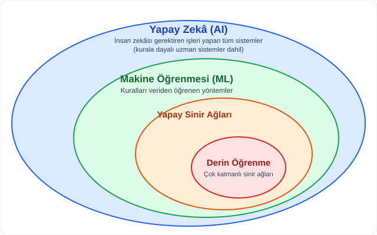</p>

> 🎓 **Tanım (Tom Mitchell, 1997):** "Bir bilgisayar programı, **T** görevindeki başarısı **P** ölçütüyle ölçüldüğünde, **E** deneyimiyle artıyorsa, o program E deneyiminden öğreniyor demektir."
> Örneğin bir spam filtresi için: **T** = e-postaları spam/normal diye ayırmak, **P** = doğru sınıflandırılan e-postaların oranı, **E** = kullanıcının daha önce "spam" diye işaretlediği e-postalar.

### 1.2 Klasik Programlama ile Makine Öğrenmesinin Farkı 🟢

Bilgisayarlar talimatları **dijital (sayısal)** bir dille, yani 0 ve 1'lerle işler. Klasik programlamada, bir problemi çözmek için gereken kuralları **programcı** bu dile çevirir. Makine öğrenmesinde ise bilgisayara **veri ve doğru cevaplar** verilir, kuralları **öğrenme algoritması** kendisi çıkarır.

<p align="center">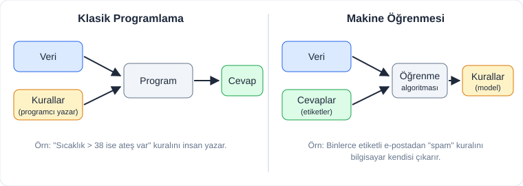</p>

Bu yaklaşımın en büyük **avantajı**, kuralları açıkça yazmanın çok zor veya imkânsız olduğu problemlerde (bir fotoğrafta kedi olup olmadığını anlamak, bir sesin kime ait olduğunu bulmak gibi) insan uzmanlığının **veri aracılığıyla** bilgisayara aktarılabilmesidir.

### 1.3 Veri, Enformasyon ve Bilgi 🟢

**Datum** Latince kökenli bir kelimedir ve "verilen şey" anlamına gelir. İngilizcedeki **data** kelimesi bunun çoğuludur: tek bir ölçüm *datum*, ölçümlerin bütünü *data*dır.

**Veri**, bir nesne, varlık, olay veya durum hakkındaki nitel (kategorik) ya da nicel (sayısal) gözlemlerin belirli bir sisteme göre **kayıt altına alınmış** hâlidir.

Veri, işlendikçe değer kazanır. Bu süreç literatürde **DIKW hiyerarşisi** (Data → Information → Knowledge → Wisdom) olarak bilinir:

<p align="center">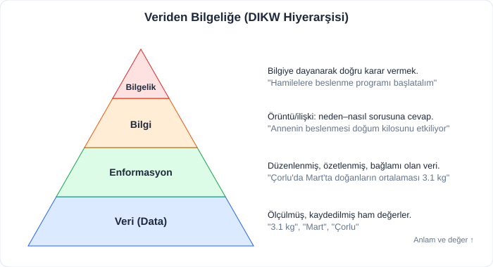</p>

| Seviye | Açıklama | Yeni doğan bebek örneği |
| :--- | :--- | :--- |
| **Veri (Data)** | Ölçülmüş ve kaydedilmiş ham değerler. | Bir bebeğin tartılıp kilosunun "3.1 kg" olarak deftere yazılması. *(Bebek tartılmadan önce de bir ağırlığı vardır, ama henüz veri değildir.)* |
| **Enformasyon (Information)** | Düzenlenmiş, özetlenmiş, bağlamı olan veri. | "Çorlu'da Mart ayında doğan bebeklerin ortalama kilosu 3.1 kg'dır." |
| **Bilgi (Knowledge)** | Büyük ve karmaşık veriden çıkarılan, ilk bakışta fark edilmeyen, **işe yarar** örüntü ve ilişkiler. | Bir yapay zekâ sisteminin ağlama seslerini analiz ederek bebeğin açlıktan mı, uykusuzluktan mı yoksa ağrıdan mı ağladığını ayırt edebilmesi. |
| **Bilgelik (Wisdom)** | Bilgiye dayanarak doğru eylemi seçmek. | Sistemin önerisine göre ebeveynin doğru müdahaleyi yapması. |

> 💡 Makine öğrenmesinin asıl işi, **veriden bilgiye (knowledge)** giden yolu otomatikleştirmektir. **Veri madenciliği (data mining)** terimi de tam olarak bu süreci anlatır.

### 1.4 Makine Öğrenmesiyle İlişkili Disiplinler 🟢

Makine öğrenmesi tek başına bir ada değildir. Temelini **istatistik** ve **matematik** (özellikle lineer cebir, olasılık ve optimizasyon) oluşturur; uygulaması **bilgisayar bilimleri** ve **mühendislik** gerektirir.

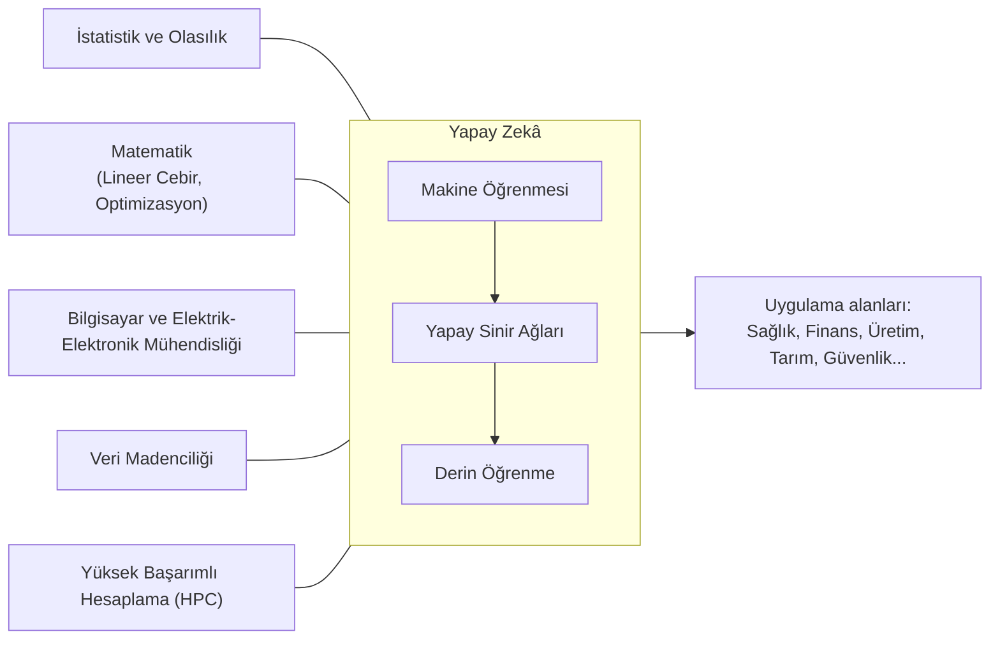
```mermaid
flowchart LR
    subgraph AI["Yapay Zekâ"]
        direction TB
        ML["Makine Öğrenmesi"] --> NN["Yapay Sinir Ağları"] --> DL["Derin Öğrenme"]
    end
    IST["İstatistik ve Olasılık"] --- AI
    MAT["Matematik<br/>(Lineer Cebir, Optimizasyon)"] --- AI
    BLG["Bilgisayar ve Elektrik-Elektronik Mühendisliği"] --- AI
    VM["Veri Madenciliği"] --- AI
    HPC["Yüksek Başarımlı Hesaplama (HPC)"] --- AI
    AI --> UYG["Uygulama alanları:<br/>Sağlık, Finans, Üretim, Tarım, Güvenlik..."]
```

En basit hâliyle bir makine öğrenmesi sistemi, girdiyi alıp bir **model** aracılığıyla çıktıya dönüştürür:

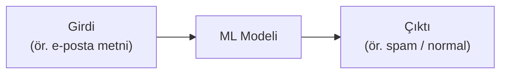
```mermaid
graph LR
    A["Girdi<br/>(ör. e-posta metni)"] --> B["ML Modeli"] --> C["Çıktı<br/>(ör. spam / normal)"]
```

### 1.5 Model Nedir? Öğrenme Nedir? 🟢

**Model**, girdiye bakarak çıktıyı tahmin eden, veriden öğrenilmiş **matematiksel bir fonksiyon** veya **kural kümesidir**. Bir doğru denklemi ($y = \theta_0 + \theta_1 x$), bir karar ağacı ya da milyonlarca parametreli bir sinir ağı birer modeldir.

Bilgisayar için **öğrenme**, modelin içindeki ayarlanabilir sayıları (**parametreleri**) veriye bakarak, tahmin hatasını en aza indirecek şekilde ayarlama sürecidir. Bu sürece **eğitim (training)** denir. İyi eğitilmiş bir model, daha önce **hiç görmediği** verilere de doğru tahminler yapabilir; bu yeteneğe **genelleme (generalization)** denir.

> ⚠️ Modellerin ürettiği sonuçlar **kesin değil, olasılıksaldır**. "Bu e-posta %97 olasılıkla spam" demek, bazen yanılacağımızı da kabul etmek demektir.

### 1.6 Avantajlar ve Dezavantajlar 🟢

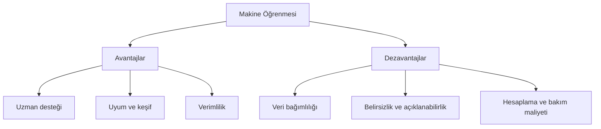
```mermaid
graph TD
    A[Makine Öğrenmesi] --> B[Avantajlar]
    A --> C[Dezavantajlar]
    B --> D[Uzman desteği]
    B --> E[Uyum ve keşif]
    B --> F[Verimlilik]
    C --> G[Veri bağımlılığı]
    C --> H[Belirsizlik ve açıklanabilirlik]
    C --> I[Hesaplama ve bakım maliyeti]
```

**Avantajları**

1. **Uzman desteği:** Uzman sayısının yetersiz olduğu alanlarda (ör. kırsal bölgede radyoloji) karar desteği sağlar.
2. **Uyum ve keşif:** Yeni veriyle kendini güncelleyebilir; veride insanın göremeyeceği gizli örüntüleri keşfedebilir.
3. **Verimlilik:** 7/24 çalışır; klasik programlamayla çözülemeyen problemlere veri odaklı çözümler üretir.

**Dezavantajları**

1. **Veri bağımlılığı:** Model ancak verisi kadar iyidir ("çöp girer, çöp çıkar"). Verideki önyargılar (bias) modele de geçer. Dünya değiştikçe (ör. pandemi sonrası alışveriş alışkanlıkları) model eskir ve yeniden eğitilmelidir.
2. **Belirsizlik ve açıklanabilirlik:** Sonuçlar olasılıksaldır. Bazı güçlü modeller (derin ağlar, büyük topluluklar) kararlarını **neden** verdiklerini açıklamakta zorlanır ("kara kutu").
3. **Hesaplama ve bakım maliyeti:** Karmaşık modeller yüksek işlemci/bellek (GPU, HPC) gerektirebilir; gerçek zamanlı sistemlerde gecikme sorunları yaşanabilir. Model devreye alındıktan sonra da izlenmeli ve bakımı yapılmalıdır.

---

<a id="b2"></a>

## 2. Bir Makine Öğrenmesi Projesinin Adımları 🟢

Bir makine öğrenmesi projesi, tıpkı bilimsel bir araştırma gibi birbirini izleyen aşamalardan oluşur. Endüstride en yaygın kullanılan çerçeve **CRISP-DM**'dir (Cross-Industry Standard Process for Data Mining). Süreç **döngüseldir**: sonuçlar yeterli değilse önceki adımlara geri dönülür.

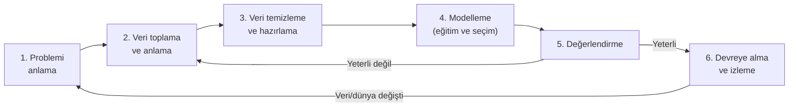
```mermaid
flowchart LR
    A["1. Problemi<br/>anlama"] --> B["2. Veri toplama<br/>ve anlama"]
    B --> C["3. Veri temizleme<br/>ve hazırlama"]
    C --> D["4. Modelleme<br/>(eğitim ve seçim)"]
    D --> E["5. Değerlendirme"]
    E -->|Yeterli değil| B
    E -->|Yeterli| F["6. Devreye alma<br/>ve izleme"]
    F -->|Veri/dünya değişti| A
```

### Adım 1 – Problemi Anlamak ve Tanımlamak

Her şey, çözmek istediğimiz problemi net olarak tanımlamakla başlar: **Ne tahmin edilecek? Başarı nasıl ölçülecek? Hata yapmanın bedeli ne?**

Her problem makine öğrenmesi problemi değildir:
- Bir fırının sıcaklığını sabit tutmak → **kontrol sistemleri** problemi.
- Bir marketteki müşterilerin yaş ortalamasını bulmak → **tanımlayıcı istatistik** problemi.
- Bir müşterinin önümüzdeki ay aboneliğini iptal edip etmeyeceğini tahmin etmek → **makine öğrenmesi** problemi.

Makine öğrenmesi özellikle şu durumlarda uygundur:
- **Kurallar belirsizse:** Çözüm için açık bir algoritma yazmak zorsa (yüz tanıma).
- **Veri büyük ve dinamikse:** Çok sayıda girdisi olan, sürekli değişen sistemler (borsa, trafik).
- **Gizli örüntüler aranıyorsa:** İlk bakışta görünmeyen ilişkiler (dolandırıcılık tespiti).

### Adım 2 – Veri Toplama ve Yönetimi

Bu aşama genellikle **alan uzmanlarıyla** (doktor, bankacı, mühendis) birlikte yürütülür.
- **Hangi veriler?** Problemi çözmek için hangi değişkenler (öznitelikler) önemli?
- **Nereden ve nasıl?** Veritabanı, sensör, anket, web…
- **Nerede ve nasıl saklanacak?** Yerel sunucu veya bulut; SQL, NoSQL, veri gölü (data lake).
- **Türü ve hacmi ne?** Nitel mi nicel mi? Kaç satır, kaç sütun? Kişisel veri mi (KVKK)?

### Adım 3 – Veri Temizleme ve Hazırlama

Gerçek dünya verisi nadiren temizdir: eksik değerler, hatalı girişler, aykırı değerler, tutarsız biçimler… Bu adım genellikle projenin **en çok zaman alan** (%60–80) kısmıdır. Detaylar [Bölüm 5](#b5)'tedir.

### Adım 4 – Modelleme

Farklı algoritmalar (karar ağaçları, SVM, sinir ağları…) **eğitim verisi** üzerinde denenir.
- Her problem ve veri tipi için "en iyi" tek bir algoritma yoktur (**No Free Lunch** teoremi). Bu yüzden birden fazla algoritma denenir.
- Bazı algoritmalar yalnızca sayısal veriyle çalışır; bazıları kategorik veriyi doğrudan işleyebilir.
- Algoritmaların **hiperparametreleri** ayarlanır ([Bölüm 21](#b21)).

### Adım 5 – Değerlendirme ve İyileştirme

Model, daha önce **görmediği** veriler üzerinde, problemin doğasına uygun **performans ölçütleriyle** (doğruluk, kesinlik, duyarlılık, F1, AUC, RMSE…) değerlendirilir ([Bölüm 13](#b13) ve [Bölüm 14](#b14)).
- Sadece genel başarıya değil, **hata türlerine** de bakılır (hasta birini sağlıklı demek ile sağlıklı birini hasta demek aynı değildir).
- Sonuçların **istatistiksel olarak anlamlı** olup olmadığı test edilir ([Bölüm 24](#b24)).
- Yetersizse önceki adımlara dönülür. Bu bir başarısızlık değil, sürecin doğal parçasıdır.

### Adım 6 – Devreye Alma ve İzleme

Model bir uygulamaya (web servisi, mobil uygulama, masaüstü program) entegre edilir. Bu depodaki [`application/`](https://github.com/erkanozhan/machinelearning/tree/main/application) klasöründe, WEKA ile eğitilmiş bir Iris modelinin **Java masaüstü** ve **Spring Boot web** uygulamalarına nasıl gömüldüğüne dair örnekler bulunur. Devreye alınan model düzenli olarak izlenmelidir; verinin dağılımı zamanla değişirse (**veri kayması / data drift**) model yeniden eğitilir.

---

<a id="b3"></a>

## 3. Öğrenme Türleri 🟢

Bilgisayarların veriden nasıl öğrendiğine göre makine öğrenmesi yöntemleri üç ana gruba ayrılır:

<p align="center">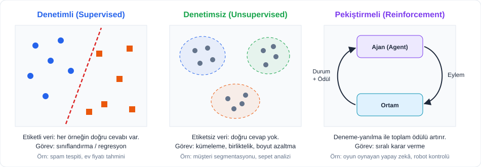</p>

### 3.1 Denetimli Öğrenme (Supervised Learning)

Küçük bir çocuğa hayvanları öğrettiğimizi düşünelim. Ona bir kedi resmi gösterip "bu bir kedi", bir köpek resmi gösterip "bu bir köpek" deriz. Yani her resim için **doğru cevabı (etiketi)** veririz. Çocuk yeterince örnek gördükten sonra, daha önce hiç görmediği bir hayvan resmini de doğru tanımaya başlar.

Denetimli öğrenme tam olarak böyle çalışır. Elimizde girdiler ($X$) ve her girdiye karşılık gelen doğru çıktı ($y$) bulunur. Bu tür veriye **etiketli veri (labeled data)** denir. Amaç, girdiden çıktıya giden ilişkiyi öğrenip **yeni** girdiler için doğru çıktıyı tahmin edebilen bir model kurmaktır. Makine öğrenmesinde en sık karşılaşılan türdür.

Tahmin edilen çıktının türüne göre ikiye ayrılır:

| | **Sınıflandırma (Classification)** | **Regresyon (Regression)** |
| :--- | :--- | :--- |
| Çıktı | Kategorik bir **sınıf** | Sürekli bir **sayı** |
| Soru | "Hangisi?" | "Ne kadar?" |
| Örnek | E-posta **spam mı, normal mi?** | Evin satış **fiyatı kaç TL?** |
| Örnek | Kredi başvurusu **onay / ret** | Yarınki **sıcaklık kaç °C?** |
| Örnek | Hastada **diyabet var / yok** | Bir öğrencinin **sınav notu** |

### 3.2 Denetimsiz Öğrenme (Unsupervised Learning)

Size bir kutu dolusu farklı renk ve şekilde oyuncak veriliyor ve "Bunları benzerliklerine göre grupla" deniyor. Hangi oyuncağın ne olduğunu ya da kaç grup olması gerektiğini söyleyen kimse yok. Siz de renklerine, boyutlarına, şekillerine bakarak kendinizce gruplar oluşturuyorsunuz.

Denetimsiz öğrenmede veri **etiketsizdir (unlabeled)**; doğru cevaplar ve sınıflar önceden bilinmez. Amaç, verinin kendi içindeki **gizli yapıyı** ortaya çıkarmaktır. Bulunan yapının anlamlı olup olmadığına genellikle **veri analisti ve alan uzmanı** karar verir.

- **Kümeleme (Clustering):** Benzer örnekleri gruplara ayırır. *Örnek:* Bir e-ticaret sitesinin müşterilerini satın alma alışkanlıklarına göre segmentlere ayırması ([Bölüm 17](#b17)).
- **Birliktelik Kuralları (Association Rules):** Birlikte ortaya çıkan olayları bulur. *Örnek:* **Sepet analizi**: "Ekmek alan müşterilerin çoğu tereyağı da alıyor." ([Bölüm 18](#b18))
- **Boyut Azaltma (Dimensionality Reduction):** Çok sayıda özniteliği, bilgi kaybını en aza indirerek daha az sayıda öznitelikle temsil eder ([Bölüm 19](#b19)).
- **Anomali Tespiti (Anomaly Detection):** Normalin dışındaki sıra dışı örnekleri bulur. *Örnek:* Olağandışı kredi kartı harcamaları.

### 3.3 Yarı Denetimli Öğrenme (Semi-supervised Learning)

Etiketlemek çoğu zaman pahalıdır (bir radyoloğun binlerce görüntüyü tek tek etiketlemesi gibi). Yarı denetimli öğrenmede **az sayıda etiketli** ve **çok sayıda etiketsiz** veri birlikte kullanılır.

### 3.4 Pekiştirmeli Öğrenme (Reinforcement Learning)

Bir köpeği eğitirken doğru davranışta ödül (mama), yanlış davranışta ödülsüzlük uygularız. Pekiştirmeli öğrenmede de bir **ajan (agent)**, bir **ortamda (environment)** eylemler yapar ve karşılığında **ödül (reward)** veya ceza alır. Hiç kimse ona doğru cevabı söylemez; ajan **deneme-yanılma** ile uzun vadede toplam ödülü en büyük yapan davranış biçimini (**politika**) öğrenir. Satranç ve Go oynayan yapay zekâlar, robot kontrolü ve otonom sürüşün bazı bileşenleri bu yaklaşımı kullanır.

> 🎓 Bu derste ağırlıklı olarak **denetimli** ve **denetimsiz** öğrenme yöntemleri işlenmektedir. Pekiştirmeli öğrenme, genellikle ayrı bir ileri seviye dersin konusudur.

---

<a id="b4"></a>

## 4. Araçlar: WEKA ve Python 🟢

Bu derste iki araç birlikte kullanılır:

| | **WEKA** | **Python (scikit-learn)** |
| :--- | :--- | :--- |
| Kullanım | Görsel arayüz, kod yazmadan | Kod yazarak |
| Avantaj | Hızlı deneme, kavramları görsel öğrenme | Esneklik, otomasyon, endüstri standardı |
| Dosya formatı | `.arff` (ayrıca `.csv`) | `.csv`, NumPy dizileri, pandas tabloları |

### 4.1 WEKA'ya Hızlı Başlangıç

**WEKA (Waikato Environment for Knowledge Analysis)**, Yeni Zelanda'daki Waikato Üniversitesi tarafından geliştirilmiş, **Java tabanlı**, **açık kaynak** bir makine öğrenmesi yazılımıdır. İçinde sınıflandırma, regresyon, kümeleme, birliktelik kuralları, öznitelik seçimi ve görselleştirme için yüzlerce algoritma vardır. [weka.io](https://ml.cms.waikato.ac.nz/weka) adresinden indirilebilir.

**Başlatma:** Windows'ta "**Weka (with Console)**" seçeneğiyle açmak iyi bir alışkanlıktır. Konsol penceresi arka planda olan işlemleri ve hata mesajlarını gösterir.

**Bellek ayarı:** Büyük veri setlerinde `OutOfMemoryError` (bellek yetersiz) hatası alabilirsiniz. WEKA'nın kurulu olduğu klasördeki `RunWeka.ini` dosyasında `maxheap=` değerini artırın (ör. `maxheap=4g`) ve WEKA'yı yeniden başlatın.

**GUI Chooser (ana pencere) seçenekleri:**

| Arayüz | Ne için kullanılır? |
| :--- | :--- |
| **Explorer** | Veri yükleme, ön işleme, model kurma ve değerlendirme. Derste en çok kullanacağımız ekran. |
| **Experimenter** | Birden çok algoritmayı birden çok veri setinde, tekrarlı deneylerle ve istatistiksel testlerle karşılaştırma ([Bölüm 24](#b24)). |
| **KnowledgeFlow** | Sürükle-bırak ile veri akış şeması (pipeline) tasarlama ([Bölüm 23](#b23)). |
| **Workbench** | Yukarıdakilerin tümünü tek pencerede toplayan arayüz. |
| **Simple CLI** | Komut satırından WEKA komutları çalıştırma. |

**Explorer sekmeleri:**

| Sekme | İşlevi |
| :--- | :--- |
| **Preprocess** | Veri yükleme, istatistikleri görme, filtre (ön işleme) uygulama. |
| **Classify** | Sınıflandırma **ve regresyon** modelleri kurma ve test etme. |
| **Cluster** | Kümeleme. |
| **Associate** | Birliktelik kuralları (sepet analizi). |
| **Select attributes** | Öznitelik seçimi. |
| **Visualize** | Öznitelik çiftlerinin dağılım grafikleri. |

### 4.2 ARFF Dosya Formatı

WEKA'nın kendi dosya biçimi **ARFF**'dir (*Attribute-Relation File Format*). Düz bir metin dosyasıdır ve üç bölümden oluşur:

```text
% Yüzde (%) işaretiyle başlayan satırlar yorumdur. Yorumları her zaman ayrı satıra yazın.
% 1) Veri setinin adı
@relation ogrenci_notlari

% 2) Öznitelik adı ve türü (numeric = sayısal, { } = kategorik/nominal değerler)
@attribute vize numeric
@attribute final numeric
@attribute durum {gecti, kaldi}

% 3) Veriler: her satır bir örnek, değerler virgülle ayrılır
@data
60,75,gecti
45,50,kaldi
80,90,gecti
95,92,gecti
30,40,kaldi
```

- Denetimli öğrenmede tahmin edilecek **hedef öznitelik (sınıf)** genellikle **son** `@attribute` olarak yazılır.
- Bilinmeyen (eksik) değerler `?` ile gösterilir.
- Diğer türler: `string` (metin), `date` (tarih).
- `.csv` dosyalarını WEKA'da açıp **Save** ile `.arff` olarak kaydedebilirsiniz. Veritabanından veri çekmek için ilgili **JDBC** sürücüsünün WEKA'ya tanıtılması gerekir.

Bu örnek dosya depoda hazırdır: [`data/notlar.arff`](https://github.com/erkanozhan/machinelearning/blob/main/data/notlar.arff).

WEKA'nın kurulum klasöründeki `data/` dizininde derste kullanacağımız hazır veri setleri bulunur: `iris.arff`, `weather.nominal.arff`, `cpu.arff`, `diabetes.arff`, `credit-g.arff`, `supermarket.arff` vb.

### 4.3 Python ve scikit-learn

**scikit-learn**, Python'daki en yaygın makine öğrenmesi kütüphanesidir. Neredeyse tüm modeller aynı arayüzü kullanır; bunu bir kez öğrenmek yeterlidir:

```python
from sklearn.tree import DecisionTreeClassifier   # 1) Modeli içe aktar

model = DecisionTreeClassifier()                   # 2) Modeli oluştur (hiperparametreler burada verilir)
model.fit(X_egitim, y_egitim)                      # 3) Eğit: parametreleri veriden öğren
y_tahmin = model.predict(X_test)                   # 4) Görülmemiş veride tahmin yap
olasilik = model.predict_proba(X_test)             # 5) (Varsa) sınıf olasılıklarını al
```

Ön işleme araçları da benzer biçimde çalışır: `fit` (istatistikleri öğren), `transform` (dönüştür), `fit_transform` (ikisi birden).

> ⚠️ **Altın kural:** `fit` her zaman **yalnızca eğitim verisiyle** yapılır. Test verisine sadece `transform` / `predict` uygulanır. Bu kuralın neden bu kadar önemli olduğu [Bölüm 22](#b22)'de anlatılıyor.

---

<a id="b5"></a>

## 5. Veri ve Öznitelikler

### 5.1 Veri Setinin Dili 🟢

Makine öğrenmesinde veri genellikle bir **tablo** olarak düşünülür:

| Ad (kimlik) | Yaş | Aylık gelir (TL) | Şehir | Geçmiş gecikme | **Risk (hedef)** |
| :--- | :---: | :---: | :---: | :---: | :---: |
| Müşteri 1 | 34 | 25 000 | İstanbul | Hayır | **Düşük** |
| Müşteri 2 | 22 | 9 000 | Ankara | Evet | **Yüksek** |
| Müşteri 3 | 45 | 40 000 | İzmir | Hayır | **Düşük** |

| Terim | Karşılığı | Tablodaki yeri |
| :--- | :--- | :--- |
| **Örnek** (instance, sample, observation, kayıt) | Tek bir müşteri, hasta, çiçek… | Bir **satır** |
| **Öznitelik** (feature, attribute, değişken) | Örneği tanımlayan bir özellik | Bir **sütun** (Yaş, Gelir…) |
| **Hedef / Etiket / Sınıf** (target, label, class) | Tahmin etmek istediğimiz değer | Son sütun (Risk) |
| **Öznitelik vektörü** | Bir örneğin tüm öznitelik değerleri | Bir satırın hedef dışındaki kısmı |

Matematiksel gösterimde $n$ örnek ve $d$ öznitelik varsa veri bir $X$ matrisiyle, hedef ise bir $y$ vektörüyle gösterilir:

$$
X = \begin{bmatrix} x_{11} & x_{12} & \cdots & x_{1d} \\ x_{21} & x_{22} & \cdots & x_{2d} \\ \vdots & \vdots & \ddots & \vdots \\ x_{n1} & x_{n2} & \cdots & x_{nd} \end{bmatrix}, \qquad y = \begin{bmatrix} y_1 \\ y_2 \\ \vdots \\ y_n \end{bmatrix}
$$

| Sembol | Okunuşu | Anlamı |
| :---: | :--- | :--- |
| $X$ | "büyük iks" | Öznitelik matrisi ($n$ satır × $d$ sütun) |
| $x_{ij}$ | "iks i j" | $i$. örneğin $j$. özniteliğinin değeri |
| $y_i$ | "ye i" | $i$. örneğin gerçek hedef değeri |
| $\hat{y}_i$ | "ye şapka i" | Modelin $i$. örnek için **tahmini** (şapka = tahmin) |
| $n$ (bazen $m$) | "en" | Örnek (satır) sayısı |
| $d$ (bazen $p$ veya $n$) | "de" | Öznitelik (sütun) sayısı |

> ⚠️ **Öznitelik** ile **parametre** farklı şeylerdir. Öznitelik, veride bulunan bir girdidir (evin metrekaresi). **Parametre** ise modelin içinde, eğitim sırasında öğrenilen bir sayıdır (metrekarenin fiyata etkisini gösteren katsayı, $\theta$). Kaynaklarda bazen karıştırılır; biz bu ayrımı koruyacağız.

### 5.2 Temel İstatistikler 🟢

Veriyi tanımak için ilk bakılan değerler bunlardır. WEKA'da **Preprocess** sekmesinde bir öznitelik seçildiğinde sağ panelde otomatik görünürler.

**Aritmetik ortalama:**

$$
\bar{x} = \mu = \frac{1}{n}\sum_{i=1}^{n} x_i
$$

**Varyans ve standart sapma** (değerlerin ortalama etrafında ne kadar yayıldığı):

$$
\sigma^2 = \frac{1}{n}\sum_{i=1}^{n}(x_i-\mu)^2 \qquad\qquad s^2 = \frac{1}{n-1}\sum_{i=1}^{n}(x_i-\bar{x})^2
$$

| Sembol | Okunuşu | Anlamı |
| :---: | :--- | :--- |
| $\bar{x}$, $\mu$ | "iks bar", "mü" | Ortalama ($\mu$ genellikle kitle, $\bar{x}$ örneklem ortalaması için kullanılır) |
| $\sum_{i=1}^{n}$ | "sigma, i eşittir birden n'e kadar" | $i=1$'den $n$'e kadar tüm terimleri **topla** |
| $\sigma^2$, $\sigma$ | "sigma kare", "sigma" | Kitle varyansı ve standart sapması ($n$'e bölünür) |
| $s^2$, $s$ | "es kare", "es" | Örneklem varyansı ve standart sapması ($n-1$'e bölünür) |

**Medyan:** Değerler sıralandığında ortadaki değer. Aykırı değerlerden ortalamaya göre çok daha az etkilenir.
**Çeyrekler ve IQR:** $Q_1$ (%25), $Q_3$ (%75) ve çeyrekler arası açıklık $IQR = Q_3 - Q_1$.

**Örnek:** Notlar $[60, 70, 80, 100]$

- Ortalama: $(60+70+80+100)/4 = 77.5$
- Ortalamadan farklar: $-17.5,\ -7.5,\ 2.5,\ 22.5$ → kareleri toplamı: $306.25+56.25+6.25+506.25 = 875$
- Kitle std: $\sigma=\sqrt{875/4} \approx 14.79$ · Örneklem std: $s=\sqrt{875/3} \approx 17.08$
- Medyan: $(70+80)/2 = 75$

> ⚠️ **Hangi standart sapma?** `numpy.std()` ve scikit-learn'ün `StandardScaler`'ı **$n$'e böler** (14.79). Excel `STDEV`, pandas `.std()` ve WEKA **$n-1$'e böler** (17.08). Aynı veride farklı araçların küçük farklı sonuçlar vermesinin sık bir nedeni budur.

### 5.3 Öznitelik Türleri 🟢

| Tür | Açıklama | Örnek | İzin verilen işlemler |
| :--- | :--- | :--- | :--- |
| **Nominal (kategorik)** | Sırasız kategoriler | Şehir, kan grubu, marka | Eşit mi / değil mi |
| **İkili (binary)** | Sadece iki değerli nominal | Garajı var mı? (Evet/Hayır) | Eşitlik |
| **Sıralı (ordinal)** | Sıralanabilen kategoriler | Eğitim: İlkokul < Lise < Lisans | Sıralama (<, >) |
| **Aralık (interval)** | Sayısal, **gerçek sıfır noktası yok** | Sıcaklık (°C), takvim yılı | Toplama/çıkarma |
| **Oran (ratio)** | Sayısal, **gerçek sıfır var** | Boy, gelir, yaş, kilo | Tüm aritmetik işlemler (100 kg, 50 kg'ın iki katıdır) |

> 💡 Pratikte bu beş tür iki büyük gruba indirgenir: **sayısal (numeric)** ve **kategorik (nominal)**. WEKA'daki `numeric` ve `{...}` tanımları bu ayrımdır.

Sayısal öznitelikler ayrıca **sürekli** (boy: 1.753 m) veya **kesikli** (çocuk sayısı: 2) olabilir.

### 5.4 Öznitelik Seçimi ve Öznitelik Mühendisliği 🟢

Bir doktorun doğru teşhis için ateşe, tansiyona ve tahlil sonuçlarına bakması gibi, model de tahmin yaparken özniteliklere bakar. **Doğru öznitelikleri seçmek**, bir dedektifin doğru ipuçlarını izlemesine benzer: Ev fiyatını tahmin ederken metrekare çok önemlidir, kapının rengi ise muhtemelen önemsizdir. Alakasız öznitelikler modeli yanıltabilir.

- **Temel öznitelikler:** Veride doğrudan bulunan özellikler. Seçiminde **alan uzmanının** görüşü altın değerindedir.
- **Türetilmiş öznitelikler:** Mevcut özelliklerden yeni ve daha anlamlı bilgi üretmek. *Örnek:* "Doğum tarihi"nden "yaş"; "en" ve "boy"dan "alan = en × boy"; "kilo" ve "boy"dan **vücut kitle indeksi** $= \text{kilo}/\text{boy}^2$.
- **Etkileşim öznitelikleri:** Tek başına zayıf iki özellik birlikte güçlü olabilir. *Örnek:* Bir reklamın tıklanmasında "akşam saati **ve** mobil cihaz" birleşimi.
- **Gereksiz (redundant) öznitelikler:** Aynı bilgiyi tekrar edenler ("doğum tarihi" ve "yaş" birlikte). Birini çıkarmak modeli sadeleştirir.

Kısacası, bir modelin ne kadar "akıllı" olacağı ona verdiğimiz bilginin kalitesiyle doğrudan ilişkilidir. Ham veriyi zenginleştirmek ve en iyi temsilini bulmak bu işin hem bilimi hem sanatıdır. Otomatik öznitelik seçimi yöntemleri [Bölüm 19](#b19)'dadır.

### 5.5 Eksik Veri ve Aykırı Değerler 🟢

**Eksik veri (missing values)** – WEKA'da `?` ile, Python'da `NaN` ile gösterilir.

| Strateji | Ne zaman? | Dikkat |
| :--- | :--- | :--- |
| Satırı silmek | Eksik satır çok azsa | Veri kaybı; eksiklik rastgele değilse yanlılık yaratır |
| Sütunu silmek | Sütunun büyük kısmı boşsa | Önemli bilgi kaybolabilir |
| Ortalama / medyan ile doldurmak | Sayısal öznitelik | Medyan, aykırı değerlere karşı daha güvenlidir |
| En sık değer (mod) ile doldurmak | Kategorik öznitelik | |
| Modelle tahmin ederek doldurmak (k-NN imputation vb.) | Öznitelikler arasında ilişki varsa | Daha maliyetli |

WEKA'da: `filters → unsupervised → attribute → ReplaceMissingValues` (sayısalda ortalama, kategorikte mod ile doldurur).

**Aykırı değer (outlier)** – Diğerlerinden çok farklı değer. Bir ölçüm hatası da (yaş = 250) olabilir, gerçek ama nadir bir durum da (çok yüksek gelirli bir müşteri). Yaygın bir kural, **IQR kuralıdır**: $Q_1 - 1.5\cdot IQR$ altındaki veya $Q_3 + 1.5\cdot IQR$ üstündeki değerler şüphelidir. Aykırı değeri silmeden önce **neden** oluştuğunu anlamak gerekir. WEKA'da `InterquartileRange` filtresi bu kuralı uygular.

### 5.6 Kategorik Verinin Sayıya Dönüştürülmesi 🟢

Lineer regresyon, SVM, sinir ağları gibi matematiksel modeller yalnızca **sayılarla** çalışır. Bu yüzden kategorik öznitelikleri dönüştürmemiz gerekir.

**İkili öznitelikler:** "Evet" → `1`, "Hayır" → `0`.

**Sıralı öznitelikler:** Sıra korunarak kodlanır: İlkokul=1, Lise=2, Lisans=3.

**Nominal öznitelikler → One-Hot Encoding (Tekil Etkin Kodlama):** "Şehir" için İstanbul=1, Ankara=2, İzmir=3 dersek model "İzmir > Ankara" gibi **anlamsız bir sıralama** öğrenebilir. Bunun yerine her kategori için ayrı bir 0/1 sütunu açılır:

| Şehir | → | Şehir_İstanbul | Şehir_Ankara | Şehir_İzmir |
| :---: | :---: | :---: | :---: | :---: |
| İstanbul | → | 1 | 0 | 0 |
| Ankara | → | 0 | 1 | 0 |
| İzmir | → | 0 | 0 | 1 |

WEKA'da: `filters → unsupervised → attribute → NominalToBinary`. Python'da:

```python
import pandas as pd                                          # Tablo işlemleri için pandas

df = pd.DataFrame({"sehir": ["İstanbul", "Ankara", "İzmir", "Ankara"]})
print(pd.get_dummies(df, columns=["sehir"], dtype=int))     # Her şehir için 0/1 sütunu üretir
```

**Gruplama (binning / discretization):** Sayısal bir özniteliği aralıklara bölmek. *Örnek:* Gelir → "Düşük (0–10 000)", "Orta (10 001–20 000)", "Yüksek (20 001+)". Bazı algoritmalar (ör. klasik Naive Bayes, Apriori) kategorik veri ister; ayrıca gruplama, belirli aralıklardaki davranış değişimini yakalamaya yardımcı olabilir. WEKA'da: `Discretize` filtresi.

### 5.7 Uygulama Senaryosu: Kredi Riski Tahmini 🧪

Bir bankada, kredi başvurusu yapan müşterinin borcunu zamanında ödeyip ödemeyeceğini ("kredi riski") tahmin etmek istiyoruz.

1. **Problemi anlamak:** Kredi analistleriyle (alan uzmanları) görüşerek riski etkileyen faktörleri belirleriz. Geçmişte kredi kullanmış ve **sonucu belli olan** (ödedi / ödemedi) müşteriler **etiketli eğitim verimizi** oluşturur.
2. **Öznitelikleri ve türlerini belirlemek:**
   - *Aylık gelir* → **sayısal**. Ödeme kapasitesinin temel göstergesi.
   - *Yaşadığı şehir* → **nominal**. Bölgesel ekonomik koşulları yansıtabilir.
   - *Geçmiş ödeme gecikmesi* → **ikili**. Gelecekteki davranış için en güçlü ipuçlarından biri.
3. **Hedefi belirlemek:** "Yüksek risk" / "Düşük risk" → iki sınıflı bir **sınıflandırma** problemi.
4. **Dönüştürmek:** Gecikme → 0/1; şehir → one-hot; gelir → ölçekleme veya gruplama.
5. **Modellemek ve değerlendirmek:** Sonraki bölümlerde göreceğimiz algoritmalarla.

> ⚠️ **Etik not:** Kredi, işe alım, sağlık gibi insanları doğrudan etkileyen kararlarda cinsiyet, etnik köken gibi korunan özellikler (veya onların dolaylı temsilcileri, ör. posta kodu) ayrımcılığa yol açabilir. Modelin **adil** olup olmadığı ayrıca denetlenmelidir.

### 5.8 Özniteliklerin Ölçeklendirilmesi (Feature Scaling) 🟢

Bir ev fiyatı modeli düşünelim:

| Öznitelik | Örnek değer | Değer aralığı |
| :--- | :---: | :---: |
| Metrekare (m²) | 150 | ~50 – 250 |
| Oda sayısı | 3 | ~1 – 6 |

İki evin "ne kadar farklı" olduğunu ölçen **mesafe tabanlı** bir algoritma (k-NN, K-Means, SVM) metrekaredeki 10 birimlik farkı, oda sayısındaki 1 birimlik farktan çok daha önemli sayar. **Gradyan inişi** kullanan modeller (lineer/lojistik regresyon, sinir ağları) ise ölçek farkı yüzünden çok yavaş öğrenir. Ölçekleme, tüm özniteliklere **adil söz hakkı** tanımak için yapılır.

> 💡 **Hangi modeller ölçeklemeye duyarlı?** k-NN, K-Means, SVM, PCA, lineer/lojistik regresyon (özellikle düzenlileştirme varsa), sinir ağları → **Evet.** Karar ağaçları, Random Forest, gradyan artırma ağaçları, Naive Bayes → **Genellikle hayır.**

#### a) Min-Max Normalizasyonu

Değerleri $[0, 1]$ aralığına taşır.

$$
x' = \frac{x - x_{\min}}{x_{\max} - x_{\min}}
$$

| Sembol | Okunuşu | Anlamı |
| :---: | :--- | :--- |
| $x$ | "iks" | Özniteliğin orijinal değeri |
| $x'$ | "iks üssü" | Ölçeklenmiş (yeni) değer |
| $x_{\min}$, $x_{\max}$ | "iks min", "iks maks" | Özniteliğin **eğitim verisindeki** en küçük ve en büyük değeri |

**Örnek:** $[60, 70, 80, 100]$ → min = 60, max = 100. 70 için: $\frac{70-60}{100-60} = 0.25$. Sonuç: $[0,\ 0.25,\ 0.5,\ 1]$.

⚠️ **Aykırı değerlere çok duyarlıdır.** Veriye hatalı bir 300 eklenirse diğer tüm notlar $[0, 0.17]$ aralığına sıkışır.

#### b) Z-Skoru Standardizasyonu

Veriyi ortalaması 0, standart sapması 1 olacak şekilde dönüştürür. Her değer "ortalamadan kaç standart sapma uzakta?" sorusunun cevabına dönüşür.

$$
z = \frac{x - \mu}{\sigma}
$$

| Sembol | Okunuşu | Anlamı |
| :---: | :--- | :--- |
| $z$ | "zet" | Standartlaştırılmış değer (z-skoru) |
| $\mu$ | "mü" | Özniteliğin (eğitim verisindeki) ortalaması |
| $\sigma$ | "sigma" | Özniteliğin standart sapması |

**Örnek:** $[60, 70, 80, 100]$, $\mu = 77.5$, $\sigma \approx 14.79$ (scikit-learn'ün kullandığı değer). 70 için: $z = \frac{70-77.5}{14.79} \approx -0.51$ → "70, ortalamanın yaklaşık yarım standart sapma altında." Tüm sonuç: $[-1.18,\ -0.51,\ 0.17,\ 1.52]$. *(WEKA $n-1$ ile hesapladığı için $\sigma \approx 17.08$ ve $z \approx -0.44$ bulur.)*

Standardizasyon değerleri sabit bir aralığa sıkıştırmaz. Bu yüzden tek bir aykırı değer diğerlerini Min-Max kadar ezmez. Ancak ortalama ve standart sapma da aykırı değerlerden etkilendiği için **tam olarak dayanıklı değildir**. Normal dağılıma yakın veride ve SVM, lojistik regresyon, PCA gibi yöntemlerde genellikle ilk tercihtir.

#### c) Dayanıklı Ölçekleme (Robust Scaling) 🎓

Aykırı değerlere karşı gerçekten dayanıklı olan yöntem **medyan** ve **IQR** kullanır:

$$
x' = \frac{x - \text{medyan}(x)}{IQR}, \qquad IQR = Q_3 - Q_1
$$

scikit-learn'de: `RobustScaler`.

#### d) Onluk Ölçekleme (Decimal Scaling)

Ondalık virgülü kaydırarak değerleri $(-1, 1)$ aralığına getirir:

$$
x' = \frac{x}{10^{j}}, \qquad j:\ \max_i \lvert x'_i \rvert < 1 \text{ koşulunu sağlayan en küçük tam sayı}
$$

**Örnek:** $[-986, 450, 120, -50]$ → en büyük mutlak değer 986 → $j = 3$ → $[-0.986,\ 0.450,\ 0.120,\ -0.050]$. Basittir ama verinin dağılımını hiç kullanmadığından pratikte az tercih edilir.

**Karşılaştırma** (aynı veri + hatalı bir 300 değeri):

| Yöntem | $[60, 70, 80, 100, 300]$ için sonuç | Yorum |
| :--- | :--- | :--- |
| Min-Max | $[0,\ 0.04,\ 0.08,\ 0.17,\ 1]$ | Normal notlar sıkıştı |
| Z-skoru | $[-0.69,\ -0.58,\ -0.47,\ -0.25,\ 1.98]$ | Ortalama bozuldu |
| Robust | $[-0.67,\ -0.33,\ 0,\ 0.67,\ 7.33]$ | Normal notlar makul aralıkta kaldı; aykırı değer net biçimde göze çarpıyor |

> ⚠️ **En önemli kural:** $x_{\min}$, $x_{\max}$, $\mu$, $\sigma$ gibi değerler **yalnızca eğitim verisinden** hesaplanır ve test verisine **aynı değerlerle** uygulanır. Tüm veriyle hesaplarsanız test verisinin bilgisi modele sızar ([Bölüm 22](#b22)).

#### 🧪 WEKA'da Ölçeklendirme

1. [`data/notlar.arff`](https://github.com/erkanozhan/machinelearning/blob/main/data/notlar.arff) dosyasını indirin. **Explorer → Preprocess → Open file…** ile açın. Bir özniteliğe tıklayınca sağ panelde Minimum, Maximum, Mean, StdDev değerleri görünür.
2. **Min-Max:** Filter → **Choose** → `weka → filters → unsupervised → attribute → Normalize` → **Apply**. `vize` seçildiğinde Minimum = 0, Maximum = 1 olur. (`scale` ve `translation` parametreleriyle farklı aralıklar da seçilebilir, ör. $[-1, 1]$.)
3. **Undo** ile geri alın.
4. **Z-skoru:** Aynı yoldan `Standardize` → **Apply**. Mean ≈ 0, StdDev = 1 olur.

> ⚠️ Preprocess sekmesinde uygulanan filtre **tüm veriye** uygulanır. Sadece veriyi incelemek için sorun değildir; ancak ardından çapraz doğrulama yapılacaksa doğru yol filtreyi `FilteredClassifier` içine koymaktır ([Bölüm 22](#b22)).

#### 🧪 Python'da Ölçeklendirme

```python
import numpy as np                                          # Sayısal diziler
from sklearn.preprocessing import MinMaxScaler, StandardScaler

notlar = np.array([[60], [70], [80], [100]])                # sklearn 2 boyutlu dizi ister: (örnek, öznitelik)

print(MinMaxScaler().fit_transform(notlar).ravel())        # [0.   0.25 0.5  1.  ]
print(StandardScaler().fit_transform(notlar).ravel())      # [-1.183 -0.507  0.169  1.521]
```

➡️ Tüm yöntemler, aykırı değer deneyi ve eğitim/test ayrımıyla doğru kullanım: [`codes/python/01_istatistik_ve_olceklendirme.py`](https://github.com/erkanozhan/machinelearning/blob/main/codes/python/01_istatistik_ve_olceklendirme.py)

### 5.9 Mesafe (Uzaklık) Ölçüleri 🟢

k-NN, K-Means, hiyerarşik kümeleme ve DBSCAN gibi yöntemler iki örneğin **ne kadar benzer** olduğunu bir mesafe ölçüsüyle belirler. $\mathbf{a} = (a_1,\dots,a_d)$ ve $\mathbf{b} = (b_1,\dots,b_d)$ iki örnek olsun:

$$
d_{\text{Öklid}}(\mathbf{a},\mathbf{b}) = \sqrt{\sum_{j=1}^{d}(a_j-b_j)^2} \qquad d_{\text{Manhattan}}(\mathbf{a},\mathbf{b}) = \sum_{j=1}^{d}\lvert a_j-b_j \rvert
$$

| Sembol | Okunuşu | Anlamı |
| :---: | :--- | :--- |
| $\mathbf{a}, \mathbf{b}$ | "a vektörü", "b vektörü" | Karşılaştırılan iki örnek (kalın harf = vektör) |
| $a_j$ | "a j" | $\mathbf{a}$'nın $j$. özniteliği |
| $\lvert \cdot \rvert$ | "mutlak değer" | İşaretsiz büyüklük |
| $d$ | "de" | Öznitelik sayısı |

**Örnek:** $\mathbf{a}=(1, 2)$, $\mathbf{b}=(4, 6)$ → Öklid: $\sqrt{3^2+4^2}=5$ (kuş uçuşu) · Manhattan: $3+4=7$ (şehir blokları boyunca yürüyerek).

> 🎓 **Minkowski mesafesi** ikisini genelleştirir: $d_p = \left(\sum_j \lvert a_j-b_j\rvert^p\right)^{1/p}$. $p=1$ Manhattan, $p=2$ Öklid'dir. Metin verisinde sıklıkla **kosinüs benzerliği** kullanılır: $\cos(\mathbf{a},\mathbf{b}) = \frac{\mathbf{a}\cdot\mathbf{b}}{\lVert\mathbf{a}\rVert\,\lVert\mathbf{b}\rVert}$. Kategorik verilerde ise farklı olan öznitelik sayısını sayan **Hamming mesafesi** kullanılabilir.

---

<a id="b6"></a>

## 6. Lineer Regresyon (Doğrusal Regresyon)

### 6.1 Temel Fikir 

Hayatta birçok şeyin birbiriyle ilişkili olduğunu gözlemleriz: Evin büyüklüğü arttıkça fiyatı artar, ders çalışma süresi arttıkça sınav notu yükselme eğilimindedir. **Lineer regresyon**, bir girdi ile sürekli bir çıktı arasındaki ilişkiyi bir **doğru** ile ifade eden, makine öğrenmesinin en temel modelidir.

**Basit lineer regresyonun modeli (hipotezi):**

$$
\hat{y} = h_\theta(x) = \theta_0 + \theta_1 x
$$

| Sembol | Okunuşu | Anlamı |
| :---: | :--- | :--- |
| $\hat{y}$ | "ye şapka" | Modelin tahmini (ör. tahmini sınav notu) |
| $h_\theta(x)$ | "h teta iks" | Hipotez fonksiyonu: $\theta$ parametreleriyle çalışan model |
| $x$ | "iks" | Girdi / bağımsız değişken (ör. çalışma süresi) |
| $\theta_0$ | "teta sıfır" | **Kesişim (intercept):** $x = 0$ iken tahmin; doğrunun $y$ eksenini kestiği nokta |
| $\theta_1$ | "teta bir" | **Eğim (slope):** $x$ bir birim artınca $\hat{y}$'deki değişim; ilişkinin yönü ve gücü |

> 💡 Bazı kaynaklarda aynı denklem $y = \beta_0 + \beta_1 x$ (istatistik) veya $y = w x + b$ (makine öğrenmesi, $w$: ağırlık, $b$: bias) olarak yazılır. Hepsi aynı şeydir.

**Öğrenme**, eldeki verilere en iyi uyan $\theta_0$ ve $\theta_1$ değerlerini bulmaktır. Peki "en iyi uyan" ne demek?

### 6.2 Maliyet Fonksiyonu: "En İyi Doğru" Ne Demek? 🟢

Her veri noktası için gerçek değer ile tahmin arasındaki farka **artık (residual)** veya **hata** denir: $e_i = y_i - \hat{y}_i$. En iyi doğru, bu hataların **karelerinin toplamını** en küçük yapan doğrudur. Bu yönteme **En Küçük Kareler (Ordinary Least Squares – OLS)** denir.

$$
J(\theta_0,\theta_1) = \frac{1}{2m}\sum_{i=1}^{m}\left(\hat{y}_i - y_i\right)^2 = \frac{1}{2m}\sum_{i=1}^{m}\left(\theta_0 + \theta_1 x_i - y_i\right)^2
$$

| Sembol | Okunuşu | Anlamı |
| :---: | :--- | :--- |
| $J(\theta)$ | "ce teta" | **Maliyet (cost) / kayıp (loss) fonksiyonu:** modelin toplam hatasının ölçüsü |
| $m$ | "em" | Eğitim örneği sayısı |
| $\left(\hat{y}_i - y_i\right)^2$ | — | $i$. örneğin hata karesi |
| $\frac{1}{2m}$ | "bir bölü iki em" | Ortalama almak için $\frac{1}{m}$; $\frac{1}{2}$ ise türev alınca sadeleşsin diye eklenir (sonucu değiştirmez) |

> 💡 **Neden kare?** (1) Pozitif ve negatif hatalar birbirini götürmesin. (2) Büyük hatalar daha çok cezalandırılsın. (3) Kare fonksiyonun türevi kolay alınır ve tek bir minimumu vardır.

### 6.3 Kapalı Form Çözüm ve Elle Örnek 🟢

Basit lineer regresyonda $J$'yi en küçük yapan değerler doğrudan hesaplanabilir:

$$
\theta_1 = \frac{\sum_{i=1}^{m}(x_i-\bar{x})(y_i-\bar{y})}{\sum_{i=1}^{m}(x_i-\bar{x})^2}, \qquad \theta_0 = \bar{y} - \theta_1\,\bar{x}
$$

| Sembol | Okunuşu | Anlamı |
| :---: | :--- | :--- |
| $\bar{x}, \bar{y}$ | "iks bar", "ye bar" | $x$ ve $y$ değerlerinin ortalaması |
| Pay | — | $x$ ile $y$'nin birlikte değişimi (kovaryansla orantılı) |
| Payda | — | $x$'in kendi değişimi (varyansla orantılı) |

**Örnek:** 5 öğrencinin çalışma süresi ve notu:

| $x$ (saat) | $y$ (not) | $x-\bar{x}$ | $y-\bar{y}$ | $(x-\bar{x})(y-\bar{y})$ | $(x-\bar{x})^2$ |
| :---: | :---: | :---: | :---: | :---: | :---: |
| 1 | 52 | −2 | −13 | 26 | 4 |
| 2 | 58 | −1 | −7 | 7 | 1 |
| 3 | 65 | 0 | 0 | 0 | 0 |
| 4 | 70 | 1 | 5 | 5 | 1 |
| 5 | 80 | 2 | 15 | 30 | 4 |
| $\bar{x}=3$ | $\bar{y}=65$ | | | **Σ = 68** | **Σ = 10** |

$\theta_1 = 68 / 10 = 6.8$ ve $\theta_0 = 65 - 6.8 \times 3 = 44.6$ → **Model:** $\hat{y} = 44.6 + 6.8x$

**Yorum:** Her ek çalışma saati notu ortalama **6.8 puan** artırıyor. 6 saat çalışan bir öğrenci için tahmin: $44.6 + 6.8 \times 6 = 85.4$.

<p align="center">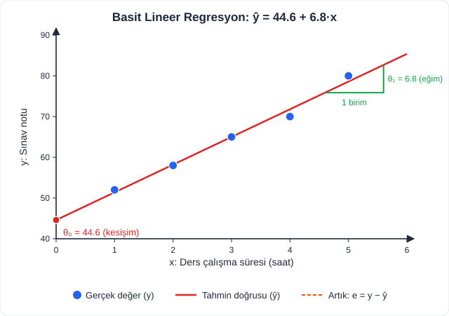</p>

### 6.4 Gradyan İnişi (Gradient Descent) 🟢

Kapalı form çözüm her zaman mümkün veya pratik değildir (çok büyük veri, milyonlarca öznitelik, doğrusal olmayan modeller). Bu durumda **gradyan inişi** kullanılır: Parametrelere rastgele bir başlangıç değeri verilir, sonra maliyet fonksiyonunun **eğimine (türevine)** bakılarak maliyeti azaltan yönde küçük adımlar atılır.

> 💡 Sisli bir dağda gözleriniz bağlı, vadiye inmeye çalışıyorsunuz. Ayağınızla zeminin eğimini hissedip **aşağı eğimli** yöne küçük bir adım atarsınız ve bunu tekrarlarsınız. Gradyan inişi tam olarak budur.

**Güncelleme kuralı** (her iki parametre **aynı anda** güncellenir):

$$
\theta_j := \theta_j - \alpha \frac{\partial J}{\partial \theta_j}
$$

Lineer regresyon için türevler:

$$
\frac{\partial J}{\partial \theta_0} = \frac{1}{m}\sum_{i=1}^{m}(\hat{y}_i - y_i), \qquad \frac{\partial J}{\partial \theta_1} = \frac{1}{m}\sum_{i=1}^{m}(\hat{y}_i - y_i)\,x_i
$$

| Sembol | Okunuşu | Anlamı |
| :---: | :--- | :--- |
| $:=$ | "atanır" | Sol taraftaki değişkene sağdaki yeni değeri ata (programlamadaki `=`) |
| $\alpha$ (veya $\eta$) | "alfa" ("eta") | **Öğrenme oranı (learning rate):** her adımın büyüklüğü |
| $\frac{\partial J}{\partial \theta_j}$ | "ce'nin teta j'ye göre kısmi türevi" | $\theta_j$ biraz artınca maliyetin ne kadar değiştiği = **eğim**. Tüm kısmi türevlerin oluşturduğu vektöre **gradyan** ($\nabla J$, "nabla ce") denir |
| Eksi işareti | — | Eğimin **tersi** yönünde, yani yokuş aşağı gidilir |

<p align="center">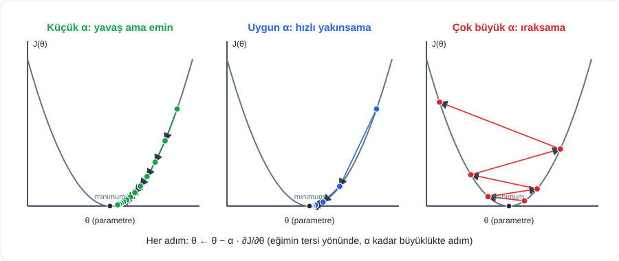</p>

Örneğimizde $\theta_0 = \theta_1 = 0$ başlangıcı ve $\alpha = 0.05$ ile 5000 adım sonunda $\theta_0 = 44.600$, $\theta_1 = 6.800$ bulunur, yani kapalı form ile **aynı sonuç**. Öğrenme oranının etkisi (100 adım sonra maliyet):

| $\alpha$ | 0.001 | 0.01 | 0.05 | 0.15 | 0.2 |
| :--- | :---: | :---: | :---: | :---: | :---: |
| $J$ | 325.5 | 102.7 | 26.8 | 1.40 | $2.6\times10^{30}$ (**ıraksadı!**) |

> 🎬 **Animasyon:** Öğrenme oranını kendiniz değiştirip doğrunun ve maliyetin adım adım nasıl değiştiğini izleyin → [Gradyan İnişi Animasyonu](https://erkanozhan.github.io/machinelearning/animation/gradyan_inisi_animasyonu.html)
>
> ➡️ Kod: kapalı form, sıfırdan gradyan inişi ve scikit-learn karşılaştırması: [`codes/python/02_lineer_regresyon.py`](https://github.com/erkanozhan/machinelearning/blob/main/codes/python/02_lineer_regresyon.py)

### 6.5 Çoklu Lineer Regresyon 🟢

Ev fiyatını sadece metrekare değil; oda sayısı, bina yaşı, semt gibi birçok faktör etkiler:

$$
\hat{y} = \theta_0 + \theta_1 x_1 + \theta_2 x_2 + \cdots + \theta_d x_d = \theta_0 + \sum_{j=1}^{d}\theta_j x_j
$$

| Sembol | Okunuşu | Anlamı |
| :---: | :--- | :--- |
| $x_j$ | "iks j" | $j$. öznitelik (ör. $x_1$: metrekare, $x_2$: oda sayısı) |
| $\theta_j$ | "teta j" | $x_j$'nin katsayısı: **diğer öznitelikler sabitken** $x_j$ bir birim artınca $\hat{y}$'deki değişim |
| $d$ | "de" | Öznitelik sayısı |

Tek öznitelikte model bir **doğru**, iki öznitelikte bir **düzlem**, daha fazlasında ise bir **hiperdüzlemdir**. Model "lineer" olarak adlandırılır çünkü **parametrelere göre** doğrusaldır: her öznitelik bir katsayıyla çarpılıp toplanır.

<details>
<summary>🎓 <b>Derinleşme: Matris gösterimi ve normal denklem</b></summary>

Her örneğe sabit terim için $x_0 = 1$ eklenirse model vektörlerle yazılır: $\hat{y} = \boldsymbol{\theta}^{T}\mathbf{x}$. Tüm veri için $\hat{\mathbf{y}} = X\boldsymbol{\theta}$ olur. Maliyeti sıfıra eşitleyerek bulunan kapalı form çözüme **normal denklem** denir:

$$
\boldsymbol{\theta} = \left(X^{T}X\right)^{-1}X^{T}\mathbf{y}
$$

| Sembol | Okunuşu | Anlamı |
| :---: | :--- | :--- |
| $\boldsymbol{\theta}$ | "teta vektörü" | Tüm parametreler $[\theta_0, \theta_1, \dots, \theta_d]^T$ |
| $X^{T}$ | "iks transpoz" | $X$ matrisinin satır ve sütunlarının yer değiştirmiş hâli |
| $(\cdot)^{-1}$ | "ters" | Matris tersi |

Normal denklem $d$ küçükken çok hızlıdır. $d$ büyüdükçe $(X^TX)^{-1}$ hesabı pahalanır ($\approx d^3$ işlem) ve öznitelikler birbirine çok bağımlıysa (**çoklu doğrusallık, multicollinearity**) sayısal olarak kararsızlaşır. Bu durumlarda gradyan inişi veya düzenlileştirme (Ridge) tercih edilir ([Bölüm 21](#b21)).

</details>

### 6.6 Doğrusal Olmayan İlişkiler: Öznitelik Dönüşümü 🟢

Lineer modeller şaşırtıcı derecede esnektir. İlişki eğrisel olsa bile yeni öznitelikler türetip modeli **parametrelere göre doğrusal** tutabiliriz:

$$
\hat{y} = \theta_0 + \theta_1 x + \theta_2 x^2 \quad\xrightarrow{\;x_2 \,:=\, x^2\;}\quad \hat{y} = \theta_0 + \theta_1 x_1 + \theta_2 x_2
$$

Benzer şekilde $\log(x)$, $\sqrt{x}$, $x_1 \cdot x_2$ (etkileşim) gibi dönüşümler veri setine yeni sütunlar olarak eklenebilir. Buna **polinom regresyon** veya **temel fonksiyon genişletmesi** denir. Ancak derece arttıkça model veriyi ezberleyebilir ([Bölüm 13.1](#b13)).

### 6.7 Varsayımlar, Avantajlar ve Sınırlılıklar 🟢

**Avantajlar:** Teorisi çok iyi bilinir; hızlıdır; katsayılar doğrudan yorumlanabilir ("hangi faktör sonucu ne kadar etkiliyor?"); yüz binlerce öznitelikle bile kolayca eğitilir; çoğu problemde güçlü bir **başlangıç modeli (baseline)** sunar.

**Sınırlılıklar ve varsayımlar** 🎓:
1. **Doğrusallık:** Girdi ile çıktı arasındaki ilişki (dönüşümlerden sonra) doğrusal olmalı.
2. **Hataların bağımsızlığı:** Bir örneğin hatası diğerini etkilememeli (zaman serilerinde bu sıkça ihlal edilir).
3. **Sabit varyans (homoskedastisite):** Hataların yayılımı tüm $x$ değerlerinde benzer olmalı.
4. **Hataların normalliği:** Özellikle güven aralıkları ve hipotez testleri için gereklidir.
5. **Çoklu doğrusallık olmamalı:** Öznitelikler birbirine çok bağımlıysa katsayılar kararsızlaşır ve yorumlanamaz hâle gelir.
6. **Aykırı değerlere duyarlılık:** Hatanın karesi alındığı için tek bir aşırı değer doğruyu kendine doğru çekebilir.

> 🧪 **WEKA:** Classify → `functions → LinearRegression`. Hedef sayısal olduğunda WEKA otomatik olarak regresyon yapar. `cpu.arff` üzerindeki uygulama ve çıktının yorumu [Bölüm 14.3](#b14)'tedir.

---

<a id="b7"></a>

## 7. Lojistik Regresyon

### 7.1 Neden Doğrusal Regresyon Sınıflandırma İçin Uygun Değil? 🟢

"Öğrenci geçer mi (1) kalır mı (0)?" gibi bir soruda lineer regresyon 1.4 veya −0.3 gibi, olasılık olarak yorumlanamayacak değerler üretir. Bize **0 ile 1 arasında** kalan, "geçme olasılığı" gibi okunabilecek bir çıktı gerekir.

### 7.2 Sigmoid Fonksiyonu 🟢

**Lojistik regresyon**, adında "regresyon" geçse de bir **sınıflandırma** algoritmasıdır. Lineer bir kombinasyonu **sigmoid (lojistik) fonksiyonundan** geçirir:

$$
z = \theta_0 + \theta_1 x_1 + \cdots + \theta_d x_d, \qquad \hat{p} = P(y=1 \mid \mathbf{x}) = \sigma(z) = \frac{1}{1+e^{-z}}
$$

| Sembol | Okunuşu | Anlamı |
| :---: | :--- | :--- |
| $z$ | "zet" | Doğrusal skor (logit) |
| $\sigma(z)$ | "sigma zet" | Sigmoid fonksiyonu; her gerçek sayıyı $(0, 1)$ aralığına taşır |
| $e$ | "e" | Euler sayısı ($\approx 2.718$), doğal logaritmanın tabanı |
| $P(y=1 \mid \mathbf{x})$ | "iks verildiğinde ye'nin bir olma olasılığı" | **Koşullu olasılık**: bu özniteliklere sahip bir örneğin pozitif sınıfta olma olasılığı |
| $\hat{p}$ | "pe şapka" | Tahmin edilen olasılık |

<p align="center">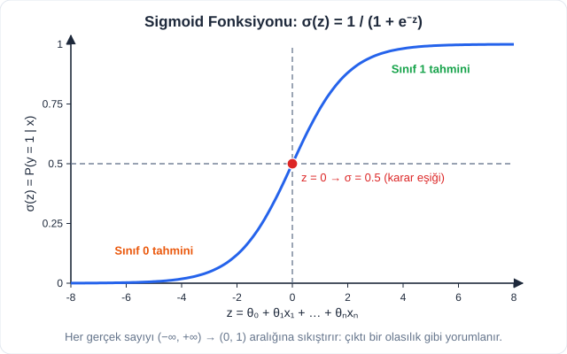</p>

**Karar kuralı:** $\hat{p} \ge 0.5$ ise sınıf 1, değilse sınıf 0. $\sigma(z) = 0.5 \iff z = 0$ olduğundan, **karar sınırı** $\theta_0 + \theta_1x_1 + \dots = 0$ denklemiyle tanımlanan bir **doğru/düzlemdir**. Yani lojistik regresyon **doğrusal bir sınıflandırıcıdır**.

**Örnek:** Bir modelin "sınavı geçme" için öğrendiği parametreler $\theta_0 = -4$, $\theta_1 = 1.5$ olsun ($x$: çalışma saati).
- 2 saat çalışan öğrenci: $z = -4 + 1.5\cdot 2 = -1$ → $\sigma(-1) = \frac{1}{1+e^{1}} \approx 0.27$ → **kalır** (%27 geçme olasılığı)
- 3 saat: $z = 0.5$ → $\sigma(0.5) \approx 0.62$ → **geçer**
- Karar sınırı: $z = 0 \Rightarrow x = 4/1.5 \approx 2.67$ saat.

> 💡 **Eşik 0.5 olmak zorunda değildir.** Hasta birini kaçırmak çok pahalıysa eşik 0.2'ye düşürülebilir ([Bölüm 20](#b20)).

### 7.3 Log-Loss (Çapraz Entropi) Maliyet Fonksiyonu 🎓

Lojistik regresyonda karesel hata yerine **log-loss** (ikili çapraz entropi) kullanılır:

$$
J(\boldsymbol{\theta}) = -\frac{1}{m}\sum_{i=1}^{m}\Big[\,y_i \log(\hat{p}_i) + (1-y_i)\log(1-\hat{p}_i)\Big]
$$

| Sembol | Okunuşu | Anlamı |
| :---: | :--- | :--- |
| $y_i \in \lbrace 0,1 \rbrace$ | "ye i" | Gerçek sınıf |
| $\hat{p}_i$ | "pe şapka i" | Modelin $i$. örnek için verdiği pozitif sınıf olasılığı |
| $\log$ | "logaritma" | Doğal logaritma |

**Sezgi:** Gerçek sınıf 1 iken model $\hat{p} = 0.99$ derse ceza $-\log(0.99) \approx 0.01$ (çok az); $\hat{p} = 0.01$ derse ceza $-\log(0.01) \approx 4.6$ (çok büyük). Yani model **kendinden emin ve yanlış** olduğunda ağır cezalandırılır. Bu fonksiyonun kapalı form çözümü yoktur; **gradyan inişi** (veya türevleri) ile çözülür.

**Çok sınıflı durum:** Sınıf sayısı ikiden fazlaysa ya her sınıf için ayrı bir "bu sınıf / diğerleri" modeli kurulur (**one-vs-rest**) ya da sigmoidin genellemesi olan **softmax** kullanılır.

🧪 **WEKA:** `functions → Logistic` · **Python:** `sklearn.linear_model.LogisticRegression`. Iris verisinde 10 katlı çapraz doğrulamayla doğruluk ≈ **0.953**. Model her çiçek için olasılık da verir (ör. setosa = 0.985, versicolor = 0.015, virginica = 0.000). ➡️ [`codes/python/03_siniflandirma_algoritmalari.py`](https://github.com/erkanozhan/machinelearning/blob/main/codes/python/03_siniflandirma_algoritmalari.py)

---

<a id="b8"></a>

## 8. k-En Yakın Komşu (k-Nearest Neighbors, k-NN)

### 8.1 Temel Fikir 🟢

"Bana arkadaşını söyle, sana kim olduğunu söyleyeyim." k-NN, yeni bir örneği sınıflandırmak için eğitim verisindeki **en yakın k komşusuna** bakar ve **çoğunluk oyuna** göre karar verir.

**Algoritma:**
1. Yeni örnek ile **tüm** eğitim örnekleri arasındaki mesafeyi hesapla (genellikle Öklid, [Bölüm 5.9](#b5)).
2. En yakın $k$ örneği seç.
3. **Sınıflandırma:** Bu $k$ komşu arasında en sık görülen sınıfı ata. **Regresyon:** Komşuların hedef değerlerinin ortalamasını al.

<p align="center">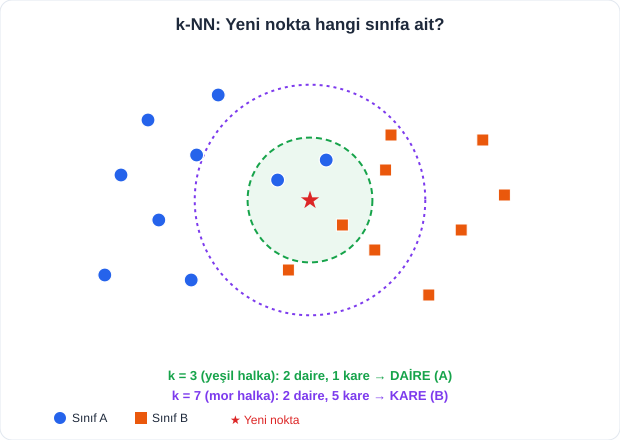</p>

Şekilde aynı nokta, $k = 3$ için **daire (A)**, $k = 7$ için **kare (B)** sınıfına atanıyor. Yani **$k$ seçimi sonucu doğrudan değiştirir.**

### 8.2 k Değerinin Seçimi 🟢

| Küçük $k$ (ör. 1) | Büyük $k$ (ör. 101) |
| :--- | :--- |
| Gürültüye ve aykırı değerlere çok duyarlı | Sınırlar aşırı düzleşir, küçük sınıflar ezilir |
| **Aşırı öğrenme** (yüksek varyans) | **Eksik öğrenme** (yüksek yanlılık) |

Iris verisinde (standartlaştırılmış, 10 katlı çapraz doğrulama) ölçülen doğruluklar:

| $k$ | 1 | 3 | 5 | 15 | 51 | 101 |
| :--- | :---: | :---: | :---: | :---: | :---: | :---: |
| Doğruluk | 0.940 | 0.947 | **0.960** | **0.960** | 0.860 | 0.660 |

> 💡 İki sınıflı problemlerde beraberliği önlemek için $k$ **tek sayı** seçilir. En iyi $k$ çapraz doğrulama ile bulunur ([Bölüm 21](#b21)). Yakın komşulara daha çok ağırlık vermek (örneğin $1/d$ ile) de sık kullanılan bir iyileştirmedir.

### 8.3 Özellikler 🟢

- **Tembel öğrenici (lazy learner):** Eğitim aşamasında hiçbir şey öğrenmez, sadece veriyi saklar. Tüm iş tahmin anında yapılır. Bu yüzden eğitimi anlıktır ama büyük veride **tahmin yavaştır**.
- **Ölçekleme şarttır** ([Bölüm 5.8](#b5)): Aksi hâlde büyük değerli öznitelik mesafeyi tek başına belirler.
- 🎓 **Boyut laneti (curse of dimensionality):** Öznitelik sayısı çok arttığında tüm noktalar birbirine neredeyse eşit uzaklıkta hâle gelir ve "en yakın komşu" kavramı anlamını yitirir. Bu nedenle k-NN'den önce öznitelik seçimi veya boyut azaltma faydalıdır ([Bölüm 19](#b19)).

🧪 **WEKA:** `lazy → IBk` (`KNN` parametresi = $k$; `distanceWeighting` ile ağırlıklandırma; `crossValidate=True` ile en iyi $k$'yı otomatik arar). **Python:** `KNeighborsClassifier(n_neighbors=5)`.

---

<a id="b9"></a>

## 9. Naive Bayes

### 9.1 Bayes Teoremi 🟢

Naive Bayes, olasılık teorisine dayanan, hızlı ve şaşırtıcı derecede etkili bir sınıflandırıcıdır. Temeli **Bayes teoremidir**:

$$
P(C \mid \mathbf{x}) = \frac{P(\mathbf{x} \mid C)\; P(C)}{P(\mathbf{x})}
$$

| Sembol | Okunuşu | Anlamı |
| :---: | :--- | :--- |
| $C$ | "ce" | Bir sınıf (ör. "oynanır = yes") |
| $\mathbf{x}$ | "iks vektörü" | Örneğin öznitelikleri (ör. güneşli, serin, nemli, rüzgârlı) |
| $P(C \mid \mathbf{x})$ | "iks verildiğinde ce'nin olasılığı" | **Sonsal (posterior) olasılık:** Bu gözlemler varken sınıfın olasılığı. **Aradığımız şey budur.** |
| $P(\mathbf{x} \mid C)$ | "ce verildiğinde iks'in olasılığı" | **Olabilirlik (likelihood):** Bu sınıfta bu gözlemleri görme olasılığı |
| $P(C)$ | "ce'nin olasılığı" | **Önsel (prior) olasılık:** Veri görmeden önce sınıfın genel sıklığı |
| $P(\mathbf{x})$ | "iks'in olasılığı" | **Kanıt (evidence):** Tüm sınıflar için aynı olduğundan karşılaştırmada ihmal edilebilir |

### 9.2 "Naive" (Saf) Varsayım 🟢

$P(\mathbf{x} \mid C)$'yi doğrudan tahmin etmek için her öznitelik kombinasyonundan bol örnek gerekir; bu pratikte imkânsızdır. Naive Bayes, **sınıf bilindiğinde özniteliklerin birbirinden bağımsız olduğunu** varsayar. Böylece olasılık, tek tek özniteliklerin olasılıklarının **çarpımına** dönüşür:

$$
P(C \mid x_1,\dots,x_d) \;\propto\; P(C)\prod_{j=1}^{d} P(x_j \mid C)
$$

| Sembol | Okunuşu | Anlamı |
| :---: | :--- | :--- |
| $\propto$ | "orantılıdır" | Sabit bir çarpan ($1/P(\mathbf{x})$) dışında eşittir |
| $\prod_{j=1}^{d}$ | "pi, j birden d'ye" | $j=1$'den $d$'ye kadar tüm terimleri **çarp** |

Bu varsayım gerçekte nadiren doğrudur (hava sıcaklığı ile nem bağımsız değildir). Buna rağmen model sınıflar arasında **doğru sıralamayı** çoğu zaman bulduğu için pratikte iyi çalışır. Özellikle **metin sınıflandırmada** (spam filtresi) çok başarılıdır.

### 9.3 Elle Çözülmüş Örnek: Tenis Oynanır mı? 🟢

WEKA ile gelen `weather.nominal.arff` verisi (14 gün; 9 "yes", 5 "no"). Yeni gün: **outlook = sunny, temperature = cool, humidity = high, windy = true.**

Eğitim verisinden sayılan olasılıklar:

| | $P(\cdot \mid yes)$ | $P(\cdot \mid no)$ |
| :--- | :---: | :---: |
| Önsel $P(C)$ | 9/14 | 5/14 |
| outlook = sunny | 2/9 | 3/5 |
| temperature = cool | 3/9 | 1/5 |
| humidity = high | 3/9 | 4/5 |
| windy = true | 3/9 | 3/5 |

$$
\text{yes: } \tfrac{9}{14}\cdot\tfrac{2}{9}\cdot\tfrac{3}{9}\cdot\tfrac{3}{9}\cdot\tfrac{3}{9} \approx 0.0053 \qquad \text{no: } \tfrac{5}{14}\cdot\tfrac{3}{5}\cdot\tfrac{1}{5}\cdot\tfrac{4}{5}\cdot\tfrac{3}{5} \approx 0.0206
$$

Normalize edersek: $P(no \mid \mathbf{x}) = \frac{0.0206}{0.0053+0.0206} \approx 0.795$. **Tahmin: oynanmaz (no), %79.5 olasılıkla.**

➡️ Aynı hesabı hiçbir kütüphane kullanmadan yapan kod: [`codes/python/04_entropi_ve_naive_bayes_elle.py`](https://github.com/erkanozhan/machinelearning/blob/main/codes/python/04_entropi_ve_naive_bayes_elle.py)

### 9.4 Sıfır Frekans Sorunu ve Sayısal Öznitelikler 🎓

- **Sıfır frekans:** Eğitim verisinde "outlook = overcast" hiç "no" ile görülmemiştir; $P(overcast \mid no) = 0/5 = 0$. Çarpımda tek bir sıfır tüm sonucu sıfırlar. Çözüm **Laplace düzeltmesidir**: her sayıma 1 eklenir, $P(x_j = v \mid C) = \frac{\text{sayım} + 1}{n_C + k}$ ($k$: özniteliğin farklı değer sayısı). WEKA bunu otomatik yapar.
- **Sayısal öznitelikler:** Her sınıfta özniteliğin **normal (Gauss) dağıldığı** varsayılır ve olasılık yoğunluğu $\frac{1}{\sqrt{2\pi}\sigma}e^{-\frac{(x-\mu)^2}{2\sigma^2}}$ ile hesaplanır (Gaussian Naive Bayes). WEKA'da alternatif olarak `useKernelEstimator` veya `useSupervisedDiscretization` seçilebilir.
- Çok sayıda küçük olasılığın çarpımı bilgisayarda sıfıra yuvarlanabilir (**underflow**); bu yüzden uygulamalarda çarpım yerine **logaritmaların toplamı** kullanılır.

🧪 **WEKA:** `bayes → NaiveBayes`. `NaiveBayesUpdateable` sürümü veriyi satır satır öğrenebilir ([Bölüm 23](#b23)). **Python:** `GaussianNB` (sayısal), `MultinomialNB` (kelime sayıları), `CategoricalNB` (kategorik). Iris'te 10 katlı CV doğruluğu ≈ **0.953**.

---

<a id="b10"></a>

## 10. Karar Ağaçları

### 10.1 Temel Fikir 🟢

Karar ağacı, veriyi bir dizi **evet/hayır sorusuyla** parçalara ayıran, insanın düşünme biçimine çok yakın bir modeldir. Bir doktorun "Ateşi 38'in üstünde mi? → Evet → Öksürüğü var mı? → …" şeklinde ilerlemesi gibi.

<p align="center">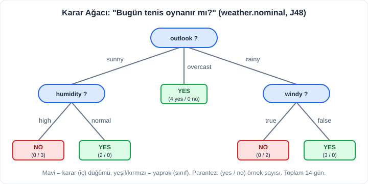</p>

- **Kök düğüm (root):** İlk soru (outlook).
- **İç düğüm:** Ara sorular (humidity, windy).
- **Dal (branch):** Bir sorunun olası cevabı (sunny, overcast, rainy).
- **Yaprak (leaf):** Sonuç / sınıf (yes, no).

Ağaç kökten yaprağa her yol bir **EĞER–İSE kuralıdır**: *"EĞER outlook = sunny VE humidity = high İSE play = no."* Bu yüzden karar ağaçları **açıklanabilir** modellerin başında gelir.

### 10.2 Hangi Soruyu Önce Sormalı? Entropi ve Bilgi Kazancı 🟢

Ağaç kurulurken her adımda, veriyi **en saf (homojen)** alt gruplara ayıran öznitelik seçilir. Saflığı ölçmek için **entropi** kullanılır:

$$
H(S) = -\sum_{i=1}^{c} p_i \log_2 p_i
$$

| Sembol | Okunuşu | Anlamı |
| :---: | :--- | :--- |
| $H(S)$ | "ha es" | $S$ kümesinin entropisi (belirsizliği), birimi **bit** |
| $c$ | "ce" | Sınıf sayısı |
| $p_i$ | "pe i" | $S$ içindeki örneklerin $i$. sınıfa ait olma oranı |
| $\log_2$ | "iki tabanında logaritma" | |

- Tüm örnekler aynı sınıftaysa $H = 0$ (**saf**, hiç belirsizlik yok).
- İki sınıf yarı yarıyaysa $H = 1$ (**en belirsiz**).

**Bilgi Kazancı (Information Gain):** Bir $A$ özniteliğine göre bölmenin belirsizliği ne kadar azalttığı:

$$
IG(S, A) = H(S) - \sum_{v \,\in\, \text{Değerler}(A)} \frac{\lvert S_v \rvert}{\lvert S \rvert}\, H(S_v)
$$

| Sembol | Okunuşu | Anlamı |
| :---: | :--- | :--- |
| $IG(S,A)$ | "ay ci es a" | $A$ ile bölünce kazanılan bilgi |
| $S_v$ | "es ve" | $S$'nin, $A$ özniteliği $v$ değerini alan alt kümesi |
| $\lvert S_v \rvert / \lvert S \rvert$ | — | Alt kümenin ağırlığı (oranı) |

**Elle örnek (weather.nominal):** Kök: 9 yes, 5 no.

$H(S) = -\frac{9}{14}\log_2\frac{9}{14} - \frac{5}{14}\log_2\frac{5}{14} = 0.940$ bit

*outlook* ile bölersek: sunny (2 yes, 3 no) → $H = 0.971$; overcast (4 yes, 0 no) → $H = 0$; rainy (3 yes, 2 no) → $H = 0.971$

$IG = 0.940 - \left(\frac{5}{14}\cdot 0.971 + \frac{4}{14}\cdot 0 + \frac{5}{14}\cdot 0.971\right) = 0.940 - 0.694 = 0.247$

| Öznitelik | Bilgi Kazancı | Kazanç Oranı |
| :--- | :---: | :---: |
| **outlook** | **0.247** | **0.156** |
| humidity | 0.152 | 0.152 |
| windy | 0.048 | 0.049 |
| temperature | 0.029 | 0.019 |

En yüksek kazanç **outlook**'ta olduğundan **kök** olarak seçilir. İşlem her alt dal için tekrarlanır ve düğümler saf olunca (veya durma kriteri sağlanınca) durulur.

<p align="center">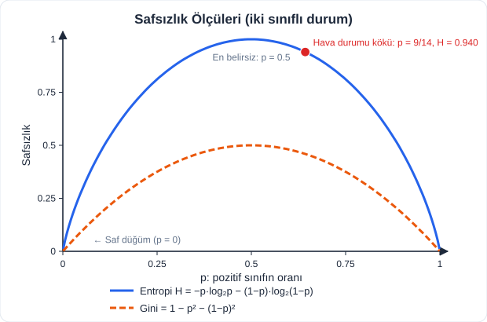</p>

<details>
<summary>🎓 <b>Derinleşme: Kazanç oranı, Gini ve sayısal öznitelikler</b></summary>

- **Kazanç Oranı (Gain Ratio):** Bilgi kazancı, çok sayıda farklı değeri olan özniteliklere (ör. müşteri numarası) haksız avantaj sağlar; her müşteri ayrı bir dal olur ve entropi sıfırlanır ama model hiçbir şey öğrenmemiştir. C4.5 algoritması (WEKA'da **J48**) bu yüzden kazancı bölmenin kendi entropisine böler:
  $GainRatio(S,A) = \frac{IG(S,A)}{SplitInfo(S,A)}$, $SplitInfo(S,A) = -\sum_v \frac{\lvert S_v\rvert}{\lvert S\rvert}\log_2\frac{\lvert S_v\rvert}{\lvert S\rvert}$
- **Gini Safsızlığı:** CART algoritması ve scikit-learn'ün varsayılanı: $Gini(S) = 1 - \sum_i p_i^2$. Entropiye çok benzer davranır, logaritma içermediği için biraz daha hızlıdır.
- **Sayısal öznitelikler:** Değerler sıralanır ve ardışık değerlerin ortasındaki eşikler denenir ("petal length ≤ 2.45?"). En yüksek kazancı veren eşik seçilir.
- **Algoritma ailesi:** ID3 (bilgi kazancı, yalnızca kategorik), C4.5/J48 (kazanç oranı, sayısal + eksik veri + budama), CART (Gini, ikili bölmeler, regresyon ağaçları da kurar).

</details>

### 10.3 Aşırı Öğrenme ve Budama (Pruning) 🟢

Sınırsız büyüyen bir ağaç, her eğitim örneği için ayrı bir yaprak oluşturup veriyi **ezberleyebilir** (eğitim doğruluğu %100, test doğruluğu düşük). Bunu önlemek için:
- **Ön budama (pre-pruning):** Ağacı erken durdur. Örneğin maksimum derinlik (`max_depth`), bir yapraktaki minimum örnek sayısı (WEKA: `minNumObj`, varsayılan 2).
- **Sonradan budama (post-pruning):** Ağacı tam büyüt, sonra genellemeye katkısı olmayan dalları kes. WEKA J48'de `confidenceFactor` (varsayılan 0.25; küçüldükçe budama artar), `unpruned=True` budamayı kapatır.

**Iris üzerinde öğrenilmiş ağaç** (scikit-learn, `max_depth=3`):

```text
|--- petal length (cm) <= 2.45            ← Tek soruyla tüm setosa'lar ayrıldı
|   |--- class: setosa
|--- petal length (cm) >  2.45
|   |--- petal width (cm) <= 1.75
|   |   |--- petal length (cm) <= 4.95
|   |   |   |--- class: versicolor
|   |   |--- petal length (cm) >  4.95
|   |   |   |--- class: virginica
|   |--- petal width (cm) >  1.75
|   |   |--- class: virginica
```

Öznitelik önemleri: petal length 0.69, petal width 0.31, sepal ölçüleri **0**. Ağaç, sepal ölçülerini hiç kullanmadı. Bu durum [Bölüm 19](#b19)'daki öznitelik seçimi sonuçlarıyla da tutarlıdır.

### 10.4 Avantajlar ve Dezavantajlar 🟢

| Avantajlar | Dezavantajlar |
| :--- | :--- |
| Yorumlanabilir (kurallar okunabilir) | Tek ağaç **kararsızdır**: veride küçük bir değişiklik bambaşka bir ağaç üretebilir (yüksek varyans) |
| Ölçekleme gerektirmez | Budanmazsa kolayca aşırı öğrenir |
| Sayısal ve kategorik veriyi birlikte işler | Eksenlere paralel (merdiven biçimli) sınırlar çizer; çapraz sınırları zor öğrenir |
| Öznitelik önemini doğrudan verir | Tek ağacın doğruluğu genellikle toplulukların gerisinde kalır |

Tek ağacın kararsızlığı, **Random Forest** ve **Gradient Boosting** gibi güçlü topluluk yöntemlerinin çıkış noktasıdır ([Bölüm 16](#b16)).

🧪 **WEKA:** `trees → J48`. Sonucu görsel olarak görmek için Result list'te sağ tık → **Visualize tree**. **Python:** `DecisionTreeClassifier(criterion="entropy")`, kuralları yazdırmak için `export_text`.

---

<a id="b11"></a>

## 11. Destek Vektör Makineleri (Support Vector Machines – SVM)

### 11.1 Temel Fikir: En Geniş Yolu Bulmak 🟢

İki sınıfı ayıran bir çizgi çekmek istiyoruz. Veri doğrusal olarak ayrılabiliyorsa, bu işi yapan **sonsuz sayıda** çizgi vardır. Hangisi en iyisidir?

SVM'nin cevabı: **İki sınıfa da en uzak olan**, yani aradaki "güvenlik şeridini" (**marjı**) en geniş tutan çizgi. İki köy arasına yol yaptığımızı düşünelim: En güvenli yol, iki köyün de en yakın evlerine eşit ve olabildiğince uzak geçen yoldur. Böyle bir yol, gelecekte köylerin sınırlarında olacak küçük değişikliklerden en az etkilenir. Bu da **daha iyi genelleme** anlamına gelir.

<p align="center">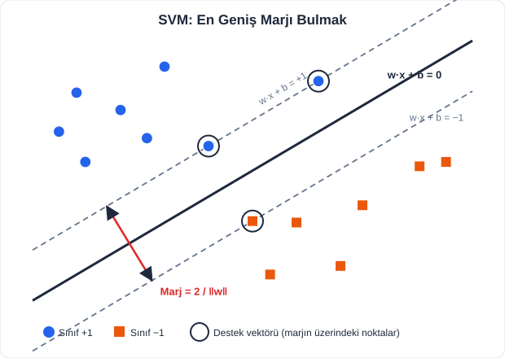</p>

- **Hiperdüzlem (hyperplane):** Ayırıcı sınır. 2 boyutta doğru, 3 boyutta düzlem, daha yüksek boyutta hiperdüzlem.
- **Destek vektörleri (support vectors):** Marjın kenarında duran, sınıra en yakın örnekler. Sınırı **yalnızca bunlar** belirler; diğer noktalar silinse bile hiperdüzlem değişmez. Algoritmanın adı buradan gelir.
- **Marj (margin):** İki sınıfın en yakın noktaları arasındaki şeridin genişliği.

### 11.2 Matematiksel Formülasyon 🎓

Hiperdüzlem $\mathbf{w}\cdot\mathbf{x} + b = 0$ ile tanımlanır. Sınıf etiketleri $y_i \in \lbrace -1, +1 \rbrace$ olsun. Marj sınırları $\mathbf{w}\cdot\mathbf{x}+b = \pm 1$ doğrularıdır ve aralarındaki uzaklık $\frac{2}{\lVert\mathbf{w}\rVert}$'dir. Marjı en büyük yapmak, $\lVert\mathbf{w}\rVert$'yi en küçük yapmakla aynı şeydir:

$$
\min_{\mathbf{w},\,b}\; \frac{1}{2}\lVert\mathbf{w}\rVert^2 \quad \text{koşul:}\quad y_i\,(\mathbf{w}\cdot\mathbf{x}_i + b) \ge 1 \quad (i = 1,\dots,n)
$$

| Sembol | Okunuşu | Anlamı |
| :---: | :--- | :--- |
| $\mathbf{w}$ | "dabılyu vektörü" | Ağırlık vektörü; hiperdüzleme **dik** yön |
| $b$ | "be" | Sapma (bias); hiperdüzlemin orijinden kayması |
| $\mathbf{w}\cdot\mathbf{x}$ | "dabılyu nokta iks" | İç çarpım: $\sum_j w_j x_j$ |
| $\lVert\mathbf{w}\rVert$ | "dabılyu'nun normu" | Vektörün uzunluğu: $\sqrt{\sum_j w_j^2}$ |
| $y_i(\mathbf{w}\cdot\mathbf{x}_i+b) \ge 1$ | — | Her örnek kendi tarafında ve marjın dışında kalmalı |

### 11.3 Yumuşak Marj ve C Parametresi 🟢

Gerçek veride sınıflar genellikle iç içe geçer; hiçbir doğru onları kusursuz ayıramaz. **Yumuşak marj (soft margin)** yaklaşımında bazı örneklerin marjın içine düşmesine veya yanlış tarafta kalmasına izin verilir, ama her ihlal cezalandırılır:

$$
\min_{\mathbf{w},\,b,\,\xi}\; \frac{1}{2}\lVert\mathbf{w}\rVert^2 + C\sum_{i=1}^{n}\xi_i
$$

| Sembol | Okunuşu | Anlamı |
| :---: | :--- | :--- |
| $\xi_i$ | "ksi i" | $i$. örneğin marjı ne kadar ihlal ettiği (gevşek değişken, slack) |
| $C$ | "ce" | **Ceza katsayısı:** geniş marj ile az hata arasındaki denge |

| Küçük $C$ (ör. 0.01) | Büyük $C$ (ör. 100) |
| :--- | :--- |
| Hatalara toleranslı, **geniş marj** | Hatalara toleranssız, **dar marj** |
| Daha çok destek vektörü | Eğitim verisine sıkı uyum |
| Eksik öğrenme riski | **Aşırı öğrenme** riski |

İç içe geçmiş iki sınıflı bir veride ölçülen değerler: $C = 0.01$ → 72 destek vektörü, marj 4.22; $C = 1$ → 45 destek vektörü, marj 2.53. ([`codes/python/09_svm.py`](https://github.com/erkanozhan/machinelearning/blob/main/codes/python/09_svm.py))

### 11.4 Çekirdek Hilesi (Kernel Trick) 🟢

Veri doğrusal olarak hiç ayrılamıyorsa ne olur? SVM'nin buradaki çözümü zekicedir: Veriyi, doğrusal olarak **ayrılabileceği daha yüksek boyutlu bir uzaya** taşımak.

<p align="center">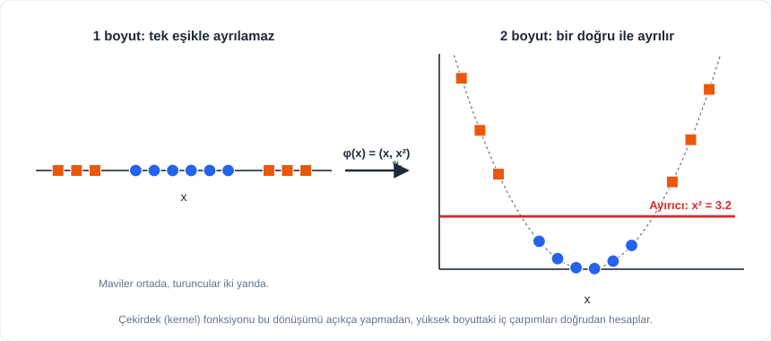</p>

Şekilde tek boyutta mavi noktalar ortada, turuncular iki yandadır; tek bir eşikle ayrılamazlar. Her noktaya ikinci bir koordinat olarak $x^2$ eklersek ($\varphi(x) = (x, x^2)$), iki boyutta **yatay bir doğru** onları mükemmel ayırır.

Bu dönüşümü açıkça yapmak çok pahalı olabilir (boyut sonsuza bile çıkabilir). **Çekirdek fonksiyonu**, dönüşümü hiç yapmadan yüksek boyuttaki iç çarpımı doğrudan hesaplar: $K(\mathbf{x}, \mathbf{z}) = \varphi(\mathbf{x})\cdot\varphi(\mathbf{z})$.

| Çekirdek | Formül | Kullanım |
| :--- | :--- | :--- |
| Lineer | $K(\mathbf{x},\mathbf{z}) = \mathbf{x}\cdot\mathbf{z}$ | Doğrusal ayrılabilir veri, çok yüksek boyutlu metin verisi |
| Polinom | $K(\mathbf{x},\mathbf{z}) = (\mathbf{x}\cdot\mathbf{z} + r)^{p}$ | Eğrisel sınırlar ($p$: derece) |
| RBF (Gauss) | $K(\mathbf{x},\mathbf{z}) = e^{-\gamma\lVert\mathbf{x}-\mathbf{z}\rVert^2}$ | En yaygın ve en esnek varsayılan seçim |

| Sembol | Okunuşu | Anlamı |
| :---: | :--- | :--- |
| $\varphi(\mathbf{x})$ | "fi iks" | Veriyi yüksek boyuta taşıyan (açıkça hesaplanmayan) dönüşüm |
| $\gamma$ | "gama" | RBF'de tek bir örneğin etki yarıçapının tersi. Büyük $\gamma$: dar etki, çok kıvrımlı sınır (aşırı öğrenme). Küçük $\gamma$: yumuşak sınır |
| $p$, $r$ | "pe", "ar" | Polinom derecesi ve sabit terimi |

**Deney:** İç içe iki halka biçimindeki veride 5 katlı CV doğruluğu: **lineer çekirdek 0.56** (yazı-turadan biraz iyi), **RBF çekirdek 1.00**.

> ⚠️ SVM mesafeye dayandığı için **öznitelikler mutlaka ölçeklenmelidir**. WEKA'nın SMO'su bunu varsayılan olarak yapar (`filterType = Normalize`). scikit-learn'de ise ölçeklemeyi sizin eklemeniz gerekir.

### 11.5 Uygulama 🧪

**WEKA (SMO):** WEKA'da SVM, çözümünde kullanılan *Sequential Minimal Optimization* algoritmasının adıyla **SMO** olarak geçer.
1. Explorer'da `iris.arff` dosyasını yükleyin.
2. Classify → Choose → `functions → SMO`.
3. Ayarlar (yazının üzerine tıklayın):
   - `c`: yumuşak marj ceza katsayısı $C$ (varsayılan 1.0).
   - `kernel`: varsayılan `PolyKernel` (üs = 1, yani lineer). `RBFKernel` seçip `gamma` değerini ayarlayabilirsiniz.
4. Cross-validation (10 kat) ile **Start**. Farklı `c` ve çekirdek seçeneklerini deneyip sonuçları karşılaştırın.

**Python:**

```python
from sklearn.datasets import load_iris
from sklearn.pipeline import make_pipeline                     # Ölçekleme + model zinciri
from sklearn.preprocessing import StandardScaler
from sklearn.svm import SVC                                    # Support Vector Classifier
from sklearn.model_selection import cross_val_score

X, y = load_iris(return_X_y=True)
model = make_pipeline(StandardScaler(),                        # SVM için ölçekleme şart
                      SVC(kernel="rbf", C=10, gamma=0.01))     # RBF çekirdek, C ve gamma
print(cross_val_score(model, X, y, cv=5).mean())               # ≈ 0.96 (5 katlı CV doğruluğu)
```

$C$ ve $\gamma$'nın en iyi değerleri **Grid Search** ile bulunur ([Bölüm 21](#b21)); Iris'te bulunan en iyi değerler $C = 10$, $\gamma = 0.01$'dir.

> 🎓 **Çok sınıflı SVM:** SVM doğası gereği ikili bir sınıflandırıcıdır. Çok sınıflı problemlerde her sınıf çifti için ayrı bir model (**one-vs-one**, WEKA ve sklearn `SVC`'nin yöntemi) ya da her sınıf için "bu sınıf / diğerleri" modeli (**one-vs-rest**) kurulur. **Regresyon** için SVM'in bir türevi olan SVR kullanılır (WEKA: `SMOreg`).

---

<a id="b12"></a>

## 12. Yapay Sinir Ağlarına Giriş

### 12.1 Yapay Nöron 🟢

Beyindeki nöronlardan esinlenen **yapay nöron (algılayıcı, perceptron)** girdileri ağırlıklarla çarpıp toplar, sonucu bir **aktivasyon fonksiyonundan** geçirir:

$$
z = \sum_{j=1}^{d} w_j x_j + b, \qquad \hat{y} = f(z)
$$

| Sembol | Okunuşu | Anlamı |
| :---: | :--- | :--- |
| $w_j$ | "dabılyu j" | $j$. girdinin ağırlığı (öğrenilen parametre) |
| $b$ | "be" | Sapma (bias) |
| $f$ | "ef" | Aktivasyon fonksiyonu |

<p align="center">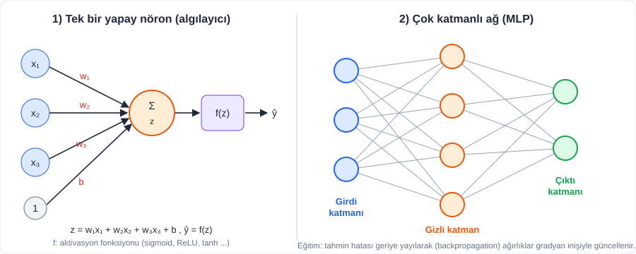</p>

> 💡 Aktivasyon fonksiyonu **sigmoid** seçilirse tek bir nöron tam olarak **lojistik regresyondur** ([Bölüm 7](#b7)).

**Yaygın aktivasyon fonksiyonları:** Sigmoid $\frac{1}{1+e^{-z}}$ (0–1 arası), tanh (−1 ile 1 arası), **ReLU** $\max(0, z)$ (derin ağlarda en yaygın olanı).

### 12.2 Çok Katmanlı Algılayıcı (MLP) 🟢

Tek bir nöron yalnızca doğrusal sınırlar çizebilir (ünlü XOR problemini çözemez). Nöronları **katmanlar** hâlinde dizersek (girdi → gizli katman(lar) → çıktı) ağ, doğrusal olmayan çok karmaşık ilişkileri öğrenebilir. **Derin öğrenme**, çok sayıda gizli katmanı olan ağlardır.

**Eğitim nasıl olur?**
1. **İleri yayılım (forward pass):** Girdi ağdan geçer, tahmin üretilir.
2. **Hata hesabı:** Tahmin gerçek değerle karşılaştırılır (ör. log-loss).
3. **Geri yayılım (backpropagation):** Zincir kuralıyla her ağırlığın hataya katkısı (gradyanı) hesaplanır.
4. **Güncelleme:** Ağırlıklar gradyan inişiyle güncellenir ([Bölüm 6.4](#b6)).

Tüm eğitim verisinin bir kez ağdan geçmesine **epoch** denir. Güncellemenin kaç örnekte bir yapıldığı ise **batch (yığın) boyutudur**.

| Avantajlar | Dezavantajlar |
| :--- | :--- |
| Çok karmaşık, doğrusal olmayan ilişkileri öğrenebilir | Çok veri ve hesaplama gücü ister |
| Görüntü, ses, metin gibi ham veride çok başarılıdır | Çok sayıda hiperparametre vardır (katman, nöron, öğrenme oranı…) |
| | Kararlarını açıklamak zordur (kara kutu) |
| | Kolayca aşırı öğrenir; erken durdurma ve düzenlileştirme gerekir ([Bölüm 21](#b21)) |

🧪 **WEKA:** `functions → MultilayerPerceptron`. Önemli parametreler: `hiddenLayers` (ör. `a` = (öznitelik+sınıf)/2 nöron, `5,3` = iki gizli katman), `learningRate` (0.3), `momentum` (0.2), `trainingTime` (epoch sayısı, 500). `GUI = True` ile ağı görsel olarak izleyebilirsiniz. Bu depodaki [`application/`](https://github.com/erkanozhan/machinelearning/tree/main/application) uygulamaları, WEKA'da eğitilip `MLP_iris_model.model` olarak kaydedilmiş bir MLP modelini kullanır.

**Python:** `MLPClassifier(hidden_layer_sizes=(10,), max_iter=2000)` → Iris'te 10 katlı CV doğruluğu ≈ **0.960**. Derin öğrenme için **PyTorch**, **TensorFlow/Keras** gibi kütüphaneler kullanılır.

---

<a id="b13"></a>

## 13. Model Değerlendirme Yöntemleri: Modelimiz Gerçekten Öğrendi mi?

### 13.1 Ezberleme ile Öğrenme Arasındaki Fark 🟢

Bir öğrenci çalışma kitabındaki soruları cevaplarıyla birlikte **ezberlerse**, aynı sorular sorulduğunda %100 alır. Ama sınavda aynı konudan **farklı** sorular gelince başarısız olur. Model de böyledir: Eğitildiği veriyle test edilirse sonuç bir **yanılsama** olabilir.

**Deney:** Sınırlandırılmamış bir karar ağacı meme kanseri verisiyle eğitilip **aynı veriyle** test edildiğinde doğruluk **1.000** çıkar. Görülmemiş veride ise **≈ 0.92**'dir.

<p align="center">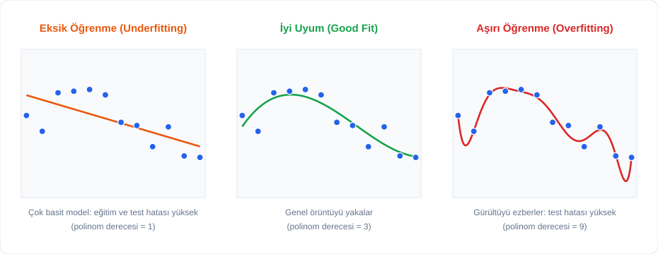</p>

| | **Eksik öğrenme (Underfitting)** | **İyi uyum** | **Aşırı öğrenme (Overfitting)** |
| :--- | :--- | :--- | :--- |
| Eğitim hatası | Yüksek | Düşük | Çok düşük (≈ 0) |
| Test hatası | Yüksek | Düşük | **Yüksek** |
| Neden | Model çok basit | Doğru karmaşıklık | Model çok karmaşık, gürültüyü ezberliyor |
| Çözüm | Daha karmaşık model, daha iyi öznitelikler | — | Daha fazla veri, düzenlileştirme, budama, erken durdurma, daha basit model |

### 13.2 Yanlılık–Varyans Dengesi (Bias–Variance Trade-off) 🟢

- **Yanlılık (bias):** Modelin **sistematik** hatası. Gerçek ilişkiyi yakalayamayacak kadar basit bir model (eğrisel veriye doğru uydurmak) yüksek yanlılığa sahiptir.
- **Varyans (variance):** Modelin eğitim verisindeki küçük değişikliklere **aşırı duyarlılığı**. Farklı bir örneklemle eğitilse bambaşka bir model çıkıyorsa varyans yüksektir.

<p align="center">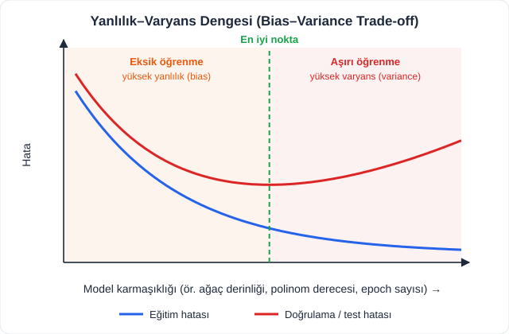</p>

Model karmaşıklaştıkça yanlılık azalır ama varyans artar. Amaç, **test hatasını** en küçük yapan dengeyi bulmaktır.

<details>
<summary>🎓 <b>Derinleşme: Hatanın ayrıştırılması</b></summary>

Karesel hata için beklenen test hatası üç parçaya ayrılır:

$$
E\big[(y-\hat{f}(x))^2\big] = \underbrace{\big(E[\hat{f}(x)] - f(x)\big)^2}_{\text{Yanlılık}^2} + \underbrace{E\big[(\hat{f}(x) - E[\hat{f}(x)])^2\big]}_{\text{Varyans}} + \underbrace{\sigma_\varepsilon^2}_{\text{Gürültü}}
$$

| Sembol | Okunuşu | Anlamı |
| :---: | :--- | :--- |
| $f(x)$ | "ef iks" | Gerçek (bilinmeyen) ilişki |
| $\hat{f}(x)$ | "ef şapka iks" | Öğrenilen model |
| $E[\cdot]$ | "beklenen değer" | Farklı eğitim setleri üzerinden ortalama |
| $\sigma_\varepsilon^2$ | "sigma epsilon kare" | İndirgenemez gürültü; hiçbir model bunu yok edemez |

</details>

### 13.3 Holdout (Dışarıda Tutma) 🟢

En basit yöntem: Veri **bir kez** ikiye bölünür. Büyük parça **eğitim**, küçük parça **test** için kullanılır (yaygın oranlar: 80/20, 70/30, 66/34).

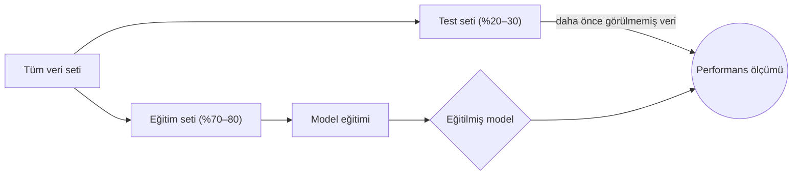
```mermaid
graph LR
    A["Tüm veri seti"] --> B["Eğitim seti (%70–80)"]
    A --> C["Test seti (%20–30)"]
    B --> D["Model eğitimi"]
    D --> E{"Eğitilmiş model"}
    C -->|"daha önce görülmemiş veri"| F(("Performans ölçümü"))
    E --> F
```

**Dezavantajı:** Sonuç, bölmenin şansına bağlıdır. Aynı model ve veriyle, sadece rastgele bölme değiştirilerek (10 farklı `random_state`) elde edilen test doğrulukları **0.889 ile 0.977** arasında değişti. Küçük veri setlerinde bu risk daha da büyüktür.

### 13.4 Eğitim / Doğrulama / Test (Üçlü Ayırma) 🟢

Model geliştirirken **hiperparametre** (ağacın derinliği, $k$, $C$…) seçmemiz gerekir. Bu seçim test setine bakılarak yapılırsa, test setinin bilgisi dolaylı olarak modele **sızar** ve test sonucu artık tarafsız olmaz. Çözüm veriyi üçe ayırmaktır:

1. **Eğitim seti (training):** Modelin parametrelerini öğrendiği kısım (ör. %60).
2. **Doğrulama seti (validation):** Hiperparametre ayarlama ve model seçimi için (ör. %20).
3. **Test seti (test):** Tüm kararlar verildikten sonra **yalnızca bir kez**, nihai performansı raporlamak için (ör. %20). Tüm süreç boyunca "kasada kilitli" tutulur.

### 13.5 K-Katlı Çapraz Doğrulama (K-Fold Cross-Validation) 🟢

Tek bir bölmenin şansına güvenmek yerine, veriyi **K eşit parçaya (katman, fold)** ayırıp K kez deneme yaparız:

1. Veri $K$ katmana bölünür (genellikle $K = 5$ veya $10$).
2. Her turda **bir katman test**, kalan $K-1$ katman **eğitim** için kullanılır.
3. $K$ adet skorun **ortalaması (± standart sapması)** raporlanır.

<p align="center">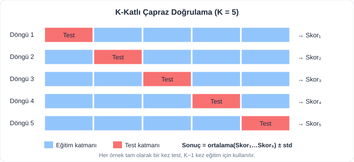</p>

**Avantajı:** Her örnek tam olarak bir kez test, $K-1$ kez eğitim için kullanılır. Verinin tamamından yararlanılır ve sonuç çok daha **kararlıdır**. Bu, veri az olduğunda hayati önem taşır.

#### K Değerinin Seçimi 🎓

| | **Küçük K (ör. 2–3)** | **Büyük K (ör. 10, LOOCV)** |
| :--- | :--- | :--- |
| Eğitim seti boyutu | Küçük (K=2 ise verinin %50'si) | Büyük (K=10 ise %90) |
| Tahminin **yanlılığı** | **Yüksek**: az veriyle eğitilen model gerçekte olacağından kötü görünür (**kötümser** tahmin) | **Düşük**: nihai modele çok yakın bir model test edilir |
| Tahminin **varyansı** | Düşük olma eğiliminde | Daha yüksek olabilir: eğitim setleri neredeyse aynıdır, modeller birbirine çok benzer ve hataları ilişkilidir |
| Hesaplama maliyeti | Düşük (K model) | Yüksek |

Genel kabul görmüş uygulama $K = 5$ veya $K = 10$'dur. Bu değerler yanlılık, varyans ve hesaplama maliyeti arasında makul bir denge sağlar.

### 13.6 Tabakalı Örnekleme (Stratified K-Fold) 🟢

Sınıflar dengesizse (ör. 1000 hastanın 950'si sağlıklı, 50'si hasta) rastgele bölmede bazı katmanlarda hiç hasta olmayabilir. **Tabakalı** çapraz doğrulama, her katmanda **sınıf oranlarının orijinal veriyle aynı** (%95 / %5) kalmasını garanti eder. Sınıflandırmada **varsayılan tercih** olmalıdır (WEKA'nın çapraz doğrulaması zaten tabakalıdır; scikit-learn'de `StratifiedKFold` veya `train_test_split(..., stratify=y)`).

### 13.7 Birini Dışarıda Bırak (Leave-One-Out, LOOCV) 🟢

$K = N$ (örnek sayısı) olan özel durum: Her seferinde **tek bir örnek** test edilir, kalan $N-1$ örnekle eğitilir; bu $N$ kez tekrarlanır. Yanlılığı çok düşüktür ama $N$ model eğitmek gerektiğinden **hesaplama maliyeti çok yüksektir**. Genellikle çok küçük veri setlerinde (onlarca örnek) kullanılır.

### 13.8 Bootstrap Örnekleme ve Torba Dışı (OOB) Örnekler 🟢

Torbada 10 farklı renkte bilye var. Bir bilye çekip rengini not ediyor ve **torbaya geri koyuyorsunuz**. Bunu 10 kez tekrarlıyorsunuz. Sonuçta bazı renkler birden fazla kez seçilir (kopyalar), bazıları ise hiç seçilmez. Bu **yerine koyarak örnekleme (sampling with replacement)** işlemine **bootstrap** denir.

Makine öğrenmesinde $n$ satırlık veriden yine $n$ satırlık bir **eğitim seti** bu şekilde çekilir. Hiç seçilmeyen satırlara **torba dışı (out-of-bag, OOB)** örnekler denir. Model bunları hiç görmediği için bu örnekler doğal bir **test seti** oluşturur.

**Bir örneğin hiç seçilmeme olasılığı:** Her çekişte seçilmeme olasılığı $1 - \frac{1}{n}$, $n$ çekişte:

$$
P(\text{seçilmeme}) = \left(1-\frac{1}{n}\right)^{n} \xrightarrow{\;n\to\infty\;} e^{-1} \approx 0.368
$$

| Sembol | Okunuşu | Anlamı |
| :---: | :--- | :--- |
| $n$ | "en" | Veri setindeki örnek sayısı (= çekiş sayısı) |
| $e^{-1}$ | "e üzeri eksi bir" | $\approx 0.368$ |
| $\xrightarrow{n\to\infty}$ | "en sonsuza giderken" | Limit |

Yani her bootstrap eğitim seti, farklı örneklerin ortalama **%63.2**'sini içerir; kalan **%36.8** OOB setidir (**0.632 kuralı**). Kodla yapılan 200 tekrarlı deneyde ortalama OOB oranı **0.368** çıktı.

Bootstrap, **Bagging** ve **Random Forest**'ın temelidir ([Bölüm 16](#b16)). Her ağacın kendi OOB örnekleri üzerindeki başarısının ortalaması (**OOB skoru**), ayrı bir doğrulama seti ayırmadan genelleme başarısı hakkında güvenilir bir **tahmin** verir. Yine de akademik bir çalışmada nihai sonuç için ayrı bir test seti veya çapraz doğrulama kullanmak iyi bir uygulamadır.

### 13.9 Özet Deney 🧪

Meme kanseri verisi, karar ağacı:

| Yöntem | Sonuç |
| :--- | :--- |
| Eğitim verisinde test (**yanlış!**) | 1.000 |
| Holdout (10 farklı bölme) | 0.889 – 0.977 arası |
| 5 katlı tabakalı CV | 0.926 ± 0.022 |
| 10 katlı tabakalı CV | 0.923 ± 0.040 |
| Bootstrap / OOB (200 tekrar) | 0.922 ± 0.019 |

➡️ Tüm yöntemlerin kodu: [`codes/python/05_model_degerlendirme_yontemleri.py`](https://github.com/erkanozhan/machinelearning/blob/main/codes/python/05_model_degerlendirme_yontemleri.py)

**WEKA'da karşılıkları** (Classify → *Test options*):

| WEKA seçeneği | Yöntem |
| :--- | :--- |
| Use training set | Eğitim verisinde test (**sadece model incelemek için; performans raporlamak için değil!**) |
| Supplied test set | Ayrı bir test dosyasıyla holdout |
| Cross-validation (Folds = 10) | Tabakalı K-katlı CV |
| Percentage split (% 66) | Holdout |

---

<a id="b14"></a>

## 14. Performans Ölçütleri

"Bu model ne kadar iyi?" sorusunu nesnel olarak cevaplamak için **performans ölçütleri (metrikler)** kullanılır. Sınıflandırma ve regresyon için farklı ölçütler vardır.

### 14.1 Karışıklık Matrisi (Confusion Matrix) 🟢

Sınıflandırma performansını analiz etmeye her zaman buradan başlanır. Tablo, modelin tahminlerini gerçek değerlerle karşılaştırır.

<p align="center">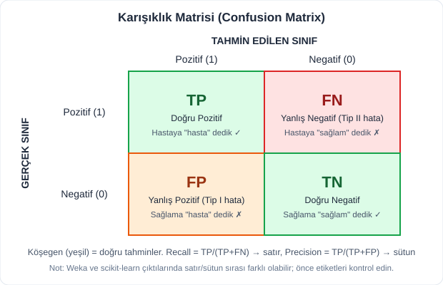</p>

| Terim | Anlamı | Örnek (hastalık testi) |
| :--- | :--- | :--- |
| **TP** – Doğru Pozitif | Pozitifi doğru bildik | Hastaya "hasta" dedik |
| **TN** – Doğru Negatif | Negatifi doğru bildik | Sağlıklıya "sağlıklı" dedik |
| **FP** – Yanlış Pozitif (**Tip I hata**) | Negatife yanlışlıkla pozitif dedik | Sağlıklıya "hasta" dedik (yanlış alarm) |
| **FN** – Yanlış Negatif (**Tip II hata**) | Pozitifi kaçırdık | Hastaya "sağlıklı" dedik |

> 💡 **Hatırlama yolu:** İkinci kelime modelin **ne dediğini** (Pozitif/Negatif), ilk kelime bunun **doğru mu yanlış mı** olduğunu söyler. "Yanlış Pozitif" = model "pozitif" dedi ama yanlıştı.

**Çalışma örneği** (1000 kişi: 500 gerçekten hasta, 500 sağlıklı):

| | **Tahmin: Pozitif** | **Tahmin: Negatif** | **Toplam** |
| :--- | :---: | :---: | :---: |
| **Gerçek: Pozitif** | TP = 350 | FN = 150 | 500 |
| **Gerçek: Negatif** | FP = 250 | TN = 250 | 500 |
| **Toplam** | 600 | 400 | 1000 |

### 14.2 Sınıflandırma Ölçütleri 🟢

#### Doğruluk (Accuracy)

"Tüm tahminlerin ne kadarı doğru?"

$$
\text{Accuracy} = \frac{TP + TN}{TP + TN + FP + FN}
$$

**Örnek:** $(350 + 250)/1000 = 0.60$

> ⚠️ **Doğruluk tuzağı:** 990 sağlıklı, 10 hasta olan bir veri setinde herkese "sağlıklı" diyen, **hiçbir şey öğrenmemiş** bir model %99 doğruluk elde eder, ama tek bir hastayı bile bulamaz. **Dengesiz veri setlerinde doğruluk tek başına kullanılmamalıdır.**

#### Kesinlik (Precision)

"Pozitif dediklerimin ne kadarı gerçekten pozitif?"

$$
\text{Precision} = \frac{TP}{TP + FP}
$$

**Örnek:** $350/600 \approx 0.583$. **Yanlış alarmın pahalı olduğu** durumlarda kritiktir. *Örnek:* Önemli bir e-postanın spam kutusuna düşmesi.

#### Duyarlılık (Recall, Sensitivity, TPR)

"Gerçek pozitiflerin ne kadarını yakalayabildim?"

$$
\text{Recall} = \text{TPR} = \frac{TP}{TP + FN}
$$

**Örnek:** $350/500 = 0.70$. **Kaçırmanın pahalı olduğu** durumlarda kritiktir. *Örnek:* Kanser taraması, dolandırıcılık tespiti.

#### Özgüllük (Specificity, TNR) ve Yanlış Pozitif Oranı (FPR)

"Gerçek negatiflerin ne kadarını doğru bildim?" ve bunun tümleyeni olan "yanlış alarm oranı":

$$
\text{Specificity} = \text{TNR} = \frac{TN}{TN + FP}, \qquad \text{FPR} = \frac{FP}{FP + TN} = 1 - \text{Specificity}
$$

**Örnek:** Specificity $= 250/500 = 0.50$, FPR $= 0.50$. (Tıpta "duyarlılık" ve "özgüllük" birlikte raporlanır.)

#### F1-Skoru

Precision ile recall genellikle birbiriyle çelişir: Biri artarken diğeri azalma eğilimindedir. F1 ikisinin **harmonik ortalamasıdır**; ikisinden biri düşükse F1 de düşük çıkar:

$$
F_1 = 2\cdot\frac{\text{Precision}\cdot\text{Recall}}{\text{Precision} + \text{Recall}} = \frac{2\,TP}{2\,TP + FP + FN}
$$

**Örnek:** $\frac{2 \cdot 0.583 \cdot 0.70}{0.583 + 0.70} \approx 0.636$

> 🎓 **$F_\beta$ skoru:** $F_\beta = (1+\beta^2)\frac{P\cdot R}{\beta^2 P + R}$. $\beta = 2$ recall'a, $\beta = 0.5$ precision'a daha fazla ağırlık verir.

#### Cohen'in Kappa Katsayısı ($\kappa$)

Kappa, modelin başarısının **şansın ne kadar ötesinde** olduğunu ölçer. Sınıf dağılımlarını bilen ama öznitelikleri hiç kullanmayan "rastgele" bir tahminciyle karşılaştırma yapar.

$$
\kappa = \frac{p_o - p_e}{1 - p_e}
$$

| Sembol | Okunuşu | Anlamı |
| :---: | :--- | :--- |
| $\kappa$ | "kappa" | Kappa katsayısı ($-1$ ile $+1$ arası) |
| $p_o$ | "pe o" | **Gözlenen uyum** = doğruluk (accuracy) |
| $p_e$ | "pe e" | **Şans eseri beklenen uyum:** her sınıf için (gerçek oran × tahmin oranı) toplamı |

**Adım adım (örneğimiz):**
1. $p_o = 0.60$
2. Pozitif için şans uyumu: gerçek pozitif oranı $500/1000 = 0.5$ × tahmin pozitif oranı $600/1000 = 0.6$ → $0.30$. Negatif için: $0.5 \times 0.4 = 0.20$. Toplam $p_e = 0.50$. *(Hiçbir şey bilmeyen, sadece oranlara göre tahmin yapan biri bile %50 tutturabilirdi.)*
3. $\kappa = \frac{0.60 - 0.50}{1 - 0.50} = 0.20$

**Yorum:** Model, şansın üzerine çıkabilecek en fazla iyileşmenin ($1 - p_e = 0.50$) yalnızca **%20'sini** gerçekleştirmiştir. %60'lık doğruluk ilk bakışta fena görünmese de başarının büyük kısmı şans düzeyindedir.

| Kappa | Uyum düzeyi (Landis & Koch, 1977) |
| :--- | :--- |
| < 0 | Uyum yok (şanstan kötü) |
| 0.00 – 0.20 | Çok zayıf |
| 0.21 – 0.40 | Zayıf |
| 0.41 – 0.60 | Orta |
| 0.61 – 0.80 | İyi |
| 0.81 – 1.00 | Çok iyi / neredeyse mükemmel |

WEKA her sınıflandırma çıktısında `Kappa statistic` değerini otomatik verir.

#### Matthews Korelasyon Katsayısı (MCC) 🎓

Karışıklık matrisinin dört hücresini birden kullanan, dengesiz veride çok güvenilir bir ölçüttür ($-1$: tamamen ters, $0$: rastgele, $+1$: mükemmel):

$$
MCC = \frac{TP\cdot TN - FP\cdot FN}{\sqrt{(TP+FP)(TP+FN)(TN+FP)(TN+FN)}}
$$

**Örnek:** $\frac{350\cdot 250 - 250\cdot 150}{\sqrt{600\cdot 500\cdot 500\cdot 400}} \approx 0.204$. WEKA'da `MCC` sütunu olarak görünür.

#### Çok Sınıflı Problemlerde Ortalama Alma: Macro ve Weighted 🟢

Üç sınıf (A, B, C) varsa her sınıf için ayrı precision, recall ve F1 hesaplanır ("bu sınıf pozitif, diğerleri negatif"). Genel skor için ortalama alınır:

- **Macro ortalama:** Tüm sınıflara **eşit** ağırlık verir; sınıf büyüklüğüne bakmaz.
- **Ağırlıklı (weighted) ortalama:** Her sınıfın skorunu örnek sayısıyla (**support**) ağırlıklandırır.

**Örnek:** F1 skorları A = 0.90, B = 0.40, C = 0.50; örnek sayıları A = 800, B = 150, C = 50.

$$
\text{Macro} = \frac{0.90 + 0.40 + 0.50}{3} = 0.60 \qquad \text{Weighted} = \frac{0.90\cdot800 + 0.40\cdot150 + 0.50\cdot50}{1000} = 0.805
$$

Macro ortalama, azınlık sınıflarındaki (B, C) kötü performansı açıkça gösterir. Weighted ortalama ise çoğunluk sınıfının (A) başarısıyla yüksek görünür. **Nadir sınıflar önemliyse** (nadir bir hastalık gibi) macro ortalamaya bakılmalıdır. scikit-learn'ün `classification_report` çıktısında ikisi `macro avg` ve `weighted avg` olarak yan yana verilir.

> 🎓 **Micro ortalama:** Tüm sınıfların TP, FP ve FN değerleri önce toplanır, sonra metrik hesaplanır. Tek etiketli çok sınıflı problemlerde micro-F1 doğruluğa eşittir.

### 14.3 ROC Eğrisi ve AUC 🟢

#### Kökeni

ROC (*Receiver Operating Characteristic*), II. Dünya Savaşı'nda **radar operatörlerinin** performansını ölçmek için geliştirildi. Operatör ekrandaki bir sinyalin düşman uçağı mı (pozitif), yoksa kuş sürüsü veya gürültü mü (negatif) olduğuna karar veriyordu.
- **Çok hassas** operatör en zayıf sinyali bile düşman sayar: Hiçbir uçağı kaçırmaz (yüksek TPR) ama çok yanlış alarm verir (yüksek FPR).
- **Az hassas** operatör sadece güçlü sinyalleri düşman sayar: Az yanlış alarm verir (düşük FPR) ama bazı uçakları kaçırır (düşük TPR).

#### Karar Eşiği (Threshold)

Çoğu sınıflandırıcı bir **olasılık/skor** üretir (lojistik regresyonda $\hat{p}$). Bu skor bir **eşikle** karşılaştırılarak sınıfa çevrilir. Aşağıdaki şekilde negatif ve pozitif sınıfların skor dağılımları ve bir eşik görülüyor. Eşiğin sağında kalanlar "pozitif" tahmin edilir; bu yüzden negatif dağılımın eşiğin sağındaki kuyruğu **FP**, pozitif dağılımın solundaki kuyruğu **FN** olur. İki dağılım ne kadar ayrıksa model o kadar iyidir.

<p align="center">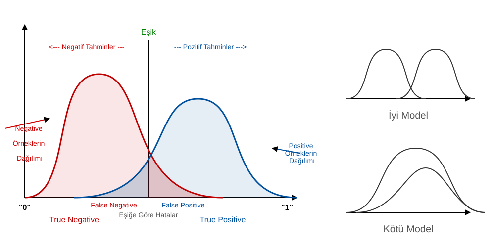</p>

- **Katı eşik (ör. 0.95):** Az yanlış alarm (düşük FPR), ama birçok pozitif kaçar (düşük TPR).
- **Gevşek eşik (ör. 0.20):** Neredeyse tüm pozitifler yakalanır (yüksek TPR), ama çok yanlış alarm olur (yüksek FPR).

#### ROC Eğrisinin Çizilmesi

Eşik 1'den 0'a doğru kaydırılır ve her eşik için **(FPR, TPR)** noktası çizilir:
- **Eşik = 1:** Model hiçbir şeye pozitif demez → **(0, 0)**.
- **Eşik düştükçe:** Daha fazla örneğe pozitif denir; hem TPR hem FPR artar.
- **Eşik = 0:** Her şeye pozitif denir → **(1, 1)**.

<p align="center">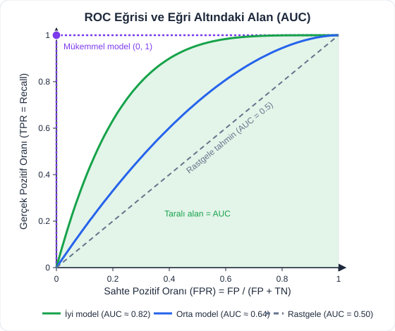</p>

- **Köşegen:** Rastgele tahmin (yazı-tura), AUC = 0.5.
- **Sol üst köşe (0, 1):** Mükemmel model: hiç yanlış alarm vermeden tüm pozitifleri bulur.
- Eğri sol üst köşeye ne kadar yakınsa model o kadar iyidir.

> 🎬 **Animasyon:** Eşiği kaydırdıkça ROC eğrisinin nasıl oluştuğunu izleyin → [ROC Eğrisi Animasyonu](https://erkanozhan.github.io/machinelearning/roc_animation.html)

#### Eğri Altındaki Alan (AUC)

ROC performansını tek bir sayıyla özetler:

| AUC | Yorum |
| :--- | :--- |
| 1.0 | Mükemmel ayırma |
| 0.9 – 1.0 | Çok iyi |
| 0.8 – 0.9 | İyi |
| 0.7 – 0.8 | Orta |
| 0.5 | Rastgele |
| < 0.5 | Rastgeleden kötü (tahminler ters çevrilirse iyileşir) |

> 🎓 **AUC'nin olasılıksal anlamı:** Rastgele seçilen bir pozitif örneğin skorunun, rastgele seçilen bir negatif örneğin skorundan **yüksek olma olasılığıdır**. Bu yüzden AUC eşikten bağımsızdır ve modelin **sıralama** başarısını ölçer.

#### Precision–Recall (PR) Eğrisi 🎓

Pozitif sınıf **çok nadirse** (ör. %1 dolandırıcılık), ROC eğrisi iyimser görünebilir: TN sayısı çok büyük olduğu için FPR küçük kalır. Bu durumda **recall (x) – precision (y)** eğrisi ve altındaki alan (**AP, Average Precision**; WEKA'da `PRC Area`) daha bilgilendiricidir. Rastgele bir modelin AP değeri, pozitif sınıfın oranına eşittir.

#### 🧪 Python ile Dengesiz Veride Tüm Ölçütler

%90 negatif, %10 pozitif yapay veri; lojistik regresyon:

```python
from sklearn.datasets import make_classification
from sklearn.model_selection import train_test_split
from sklearn.linear_model import LogisticRegression
from sklearn.metrics import classification_report, roc_auc_score, average_precision_score

X, y = make_classification(n_samples=1000, n_features=2, n_informative=2, n_redundant=0,
                           weights=[0.9, 0.1], flip_y=0, random_state=42)   # %90 / %10 dengesiz veri
X_tr, X_te, y_tr, y_te = train_test_split(X, y, test_size=0.3, stratify=y, random_state=42)

model = LogisticRegression().fit(X_tr, y_tr)                 # Modeli eğit
y_pred = model.predict(X_te)                                 # Sınıf tahmini (eşik 0.5)
y_skor = model.predict_proba(X_te)[:, 1]                     # Pozitif sınıf olasılığı (ROC/PR için)

print(classification_report(y_te, y_pred, digits=3))        # Precision, recall, F1, macro/weighted
print("ROC-AUC:", roc_auc_score(y_te, y_skor))               # Eşikten bağımsız sıralama başarısı
print("PR-AUC :", average_precision_score(y_te, y_skor))     # Nadir sınıf için daha bilgilendirici
```

Çıktının yorumu:

| Ölçüt | Değer | Yorum |
| :--- | :---: | :--- |
| Accuracy | 0.940 | Herkese "negatif" diyen model bile **0.900** alır; yanıltıcı |
| Pozitif sınıf precision | 0.929 | Pozitif dediğinde çoğunlukla haklı |
| Pozitif sınıf **recall** | **0.433** | Pozitiflerin yarısından fazlasını **kaçırıyor**! |
| Pozitif sınıf F1 | 0.591 | |
| Macro F1 / Weighted F1 | 0.779 / 0.930 | Macro, azınlık sınıfındaki zayıflığı gösteriyor |
| ROC-AUC | 0.919 | Sıralama başarısı aslında iyi, sorun **eşikte** |
| PR-AUC | 0.746 | Rastgele model ≈ 0.10 |

Eşik düşürülünce precision ile recall arasındaki takas:

| Eşik | 0.2 | 0.3 | 0.5 | 0.7 |
| :--- | :---: | :---: | :---: | :---: |
| Precision | 0.615 | 0.655 | 0.929 | 1.000 |
| Recall | **0.800** | 0.633 | 0.433 | 0.300 |

➡️ Grafiklerle birlikte tam kod: [`codes/python/06_siniflandirma_metrikleri.py`](https://github.com/erkanozhan/machinelearning/blob/main/codes/python/06_siniflandirma_metrikleri.py)

#### Hangi Ölçütü Ne Zaman Kullanmalı?

| Durum | Öncelikli ölçüt |
| :--- | :--- |
| Sınıflar dengeli, hataların maliyeti eşit | Accuracy, Kappa |
| Pozitifi kaçırmak pahalı (hastalık, dolandırıcılık) | **Recall**, $F_2$ |
| Yanlış alarm pahalı (spam filtresi, gereksiz ameliyat) | **Precision** |
| İkisi birden önemli | F1 |
| Sınıflar dengesiz | F1, MCC, Kappa, **PR-AUC**, macro ortalama |
| Eşikten bağımsız genel sıralama başarısı | ROC-AUC |
| Hataların maliyetleri farklı ve biliniyor | **Toplam maliyet** ([Bölüm 20](#b20)) |

> 💡 Tek bir "en iyi" ölçüt yoktur; **probleme en uygun** ölçüt vardır. Akademik raporlarda birden fazla ölçüt birlikte verilmelidir.

### 14.4 Regresyon Ölçütleri 🟢

Regresyonda soru "Doğru bildi mi?" değil, "**Gerçek değere ne kadar yaklaştı?**" sorusudur.

**Çalışma örneği** (ev fiyatları, bin TL):

| Gerçek $y$ | Tahmin $\hat{y}$ | Hata $y - \hat{y}$ | Mutlak hata | Karesel hata |
| :---: | :---: | :---: | :---: | :---: |
| 250 | 260 | −10 | 10 | 100 |
| 300 | 290 | 10 | 10 | 100 |
| 200 | 215 | −15 | 15 | 225 |
| 500 | 480 | 20 | 20 | 400 |
| 420 | 450 | −30 | 30 | 900 |
| | | **Toplam** | **85** | **1725** |

#### Ortalama Mutlak Hata (MAE)

$$
MAE = \frac{1}{n}\sum_{i=1}^{n}\lvert y_i - \hat{y}_i \rvert
$$

**Örnek:** $85/5 = 17$ → "Tahminler gerçek fiyattan **ortalama 17 bin TL** sapıyor." Hedefle aynı birimdedir ve yorumlaması en kolay olanıdır.

#### Ortalama Karesel Hata (MSE) ve Kökü (RMSE)

$$
MSE = \frac{1}{n}\sum_{i=1}^{n}(y_i - \hat{y}_i)^2, \qquad RMSE = \sqrt{MSE}
$$

**Örnek:** $MSE = 1725/5 = 345$ (bin TL)², $RMSE = \sqrt{345} \approx 18.57$ bin TL.

| Sembol | Okunuşu | Anlamı |
| :---: | :--- | :--- |
| $y_i$, $\hat{y}_i$ | "ye i", "ye şapka i" | Gerçek ve tahmin edilen değer |
| $\lvert \cdot \rvert$ | "mutlak değer" | Hatanın işaretini yok sayar |
| $(\cdot)^2$ | "kare" | Büyük hataları orantısız biçimde büyütür (2'lik hata → 4, 10'luk hata → 100) |

- MSE'nin birimi hedefin **karesidir** (TL²) ve doğrudan yorumlanması zordur. RMSE birimi geri getirir.
- RMSE **büyük hatalara daha duyarlıdır**. Örnekte −30'luk tek hata RMSE'yi (18.57) MAE'nin (17) üstüne çekti. **RMSE ile MAE arasındaki fark büyüdükçe model arada bir büyük hatalar yapıyor demektir.**

| Ölçüt | Birim | Yorum kolaylığı | Aykırı değere duyarlılık |
| :--- | :--- | :--- | :--- |
| MAE | Hedefle aynı | Çok kolay | Düşük |
| MSE | Hedefin karesi | Zor | Çok yüksek |
| RMSE | Hedefle aynı | Kolay | Yüksek |

#### Belirlilik Katsayısı ($R^2$)

"Hedefteki değişkenliğin yüzde kaçını model açıklıyor?"

$$
R^2 = 1 - \frac{SS_{res}}{SS_{tot}} = 1 - \frac{\sum_i (y_i - \hat{y}_i)^2}{\sum_i (y_i - \bar{y})^2}
$$

| Sembol | Okunuşu | Anlamı |
| :---: | :--- | :--- |
| $SS_{res}$ | "es es res" | **Artık kareler toplamı:** modelin açıklayamadığı hata |
| $SS_{tot}$ | "es es tot" | **Toplam kareler:** her tahmine sadece ortalamayı ($\bar{y}$) söyleyen "en aptal" modelin hatası |
| $\bar{y}$ | "ye bar" | Gerçek değerlerin ortalaması |

**Örnek:** $\bar{y} = 334$; $SS_{tot} = 84^2 + 34^2 + 134^2 + 166^2 + 86^2 = 61\,120$; $SS_{res} = 1725$.
$R^2 = 1 - 1725/61\,120 \approx 0.972$ → "Fiyatlardaki değişkenliğin **%97.2'si** model tarafından açıklanıyor."

- $R^2 = 1$: Mükemmel uyum.
- $R^2 = 0$: Model, herkese ortalamayı söylemekten daha iyi değil.
- ⚠️ **$R^2 < 0$ olabilir!** Test verisinde model ortalamadan bile kötü tahmin yapıyorsa $R^2$ negatif çıkar. (Örneğin tahminler $[500, 200, 450, 250, 300]$ olsaydı $R^2 = -2.47$ çıkardı.) "$R^2$ bir karedir, negatif olamaz" düşüncesi yalnızca en küçük kareler ile eğitim verisinde hesaplanan değer için geçerlidir.

#### Düzeltilmiş $R^2$ (Adjusted $R^2$) 🎓

Modele **anlamsız** bir öznitelik bile eklense (ev sahibinin ayakkabı numarası gibi), eğitim verisindeki $R^2$ hemen hemen her zaman artar. Düzeltilmiş $R^2$ öznitelik sayısını cezalandırır:

$$
R^2_{adj} = 1 - \frac{(1-R^2)(n-1)}{n-k-1}
$$

| Sembol | Okunuşu | Anlamı |
| :---: | :--- | :--- |
| $n$ | "en" | Örnek sayısı |
| $k$ | "ka" | Modeldeki öznitelik (bağımsız değişken) sayısı |

Eklenen öznitelik açıklayıcılığa anlamlı katkı yapmıyorsa $R^2_{adj}$ artmaz, hatta düşer. **Örnek:** $n = 5$, $k = 1$ için $R^2_{adj} = 1 - \frac{0.028 \cdot 4}{3} \approx 0.962$.

#### Korelasyon Katsayısı ($r$)

İki sayısal değişkenin **doğrusal** olarak birlikte ne kadar hareket ettiğini ölçer ($-1 \le r \le +1$):

$$
r = \frac{\sum_i (x_i - \bar{x})(y_i - \bar{y})}{\sqrt{\sum_i (x_i-\bar{x})^2}\,\sqrt{\sum_i (y_i-\bar{y})^2}}
$$

- $r = +1$: Mükemmel pozitif doğrusal ilişki · $r = -1$: Mükemmel negatif · $r = 0$: **Doğrusal** ilişki yok. (Doğrusal olmayan bir ilişki yine de olabilir, ör. $y = x^2$.)

<p align="center">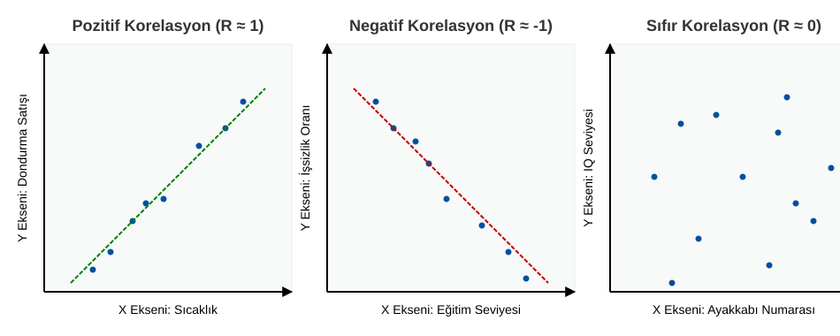</p>

**Regresyonda kullanımı:** Gerçek değerler ile tahminler arasındaki korelasyon, modelin gerçeği ne kadar iyi takip ettiğini gösterir. Örneğimizde $r(y, \hat{y}) \approx 0.987$ çok güçlü bir pozitif ilişki demektir.

> ⚠️ **$r^2$ ile $R^2$ her zaman eşit değildir.** Eşitlik yalnızca en küçük kareler ile kurulmuş bir lineer modelin **kendi eğitim verisinde** geçerlidir. Örneğimizde $r^2 = 0.975$, $R^2 = 0.972$'dir. Ayrıca korelasyon ölçek ve kaymadan etkilenmez: Tüm tahminler 100 bin TL fazla olsa bile $r$ değişmez ama model açıkça kötüdür. Bu yüzden korelasyon **tek başına** bir hata ölçüsü değildir. **Korelasyon nedensellik de değildir:** Dondurma satışı ile boğulma vakaları birlikte artar, ama ortak neden sıcak havadır.

➡️ Tüm hesaplar: [`codes/python/07_regresyon_metrikleri.py`](https://github.com/erkanozhan/machinelearning/blob/main/codes/python/07_regresyon_metrikleri.py)

#### 🧪 WEKA ile Regresyon: `cpu.arff`

`cpu.arff`, 209 bilgisayar işlemcisinin donanım özelliklerinden (MYCT: saat döngü süresi, MMIN/MMAX: bellek, CACH: önbellek, CHMIN/CHMAX: kanal sayısı) göreli performansını (son öznitelik `class`, sayısal) tahmin etmeyi amaçlar.

1. Explorer → Preprocess → WEKA kurulum klasöründeki `data/cpu.arff` dosyasını açın.
2. Classify → Choose → `functions → LinearRegression`. Hedef sayısal olduğu için WEKA regresyon yapar.
3. Test options: **Cross-validation, 10 kat** → **Start**.

Çıktının özet bölümü şu biçimdedir (değerler WEKA sürümüne göre küçük farklılıklar gösterebilir):

```text
=== Cross-validation ===
=== Summary ===

Correlation coefficient                  0.90      ← r: tahmin ile gerçek arasındaki korelasyon
Mean absolute error                     41.1       ← MAE (hedefle aynı birim)
Root mean squared error                 69.6       ← RMSE
Relative absolute error                 42.7  %    ← RAE
Root relative squared error             43.2  %    ← RRSE
Total Number of Instances              209
```

- **MAE ≈ 41:** Tahminler ortalama 41 performans birimi sapıyor. **RMSE (≈ 70) MAE'den belirgin biçimde büyük:** Model bazı işlemcilerde çok büyük hatalar yapıyor.
- **Correlation coefficient ≈ 0.90:** Tahminler gerçeği güçlü biçimde izliyor. Karesi (≈ 0.81) yalnızca **yaklaşık** bir $R^2$ fikri verir (yukarıdaki uyarıya bakın).
- 🎓 **RAE ve RRSE:** Modelin hatasının, her örneğe ortalamayı söyleyen modelin hatasına oranıdır. $RAE = \frac{\sum\lvert y_i-\hat{y}_i\rvert}{\sum\lvert y_i-\bar{y}\rvert}$, $RRSE = \sqrt{\frac{\sum(y_i-\hat{y}_i)^2}{\sum(y_i-\bar{y})^2}}$. %100 = ortalama kadar kötü, %0 = mükemmel. Dikkat: $RRSE^2 = 1 - R^2$, yani $R^2 \approx 1 - 0.432^2 \approx 0.81$.

`trees → M5P` (model ağacı) ve `functions → MultilayerPerceptron` ile de deneyip sonuçları karşılaştırın.

---

<a id="b15"></a>

## 15. WEKA ile Uçtan Uca Uygulama: Iris 🧪

Bu uygulama, bir makine öğrenmesi projesinin **eğitim → değerlendirme → kaydetme → yeni veride kullanma** adımlarının tamamını içerir.

**Iris veri seti:** 3 süsen türünden (*Iris-setosa*, *Iris-versicolor*, *Iris-virginica*) 50'şer, toplam 150 çiçek. 4 sayısal öznitelik: çanak yaprak (sepal) uzunluğu ve genişliği, taç yaprak (petal) uzunluğu ve genişliği (cm).

### Adım 1 – Veriyi Yükleme ve İnceleme

1. GUI Chooser → **Explorer** → Preprocess → **Open file…** → WEKA klasöründeki `data/iris.arff`.
2. Sağdaki **Attributes** panelinde öznitelikleri tek tek seçip istatistiklerine (min, max, mean, stddev) ve histogramlarına bakın. `class` özniteliği seçiliyken her özniteliğin histogramı sınıflara göre renklenir. `petallength` histogramında setosa'nın tamamen ayrık durduğunu fark edin.
3. **Visualize** sekmesinde öznitelik çiftlerinin dağılım grafiklerini inceleyin.

### Adım 2 – Model Eğitme ve Değerlendirme

1. **Classify** → Choose → `trees → J48`.
2. Test options: **Cross-validation, Folds = 10**. Altındaki açılır menüde hedef olarak `(Nom) class` seçili olsun.
3. **Start**.

Tipik çıktı (10 katlı CV, seed = 1):

```text
Correctly Classified Instances         144               96      %    ← Doğruluk (accuracy)
Incorrectly Classified Instances         6                4      %
Kappa statistic                          0.94                         ← Şansa göre düzeltilmiş uyum
Mean absolute error                      0.035
Root mean squared error                  0.1586

=== Detailed Accuracy By Class ===
                 TP Rate  FP Rate  Precision  Recall   F-Measure  MCC    ROC Area  PRC Area  Class
                 0.980    0.000    1.000      0.980    0.990      0.985  0.990     0.987     Iris-setosa
                 0.940    0.030    0.940      0.940    0.940      0.910  0.952     0.880     Iris-versicolor
                 0.960    0.030    0.941      0.960    0.950      0.925  0.961     0.905     Iris-virginica
Weighted Avg.    0.960    0.020    0.960      0.960    0.960      0.940  0.968     0.924

=== Confusion Matrix ===
  a  b  c   <-- classified as
 49  1  0 |  a = Iris-setosa
  0 47  3 |  b = Iris-versicolor
  0  2 48 |  c = Iris-virginica
```

**Yorum:**
- `TP Rate` = recall, `FP Rate` = yanlış pozitif oranı, `F-Measure` = F1, `ROC Area` = AUC, `PRC Area` = PR eğrisi altındaki alan.
- WEKA'da karışıklık matrisinin **satırları gerçek sınıfı, sütunları tahmini** gösterir. `b` satırı, `c` sütunundaki 3: *Gerçekte versicolor olan 3 çiçek virginica sanılmış.*
- Hataların tamamına yakını **versicolor ile virginica** arasındadır; bu iki türün ölçüleri birbirine çok yakındır.
- `Mean absolute error` gibi değerler sınıflandırmada **olasılık tahminlerinin** hatasıdır; yorumlarken öncelik doğruluk, Kappa ve sınıf bazlı ölçütlerdedir.
- Ağacı görmek için: **Result list**'te modele sağ tık → **Visualize tree**.

> 💡 Classify ekranında "Classifier output"taki `=== Classifier model (full training set) ===` bölümü, **tüm veriyle** eğitilmiş son modeldir. Performans değerleri ise çapraz doğrulamadan gelir.

### Adım 3 – Modeli Kaydetme

Result list'te modele sağ tık → **Save model** → ör. `iris_j48.model`.

### Adım 4 – Yeni (Etiketsiz) Veri Hazırlama

Yeni çiçekler için bir `.arff` dosyası hazırlanır. **Başlık bölümü (`@relation` ve `@attribute` satırları) eğitim verisiyle birebir aynı olmalıdır**. Sınıf bilinmediği için `?` yazılır. Hazır dosya: [`data/iris_yeni_test.arff`](https://github.com/erkanozhan/machinelearning/blob/main/data/iris_yeni_test.arff)

```text
% Gerçek türler (kontrol amaçlı): setosa, virginica, versicolor, setosa, virginica
@relation iris-yeni-test

@attribute sepallength numeric
@attribute sepalwidth numeric
@attribute petallength numeric
@attribute petalwidth numeric
@attribute class {Iris-setosa,Iris-versicolor,Iris-virginica}

@data
5.1,3.5,1.4,0.2,?
6.0,2.2,5.0,1.5,?
7.0,3.2,4.7,1.4,?
4.9,3.0,1.4,0.2,?
6.3,3.3,6.0,2.5,?
```

> ⚠️ ARFF'de yorum satırı `%` ile **satır başında** başlar. Veri satırlarının sonuna yorum eklemeyin; WEKA dosyayı okuyamayabilir.

### Adım 5 – Kaydedilmiş Modelle Tahmin

**Senaryo A – WEKA hâlâ açık:**
1. Classify → Test options → **Supplied test set** → **Set…** → `iris_yeni_test.arff`.
2. **More options…** → **Output predictions** → `PlainText`.
3. Result list'te modele sağ tık → **Re-evaluate model on current test set**.
4. Çıktıda her örnek için tahmin edilen sınıf ve olasılığı (`prediction`) görünür.

**Senaryo B – WEKA kapatılıp yeniden açıldı:**
1. Explorer → Preprocess'te herhangi bir `.arff` dosyası yükleyin (Classify sekmesi veri yüklenmeden aktif olmaz).
2. Classify → Result list'te boş alana sağ tık → **Load model** → `iris_j48.model`.
3. Senaryo A'daki 1–4. adımlar.

> 🎓 **Gerçek bir uygulamada** model, programın içine gömülür. Bu depodaki [`application/`](https://github.com/erkanozhan/machinelearning/tree/main/application) klasöründe WEKA modelini Java masaüstü (Swing) ve Spring Boot web uygulamasında kullanan örnek projeler bulunur.

### Ek: WEKA ile R Bağlantısı 🎓

WEKA'nın kolay arayüzü R'ın istatistik ve görselleştirme gücüyle birleştirilebilir. (Geliştiricilerin anlatımı: [YouTube](https://www.youtube.com/watch?v=EGwHXC3baWU))
1. R ve WEKA'yı kurun. R konsolunda: `install.packages("rJava")`.
2. Ortam değişkenleri (Windows: *Sistem → Gelişmiş sistem ayarları → Ortam Değişkenleri*):
   - `R_HOME` = R'ın kurulu olduğu klasör (ör. `C:\Program Files\R\R-4.x.x`)
   - `R_LIBS_USER` = kullanıcı paket klasörü (ör. `C:\Users\<Kullanıcı>\Documents\R\win-library\4.x`)
   - `PATH`'e `R.exe`'nin bulunduğu `bin\x64` klasörünü ekleyin.
3. GUI Chooser → **Tools → Package manager** → `RPlugin` paketini kurun.
4. WEKA'yı yeniden başlatın. Artık **R Console** kullanılabilir ve `MLRClassifier` ile R'daki modeller WEKA içinden çalıştırılabilir.

---

<a id="b16"></a>

## 16. Topluluk Öğrenmesi (Ensemble Learning)

### 16.1 Birlikten Kuvvet Doğar 🟢

Bir kavanozdaki bilye sayısını tahmin edeceğiz. Tek bir kişinin tahmini çok hatalı olabilir. Ama 100 kişinin tahminlerinin **ortalaması** genellikle şaşırtıcı derecede isabetlidir, çünkü bireysel hatalar birbirini dengeler ("kalabalıkların bilgeliği").

Topluluk öğrenmesi, birden çok modelin tahminlerini birleştirerek tek bir modelden **daha doğru ve daha kararlı** tahminler elde eder. Temel koşul, modellerin **farklı hatalar** yapmasıdır: Hepsi aynı hatayı yapıyorsa birleştirmek işe yaramaz.

| Yöntem | Modeller nasıl eğitilir? | Temel olarak neyi azaltır? | Örnekler |
| :--- | :--- | :--- | :--- |
| **Bagging** | Paralel, birbirinden bağımsız | **Varyans** | Bagging, Random Forest |
| **Boosting** | Sıralı, her biri öncekinin hatasına odaklanır | **Yanlılık** (ve varyans) | AdaBoost, Gradient Boosting, XGBoost, LightGBM, CatBoost |
| **Stacking** | Farklı türde modeller + bir meta-model | Her ikisi | Stacking |

### 16.2 Bagging (Bootstrap Aggregating) 🟢

1. Orijinal veriden **bootstrap** ile (yerine koyarak) $B$ adet yeni eğitim seti çekilir ([Bölüm 13.8](#b13)).
2. Her set üzerinde **aynı türden** bir model (genellikle derin, budanmamış karar ağacı) bağımsız olarak eğitilir.
3. Tahminler birleştirilir: **Sınıflandırmada çoğunluk oyu**, **regresyonda ortalama**.

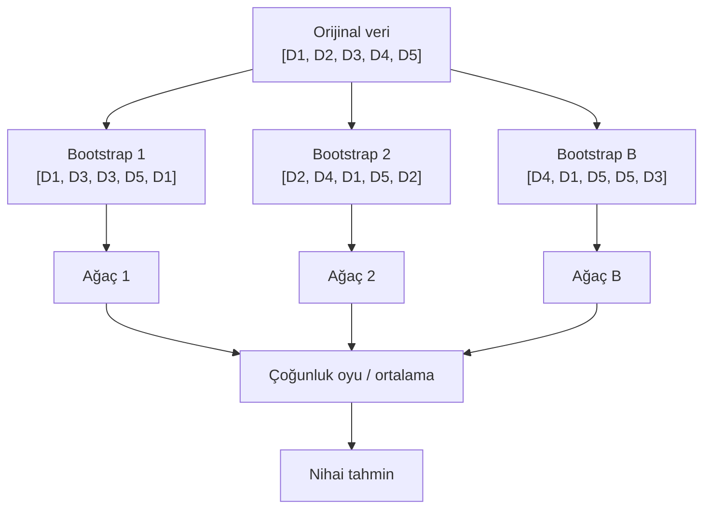
```mermaid
graph TD
    A["Orijinal veri<br/>[D1, D2, D3, D4, D5]"] --> B1["Bootstrap 1<br/>[D1, D3, D3, D5, D1]"]
    A --> B2["Bootstrap 2<br/>[D2, D4, D1, D5, D2]"]
    A --> BN["Bootstrap B<br/>[D4, D1, D5, D5, D3]"]
    B1 --> M1["Ağaç 1"]
    B2 --> M2["Ağaç 2"]
    BN --> MN["Ağaç B"]
    M1 --> F["Çoğunluk oyu / ortalama"]
    M2 --> F
    MN --> F
    F --> S["Nihai tahmin"]
```

$$
\hat{y}_{\text{sınıf}} = \operatorname{mod}\big\lbrace \hat{y}^{(1)}, \dots, \hat{y}^{(B)} \big\rbrace, \qquad \hat{y}_{\text{regresyon}} = \frac{1}{B}\sum_{b=1}^{B}\hat{y}^{(b)}
$$

| Sembol | Okunuşu | Anlamı |
| :---: | :--- | :--- |
| $B$ | "be" | Topluluktaki model sayısı |
| $\hat{y}^{(b)}$ | "ye şapka üst b" | $b$. modelin tahmini |
| $\operatorname{mod}$ | "mod" | En sık görülen değer (çoğunluk oyu) |

**Random Forest (Rastgele Orman):** Bagging'e ek olarak, her düğümde bölme yapılırken özniteliklerin yalnızca **rastgele bir alt kümesi** (sınıflandırmada genellikle $\sqrt{d}$ tane) değerlendirilir. Bu sayede ağaçlar birbirine daha az benzer (**daha az ilişkili**) hâle gelir ve ortalamanın varyans azaltma etkisi güçlenir. Hem sınıflandırma hem regresyonda çok güçlü ve az ayar gerektiren bir modeldir. OOB skoru ve öznitelik önemi de verir.

### 16.3 Boosting (Güçlendirme) 🟢

Zor bir problemi sırayla çözen bir uzmanlar ekibi düşünün: İlk uzman genel bir çözüm önerir. İkincisi, ilkinin **hata yaptığı** noktalara odaklanır. Üçüncüsü, hâlâ çözülemeyen kısımlarla uğraşır… Sonunda bu sıralı ve odaklı çaba, tek bir uzmanın ulaşabileceğinden çok daha iyi bir sonuç verir.

Boosting, **zayıf öğrenicileri** (rastgeleden biraz iyi, basit modeller; ör. tek soruluk **karar kütüğü / decision stump**) **sıralı** olarak eğitip güçlü bir model oluşturur.

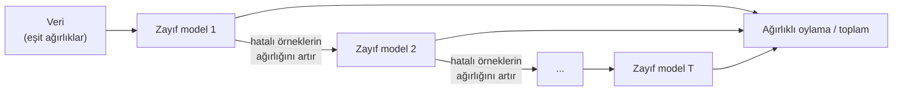
```mermaid
graph LR
    A["Veri<br/>(eşit ağırlıklar)"] --> M1["Zayıf model 1"]
    M1 -->|"hatalı örneklerin<br/>ağırlığını artır"| M2["Zayıf model 2"]
    M2 -->|"hatalı örneklerin<br/>ağırlığını artır"| M3["..."]
    M3 --> MN["Zayıf model T"]
    M1 --> F["Ağırlıklı oylama / toplam"]
    M2 --> F
    MN --> F
```

- **AdaBoost:** Her turda yanlış sınıflandırılan örneklerin **ağırlığı artırılır**. Böylece bir sonraki model onlara odaklanır. Her modelin oyu, doğruluğuna göre ağırlıklandırılır.
- **Gradient Boosting:** Her yeni ağaç, önceki modellerin toplamının **artıklarını (residuals)**, yani hâlâ açıklanamayan kısmı tahmin etmeyi öğrenir. Bu, kayıp fonksiyonu üzerinde gradyan inişinin fonksiyon uzayındaki karşılığıdır. `learning_rate` her ağacın katkısını küçültür.
- **XGBoost, LightGBM, CatBoost:** Gradient Boosting'in hızlı ve düzenlileştirilmiş uygulamaları. Tablo verisi yarışmalarında (Kaggle) çok sık kazanan modellerdir.

<details>
<summary>🎓 <b>Derinleşme: Gradient Boosting'in güncelleme adımı</b></summary>

$$
F_t(\mathbf{x}) = F_{t-1}(\mathbf{x}) + \nu \, h_t(\mathbf{x}), \qquad h_t \approx \text{argmin}_h \sum_i \big(r_{i}^{(t)} - h(\mathbf{x}_i)\big)^2, \quad r_i^{(t)} = -\frac{\partial L(y_i, F)}{\partial F}\Big\vert_{F = F_{t-1}(\mathbf{x}_i)}
$$

| Sembol | Okunuşu | Anlamı |
| :---: | :--- | :--- |
| $F_t$ | "ef te" | $t$ ağaçtan sonraki topluluk modeli |
| $h_t$ | "ha te" | $t$. turda eklenen küçük ağaç |
| $\nu$ | "nü" | Öğrenme oranı (shrinkage), ör. 0.1 |
| $r_i^{(t)}$ | "ar i" | Sözde artık: kaybın negatif gradyanı. Karesel kayıpta tam olarak $y_i - F_{t-1}(\mathbf{x}_i)$, yani gerçek artıktır |

</details>

> ⚠️ Boosting, gürültülü veride ve çok fazla turda **aşırı öğrenebilir**. Tur sayısı ve öğrenme oranı birlikte ayarlanmalı, gerekirse erken durdurma kullanılmalıdır.

### 16.4 Stacking (Yığınlama) 🟢

Bir inşaat projesinde mimar, statik mühendisi ve şehir plancısı ayrı raporlar sunar. Deneyimli bir proje yöneticisi bu raporları girdi olarak alır ve **hangi uzmana hangi konuda ne kadar güveneceğini** zamanla öğrenerek nihai kararı verir.

- **Seviye-0 (temel modeller):** Genellikle **farklı türde** modeller (SVM, Naive Bayes, karar ağacı…).
- **Seviye-1 (meta-model):** Temel modellerin tahminlerini **yeni öznitelikler** olarak alıp nihai kararı veren, genellikle basit bir model (lojistik/lineer regresyon).
- ⚠️ **Veri sızıntısını önlemek için** meta-modelin eğitim verisi, temel modellerin **eğitimde görmediği** katmanlardaki tahminlerinden (**out-of-fold**) üretilir. scikit-learn'deki `cv=5` parametresi bunu otomatik yapar.

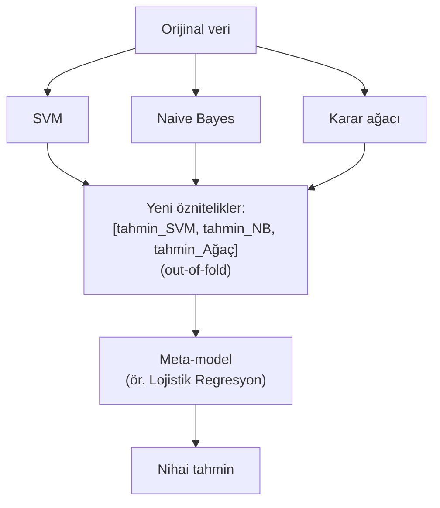
```mermaid
graph TD
    A["Orijinal veri"] --> M1["SVM"]
    A --> M2["Naive Bayes"]
    A --> M3["Karar ağacı"]
    M1 --> P["Yeni öznitelikler:<br/>[tahmin_SVM, tahmin_NB, tahmin_Ağaç]<br/>(out-of-fold)"]
    M2 --> P
    M3 --> P
    P --> META["Meta-model<br/>(ör. Lojistik Regresyon)"]
    META --> S["Nihai tahmin"]
```

### 16.5 Deney Sonuçları 🧪

Aynı 10 katlı tabakalı CV bölmeleriyle ölçülen doğruluklar ([`codes/python/08_topluluk_ogrenmesi.py`](https://github.com/erkanozhan/machinelearning/blob/main/codes/python/08_topluluk_ogrenmesi.py)):

| Model | Iris (150 örnek) | Meme kanseri (569 örnek) |
| :--- | :---: | :---: |
| Tek karar ağacı | 0.933 ± 0.052 | 0.926 ± 0.023 |
| Bagging (10 ağaç) | 0.940 ± 0.047 | 0.944 ± 0.031 |
| Random Forest (100 ağaç) | 0.953 ± 0.052 | 0.956 ± 0.024 |
| AdaBoost (100 karar kütüğü) | 0.953 ± 0.052 | **0.972 ± 0.018** |
| Gradient Boosting | 0.947 ± 0.050 | 0.960 ± 0.025 |
| Stacking (SVM + NB + Ağaç → LR) | 0.953 ± 0.052 | 0.965 ± 0.016 |

Regresyon (diyabet verisi, 10 katlı CV):

| Model | MAE | RMSE | $R^2$ |
| :--- | :---: | :---: | :---: |
| Tek karar ağacı (derinlik 5) | 52.88 | 66.23 | 0.205 |
| **Lineer regresyon** | **44.48** | **54.86** | **0.465** |
| Random Forest | 47.37 | 58.01 | 0.404 |
| Gradient Boosting | 47.15 | 57.42 | 0.410 |
| Stacking | 45.38 | 55.66 | 0.446 |

**Yorum:**
- Topluluklar tek ağaca göre **her zaman** daha iyi ve daha kararlı (düşük ±).
- Iris çok kolay bir veri seti olduğu için modeller arasındaki farklar standart sapmanın içinde kalıyor; **istatistiksel olarak anlamlı değil** ([Bölüm 24](#b24)).
- Diyabet verisinde en iyi model **basit lineer regresyon** çıktı. Karmaşık model her zaman kazanmaz; ilişki doğrusala yakınsa ve veri azsa basit modeller güçlüdür. Bu yüzden her projede **basit bir referans modelle (baseline)** başlanmalıdır.

### 16.6 WEKA'da Topluluk Öğrenmesi 🧪

Topluluk algoritmaları Classify → Choose → **`meta`** klasöründedir.

**Sınıflandırma (`iris.arff`, 10 katlı CV):** Önce referans olarak tek bir `trees → J48` çalıştırın (≈ %96).
1. **Bagging:** `meta → Bagging`. Ayarlarda `classifier = J48` (varsayılan REPTree), `numIterations = 10` (model sayısı), `bagSizePercent = 100`.
2. **AdaBoost:** `meta → AdaBoostM1`. `classifier = DecisionStump` (varsayılan; tek soruluk zayıf öğrenici), `numIterations` = tur sayısı.
3. **Random Forest:** `trees → RandomForest`. `numIterations` = ağaç sayısı (varsayılan 100).
4. **Stacking:** `meta → Stacking`. `classifiers` listesine `J48`, `NaiveBayes`, `IBk` ekleyin; `metaClassifier = functions → Logistic`.
5. **Vote:** `meta → Vote`. Farklı modellerin basit çoğunluk oyu (meta-model yok).

**Regresyon (`cpu.arff`):** Referans `trees → M5P`. Ardından `meta → Bagging` (classifier = M5P veya REPTree), `meta → AdditiveRegression` (regresyon için boosting; classifier = DecisionStump veya REPTree), `meta → Stacking` (base: LinearRegression + M5P, meta: LinearRegression). MAE, RMSE ve korelasyon değerlerini bir tabloda karşılaştırın.

**Python:**

```python
from sklearn.ensemble import RandomForestClassifier, AdaBoostClassifier, StackingClassifier
from sklearn.tree import DecisionTreeClassifier
from sklearn.linear_model import LogisticRegression
from sklearn.naive_bayes import GaussianNB

rf = RandomForestClassifier(n_estimators=100, random_state=42)             # 100 ağaçlık orman
ada = AdaBoostClassifier(estimator=DecisionTreeClassifier(max_depth=1),    # Zayıf öğrenici: karar kütüğü
                         n_estimators=100, random_state=42)                 # (eski sürümlerde 'base_estimator')
stack = StackingClassifier(
    estimators=[("nb", GaussianNB()), ("dt", DecisionTreeClassifier(max_depth=4))],  # Seviye-0
    final_estimator=LogisticRegression(max_iter=1000),                                # Seviye-1
    cv=5)                                                                             # Out-of-fold tahminler
```

---

<a id="b17"></a>

## 17. Kümeleme (Clustering)

Kümeleme **denetimsiz** öğrenmenin en temel tekniğidir: Etiket yoktur; amaç veriyi, **küme içinde benzer**, **kümeler arasında farklı** gruplara ayırmaktır. Kullanım alanları: müşteri segmentasyonu, belge gruplama, görüntü sıkıştırma, anomali tespiti, gen ifadesi analizi.

> ⚠️ Kümeleme mesafeye dayanır → **öznitelikler ölçeklenmelidir** ([Bölüm 5.8](#b5)). WEKA'nın SimpleKMeans'i bunu otomatik yapar (0–1 normalizasyonu).

### 17.1 K-Means (K-Ortalamalar) 🟢

Adındaki **K**, kaç küme istediğimizi belirten ve **önceden verilmesi gereken** bir parametredir.

**Algoritma:**
1. **Başlangıç:** $K$ adet küme merkezi (**centroid**) seçilir (genellikle rastgele veri noktaları).
2. **Atama:** Her nokta, **en yakın** merkezin kümesine atanır (Öklid mesafesi).
3. **Güncelleme:** Her merkez, kendi kümesindeki noktaların **ortalamasına** taşınır.
4. **Tekrar:** Hiçbir nokta küme değiştirmeyene (veya merkezler kıpırdamayana) kadar 2–3 tekrarlanır.

<p align="center">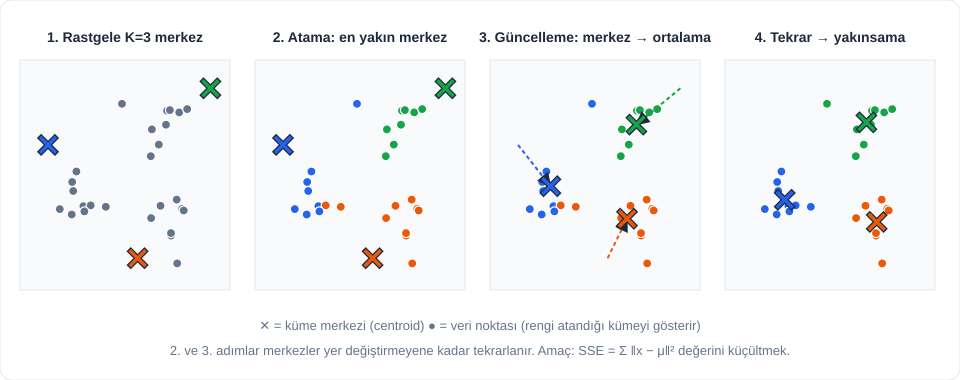</p>

K-Means'in en küçük yapmaya çalıştığı amaç fonksiyonu **küme içi kareler toplamıdır** (SSE / WCSS / inertia):

$$
SSE = \sum_{k=1}^{K}\;\sum_{\mathbf{x}\in C_k}\lVert \mathbf{x} - \boldsymbol{\mu}_k \rVert^2
$$

| Sembol | Okunuşu | Anlamı |
| :---: | :--- | :--- |
| $K$ | "ka" | Küme sayısı |
| $C_k$ | "ce ka" | $k$. kümedeki noktalar kümesi |
| $\boldsymbol{\mu}_k$ | "mü ka" | $k$. kümenin merkezi (noktalarının ortalaması) |
| $\lVert\mathbf{x}-\boldsymbol{\mu}_k\rVert^2$ | "normun karesi" | Noktanın merkezine olan Öklid mesafesinin karesi |

Iris üzerinde elle yazılmış K-Means'te SSE'nin adım adım düşüşü: **20.31 → 9.83 → 7.09 → 7.00 → 6.98 → 6.98** (6. adımda yakınsadı).

> 🎬 **Animasyon:** Atama ve güncelleme adımlarını tek tek izleyin; rastgele ve k-means++ başlangıcı karşılaştırın → [K-Means Animasyonu](https://erkanozhan.github.io/machinelearning/animation/kmeans_animasyonu.html)

**Önemli özellikler:**
- Her adımda SSE **azalır veya aynı kalır**; algoritma her zaman durur. Ancak bulunan çözüm **yerel minimum** olabilir: Kötü başlangıç merkezleri kötü kümelere götürebilir. Çözüm: algoritmayı farklı başlangıçlarla birçok kez çalıştırıp en düşük SSE'li sonucu seçmek (sklearn `n_init=10`) ve merkezleri birbirinden uzak seçen **k-means++** başlangıcını kullanmak (WEKA: `initializationMethod = k-means++`).
- **Küresel ve benzer büyüklükte** kümeleri iyi bulur; hilal, halka gibi şekillerde ve çok farklı yoğunluklarda başarısızdır.
- Aykırı değerler merkezleri kendilerine doğru çeker.

#### K Nasıl Seçilir? Dirsek Yöntemi ve Siluet Skoru 🟢

**Dirsek yöntemi (Elbow method):** $K = 1, 2, \dots$ için SSE hesaplanıp çizilir. $K$ arttıkça SSE **her zaman** azalır ($K = n$ olursa SSE = 0). Aranan nokta, düşüşün belirgin biçimde **yavaşladığı** kırılma noktasıdır ("dirsek").

<p align="center">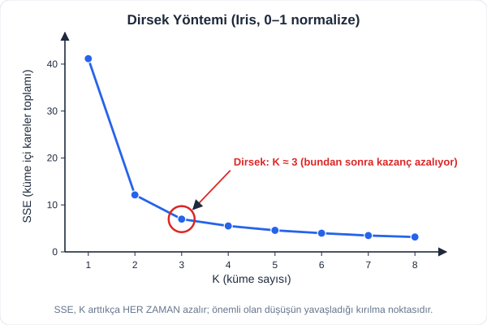</p>

**Siluet skoru (Silhouette)** 🎓: Her nokta için "kendi kümesine ne kadar yakın, en yakın komşu kümeye ne kadar uzak?" sorusunu ölçer:

$$
s(i) = \frac{b(i) - a(i)}{\max\lbrace a(i),\, b(i) \rbrace}
$$

| Sembol | Okunuşu | Anlamı |
| :---: | :--- | :--- |
| $a(i)$ | "a i" | $i$. noktanın **kendi kümesindeki** diğer noktalara ortalama uzaklığı |
| $b(i)$ | "be i" | $i$. noktanın **en yakın diğer kümedeki** noktalara ortalama uzaklığı |
| $s(i)$ | "es i" | $-1$ ile $+1$ arası. $+1$'e yakın: doğru ve net kümelenmiş; $0$: iki kümenin sınırında; negatif: muhtemelen yanlış kümede |

Tüm noktaların ortalama siluet değeri en yüksek olan $K$ tercih edilir.

| K | 1 | 2 | 3 | 4 | 5 | 6 |
| :--- | :---: | :---: | :---: | :---: | :---: | :---: |
| SSE (Iris) | 41.17 | 12.13 | 6.98 | 5.52 | 4.58 | 3.98 |
| Siluet | – | **0.630** | 0.505 | 0.445 | 0.347 | 0.350 |

Siluet $K = 2$'yi öneriyor, çünkü setosa diğer iki türden çok belirgin biçimde ayrıktır; versicolor ve virginica ise birbirine çok yakındır. Dirsek $K = 3$ civarında. **Yöntemler her zaman aynı cevabı vermez**; son karar alan bilgisiyle verilir (biyolojik olarak 3 tür olduğunu biliyoruz).

### 17.2 Hiyerarşik Kümeleme 🟢

Küme sayısını önceden vermeyi gerektirmez; veriden bir **küme ağacı** oluşturur.

- **Birleştirici (agglomerative, aşağıdan yukarı):** Her nokta başta ayrı bir kümedir. Her adımda **en yakın iki küme** birleştirilir; sonunda tek küme kalır. En yaygın türdür.
- **Bölücü (divisive, yukarıdan aşağı):** Tüm noktalar tek kümede başlar, adım adım bölünür.

Sonuç bir **dendrogram** ile gösterilir. Ağaç istenen bir yükseklikten **kesilerek** istenen sayıda küme elde edilir.

<p align="center">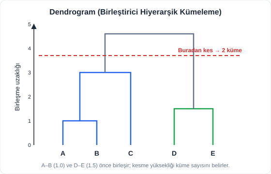</p>

**İki kümenin uzaklığı nasıl ölçülür? (Bağlantı / linkage)** 🎓

| Yöntem | Tanım | Özellik |
| :--- | :--- | :--- |
| **Tek bağlantı (single)** | En yakın iki nokta arasındaki uzaklık | Uzun, zincir biçimli kümeler üretir |
| **Tam bağlantı (complete)** | En uzak iki nokta arasındaki uzaklık | Sıkı, küresel kümeler |
| **Ortalama bağlantı (average)** | Tüm nokta çiftlerinin ortalama uzaklığı | İkisinin arası |
| **Ward** | Birleşince SSE'yi en az artıran çift | K-Means'e benzer sonuçlar; en sık kullanılanlardan |

WEKA: Cluster → `HierarchicalClusterer` (`linkType`, `numClusters`). Sonuç ağacı için Result list → sağ tık → **Visualize tree**.

### 17.3 DBSCAN (Yoğunluk Tabanlı Kümeleme) 🟢

K-Means küresel kümeleri iyi bulur. Peki kümeler hilal ya da halka biçimindeyse? **DBSCAN** (*Density-Based Spatial Clustering of Applications with Noise*) merkezlere değil **yoğunluğa** bakar: Yoğun bölgeleri birbirine bağlayarak kümeler oluşturur.

**Parametreler:**
- **$\varepsilon$ (epsilon):** Bir noktanın komşuluk yarıçapı.
- **minPts:** Bir noktanın "yoğun bölgede" sayılması için $\varepsilon$ yarıçapında bulunması gereken en az nokta sayısı (kendisi dahil).

**Nokta türleri:**
- **Çekirdek nokta (core):** $\varepsilon$ içinde en az minPts komşusu var.
- **Sınır noktası (border):** Kendisi çekirdek değil, ama bir çekirdek noktanın komşuluğunda.
- **Gürültü (noise):** İkisi de değil → hiçbir kümeye atanmaz (**aykırı değer**).

<p align="center">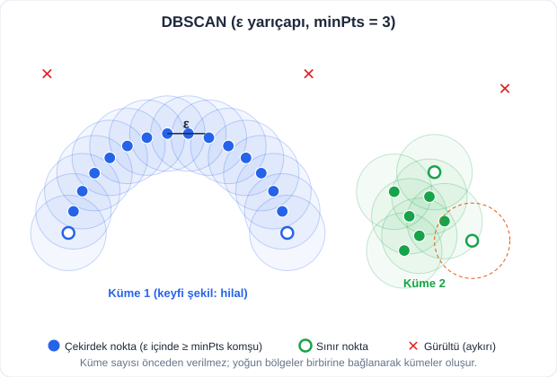</p>

Algoritma bir çekirdek noktadan başlar ve $\varepsilon$ komşuluğu üzerinden **ulaşılabilen** tüm noktaları aynı kümeye ekler; küme genişleyemeyince yeni bir çekirdek noktadan devam eder.

| | K-Means | DBSCAN |
| :--- | :--- | :--- |
| Küme sayısı | Önceden verilmeli | Otomatik bulunur |
| Küme şekli | Küresel | **Keyfi** (hilal, halka…) |
| Aykırı değerler | Kümelere zorla dahil edilir | **Gürültü** olarak etiketlenir |
| Zayıf yönü | Başlangıca duyarlı | $\varepsilon$ seçimi zor; yoğunluğu çok farklı kümelerde zorlanır |

**Deney** (iki hilal biçimli küme, ARI = gerçek gruplarla örtüşme, 1 = mükemmel): **K-Means ARI = 0.47**, **DBSCAN ARI = 0.99**. DBSCAN 2 kümeyi doğru buldu ve 1 noktayı gürültü olarak işaretledi.

WEKA: Cluster → `DBSCAN` (WEKA 3.8'de Package Manager'dan `optics_dbScan` paketi kurulmalıdır).

### 17.4 Kümelemenin Değerlendirilmesi 🟢

| Tür | Ne zaman? | Ölçütler |
| :--- | :--- | :--- |
| **İçsel (internal)** | Gerçek etiketler **yok** (gerçek hayatın çoğu) | SSE, siluet, Davies–Bouldin |
| **Dışsal (external)** | Gerçek etiketler **var** (eğitim amaçlı deneyler) | Yanlış kümelenen oran, Adjusted Rand Index (ARI), saflık |

### 17.5 WEKA ile Iris'in Kümelenmesi 🧪

Amaç: Bilgisayara çiçek türlerini söylemeden, sadece ölçülere bakarak 150 çiçeği gruplara ayırmasını istemek ve sonucu gerçek türlerle karşılaştırmak.

1. Explorer → Preprocess → `iris.arff`.
2. **Cluster** sekmesi → Choose → `SimpleKMeans`.
3. Ayarlar: `numClusters = 3`. `initializationMethod`'u deneyerek (Random / k-means++) sonuçların nasıl değiştiğine bakın; `seed` değerini değiştirmek farklı başlangıçlar verir.
4. **Cluster mode:** `Classes to clusters evaluation` → `(Nom) class`. *(Bu seçenekte WEKA, kümelemeyi yaparken sınıf özniteliğini kullanmaz; sadece sonuçta karşılaştırır.)*
5. **Start.**

**Çıktı – Küme merkezleri:**

```text
Attribute      Full Data   Cluster 0   Cluster 1   Cluster 2
               (150.0)     (50.0)      (61.0)      (39.0)
=========================================================
sepallength    5.8433      5.006       5.9016      6.8538
sepalwidth     3.0573      3.428       2.7484      3.0769
petallength    3.758       1.462       4.3934      5.7423
petalwidth     1.1993      0.246       1.4344      2.0718
```

- **Cluster 0:** Petal ölçüleri çok küçük (1.46 / 0.25) → *Iris-setosa*.
- **Cluster 2:** En büyük petal ölçüleri (5.74 / 2.07) → *Iris-virginica*.
- **Cluster 1:** Ara değerler → *Iris-versicolor*.

**Çıktı – Kümeler ve sınıflar:**

```text
  0  1  2  <-- assigned to cluster
 50  0  0 | Iris-setosa
  0 47  3 | Iris-versicolor
  0 14 36 | Iris-virginica

Incorrectly clustered instances :   17.0    11.3333 %
Within cluster sum of squared errors: 6.998114004826762
```

**Yorum:**
- Setosa'nın 50'si de doğru kümede (hata %0): Diğerlerinden çok belirgin biçimde ayrılıyor.
- Versicolor'ın 3'ü, virginica'nın 14'ü karışmış. Toplam 17 hata (**%11.3**). Bu iki türün ölçüleri uzayda iç içe geçtiği için %100 ayrım mümkün değildir.
- **Incorrectly clustered instances** dışsal bir ölçüttür: "Doğru bildin mi?" Gerçek hayatta etiketler olmadığında bakılamaz.
- **Within cluster sum of squared errors (SSE)** içsel bir ölçüttür: "Gruplama ne kadar sıkı?" Etiket olmasa da her zaman hesaplanır. Küçük değer, noktaların merkezlerinin etrafında sıkı toplandığını gösterir.
- Görselleştirme: Result list → sağ tık → **Visualize cluster assignments**. Eksenlere `petallength` ve `petalwidth` seçin, **Color: Cluster** yapın.

> 💡 **Kümeleri yeni öznitelik olarak kullanmak:** Preprocess → `filters → unsupervised → attribute → AddCluster` filtresi, her örneğe bulunduğu kümeyi yeni bir sütun olarak ekler. Bu yöntem [Bölüm 25](#b25)'teki ödevde kullanılır.

➡️ K-Means'in sıfırdan yazılışı, dirsek/siluet, dendrogram ve DBSCAN: [`codes/python/10_kumeleme.py`](https://github.com/erkanozhan/machinelearning/blob/main/codes/python/10_kumeleme.py)

---

<a id="b18"></a>

## 18. Birliktelik Kuralları (Association Rules)

### 18.1 Sepet Analizi 🟢

"Ekmek alan müşterilerin çoğu tereyağı da alıyor." Bu tür **"EĞER X İSE Y"** kurallarını büyük işlem verilerinden otomatik bulmaya **birliktelik kuralı madenciliği** denir. Marketlerde ürün yerleşimi ve kampanya tasarımı, e-ticarette "Bunu alanlar şunu da aldı" önerileri, web kullanım analizi ve tıpta birlikte görülen belirtilerin tespiti tipik uygulamalarıdır.

Örnek veri (8 alışveriş sepeti):

| Sepet | Ürünler |
| :---: | :--- |
| 1 | ekmek, süt |
| 2 | ekmek, tereyağı, yumurta |
| 3 | süt, tereyağı, çay |
| 4 | ekmek, süt, tereyağı |
| 5 | ekmek, süt, tereyağı, çay |
| 6 | süt, çay |
| 7 | ekmek, tereyağı |
| 8 | ekmek, süt, yumurta |

### 18.2 Destek, Güven ve Kaldıraç (Lift) 🟢

Bir kural $X \Rightarrow Y$ biçimindedir ($X$: öncül / antecedent, $Y$: sonuç / consequent).

$$
\text{supp}(X) = \frac{\text{count}(X)}{N}, \qquad \text{conf}(X \Rightarrow Y) = \frac{\text{supp}(X \cup Y)}{\text{supp}(X)}, \qquad \text{lift}(X \Rightarrow Y) = \frac{\text{conf}(X\Rightarrow Y)}{\text{supp}(Y)}
$$

| Sembol / Terim | Okunuşu | Anlamı |
| :---: | :--- | :--- |
| $\text{count}(X)$ | "kaunt iks" | $X$'teki ürünlerin hepsini içeren sepet sayısı |
| $N$ | "en" | Toplam işlem (sepet) sayısı |
| $\text{supp}$ | "sapport" | Destek (support) |
| $\text{conf}$ | "konfidans" | Güven (confidence) |
| $X \cup Y$ | "iks birleşim ye" | $X$ ve $Y$'deki ürünlerin **hepsini** içeren sepetler |
| **Destek (support)** | | Kuralın ne kadar **yaygın** olduğu |
| **Güven (confidence)** | | $X$ alındığında $Y$'nin de alınma olasılığı: $P(Y \mid X)$ |
| **Kaldıraç (lift)** | | $X$'in varlığı $Y$'nin olasılığını kaç kat artırıyor? **> 1:** pozitif ilişki · **= 1:** bağımsız · **< 1:** birbirini dışlıyor |

**Örnek: $\lbrace$çay$\rbrace \Rightarrow \lbrace$süt$\rbrace$**
- destek(çay) = 3/8 = 0.375 (sepet 3, 5, 6)
- destek(çay ∪ süt) = 3/8 = 0.375 (üç sepette de süt var)
- güven = 0.375 / 0.375 = **1.00** → çay alan herkes süt de almış.
- destek(süt) = 6/8 = 0.75 → lift = 1.00 / 0.75 = **1.33** → çay alanların süt alma olasılığı genel ortalamanın 1.33 katı.

**Örnek: $\lbrace$ekmek$\rbrace \Rightarrow \lbrace$süt$\rbrace$:** güven = 0.500 / 0.750 = 0.667 ama lift = 0.667 / 0.75 = **0.89 < 1**. Güven yüksek görünse de ekmek almak süt alma olasılığını **artırmıyor** (süt zaten çok popüler). ⚠️ **Sadece güvene bakmak yanıltıcıdır; lift'e de bakılmalıdır.**

### 18.3 Apriori Algoritması 🟢

Tüm ürün kombinasyonlarını denemek imkânsızdır: 1000 ürün için $2^{1000}$ alt küme vardır. **Apriori ilkesi** arama uzayını büyük ölçüde budar:

> **"Bir öğe kümesi sık değilse, onu içeren hiçbir büyük küme de sık olamaz."** (Az kişi {çay, yumurta} alıyorsa, {çay, yumurta, ekmek} alan daha da azdır.)

**Adımlar** (min. destek = 0.25, min. güven = 0.60):
1. **Seviye 1:** Tek ürünlerin desteği hesaplanır; eşiğin altındakiler elenir. (Burada hepsi geçti; yumurta tam 0.25.)
2. **Seviye 2:** Sık tekli kümelerden ikili adaylar üretilir. {yumurta, tereyağı} (0.125), {yumurta, süt} (0.125), {çay, yumurta} (0), {çay, ekmek} (0.125) **elenir**.
3. **Seviye 3:** Sadece **tüm alt kümeleri sık olan** üçlüler aday olur: {ekmek, süt, tereyağı} (0.25 ✓), {süt, tereyağı, çay} (0.25 ✓).
4. **Kural üretimi:** Her sık kümeden kurallar türetilir, güven ve lift eşiğini geçenler raporlanır.

En yüksek lift'li kurallar:

| Kural | Destek | Güven | Lift |
| :--- | :---: | :---: | :---: |
| $\lbrace$çay$\rbrace \Rightarrow \lbrace$süt, tereyağı$\rbrace$ | 0.250 | 0.667 | **1.78** |
| $\lbrace$süt, tereyağı$\rbrace \Rightarrow \lbrace$çay$\rbrace$ | 0.250 | 0.667 | **1.78** |
| $\lbrace$yumurta$\rbrace \Rightarrow \lbrace$ekmek$\rbrace$ | 0.250 | 1.000 | 1.33 |
| $\lbrace$çay$\rbrace \Rightarrow \lbrace$süt$\rbrace$ | 0.375 | 1.000 | 1.33 |
| $\lbrace$ekmek$\rbrace \Rightarrow \lbrace$süt$\rbrace$ | 0.500 | 0.667 | 0.89 |

➡️ Ek kütüphane gerektirmeyen Apriori kodu: [`codes/python/11_birliktelik_kurallari_apriori.py`](https://github.com/erkanozhan/machinelearning/blob/main/codes/python/11_birliktelik_kurallari_apriori.py) (hazır kütüphane: `pip install mlxtend`)

> 🎓 **FP-Growth**, veritabanını bir önek ağacına (FP-tree) sıkıştırarak aday üretmeden sık öğe kümelerini bulur; büyük veride Apriori'den çok daha hızlıdır. WEKA'da `FPGrowth` olarak bulunur.

### 18.4 WEKA ile Birliktelik Kuralları 🧪

1. Explorer → Preprocess → `weather.nominal.arff` (veya büyük bir örnek için `supermarket.arff`). Apriori **kategorik** veri ister; sayısal öznitelikler varsa önce `Discretize` filtresi uygulanmalıdır.
2. **Associate** sekmesi → Choose → `Apriori`.
3. Önemli parametreler: `lowerBoundMinSupport` (min. destek), `metricType` (Confidence / Lift / Leverage / Conviction), `minMetric` (ör. güven için 0.9), `numRules` (kaç kural listelensin, varsayılan 10).
4. **Start.** Çıktı şu biçimdedir:

```text
 1. outlook=overcast 4 ==> play=yes 4    <conf:(1)> lift:(1.56) lev:(0.1) conv:(1.43)
```

Okunuşu: "outlook = overcast olan 4 günün 4'ünde de play = yes; güven = 1, lift = 1.56."

---

<a id="b19"></a>

## 19. Boyut Azaltma: PCA ve Öznitelik Seçimi

### 19.1 Neden Boyut Azaltırız? 🟢

"Veri ne kadar çoksa o kadar iyi" düşüncesi **öznitelik sayısı** için her zaman doğru değildir. Yüzlerce, binlerce öznitelikle karşılaşıldığında **boyut laneti (curse of dimensionality)** ortaya çıkar: Boyut arttıkça veri uzayda seyrekleşir, mesafe ve benzerlik ölçüleri anlamını yitirir ve model gürültüyü ezberlemeye başlar.

Boyut azaltmanın amaçları:
- **Performans:** Gürültüyü ve gereksiz öznitelikleri atıp modelin "sinyale" odaklanmasını sağlamak.
- **Verimlilik:** Eğitim süresini, bellek ve depolama ihtiyacını azaltmak.
- **Yorumlanabilirlik ve görselleştirme:** 2–3 boyuta indirip veriyi gözle incelemek.

İki temel yol vardır:

| **Öznitelik Seçimi (Feature Selection)** | **Öznitelik Çıkarımı (Feature Extraction)** |
| :--- | :--- |
| Mevcut özniteliklerin **bir alt kümesi seçilir** | Öznitelikler matematiksel olarak birleştirilip **yeni öznitelikler üretilir** |
| Özniteliklerin anlamı korunur (yorumlanabilir) | Yeni özniteliklerin doğrudan fiziksel anlamı yoktur |
| Örnek: Bilgi kazancı ile sıralama, CFS, RFE, Lasso | Örnek: **PCA**, LDA, t-SNE, UMAP, otokodlayıcılar |

### 19.2 Temel Bileşen Analizi (PCA) 🟢

PCA, birbiriyle **ilişkili (korelasyonlu)** çok sayıdaki değişkeni, aralarında ilişki olmayan ve verideki **değişimi (varyansı) en iyi açıklayan** daha az sayıda yeni değişkene dönüştürür. Bu yeni değişkenlere **temel bileşenler (principal components)** denir.

> 💡 Bir fotoğrafçı, 3 boyutlu bir heykelin **en çok ayrıntısını** gösterecek tek bir 2 boyutlu fotoğraf çekmek ister ve bunun için en uygun açıyı arar. PCA matematiksel olarak tam bunu yapar: Veriyi en az bilgi kaybıyla daha az boyuta yansıtan "açıyı" bulur.

1. **PC1 (birinci bileşen):** Verinin **en çok yayıldığı** yön.
2. **PC2:** Kalan varyansın en büyük olduğu yön; PC1'e **dik (ortogonal)** olmak zorundadır. Böylece PC1'in taşıdığı bilgiyi tekrar etmez.
3. Bu şekilde orijinal öznitelik sayısı kadar bileşen bulunabilir. Genellikle toplam varyansın büyük kısmını (ör. %95) açıklayan **ilk birkaç bileşen** tutulur, gerisi atılır.

<p align="center">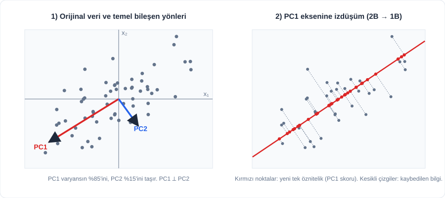</p>

<details>
<summary>🎓 <b>Derinleşme: PCA'nın matematiği</b></summary>

1. Veri **standartlaştırılır** (her sütun ortalama 0, std 1).
2. **Kovaryans matrisi** hesaplanır: $\Sigma = \frac{1}{n-1}X^{T}X$ ($d \times d$).
3. $\Sigma$'nın **özdeğer–özvektör** ayrışımı yapılır: $\Sigma\,\mathbf{v}_k = \lambda_k\,\mathbf{v}_k$.
4. Özvektörler özdeğere göre büyükten küçüğe sıralanır. İlk $k$ özvektör bir $W_k$ matrisi oluşturur ve veri bu yönlere izdüşürülür: $Z = X W_k$.
5. $k$. bileşenin açıkladığı varyans oranı: $\frac{\lambda_k}{\sum_j \lambda_j}$.

| Sembol | Okunuşu | Anlamı |
| :---: | :--- | :--- |
| $\Sigma$ | "büyük sigma" | Kovaryans matrisi (toplam sembolüyle karıştırmayın) |
| $\mathbf{v}_k$ | "ve ka" | $k$. özvektör = $k$. temel bileşenin yönü. Elemanlarına **yük (loading)** denir |
| $\lambda_k$ | "lamda ka" | $k$. özdeğer = o yöndeki varyans miktarı |
| $Z$ | "zet" | Yeni koordinatlardaki veri (bileşen skorları) |

**Iris için:** Özdeğerler $[2.938,\ 0.920,\ 0.148,\ 0.021]$ → açıklanan varyans $[72.96\%,\ 22.85\%,\ 3.67\%,\ 0.52\%]$. PC1 yükleri: sepal length −0.52, sepal width +0.27, petal length −0.58, petal width −0.57. PC1 esas olarak **"çiçeğin genel büyüklüğü"** eksenidir.

</details>

> ⚠️ **PCA'dan önce standartlaştırma şarttır.** PCA varyansa bakar. Bir sütun 1–10, diğeri 1000–5000 aralığındaysa PCA büyük sayılı sütunu "daha önemli" sanır.
>
> ⚠️ PCA **denetimsizdir**: Sınıf etiketine bakmaz. En çok varyansı taşıyan yön, sınıfları ayıran yön olmayabilir. Ayrıca **doğrusal** bir yöntemdir; eğrisel yapılarda (İsviçre rulosu gibi) **t-SNE** veya **UMAP** gibi doğrusal olmayan yöntemler gerekir. Bu yöntemler daha çok görselleştirme için kullanılır.

#### 🧪 WEKA ile PCA

Hipotez: *Öznitelik sayısını azaltsak da sınıflandırma başarısı fazla düşmemeli.*
1. **Referans:** `iris.arff` → Classify → `J48`, 10 katlı CV → doğruluk ≈ **%96**.
2. **PCA:** Preprocess → Filter → `unsupervised → attribute → PrincipalComponents`. Önemli parametre: `varianceCovered = 0.95`, yani "varyansın %95'ini açıklayan en az sayıda bileşeni tut". WEKA verileri varsayılan olarak kendisi standartlaştırır. **Apply** → 4 öznitelik yerine **2 yeni öznitelik** gelir (kümülatif varyans %95.8).
3. Aynı J48'i bu 2 bileşenle çalıştırın.

**Yorum:** Doğruluk genellikle bir miktar **düşer** (Python deneyinde 0.933 → 0.913). Atılan bileşenler tamamen "gereksiz" değildi. PCA yalnızca varyansa baktığı için sınıf ayrımına yarayan küçük ayrıntıları atabilir. **Karar bir takastır:** Öznitelik sayısını yarıya indirmek, küçük bir doğruluk kaybına değer mi? Iris'te öznitelik zaten az olduğu için muhtemelen hayır; binlerce öznitelikli bir veride ise genellikle evet. Bu durumda başvurulacak ikinci yol **öznitelik seçimidir**.

> ⚠️ Preprocess'te PCA uygulayıp **sonra** CV yapmak küçük bir veri sızıntısıdır (PCA test katmanlarını da görmüştür). Doğrusu: `meta → FilteredClassifier` (filter = PrincipalComponents, classifier = J48) ([Bölüm 22](#b22)).

#### 🧪 Python ile PCA

```python
from sklearn.datasets import load_iris
from sklearn.preprocessing import StandardScaler
from sklearn.decomposition import PCA

X, y = load_iris(return_X_y=True)
X_std = StandardScaler().fit_transform(X)                   # 1) Standartlaştır (PCA için şart)
pca = PCA(n_components=2).fit(X_std)                        # 2) İlk 2 bileşeni bul
X_pca = pca.transform(X_std)                                # 3) 4 boyut → 2 boyut
print(pca.explained_variance_ratio_)                        # [0.7296 0.2285] → toplam %95.8 bilgi korundu
```

➡️ PCA'nın sıfırdan (özdeğer ayrışımıyla) hesaplanması, görselleştirme ve sızıntısız Pipeline karşılaştırması: [`codes/python/12_pca_ve_oznitelik_secimi.py`](https://github.com/erkanozhan/machinelearning/blob/main/codes/python/12_pca_ve_oznitelik_secimi.py)

### 19.3 Öznitelik Seçimi 🟢

Burada öznitelikleri dönüştürmek yerine **eleğe** koyarız: "Hangi sütun işe yarıyor, hangisi kalabalık yapıyor?"

| Yaklaşım | Nasıl çalışır? | Örnek | Hız |
| :--- | :--- | :--- | :--- |
| **Filtre (filter)** | Her özniteliği modelden bağımsız bir istatistikle puanlar | Bilgi kazancı, ki-kare, korelasyon, karşılıklı bilgi | Çok hızlı |
| **Sarmalayıcı (wrapper)** | Öznitelik alt kümelerini **bir modeli eğitip test ederek** değerlendirir | İleri/geri seçim, RFE, WEKA `WrapperSubsetEval` | Yavaş ama genellikle daha isabetli |
| **Gömülü (embedded)** | Seçim, modelin eğitimi sırasında kendiliğinden yapılır | Lasso (L1), karar ağacı öznitelik önemi | Orta |

#### 🧪 WEKA: "Select attributes" Sekmesi

Bu sekmede birbiriyle uyumlu çalışması gereken iki bileşen vardır:
1. **Attribute Evaluator (değerlendirici, "jüri"):** Öznitelik veya öznitelik kümesine puan verir.
2. **Search Method (arama yöntemi, "izci"):** Olası öznitelik kümeleri arasında nasıl dolaşılacağını belirler.

**Senaryo 1 – Tek tek puanlama (sıralama):**
- Evaluator: `InfoGainAttributeEval` (bilgi kazancı: "Sadece bu özniteliği bilseydim, sınıf hakkındaki belirsizliğim ne kadar azalırdı?" [Bölüm 10](#b10)). WEKA arama yöntemini `Ranker` yapmanızı ister; onaylayın.
- Attribute Selection Mode: **Use full training set** → **Start**:

```text
Ranked attributes:
 1.418  3 petallength
 1.378  4 petalwidth
 0.698  1 sepallength
 0.376  2 sepalwidth
```

`petallength` ve `petalwidth` sınıf hakkında en çok bilgiyi taşıyor; `sepalwidth` en zayıf. *(Cross-validation modu seçilirse çıktı, katmanlar boyunca ortalama puan ve ortalama sıra (`average merit`, `average rank`) biçiminde verilir. Bu, sıralamanın ne kadar **kararlı** olduğunu gösterir.)*

**Senaryo 2 – En iyi alt kümeyi seçme:**
- Evaluator: `CfsSubsetEval` (korelasyon tabanlı öznitelik seçimi). İlkesi şudur: *"İyi bir alt kümedeki öznitelikler sınıfla **yüksek**, birbirleriyle **düşük** korelasyonlu olmalıdır."* Aynı bilgiyi tekrar eden iki öznitelik istenmez.
- Search: `BestFirst` (öznitelik kombinasyonlarını akıllıca dener) → **Start**:

```text
Selected attributes: 3,4 : 2
                     petallength
                     petalwidth
```

Bireysel olarak iyi öznitelikleri bir araya getirmek her zaman en iyi takımı kurmak anlamına gelmez; önemli olan birlikte ne kadar iyi çalıştıklarıdır. CFS, iki sepal ölçüsünün **ek bilgi getirmediğine** karar verdi.

**Python karşılıkları** (aynı kod dosyasında): Filtre → `mutual_info_classif` (Iris: petal length 0.99, petal width 0.98, sepal length 0.47, sepal width 0.29); sarmalayıcı → `RFE`; gömülü → `LogisticRegression(penalty="l1")`. Meme kanseri verisinde L1 cezası 30 katsayının 23'ünü **tam sıfır** yaptı ve 7 öznitelik bıraktı.

| | **PCA** | **Öznitelik Seçimi** |
| :--- | :--- | :--- |
| Ne yapar? | Veriyi yeni eksenlere **döndürür / bükerek** dönüştürür | Orijinal sütunlardan **işe yarayanları seçer** |
| Yorumlanabilirlik | Düşük (PC1 = karışım) | Yüksek (hangi ölçüm önemli, açıkça görülür) |
| Sınıf etiketini kullanır mı? | Hayır | Genellikle evet |

> 💡 Bir projeye başlarken yüzlerce sütunu doğrudan modele vermek yerine önce bu analizi yapmak, kurulacak modelin başarısını doğrudan etkileyen **stratejik** bir adımdır. Ayrıca veri toplama maliyetini de düşürür: Gereksiz bir ölçüm artık yapılmayabilir.

---

<a id="b20"></a>

## 20. Dengesiz Veri ve Maliyete Duyarlı Öğrenme

### 20.1 Her Hatanın Bedeli Aynı Değildir 🟢

Standart algoritmalar tüm hataların **eşit maliyetli** olduğunu varsayar ve toplam hata sayısını en aza indirir:

$$
\text{Hata} = \sum_{i=1}^{N} \mathbb{I}(y_i \neq \hat{y}_i)
$$

| Sembol | Okunuşu | Anlamı |
| :---: | :--- | :--- |
| $\mathbb{I}(\cdot)$ | "gösterge fonksiyonu" | İçindeki koşul doğruysa 1, değilse 0 |
| $y_i \neq \hat{y}_i$ | "ye i eşit değil ye şapka i" | Yanlış tahmin |

Oysa gerçek hayatta:
- Hasta birine "sağlıklısın" demek (**FN**) hastanın tedavi şansını yok edebilir. Sağlıklı birine "bir test daha yapalım" demek (**FP**) ise yalnızca zaman ve para kaybıdır.
- Batacak bir krediyi onaylamak (bankanın parası gider), iyi bir müşteriyi reddetmekten (potansiyel kâr kaybı) çok daha pahalıdır.

Bu durum özellikle **dengesiz veri setlerinde** (dolandırıcılık %0.1, nadir hastalık %1, üretim hattındaki kusurlu parça %0.5) kritiktir. Algoritma nadir ama önemli sınıfı görmezden gelip çoğunluk sınıfını tahmin ederek yüksek doğruluk elde edebilir ([Bölüm 14.2](#b14)).

### 20.2 Maliyet Matrisi 🟢

Karışıklık matrisindeki her hücreye bir **maliyet** atanır. Satırlar **gerçek**, sütunlar **tahmin edilen** sınıftır:

$$
C = \begin{bmatrix} C_{00} & C_{01} \\ C_{10} & C_{11} \end{bmatrix} = \begin{bmatrix} 0 & C_{FP} \\ C_{FN} & 0 \end{bmatrix}
$$

Amaç artık hata **sayısını** değil, **toplam maliyeti** en aza indirmektir:

$$
\text{Maliyet}_{\text{toplam}} = \sum_{i=1}^{N} C(y_i, \hat{y}_i) = FP \cdot C_{FP} + FN \cdot C_{FN}
$$

| Sembol | Okunuşu | Anlamı |
| :---: | :--- | :--- |
| $C_{jk}$ | "ce je ka" | Gerçek sınıf $j$ iken $k$ tahmin etmenin maliyeti |
| $C_{FP}$, $C_{FN}$ | "ce ef pe", "ce ef en" | Yanlış pozitif ve yanlış negatif hatalarının maliyeti. Doğru tahminlerin maliyeti genellikle 0 alınır |
| $C(y_i, \hat{y}_i)$ | | $i$. örnek için ödenen bedel |

⚠️ Hangi hatanın FP, hangisinin FN olduğu **pozitif sınıfın hangisi seçildiğine** bağlıdır. Raporlarda pozitif sınıfı her zaman açıkça belirtin.

### 20.3 Çözüm Yaklaşımları 🟢

1. **Veri seviyesi – yeniden örnekleme:**
   - **Aşırı örnekleme (oversampling):** Azınlık sınıfının örnekleri çoğaltılır. **SMOTE**, iki komşu azınlık örneği arasında **yapay yeni örnekler** üretir.
   - **Alt örnekleme (undersampling):** Çoğunluk sınıfından örnek atılır.
   - ⚠️ Yeniden örnekleme **yalnızca eğitim verisine** uygulanır; test verisi gerçek dünyayı temsil etmeli ve olduğu gibi kalmalıdır ([Bölüm 22](#b22)).
2. **Algoritma seviyesi – sınıf ağırlıkları:** Kayıp fonksiyonunda pahalı sınıfın hataları daha ağır sayılır:
   $L = -\sum_{i} w_{y_i}\,\log \hat{p}_{i,\,y_i}$ ($w_{y_i}$: örneğin gerçek sınıfının ağırlığı; $\hat{p}_{i,y_i}$: modelin gerçek sınıfa verdiği olasılık). scikit-learn: `class_weight={0: 1, 1: 10}` veya `class_weight="balanced"`.
3. **Karar eşiğini kaydırma (threshold moving):** Model eğitildikten sonra 0.5 eşiği değiştirilir. Olasılıklar iyi kalibre edilmişse, pozitif demenin beklenen maliyeti negatif demenin beklenen maliyetinden küçük olduğunda pozitif denmelidir:

$$
\hat{p}\cdot 0 + (1-\hat{p})\,C_{FP} \;<\; \hat{p}\,C_{FN} \quad\Longrightarrow\quad \hat{p} > t^{*} = \frac{C_{FP}}{C_{FP} + C_{FN}}
$$

| Sembol | Okunuşu | Anlamı |
| :---: | :--- | :--- |
| $\hat{p}$ | "pe şapka" | Modelin pozitif sınıf olasılığı |
| $t^{*}$ | "te yıldız" | Maliyeti en küçük yapan eşik |

   **Örnek:** $C_{FP} = 1$, $C_{FN} = 10$ → $t^* = 1/11 \approx 0.09$. Model bir işlem için "yalnızca %10 ihtimalle dolandırıcılık" dese bile işlemi şüpheli olarak işaretlemek toplam maliyeti düşürür. Pratikte eşik, **doğrulama seti** üzerinde maliyeti en küçük yapacak şekilde de aranabilir (test setinde **değil**).

### 20.4 Deney 🧪

%95 negatif / %5 pozitif veri, $C_{FP} = 1$, $C_{FN} = 10$, test seti (1200 örnek):

| Yöntem | FP | FN | Recall | Toplam maliyet |
| :--- | :---: | :---: | :---: | :---: |
| Standart lojistik regresyon (eşik 0.5) | 2 | 65 | 0.02 | 652 |
| `class_weight={0:1, 1:10}` | 195 | 44 | 0.33 | 635 |
| `class_weight="balanced"` | 382 | 22 | 0.67 | 602 |
| Rastgele aşırı örnekleme (eğitimde) | 379 | 23 | 0.65 | 609 |
| **Teorik eşik $t^* = 0.091$** | 166 | 41 | 0.38 | **576** |
| Doğrulama setinde seçilen eşik (0.10) | 140 | 46 | 0.30 | 600 |

**Yorum:** Standart model neredeyse hiçbir pozitifi yakalamıyor (recall 0.02). Doğruluğu çok yüksek görünür (~%94.4), ama maliyeti en yüksek olan odur. Maliyete duyarlı tüm yöntemler doğruluğu **düşürürken** toplam maliyeti **azaltıyor**. **Mühendislikte hedef en yüksek doğruluk değil, problemi en düşük toplam maliyetle çözmektir.**

➡️ [`codes/python/13_maliyete_duyarli_ogrenme.py`](https://github.com/erkanozhan/machinelearning/blob/main/codes/python/13_maliyete_duyarli_ogrenme.py) (SMOTE için: `pip install imbalanced-learn`)

### 20.5 WEKA ile Maliyete Duyarlı Öğrenme 🧪

WEKA'da `meta → CostSensitiveClassifier` bir **meta-sınıflandırıcıdır**: Kendi başına karar vermez, J48 veya NaiveBayes gibi bir temel sınıflandırıcıyı sarmalayarak ona maliyet bilinci kazandırır.

**Veri:** `credit-g.arff` (Alman kredi verisi; 1000 başvuru, sınıflar `good` ve `bad`). Veri setinin kendi belgelerinde önerilen maliyet: kötü bir müşteriyi iyi sanmak, iyi bir müşteriyi reddetmekten **5 kat** pahalıdır.

1. Explorer → `credit-g.arff` → Classify → `meta → CostSensitiveClassifier`.
2. `classifier = trees → J48`.
3. `costMatrix` → 2×2 matris. Sınıf sırası `good, bad`; **satır = gerçek, sütun = tahmin**:

```text
             tahmin: good   tahmin: bad
gerçek good      0.0           1.0        ← iyi müşteriyi reddetmek (maliyet 1)
gerçek bad       5.0           0.0        ← kötü müşteriye kredi vermek (maliyet 5, kritik hata)
```

4. `minimizeExpectedCost`:
   - `False` (varsayılan) → **Yeniden ağırlıklandırma (reweighting):** Pahalı sınıfın örneklerine eğitimde daha fazla ağırlık verilir.
   - `True` → **Beklenen maliyeti en küçük yapma:** Model normal eğitilir; tahmin anında en olası sınıf yerine **beklenen maliyeti en düşük** sınıf seçilir (eşik kaydırmanın genel hâli).
5. **More options → Cost-sensitive evaluation** → aynı matrisi girin. Çıktıda `Total Cost` ve `Average Cost` satırları görünür.
6. Karşılaştırma: Önce tek başına J48, sonra CostSensitiveClassifier. Genellikle **doğruluk biraz düşer**, `bad` sınıfının recall değeri artar ve **toplam maliyet azalır**. Model, pahalı hatayı önlemek için karar sınırlarını daha temkinli hâle getirmiştir.

> 💡 Dengesiz veri için WEKA'da ayrıca `supervised → instance → SMOTE` (Package Manager'dan kurulur), `ClassBalancer` ve `Resample` filtreleri vardır. Bunları sızıntısız kullanmak için `FilteredClassifier` içine yerleştirin.

---

<a id="b21"></a>

## 21. Optimizasyon ve Hiperparametre Ayarlama

### 21.1 Model Nasıl Öğrenir? Optimizasyon 🟢

Eğitim sırasında cevaplanan soru şudur: *"Veriye en iyi uyan parametre değerleri nedir?"* Bunun için bir **maliyet fonksiyonu** $J(\theta)$ tanımlanır ([Bölüm 6.2](#b6)) ve en küçük değeri aranır. Bu işleme **optimizasyon** denir (Latince *optimus*: "en iyi").

En yaygın yöntem **gradyan inişidir** ([Bölüm 6.4](#b6)). Varyantları:

| Varyant | Her güncellemede kullanılan veri | Özellik |
| :--- | :--- | :--- |
| Batch GD | Tüm eğitim verisi | Kararlı ama büyük veride yavaş |
| **Stokastik GD (SGD)** | Tek bir örnek | Hızlı, gürültülü adımlar (yerel minimumlardan kaçmaya yardım eder) |
| Mini-batch GD | Küçük bir grup (ör. 32–256 örnek) | Derin öğrenmede standart |
| Momentum, RMSProp, **Adam** | — | Adım yönünü ve büyüklüğünü geçmiş gradyanlara göre uyarlar |

### 21.2 Öğrenme Oranı ve Zamanlaması 🟢

**Öğrenme oranı** ($\alpha$ veya $\eta$) her adımın büyüklüğüdür. Çok büyükse model hedefi atlar ve ıraksayabilir; çok küçükse öğrenme çok yavaş olur ([şekil, Bölüm 6.4](#b6)).

**Öğrenme oranı zamanlaması (learning rate scheduling):** Eğitimin başında büyük adımlar atılır, ilerledikçe adımlar küçültülür. Yeni bir şehre taşındığınızda önce hızlıca genel bir keşif yapar, sonra ayrıntılara inersiniz.
- **Step decay:** Belirli aralıklarla sabit bir oranda düşürülür.
- **Exponential decay:** $\alpha_t = \alpha_0\,e^{-kt}$
- **Uyarlamalı yöntemler (Adam vb.):** Her parametre için öğrenme oranını otomatik ayarlar.

### 21.3 Ölçeklendirme ve Gradyan İnişi 🟢

Bir öznitelik 0–1, diğeri 0–10 000 aralığındaysa maliyet yüzeyi çok uzamış bir vadi gibidir ve gradyan inişi zikzaklar çizerek çok yavaş ilerler. Ölçeklendirilmemiş veriyle gradyan inişi, bir bacağı uzun diğeri kısa biriyle yürümeye benzer. Standardizasyon ($z = \frac{x-\mu}{\sigma}$) veya normalizasyon ($\frac{x - x_{\min}}{x_{\max}-x_{\min}}$) yüzeyi yuvarlaklaştırır ve yakınsamayı hızlandırır ([Bölüm 5.8](#b5)).

### 21.4 Düzenlileştirme (Regularization): Modeli Dizginlemek 🟢

Aşırı öğrenmeyi önlemenin bir yolu, maliyet fonksiyonuna **parametrelerin büyüklüğünü cezalandıran** bir terim eklemektir (Latince *regularis*: "kurala uygun"):

$$
J_{\text{L2}}(\theta) = J(\theta) + \lambda\sum_{j=1}^{d}\theta_j^2 \qquad\qquad J_{\text{L1}}(\theta) = J(\theta) + \lambda\sum_{j=1}^{d}\lvert\theta_j\rvert
$$

| Sembol | Okunuşu | Anlamı |
| :---: | :--- | :--- |
| $\lambda$ | "lamda" | Cezanın şiddeti. 0 → düzenlileştirme yok; çok büyük → tüm katsayılar sıfıra yaklaşır (eksik öğrenme) |
| $\sum_j \theta_j^2$ | | L2 normunun karesi (sabit terim $\theta_0$ genellikle cezalandırılmaz) |
| $\sum_j \lvert\theta_j\rvert$ | | L1 normu |

- **L2 (Ridge):** Katsayıları **küçültür** ama sıfırlamaz. Model daha yumuşak ve kararlı hâle gelir; çoklu doğrusallığa karşı iyi çalışır.
- **L1 (Lasso):** Bazı katsayıları **tam sıfır** yapar ve böylece otomatik **öznitelik seçimi** yapar ([Bölüm 19.3](#b19)).
- **Elastic Net:** İkisinin karışımı.

> 💡 L2 bütçedeki tüm kalemleri biraz kısar; L1 bazı kalemleri tamamen siler.

L2 ile gradyan inişi güncellemesi (sabitler $\lambda$'nın içine katılarak):

$$
\theta_j \leftarrow \theta_j - \eta\left(\frac{\partial J}{\partial \theta_j} + \lambda\,\theta_j\right)
$$

Her adımda iki kuvvet dengelenir: hatayı azaltmak isteyen gradyan ve parametreleri sıfıra doğru çeken ceza (**ağırlık sönümü, weight decay**).

> ⚠️ Kütüphanelerde adlandırma farklıdır: scikit-learn `Ridge`/`Lasso`/`SGD*` modellerinde `alpha` = $\lambda$'dır. `LogisticRegression` ve `SVC`'de ise **`C` = $1/\lambda$**'dır; yani **büyük C = az düzenlileştirme**.

### 21.5 Erken Durdurma (Early Stopping) 🟢

Eğitim sırasında hem **eğitim hatası** hem de ayrı bir **doğrulama hatası** izlenir. Eğitim hatası genellikle sürekli düşer. Doğrulama hatası ise bir noktadan sonra düşmeyi bırakır, hatta yükselmeye başlar. O nokta, modelin **ezberlemeye başladığı** andır ([şekil, Bölüm 13.2](#b13)). Erken durdurma eğitimi orada keser ve en iyi doğrulama skorundaki parametreleri kullanır. Özellikle sinir ağları ve gradyan artırmada etkilidir.

**Deney** (MLP, meme kanseri): Erken durdurma **olmadan** 92 epoch, eğitim doğruluğu 1.000, test 0.953. Erken durdurma **ile** 23 epoch, eğitim 0.995, test **0.959**. Dört kat daha kısa eğitimle aynı veya biraz daha iyi genelleme elde edildi.

### 21.6 Parametre ile Hiperparametre Arasındaki Fark 🟢

| | **Parametre** | **Hiperparametre** |
| :--- | :--- | :--- |
| Ne zaman belirlenir? | Eğitim **sırasında**, veriden öğrenilir | Eğitimden **önce**, insan (veya arama algoritması) belirler |
| Örnekler | Regresyon katsayıları $\theta$, sinir ağı ağırlıkları, SVM'nin $\mathbf{w}$'si, ağacın bölme eşikleri | Öğrenme oranı, epoch sayısı, $k$ (k-NN), $C$ ve $\gamma$ (SVM), ağaç derinliği, $\lambda$, ağaç sayısı |

*Hyper* ön eki Yunanca "üstünde" anlamına gelir: Hiperparametreler, parametrelerin **nasıl öğrenileceğini** belirleyen üst düzey ayarlardır. Doğru değerlerin önceden bilinen bir formülü yoktur; **sistematik olarak denenmeleri** gerekir.

### 21.7 Izgara Araması (Grid Search) 🟢

Her hiperparametre için aday değerler belirlenir ve **tüm kombinasyonlar** çapraz doğrulamayla denenir.

Örnek: $\eta \in \lbrace 0.001, 0.01, 0.1 \rbrace$, $\lambda \in \lbrace 0.1, 0.5 \rbrace$ → $3 \times 2 = 6$ kombinasyon; 5 katlı CV ile $6 \times 5 = 30$ eğitim.

```text
              λ = 0.1      λ = 0.5
           ┌───────────┬───────────┐
η = 0.001  │  Deney 1  │  Deney 2  │
           ├───────────┼───────────┤
η = 0.01   │  Deney 3  │  Deney 4  │
           ├───────────┼───────────┤
η = 0.1    │  Deney 5  │  Deney 6  │
           └───────────┴───────────┘
```

Hiperparametre sayısı arttıkça kombinasyon sayısı **çarpımsal olarak** (üstel) büyür: 4 hiperparametre × 5 değer = 625 kombinasyon. Buna **kombinatoryal patlama** denir.

**Python:**

```python
from sklearn.datasets import load_breast_cancer
from sklearn.pipeline import Pipeline
from sklearn.preprocessing import StandardScaler
from sklearn.svm import SVC
from sklearn.model_selection import GridSearchCV

X, y = load_breast_cancer(return_X_y=True)
pipe = Pipeline([("olcek", StandardScaler()),            # Ölçekleme her CV katmanında yeniden öğrenilir
                 ("svm", SVC(kernel="rbf"))])
izgara = {"svm__C": [0.1, 1, 10, 100],                   # 'adımadı__parametre' söz dizimi
          "svm__gamma": [0.001, 0.01, 0.1, 1]}           # 4 x 4 = 16 kombinasyon
arama = GridSearchCV(pipe, izgara, cv=5, scoring="accuracy").fit(X, y)   # 16 x 5 = 80 eğitim
print(arama.best_params_, arama.best_score_)             # {'svm__C': 10, 'svm__gamma': 0.01} 0.982
```

### 21.8 Rastgele Arama (Random Search) 🟢

Tüm ızgara yerine, belirlenen **dağılımlardan rastgele** $N$ kombinasyon denenir. Aynı bütçeyle genellikle Grid Search kadar, geniş arama uzaylarında ondan **daha iyi** sonuç verir (Bergstra & Bengio, 2012). Nedeni şudur: Genellikle hiperparametrelerin yalnızca birkaçı gerçekten önemlidir. Izgara, önemli eksende sadece birkaç farklı değer dener; rastgele arama ise her denemede farklı bir değer dener.

<p align="center">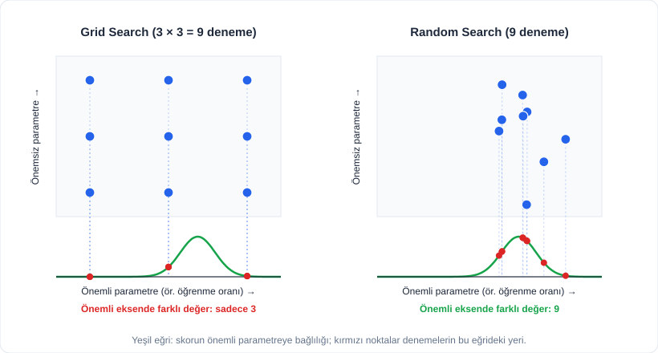</p>

```python
from scipy.stats import loguniform                      # Log ölçekte düzgün dağılım (C, gamma, lambda için ideal)
from sklearn.model_selection import RandomizedSearchCV

dagilim = {"svm__C": loguniform(1e-2, 1e3),              # 0.01 – 1000 arası
           "svm__gamma": loguniform(1e-4, 1e1)}
rand = RandomizedSearchCV(pipe, dagilim, n_iter=16, cv=5, random_state=0).fit(X, y)
print(rand.best_params_, rand.best_score_)               # ≈ C=4.07, gamma=0.0118 → 0.981
```

> 🎓 Daha gelişmiş yöntemler: **Bayesçi optimizasyon** (önceki denemelerden öğrenerek bir sonraki aday noktayı seçer; ör. `Optuna`, `scikit-optimize`) ve **Successive Halving / Hyperband** (kötü adayları erken eler).

### 21.9 İç İçe Çapraz Doğrulama (Nested Cross-Validation) 🟢

**Sık yapılan hata:** Grid Search'ün bulduğu `best_score_` değerini modelin performansı olarak raporlamak. Bu skor, **en iyiyi seçmek için kullanılan** veride ölçülmüştür; seçimin kendisi iyimser bir yanlılık yaratır.

**Çözüm:** Hiperparametre seçimi ile performans ölçümünü birbirinden ayırmak.
- **Dış döngü (outer loop, ör. 10 kat):** Genelleme performansını ölçer. Her turda bir katman **test** için ayrılır.
- **İç döngü (inner loop, ör. 5 kat):** **Yalnızca dış döngünün eğitim kısmında** Grid Search yapar.

<p align="center">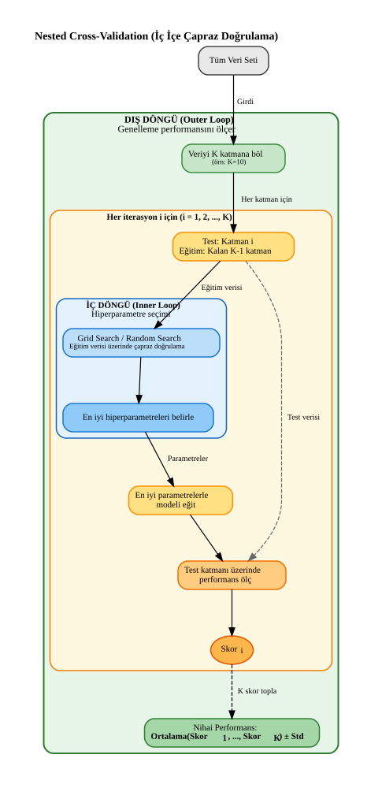</p>

Dış döngüdeki her turun kendi bağımsız hiperparametre araması vardır. Raporlanan skor, **hiperparametre seçiminin etkisinden arındırılmış** tarafsız bir tahmindir.

> 🎬 **Animasyon:** [Nested Cross-Validation Animasyonu](https://erkanozhan.github.io/machinelearning/animation/nested_cv_animation.html)

```python
from sklearn.model_selection import cross_val_score, StratifiedKFold

ic_cv = StratifiedKFold(n_splits=5, shuffle=True, random_state=1)     # İç döngü
dis_cv = StratifiedKFold(n_splits=10, shuffle=True, random_state=2)   # Dış döngü
ic_arama = GridSearchCV(pipe, izgara, cv=ic_cv)                       # GridSearch nesnesi bir "model" gibi davranır
skorlar = cross_val_score(ic_arama, X, y, cv=dis_cv)                  # 10 dış katmanın her birinde ayrı arama
print(f"{skorlar.mean():.4f} ± {skorlar.std():.4f}")                  # 0.9754 ± 0.0296
```

**Sonuç:** Grid Search `best_score_` = 0.982 (iyimser) ↔ Nested CV = **0.975 ± 0.030** (tarafsız). Fark bu örnekte küçüktür, ama çok sayıda hiperparametre ve az veri olduğunda çok büyüyebilir.

➡️ Grid, random, nested CV ve erken durdurma: [`codes/python/14_hiperparametre_optimizasyonu.py`](https://github.com/erkanozhan/machinelearning/blob/main/codes/python/14_hiperparametre_optimizasyonu.py) · R (`caret`) sürümleri: [`codes/R/grid_ve_random_search.R`](https://github.com/erkanozhan/machinelearning/blob/main/codes/R/grid_ve_random_search.R), [`codes/R/nested_cv.R`](https://github.com/erkanozhan/machinelearning/blob/main/codes/R/nested_cv.R)

### 21.10 WEKA'da Hiperparametre Optimizasyonu 🧪

**`meta → CVParameterSelection`**: Bir sınıflandırıcının parametrelerini iç çapraz doğrulamayla tarar.
1. `diabetes.arff` → Classify → `meta → CVParameterSelection`.
2. `classifier` = optimize edilecek algoritma (ör. `trees → J48` veya `functions → SGD`).
3. `CVParameters` → **Add** ile arama tanımı: `parametre_harfi alt_sınır üst_sınır adım_sayısı`
   - J48 için: `C 0.1 0.5 5` → budama güveni `-C` 0.1'den 0.5'e 5 değerle.
   - J48 için: `M 1 10 10` → yapraktaki en az örnek `-M` 1'den 10'a.
   - SGD için: `L 0.001 0.1 5` → öğrenme oranı `-L`.
4. `numFolds` = iç CV kat sayısı. **Start.**
5. Çıktıda seçilen değerler `Classifier Options: -C 0.2 -M 4` biçiminde görünür.

> 💡 Test options'ta 10 katlı CV seçiliyken CVParameterSelection çalıştırıldığında, her dış katmanda ayrı bir iç arama yapılır. Yani WEKA bu durumda **zaten iç içe çapraz doğrulama** yapmaktadır ve raporlanan doğruluk tarafsızdır.

WEKA'da ayrıca `meta → GridSearch` (iki parametreyi birlikte tarar, Package Manager'dan) ve `Auto-WEKA` paketi (algoritma ve hiperparametreyi birlikte otomatik seçer) bulunur.

---

<a id="b22"></a>

## 22. Veri Sızıntısı (Data Leakage): Modelin Sınav Sorularını Önceden Görmesi

### 22.1 Nedir? 🟢

Bir öğrenciye konuları öğretip (eğitim), sonra **daha önce görmediği** sorularla sınava sokarız (test). Bu, gerçek başarıyı ölçmenin adil yoludur. Ama öğrenci sınav sorularının bir kısmını, hatta sadece "sınavın ortalamasının kaç olacağını" önceden öğrenmişse, aldığı yüksek not konuyu anladığını göstermez.

**Veri sızıntısı**, test verisine (veya gelecekte karşılaşılacak veriye) ait herhangi bir bilginin **eğitim veya ön işleme** sırasında modele ulaşmasıdır. Sonuç: Performans metrikleri yapay olarak şişer, model gerçek dünyada beklenenden çok daha kötü çalışır. Makine öğrenmesindeki **en sinsi ve en yaygın** hatalardan biridir.

### 22.2 Çarpıcı Bir Deney 🧪

Tamamen **rastgele** 10 000 öznitelik ve **rastgele** etiketlerden oluşan 100 örneklik bir veri üretelim. Öğrenilecek hiçbir şey yoktur; gerçek başarı %50 (yazı-tura) olmalıdır.

| Yöntem | 5 katlı CV doğruluğu |
| :--- | :---: |
| ❌ **Yanlış:** En iyi 20 özniteliği **tüm veriye** bakarak seç, sonra CV yap | **0.870** (sahte başarı!) |
| ✅ **Doğru:** Öznitelik seçimini Pipeline içine koy (her katmanda yalnızca eğitim kısmına bakar) | **0.470** (≈ şans) |

Yanlış yöntemde seçici, etiketlere bakarken test katmanlarını da gördü ve **tesadüfen** test etiketleriyle ilişkili görünen gürültü sütunlarını seçti.

➡️ [`codes/python/15_veri_sizintisi.py`](https://github.com/erkanozhan/machinelearning/blob/main/codes/python/15_veri_sizintisi.py)

### 22.3 Sızıntının Yaygın Kaynakları 🟢

1. **Ön işlemi bölmeden önce tüm veriye uygulamak:** Normalize/Standardize (min, max, ortalama test verisinden de hesaplanır), PCA, Discretize, eksik değer doldurma (ortalama test verisini de içerir), öznitelik seçimi, SMOTE/oversampling (kopyalanan örneklerin eşleri hem eğitimde hem testte yer alabilir).
2. **Hedefi dolaylı olarak içeren öznitelikler (target leakage):** "Hastalık var mı?" tahmininde "bu hastalık için ilaç kullanıyor mu?" sütunu. Bu bilgi tahmin anında elde yoktur.
3. **Zaman sızıntısı:** Zaman serilerinde gelecekteki verilerle eğitip geçmişi test etmek. Zamana bağlı verilerde bölme mutlaka **kronolojik** yapılmalıdır (`TimeSeriesSplit`).
4. **Aynı varlığın tekrarları:** Aynı hastanın farklı günlerdeki kayıtları hem eğitimde hem testte. Böyle durumlarda bölme **hasta bazında** yapılmalıdır (`GroupKFold`).
5. **Test setine bakarak model/hiperparametre seçmek** ([Bölüm 13.4](#b13), [21.9](#b21)).

### 22.4 Doğru Yol: Pipeline 🟢

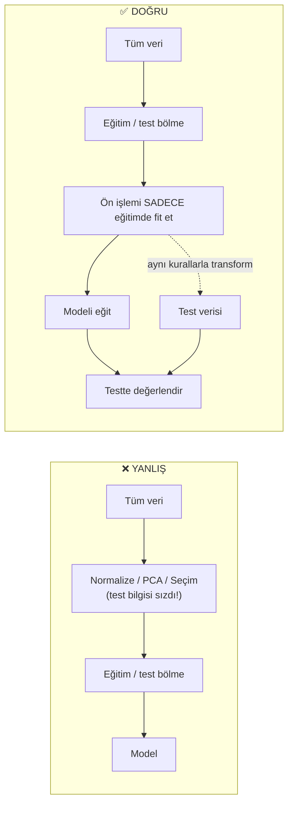
```mermaid
flowchart LR
    subgraph Yanlis["❌ YANLIŞ"]
        direction TB
        A1["Tüm veri"] --> B1["Normalize / PCA / Seçim<br/>(test bilgisi sızdı!)"] --> C1["Eğitim / test bölme"] --> D1["Model"]
    end
    subgraph Dogru["✅ DOĞRU"]
        direction TB
        A2["Tüm veri"] --> C2["Eğitim / test bölme"]
        C2 --> B2["Ön işlemi SADECE eğitimde fit et"]
        B2 --> D2["Modeli eğit"]
        B2 -.->|"aynı kurallarla transform"| T2["Test verisi"]
        D2 --> E2["Testte değerlendir"]
        T2 --> E2
    end
```

- **Python:** Tüm ön işleme adımlarını `Pipeline` / `make_pipeline` içine koyun ve pipeline'ı bir bütün olarak `cross_val_score`'a veya `GridSearchCV`'ye verin. Her katmanda ön işleme yalnızca eğitim kısmından öğrenilir.
- **WEKA Explorer:** Preprocess sekmesinde uygulanan filtre tüm veriyi değiştirir. Değerlendirme için **`meta → FilteredClassifier`** (filtre + sınıflandırıcı), öznitelik seçimi için **`meta → AttributeSelectedClassifier`** kullanın.
- **WEKA KnowledgeFlow:** Filtre bileşenlerini `CrossValidationFoldMaker`'dan **sonra** yerleştirin ([Bölüm 23](#b23)).

> 💡 **Kural:** Bir ön işlem **veriden bir şey öğreniyorsa** (ortalama, min/max, bileşenler, seçilen sütunlar, küme merkezleri…) o bir **modelin parçasıdır** ve yalnızca eğitim verisinden öğrenilmelidir.

---

<a id="b23"></a>

## 23. WEKA KnowledgeFlow

### 23.1 Nedir? Explorer'dan Farkı 🟢

**KnowledgeFlow**, veri madenciliği sürecini **sürükle-bırak** bileşenlerden oluşan bir **akış şeması (pipeline)** olarak tasarlamayı sağlayan WEKA arayüzüdür. Her kutu (WEKA 3.8'de **step**, eski sürümlerde **bean**) bir işlemi temsil eder: veri yükleme, filtre, sınıflandırıcı, değerlendirme, görselleştirme. Oklar ise verinin akış yolunu gösterir. Veri akışı (data-flow) programlamada bir bileşen, girdisi hazır olduğunda çalışır. Bu yüzden birbirinden bağımsız dallar **paralel** yürütülebilir.

| Özellik | Explorer | KnowledgeFlow |
| :--- | :--- | :--- |
| Veri işleme | Yalnızca toplu (batch): tüm veri belleğe yüklenir | Toplu **ve artımlı (incremental)**: veri satır satır akabilir |
| Bellek | Büyük veride `OutOfMemory` riski | Artımlı modda çok büyük dosyalar işlenebilir |
| Süreç tasarımı | Sekmeler arası elle geçiş | Görsel akış; dallanan ve paralel akışlar |
| Tekrar kullanım | Her seferinde elle yapılır | Akış `.kf` dosyası olarak kaydedilip yeniden çalıştırılır |
| Model karşılaştırma | Modeller sırayla çalıştırılır | Birden fazla modelin ROC eğrisi aynı grafikte |

### 23.2 Bileşen Kategorileri 🟢

| Kategori | Örnek bileşenler | Görevi |
| :--- | :--- | :--- |
| **DataSources** | `ArffLoader`, `CSVLoader`, `DatabaseLoader` | Veriyi okur |
| **DataSinks** | `ArffSaver`, `SerializedModelSaver` | Veriyi veya modeli kaydeder |
| **Filters** | `Normalize`, `Discretize`, `Remove`, `PrincipalComponents` | Ön işleme |
| **Classifiers** | `J48`, `NaiveBayes`, `RandomForest`, `NaiveBayesUpdateable` | Öğrenme |
| **Evaluation** | `ClassAssigner`, `ClassValuePicker`, `CrossValidationFoldMaker`, `TrainTestSplitMaker`, `ClassifierPerformanceEvaluator`, `IncrementalClassifierEvaluator` | Sınıfı belirleme, veriyi bölme, performans hesaplama |
| **Visualization** | `TextViewer`, `GraphViewer`, `ModelPerformanceChart`, `StripChart` | Sonuçları gösterir |

**Bağlantı türleri** (kaynak bileşene sağ tık → *Connections* altından seçilir):

| Bağlantı | Taşıdığı şey |
| :--- | :--- |
| `dataSet` | Tüm veri seti (toplu) |
| `instance` | Tek tek örnekler (artımlı akış) |
| `trainingSet` / `testSet` | Bölünmüş eğitim ve test verisi |
| `batchClassifier` | Eğitilmiş model + tahminler (toplu) |
| `incrementalClassifier` | Artımlı model güncellemeleri |
| `text` | Metin sonuçları (özet, karışıklık matrisi) |
| `graph` | Ağaç/graf yapısı |
| `thresholdData` | ROC eğrisi için eşik verileri |
| `chart` | Canlı grafik verisi |

### 23.3 Uygulama 1: J48 ile 10 Katlı Çapraz Doğrulama 🧪

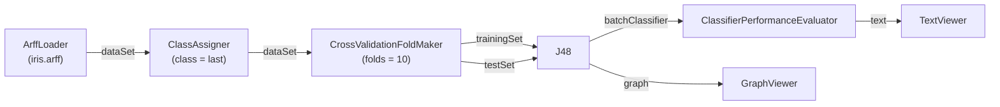
```mermaid
flowchart LR
    A["ArffLoader<br/>(iris.arff)"] -->|dataSet| B["ClassAssigner<br/>(class = last)"]
    B -->|dataSet| C["CrossValidationFoldMaker<br/>(folds = 10)"]
    C -->|trainingSet| D["J48"]
    C -->|testSet| D
    D -->|batchClassifier| E["ClassifierPerformanceEvaluator"]
    E -->|text| F["TextViewer"]
    D -->|graph| G["GraphViewer"]
```

1. GUI Chooser → **KnowledgeFlow**. Solda bileşen paleti, sağda tasarım tuvali (canvas) bulunur.
2. **DataSources → ArffLoader** tuvale bırakılır. Sağ tık (veya çift tık) → **Configure** → `iris.arff`. *(Yükleyici dosyayı hemen okumaz, akış başlayınca okur.)*
3. **Evaluation → ClassAssigner** eklenir. ArffLoader'a sağ tık → **dataSet** → ClassAssigner'a bağlanır. Configure → sınıf özniteliği (`class` veya *last*). *(WEKA varsayılan olarak son sütunu sınıf kabul eder; bu bileşen bunu açıkça belirtir.)*
4. **Evaluation → CrossValidationFoldMaker** eklenir. ClassAssigner → **dataSet** → CrossValidationFoldMaker. Configure: `Folds = 10`, `Seed = 1` (tekrarlanabilirlik için sabit tutulur).
5. **Classifiers → trees → J48** eklenir. CrossValidationFoldMaker'dan J48'e **iki bağlantı** yapılır: **trainingSet** ve **testSet**. J48 her katmanda önce eğitim verisiyle modeli kurar, sonra test verisinde tahmin üretir.
6. **Evaluation → ClassifierPerformanceEvaluator** eklenir. J48 → **batchClassifier** → değerlendirici.
7. **Visualization → TextViewer**: Değerlendirici → **text** → TextViewer.
8. **Visualization → GraphViewer**: **J48 → graph** → GraphViewer. *(Bu bağlantı değerlendiriciden değil doğrudan J48'den alınır, çünkü gösterilecek şey modelin kendisidir.)*
9. Araç çubuğundaki **▶ (Run)** düğmesine basılır. Alttaki *Status* alanında ilerleme izlenir.
10. TextViewer → sağ tık → **Show results**: doğruluk, Kappa, karışıklık matrisi. GraphViewer → **Show results**: karar ağacının görüntüsü.

> 💡 J48, C4.5 algoritmasının Java uygulamasıdır. Bölmeleri **kazanç oranına** (gain ratio) göre seçer ve budama yapar ([Bölüm 10](#b10)).

### 23.4 Uygulama 2: J48 ve Random Forest'ın ROC Karşılaştırması 🧪

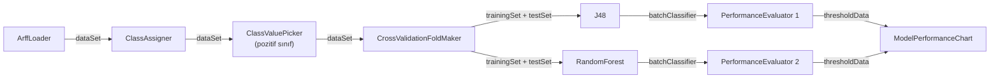
```mermaid
flowchart LR
    A["ArffLoader"] -->|dataSet| B["ClassAssigner"] -->|dataSet| P["ClassValuePicker<br/>(pozitif sınıf)"] -->|dataSet| C["CrossValidationFoldMaker"]
    C -->|"trainingSet + testSet"| D1["J48"]
    C -->|"trainingSet + testSet"| D2["RandomForest"]
    D1 -->|batchClassifier| E1["PerformanceEvaluator 1"]
    D2 -->|batchClassifier| E2["PerformanceEvaluator 2"]
    E1 -->|thresholdData| M["ModelPerformanceChart"]
    E2 -->|thresholdData| M
```

1. Uygulama 1'deki akışa **Classifiers → trees → RandomForest** ekleyin. CrossValidationFoldMaker'dan RandomForest'a da **trainingSet** ve **testSet** bağlantıları yapın. *(Bir kaynaktan çıkan veri birden çok hedefe paralel olarak akabilir.)*
2. İkinci bir **ClassifierPerformanceEvaluator** ekleyin: RandomForest → **batchClassifier** → değerlendirici 2.
3. **Visualization → ModelPerformanceChart** ekleyin. **Her iki** değerlendiriciden → **thresholdData** → aynı ModelPerformanceChart.
4. **Evaluation → ClassValuePicker** bileşenini ClassAssigner ile CrossValidationFoldMaker **arasına** yerleştirin ve ROC için **pozitif sınıfı** seçin (ör. `weather.nominal` için `yes`, `iris` için `Iris-versicolor`). ROC analizi bir sınıfın diğerlerine karşı ayrılmasına dayanır.
5. **Run** → ModelPerformanceChart → sağ tık → **Show chart**. İki modelin ROC eğrisi aynı grafikte, farklı renklerde görünür.

**Yorum:** Eğrisi sol üst köşeye daha yakın olan ve **AUC**'si daha büyük olan model, tüm eşik değerleri genelinde daha iyi ayırt edicidir ([Bölüm 14.3](#b14)). Bu grafik, tek bir doğruluk değerinden çok daha kapsamlı bir karşılaştırma sağlar.

### 23.5 Uygulama 3: Artımlı Öğrenme ve Akan Veri 🧪

IoT sensörleri, finansal işlemler, web kayıtları gibi uygulamalarda veri sürekli bir **akış (stream)** hâlinde gelir; tamamını bekleyip eğitmek mümkün değildir. **Artımlı öğrenmede** model her yeni örnekle kendini günceller ve tüm veriyi bellekte tutmaz. WEKA'da bunu yapabilen algoritmalar `UpdateableClassifier` arayüzünü uygular:
- **NaiveBayesUpdateable:** Her örnekle olasılık tablolarını günceller.
- **IBk:** `windowSize` ile son $n$ örneği saklar.
- **HoeffdingTree (VFDT):** Her örneği yalnızca bir kez okuyarak ağaç kuran, çok hızlı akışlar için tasarlanmış karar ağacı.

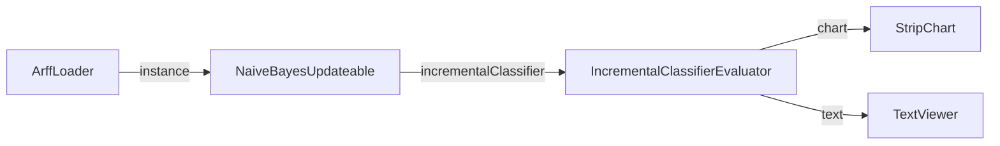
```mermaid
flowchart LR
    A["ArffLoader"] -->|instance| B["NaiveBayesUpdateable"]
    B -->|incrementalClassifier| C["IncrementalClassifierEvaluator"]
    C -->|chart| D["StripChart"]
    C -->|text| E["TextViewer"]
```

1. ArffLoader'dan sınıflandırıcıya **instance** bağlantısı yapılır (veri satır satır akar).
2. **Classifiers → bayes → NaiveBayesUpdateable**.
3. **Evaluation → IncrementalClassifierEvaluator**; sınıflandırıcıdan → **incrementalClassifier**. Bu değerlendirici **önce test, sonra eğitim (prequential / test-then-train)** yöntemini kullanır: Gelen her örnek önce tahmin edilir, sonra gerçek etiketiyle model güncellenir.
4. **Visualization → StripChart**; değerlendiriciden → **chart**. StripChart'a sağ tık → **Show chart**, sonra akışı başlatın. Doğruluk ve RMSE, bir EKG cihazı gibi zaman içinde akan çizgiler olarak görünür (x: işlenen örnek sayısı).

### 23.6 KnowledgeFlow'da Veri Sızıntısına Dikkat ⚠️

`Normalize` veya `Discretize` gibi bir filtre **CrossValidationFoldMaker'dan önce** konursa, istatistikler (min, max, aralık sınırları) **tüm veriden** (test katmanları dahil) hesaplanır ve sonuçlar iyimser çıkar ([Bölüm 22](#b22)). Doğru yol, filtreyi CrossValidationFoldMaker'dan **sonra** yerleştirmek (eğitim ve test bağlantılarıyla) ya da `FilteredClassifier` kullanmaktır.

---

<a id="b24"></a>

## 24. WEKA Experimenter ve Sonuçların Raporlanması

### 24.1 Rastgelelik, Seed ve Tekrarlanabilirlik 🟢

Çapraz doğrulama veya yüzdeye göre bölme yapılırken veri **rastgele** karıştırılır. Bu rastgeleliği kontrol eden sayıya **seed** (tohum; scikit-learn'de `random_state`) denir.
- Seed **sabit tutulursa**, deney farklı bilgisayarlarda ve farklı zamanlarda **aynı bölmelerle** tekrarlanabilir. Bilimsel karşılaştırma için bu şarttır.
- Seed değiştikçe performans ölçütleri de biraz değişir. Tek bir seed ile elde edilen sonuç **şanslı** veya **şanssız** olabilir. Bu yüzden deneyler **farklı seed'lerle defalarca tekrarlanıp** ortalama ve standart sapma raporlanmalıdır. Experimenter tam olarak bunu otomatik yapar.

### 24.2 Gözlenen Fark Gerçek mi? 🟢

Explorer'da A algoritması %82.1, B algoritması %80.9 doğruluk verdi. A gerçekten daha mı iyi, yoksa fark rastlantısal mı? Bu soruyu cevaplamak için **istatistiksel test** gerekir.

**Experimenter**, birden çok algoritmayı birden çok veri setinde **aynı bölmelerle**, **tekrarlı** olarak çalıştırır ve sonuçları istatistiksel olarak karşılaştırır.

**Kullanımı:**
1. GUI Chooser → **Experimenter**.
2. **Setup** sekmesi → **New**.
   - *Results Destination:* sonuçların kaydedileceği ARFF/CSV dosyası (isteğe bağlı).
   - *Experiment Type:* `Cross-validation`, `Number of folds = 10`, `Classification`.
   - *Iteration Control:* `Number of repetitions = 10` → 10 farklı seed ile 10 × 10 = **100 çalıştırma**.
   - *Datasets* → **Add new…** → veri setlerini ekleyin.
   - *Algorithms* → **Add new…** → karşılaştırılacak algoritmaları ekleyin (ör. ZeroR, J48, NaiveBayes, RandomForest, SMO).
3. **Run** sekmesi → **Start**.
4. **Analyse** sekmesi → **Experiment** düğmesi (az önceki deneyi yükler).
   - *Comparison field:* `Percent_correct` (doğruluk), `Kappa_statistic`, `Area_under_ROC`, `F_measure`…
   - *Test base:* referans algoritma (ör. J48).
   - *Significance:* 0.05. **Perform test.**

**Çıktının okunması:**

```text
Dataset              (1) trees.J48 | (2) bayes.Nai  (3) trees.Ran
--------------------------------------------------------------------
iris        (100)      94.73       |   95.53          95.33
diabetes    (100)      74.49       |   75.75          76.02 v
--------------------------------------------------------------------
                           (v/ /*) |  (0/2/0)        (1/1/0)
```

- **`v`:** Test base'e göre **istatistiksel olarak anlamlı biçimde daha iyi**.
- **`*`:** Anlamlı biçimde **daha kötü**.
- **Boş:** Anlamlı fark yok.
- `(1/1/0)`: 1 veri setinde daha iyi, 1'inde fark yok, 0'ında daha kötü.

*(Yukarıdaki sayılar okumayı göstermek için verilmiş bir örnektir; kendi deneyinizde değerler farklı olacaktır.)*

> 💡 **ZeroR**'u her deneye ekleyin. Her örneğe en sık sınıfı söyleyen bu "hiçbir şey öğrenmeyen" model, **alt sınırdır**. Modeliniz ZeroR'dan anlamlı biçimde iyi değilse hiçbir şey öğrenmemiştir.

<details>
<summary>🎓 <b>Derinleşme: Neden "düzeltilmiş" t-testi?</b></summary>

WEKA varsayılan olarak **Corrected Paired T-Tester**'ı (Nadeau & Bengio, 2003) kullanır. Çapraz doğrulamada eğitim setleri büyük ölçüde örtüştüğü için skorlar birbirinden **bağımsız değildir**. Standart t-testi bu durumda varyansı olduğundan küçük tahmin eder ve gerçekte olmayan farkları "anlamlı" bulur. Düzeltilmiş test, varyansa bir düzeltme terimi ekler:

$$
t = \frac{\bar{d}}{\sqrt{\left(\frac{1}{k\,r} + \frac{n_{test}}{n_{train}}\right)\hat{\sigma}_d^2}}
$$

| Sembol | Okunuşu | Anlamı |
| :---: | :--- | :--- |
| $\bar{d}$ | "de bar" | İki algoritmanın skor farklarının ortalaması |
| $\hat{\sigma}_d^2$ | "sigma şapka de kare" | Farkların varyansı |
| $k$, $r$ | "ka", "ar" | Kat sayısı ve tekrar sayısı ($k \cdot r$ = toplam çalıştırma) |
| $n_{test}/n_{train}$ | | Test ve eğitim kümesi boyutlarının oranı (10 katlı CV'de 1/9) |

Çok sayıda veri setinde çok sayıda algoritma karşılaştırılırken **Friedman testi** ve ardından **Nemenyi** post-hoc testi önerilir (Demšar, 2006).

</details>

### 24.3 Sonuçların Raporlanması 🟢

Akademik bir çalışmada yalnızca "en iyi parametreler şunlardır" demek yeterli değildir. **Hangi aralıkta, hangi doğrulama stratejisiyle, hangi ölçütle** arandığı açıkça yazılmalıdır.

**Örnek ifadeler:**

> "Model performansını artırmak amacıyla öğrenme oranı ve düzenlileştirme katsayısı, beş katlı çapraz doğrulama kullanılarak Grid Search yöntemiyle taranmıştır. En iyi performans η = 0.01 ve λ = 0.001 değerleriyle elde edilmiştir."

> "Hiperparametre seçiminin performans tahminini iyimser yönde etkilememesi için iç içe çapraz doğrulama uygulanmıştır. İç döngüde (5 kat) Grid Search ile en iyi parametreler belirlenmiş, dış döngüde (10 kat) model performansı değerlendirilmiştir. Ortalama doğruluk %76.3 ± 4.2 olarak hesaplanmıştır."

> "Random Forest, Lojistik Regresyon'a kıyasla daha yüksek ortalama doğruluk elde etmiştir (sırasıyla %82.1 ve %76.3). Bu fark, 10 tekrarlı 10 katlı çapraz doğrulama üzerinde uygulanan düzeltilmiş eşleştirilmiş t-testi sonucunda p < 0.05 düzeyinde istatistiksel olarak anlamlı bulunmuştur."

> "İki algoritma arasında gözlenen performans farkı istatistiksel olarak anlamlı bulunmamıştır (p = 0.23)."

**Bir raporda bulunması gerekenler:** veri setinin tanımı (örnek sayısı, öznitelikler, sınıf dağılımı) · ön işleme adımları · kullanılan algoritmalar ve hiperparametreleri · doğrulama stratejisi (kat sayısı, tekrar, seed) · birden fazla uygun performans ölçütü (ortalama ± std) · referans (baseline) model · istatistiksel test ve anlamlılık düzeyi · karışıklık matrisi.

### 24.4 Özet Tablo 🟢

| Kavram | Tanım | Pratik çıkarım |
| :--- | :--- | :--- |
| **Genelleme** | Görülmemiş veride tutarlı tahmin yapabilme | Asıl hedef eğitim verisinde değil, yeni veride başarıdır |
| **Aşırı öğrenme** | Eğitim verisini ezberleme | Eğitim hatası düşerken doğrulama hatası yükseliyorsa alarm |
| **Eksik öğrenme** | Ne eğitimde ne testte yeterli öğrenememe | Model kapasitesini veya öznitelikleri artırın |
| **Düzenlileştirme (L1/L2)** | Parametre büyüklüğünü cezalandırma | Aşırı öğrenmeyi azaltır; L1 öznitelik seçer |
| **Erken durdurma** | Doğrulama hatası yükselince durma | Daha kısa eğitim, daha iyi genelleme |
| **Öğrenme oranı** | Gradyan inişinde adım büyüklüğü | Çok büyük: ıraksama; çok küçük: yavaş yakınsama |
| **Öznitelik ölçekleme** | Öznitelikleri ortak ölçeğe getirme | Gradyan ve mesafe tabanlı yöntemler için şart |
| **Hiperparametre** | Eğitimden önce belirlenen ayar | Sezgiyle değil, sistematik aramayla seçin |
| **Grid Search** | Tüm kombinasyonları deneme | Kapsamlı ama pahalı |
| **Random Search** | Dağılımlardan rastgele deneme | Geniş uzaylarda daha verimli |
| **Nested CV** | Seçim ve değerlendirmeyi ayırma | Tarafsız performans tahmini |
| **Veri sızıntısı** | Test bilgisinin eğitime karışması | Tüm ön işlemleri Pipeline / FilteredClassifier içine koyun |
| **Düzeltilmiş t-testi** | CV skorları için anlamlılık testi | Farkın rastlantısal olup olmadığını gösterir |

### 24.5 Temel İlkeler ve Sık Yapılan Hatalar ⚠️

1. **Basitten başlayın:** Önce ZeroR ve basit bir model (lojistik/lineer regresyon, tek ağaç) ile bir referans oluşturun.
2. **Test verisini koruyun:** Test setine yalnızca en sonda, bir kez bakın.
3. **Veriye dayalı karar verin:** Hiperparametreleri sezgiyle değil, aramayla seçin.
4. **İstatistik kullanın:** Tekrarlı CV ve anlamlılık testi yapın.
5. **Şeffaf raporlayın:** Seed, parametre aralıkları, doğrulama stratejisi ve testler yazılsın.

| ❌ Yanlış | ✅ Doğru |
| :--- | :--- |
| Eğitim verisindeki doğruluğu raporlamak | Test verisinde veya çapraz doğrulamayla raporlamak |
| Ön işlemi tüm veriye uygulayıp sonra CV yapmak | Ön işlemi her katmanda yalnızca eğitim kısmından öğrenmek (Pipeline) |
| Grid Search'ün `best_score_` değerini nihai sonuç olarak vermek | Nested CV veya ayrı bir test seti kullanmak |
| Dengesiz veride yalnızca doğruluğa bakmak | F1, MCC, Kappa, PR-AUC, maliyet |
| Tek seed ile tek deney | Tekrarlı deney, ortalama ± std |
| Kimlik sütununu (ad, müşteri no) öznitelik olarak kullanmak | Kimlik sütunlarını çıkarmak (`Remove` filtresi) |

> En iyi model, teorik olarak kusursuz olan değil; **eldeki zaman ve kaynaklar içinde en tutarlı ve en genellenebilir sonucu veren** modeldir. Bilimsel bir çalışmada bu tutarlılığı ve tarafsızlığı kanıtlamak, raporun en önemli kısmıdır.

---

<a id="b25"></a>

## 25. Kapsamlı Uygulama (Proje Ödevi) 🧪

Bu uygulama dersin neredeyse tüm konularını kapsar. Bunu baştan sona yapabiliyorsanız önemli bir yol kat etmişsiniz demektir.

**Veri:** [`data/insanlar.csv`](https://github.com/erkanozhan/machinelearning/blob/main/data/insanlar.csv) (öznitelikler: `ad, yas, boy, kilo, ayak_no`)

**Görevler:**
1. **Veriyi tanıyın (WEKA Preprocess):** Dosyayı açın; her özniteliğin türünü, min/max/ortalama/std değerlerini ve eksik değer olup olmadığını raporlayın.
2. **Kimlik sütununu çıkarın:** `ad` bir **kimlik** sütunudur ve hiçbir genellenebilir bilgi taşımaz. `unsupervised → attribute → Remove` ile çıkarın. *(Çıkarmazsanız ne olur? Tartışın.)*
3. **Kümeleme ile etiket üretin:** `unsupervised → attribute → AddCluster` filtresi, `clusterer = SimpleKMeans`, `numClusters = 3`. Her kişi için yeni bir `cluster` sütunu oluşur. Küme merkezlerini yorumlayın: Kümeler hangi tür insan gruplarını temsil ediyor?
4. **Sınıflandırma:** `cluster` sütununu hedef seçin. **Classify** sekmesinde 10 katlı çapraz doğrulamayla en az 5 algoritma deneyin (ZeroR, J48, NaiveBayes, IBk, SMO, RandomForest, MultilayerPerceptron…). Doğruluk, **Kappa**, F1 ve ROC Area değerlerini bir tabloda karşılaştırın. En yüksek Kappa değerini veren algoritmayı belirleyin.
5. **İstatistiksel karşılaştırma:** Aynı algoritmaları **Experimenter**'da (10 tekrar × 10 kat) çalıştırıp farkların anlamlı olup olmadığını test edin.
6. **Öznitelik seçimi:** **Select attributes** sekmesinde `InfoGainAttributeEval + Ranker` ve `CfsSubsetEval + BestFirst` ile en önemli öznitelikleri bulun. Seçilen özniteliklerle en iyi modeli yeniden çalıştırın; başarı değişti mi?
7. **Eleştirel düşünme:** Kümeleri K-Means ile ürettiğimiz için etiketler öznitelik uzayında **küresel bölgelere** karşılık gelir. Hangi algoritmaların bu yapıyı öğrenmeye daha yatkın olduğunu tartışın. Bu yöntemin (kümeleme → sınıflandırma) gerçek bir tahmin probleminden farkı nedir?
8. **Raporlama:** [Bölüm 24.3](#b24)'teki yapıya uygun kısa bir rapor yazın ve sonuçlarınızı paylaşın.

**Ek alıştırma (Python):** Aynı adımları `pandas` + `scikit-learn` ile tekrarlayın (`KMeans` → etiket, `cross_val_score` ile model karşılaştırma, `SelectKBest` ile seçim). Ön işlemenin Pipeline içinde olmasına dikkat edin. İkinci bir veri seti olarak [`data/musteri_ticaret.csv`](https://github.com/erkanozhan/machinelearning/blob/main/data/musteri_ticaret.csv) (kategorik sütunlar içerir: eğitim durumu, ödeme yöntemi) ile one-hot kodlamayı da uygulayın.

---

<a id="ekA"></a>

## Ek A: Sembol Sözlüğü

| Sembol | Okunuşu | Anlamı | İlk geçtiği bölüm |
| :---: | :--- | :--- | :---: |
| $x$, $\mathbf{x}$ | iks, iks vektörü | Girdi / öznitelik (vektörü) | 5.1 |
| $X$ | büyük iks | Öznitelik matrisi ($n \times d$) | 5.1 |
| $y$, $\hat{y}$ | ye, ye şapka | Gerçek değer, tahmin | 5.1 |
| $n$, $m$ | en, em | Örnek sayısı | 5.1 |
| $d$ | de | Öznitelik sayısı | 5.1 |
| $\sum$ | sigma (toplam) | Toplama | 5.2 |
| $\prod$ | pi (çarpım) | Çarpma | 9.2 |
| $\mu$, $\bar{x}$ | mü, iks bar | Ortalama | 5.2 |
| $\sigma$, $\sigma^2$ | sigma, sigma kare | Standart sapma, varyans | 5.2 |
| $\lvert a \rvert$ | mutlak değer | İşaretsiz büyüklük | 5.8 |
| $\lVert \mathbf{w} \rVert$ | norm | Vektör uzunluğu | 11.2 |
| $\theta$, $\boldsymbol{\theta}$ | teta | Model parametreleri | 6.1 |
| $h_\theta(x)$ | h teta iks | Hipotez (model) fonksiyonu | 6.1 |
| $J(\theta)$ | ce teta | Maliyet (kayıp) fonksiyonu | 6.2 |
| $\alpha$, $\eta$ | alfa, eta | Öğrenme oranı | 6.4 |
| $\frac{\partial J}{\partial \theta}$, $\nabla J$ | kısmi türev, nabla ce | Eğim, gradyan | 6.4 |
| $:=$, $\leftarrow$ | atanır | Değer atama | 6.4 |
| $\sigma(z)$ | sigma zet | Sigmoid fonksiyonu | 7.2 |
| $e$ | e | Euler sayısı ≈ 2.718 | 7.2 |
| $P(A \mid B)$ | B verildiğinde A'nın olasılığı | Koşullu olasılık | 7.2 / 9.1 |
| $\propto$ | orantılıdır | Sabit çarpan dışında eşit | 9.2 |
| $H(S)$ | ha es | Entropi | 10.2 |
| $IG$ | bilgi kazancı | Information gain | 10.2 |
| $\mathbf{w}$, $b$ | dabılyu, be | Ağırlık vektörü, sapma (bias) | 11.2 |
| $\xi$ | ksi | Gevşek değişken (SVM) | 11.3 |
| $C$ | ce | SVM ceza katsayısı / maliyet matrisi | 11.3 / 20.2 |
| $\gamma$ | gama | RBF çekirdek parametresi | 11.4 |
| $K(\mathbf{x},\mathbf{z})$ | ka | Çekirdek fonksiyonu | 11.4 |
| $\varphi$ | fi | Özellik dönüşümü | 11.4 |
| $\kappa$ | kappa | Cohen'in Kappa katsayısı | 14.2 |
| $R^2$, $r$ | ar kare, küçük ar | Belirlilik katsayısı, korelasyon | 14.4 |
| $\varepsilon$ | epsilon | DBSCAN komşuluk yarıçapı | 17.3 |
| $\lambda$ | lamda | Özdeğer (PCA) / düzenlileştirme katsayısı | 19.2 / 21.4 |
| $\Sigma$ | büyük sigma | Kovaryans matrisi | 19.2 |
| $\mathbb{I}(\cdot)$ | gösterge fonksiyonu | Koşul doğruysa 1, değilse 0 | 20.1 |
| $\in$ | elemanıdır | Kümeye aitlik | — |
| $\cup$ | birleşim | Küme birleşimi | 18.2 |

<a id="ekB"></a>

## Ek B: Türkçe–İngilizce Terimler Sözlüğü

| Türkçe | İngilizce |
| :--- | :--- |
| Makine öğrenmesi | Machine learning |
| Denetimli / denetimsiz / pekiştirmeli öğrenme | Supervised / unsupervised / reinforcement learning |
| Öznitelik | Feature, attribute |
| Örnek | Instance, sample |
| Etiket, sınıf, hedef | Label, class, target |
| Eğitim / doğrulama / test seti | Training / validation / test set |
| Sınıflandırma, regresyon, kümeleme | Classification, regression, clustering |
| Aşırı öğrenme / eksik öğrenme | Overfitting / underfitting |
| Genelleme | Generalization |
| Yanlılık, varyans | Bias, variance |
| Çapraz doğrulama | Cross-validation |
| Tabakalı örnekleme | Stratified sampling |
| Karışıklık matrisi | Confusion matrix |
| Doğruluk, kesinlik, duyarlılık, özgüllük | Accuracy, precision, recall (sensitivity), specificity |
| Maliyet (kayıp) fonksiyonu | Cost (loss) function |
| Gradyan inişi | Gradient descent |
| Öğrenme oranı | Learning rate |
| Düzenlileştirme | Regularization |
| Erken durdurma | Early stopping |
| Hiperparametre | Hyperparameter |
| Izgara araması / rastgele arama | Grid search / random search |
| İç içe çapraz doğrulama | Nested cross-validation |
| Veri sızıntısı | Data leakage |
| Topluluk öğrenmesi | Ensemble learning |
| Zayıf öğrenici | Weak learner |
| Karar ağacı, budama | Decision tree, pruning |
| Destek vektörü, marj, çekirdek | Support vector, margin, kernel |
| Yapay sinir ağı, geri yayılım | Artificial neural network, backpropagation |
| Temel bileşen analizi | Principal component analysis (PCA) |
| Öznitelik seçimi / çıkarımı | Feature selection / extraction |
| Birliktelik kuralı, destek, güven | Association rule, support, confidence |
| Aykırı değer, eksik değer | Outlier, missing value |
| Dengesiz veri | Imbalanced data |
| Maliyete duyarlı öğrenme | Cost-sensitive learning |

<a id="ekC"></a>

## Ek C: Kodlar ve Animasyonlar

**Python kodları** ([`codes/python/`](https://github.com/erkanozhan/machinelearning/tree/main/codes/python)). Kurulum: `pip install -r codes/requirements.txt`

| Dosya | Konu | Bölüm |
| :--- | :--- | :---: |
| [`01_istatistik_ve_olceklendirme.py`](https://github.com/erkanozhan/machinelearning/blob/main/codes/python/01_istatistik_ve_olceklendirme.py) | Temel istatistikler, Min-Max, Z-skoru, Robust, onluk ölçekleme | 5 |
| [`02_lineer_regresyon.py`](https://github.com/erkanozhan/machinelearning/blob/main/codes/python/02_lineer_regresyon.py) | En küçük kareler, sıfırdan gradyan inişi, öğrenme oranı deneyi | 6 |
| [`03_siniflandirma_algoritmalari.py`](https://github.com/erkanozhan/machinelearning/blob/main/codes/python/03_siniflandirma_algoritmalari.py) | Lojistik regresyon, k-NN, Naive Bayes, karar ağacı, MLP | 7–12 |
| [`04_entropi_ve_naive_bayes_elle.py`](https://github.com/erkanozhan/machinelearning/blob/main/codes/python/04_entropi_ve_naive_bayes_elle.py) | Entropi, bilgi kazancı, Naive Bayes (kütüphanesiz) | 9–10 |
| [`05_model_degerlendirme_yontemleri.py`](https://github.com/erkanozhan/machinelearning/blob/main/codes/python/05_model_degerlendirme_yontemleri.py) | Holdout, üçlü ayırma, K-fold, LOOCV, bootstrap/OOB | 13 |
| [`06_siniflandirma_metrikleri.py`](https://github.com/erkanozhan/machinelearning/blob/main/codes/python/06_siniflandirma_metrikleri.py) | Karışıklık matrisi, tüm metrikler, ROC ve PR eğrileri | 14 |
| [`07_regresyon_metrikleri.py`](https://github.com/erkanozhan/machinelearning/blob/main/codes/python/07_regresyon_metrikleri.py) | MAE, MSE, RMSE, R², düzeltilmiş R², korelasyon | 14 |
| [`08_topluluk_ogrenmesi.py`](https://github.com/erkanozhan/machinelearning/blob/main/codes/python/08_topluluk_ogrenmesi.py) | Bagging, RF, AdaBoost, GB, Stacking (sınıflandırma + regresyon) | 16 |
| [`09_svm.py`](https://github.com/erkanozhan/machinelearning/blob/main/codes/python/09_svm.py) | Marj, C etkisi, çekirdekler, karar sınırları | 11 |
| [`10_kumeleme.py`](https://github.com/erkanozhan/machinelearning/blob/main/codes/python/10_kumeleme.py) | Sıfırdan K-Means, dirsek, siluet, hiyerarşik, DBSCAN | 17 |
| [`11_birliktelik_kurallari_apriori.py`](https://github.com/erkanozhan/machinelearning/blob/main/codes/python/11_birliktelik_kurallari_apriori.py) | Apriori (kütüphanesiz) | 18 |
| [`12_pca_ve_oznitelik_secimi.py`](https://github.com/erkanozhan/machinelearning/blob/main/codes/python/12_pca_ve_oznitelik_secimi.py) | Sıfırdan PCA, filtre/sarmalayıcı/gömülü seçim | 19 |
| [`13_maliyete_duyarli_ogrenme.py`](https://github.com/erkanozhan/machinelearning/blob/main/codes/python/13_maliyete_duyarli_ogrenme.py) | Sınıf ağırlığı, oversampling, eşik ayarı | 20 |
| [`14_hiperparametre_optimizasyonu.py`](https://github.com/erkanozhan/machinelearning/blob/main/codes/python/14_hiperparametre_optimizasyonu.py) | Grid, random, nested CV, erken durdurma | 21 |
| [`15_veri_sizintisi.py`](https://github.com/erkanozhan/machinelearning/blob/main/codes/python/15_veri_sizintisi.py) | Sızıntı deneyi (yanlış vs doğru) | 22 |

**R kodları** ([`codes/R/`](https://github.com/erkanozhan/machinelearning/tree/main/codes/R)): `grid_ve_random_search.R`, `nested_cv.R`

**Veri dosyaları** ([`data/`](https://github.com/erkanozhan/machinelearning/tree/main/data)): `notlar.arff`, `iris_yeni_test.arff`, `insanlar.csv`, `musteri_ticaret.csv`

**Etkileşimli animasyonlar** 🎬 (tarayıcıda açılır):

| Animasyon | Konu |
| :--- | :--- |
| [Gradyan İnişi](https://erkanozhan.github.io/machinelearning/animation/gradyan_inisi_animasyonu.html) | Öğrenme oranının lineer regresyon eğitimine etkisi |
| [K-Means](https://erkanozhan.github.io/machinelearning/animation/kmeans_animasyonu.html) | Atama/güncelleme adımları, rastgele vs k-means++ |
| [ROC Eğrisi](https://erkanozhan.github.io/machinelearning/roc_animation.html) | Eşik değiştikçe ROC eğrisinin oluşumu |
| [Nested Cross-Validation](https://erkanozhan.github.io/machinelearning/animation/nested_cv_animation.html) | İç ve dış döngülerin işleyişi |

<a id="kaynaklar"></a>

## Kaynaklar

**Temel kitaplar**
1. Witten, I. H., Frank, E., Hall, M. A., & Pal, C. J. (2016). *Data Mining: Practical Machine Learning Tools and Techniques* (4th ed.). Morgan Kaufmann. (WEKA geliştiricilerinin kitabı)
2. James, G., Witten, D., Hastie, T., & Tibshirani, R. (2023). *An Introduction to Statistical Learning* (2nd ed.). Springer. Ücretsiz: [statlearning.com](https://www.statlearning.com)
3. Hastie, T., Tibshirani, R., & Friedman, J. (2009). *The Elements of Statistical Learning* (2nd ed.). Springer.
4. Géron, A. (2022). *Hands-On Machine Learning with Scikit-Learn, Keras, and TensorFlow* (3rd ed.). O'Reilly.
5. Mitchell, T. M. (1997). *Machine Learning*. McGraw-Hill.

**Makaleler**
6. Quinlan, J. R. (1993). *C4.5: Programs for Machine Learning*. Morgan Kaufmann.
7. Breiman, L. (1996). Bagging predictors. *Machine Learning*, 24(2), 123–140. · Breiman, L. (2001). Random forests. *Machine Learning*, 45(1), 5–32.
8. Freund, Y., & Schapire, R. E. (1997). A decision-theoretic generalization of on-line learning and an application to boosting. *J. Computer and System Sciences*, 55(1), 119–139.
9. Friedman, J. H. (2001). Greedy function approximation: A gradient boosting machine. *Annals of Statistics*, 29(5), 1189–1232.
10. Cortes, C., & Vapnik, V. (1995). Support-vector networks. *Machine Learning*, 20(3), 273–297.
11. Ester, M., Kriegel, H.-P., Sander, J., & Xu, X. (1996). A density-based algorithm for discovering clusters in large spatial databases with noise. *KDD-96*.
12. Agrawal, R., & Srikant, R. (1994). Fast algorithms for mining association rules. *VLDB*.
13. Chawla, N. V., Bowyer, K. W., Hall, L. O., & Kegelmeyer, W. P. (2002). SMOTE: Synthetic minority over-sampling technique. *JAIR*, 16, 321–357.
14. Landis, J. R., & Koch, G. G. (1977). The measurement of observer agreement for categorical data. *Biometrics*, 33(1), 159–174.
15. Nadeau, C., & Bengio, Y. (2003). Inference for the generalization error. *Machine Learning*, 52(3), 239–281.
16. Demšar, J. (2006). Statistical comparisons of classifiers over multiple data sets. *JMLR*, 7, 1–30.
17. Bergstra, J., & Bengio, Y. (2012). Random search for hyper-parameter optimization. *JMLR*, 13, 281–305.

**Çevrim içi belgeler**
18. scikit-learn User Guide: [scikit-learn.org/stable/user_guide.html](https://scikit-learn.org/stable/user_guide.html)
19. WEKA belgeleri ve wiki: [waikato.github.io/weka-wiki](https://waikato.github.io/weka-wiki/) · WEKA KnowledgeFlow: [ROC eğrilerinin birlikte çizimi](https://waikato.github.io/weka-wiki/plotting_multiple_roc_curves/), [artımlı sınıflandırıcıda hata grafiği](https://waikato.github.io/weka-wiki/visualization/plotting_error_rate_for_incremental_classifier/)
20. WEKA KnowledgeFlow eğitimi (LIACS): [liacs.leidenuniv.nl/~kokjn/DM/knowledge.htm](https://liacs.leidenuniv.nl/~kokjn/DM/knowledge.htm)
21. Witten, I. H. — *Data Mining with Weka* ve *Advanced Data Mining with Weka* çevrim içi kursları (FutureLearn / YouTube).
22. Brownlee, J. *How to Run Your First Classifier in Weka*. MachineLearningMastery.com.
